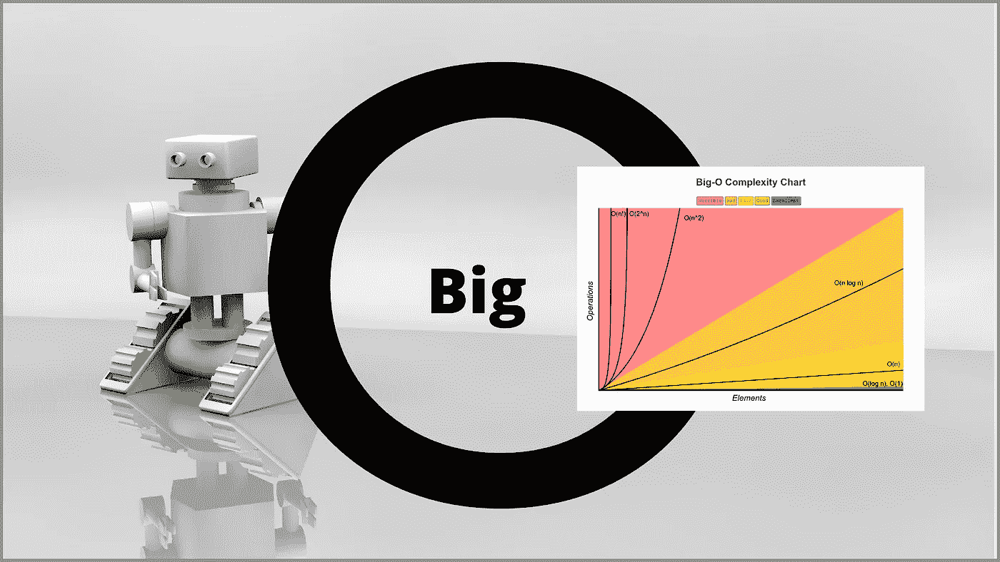
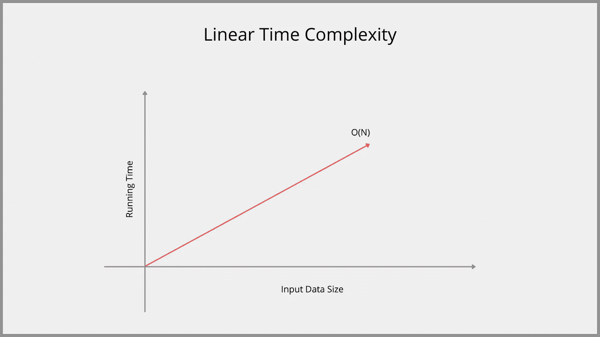
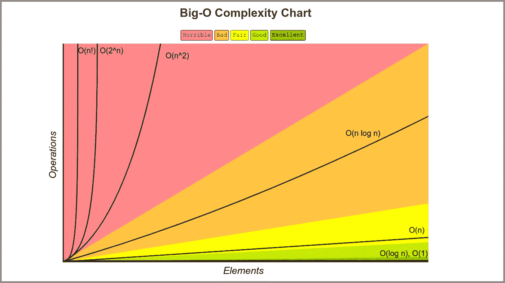

# 为初学者解释的大 O 符号

> 原文：<https://medium.com/geekculture/big-o-notation-explained-for-beginners-ad1d53ff68f5?source=collection_archive---------17----------------------->

## 通过理解基础知识来学习数据结构和算法



计算机科学中最可怕的话题之一是大 O 符号，尤其是当你第一次学习数据结构和算法的时候。大 O 符号可能是一个真正的斗争，因为我觉得很多人没有教得很好。当我第一次开始学习大 O 符号时，我花了一点时间来掌握，我希望我可以用简单的例子来为你揭开它的神秘面纱。

什么是大 O 记数法？它允许你用两种不同的方式来描述你写的代码的性能。第一种方法是时间复杂度，也称为执行时间，它告诉你代码运行需要多长时间。第二种方法是空间复杂度，也称为内存分配，它告诉你代码每次运行时需要多少内存。

让我们从一个非常简单的例子开始。假设我们有以下函数:

```
Public int sum (int a, int b) {
 int sum = a + b;
 return sum;
}
```

在这个例子中，我们实现了一个恒定的时间复杂度，即 O(1)。

第一行`int sum = a + b;`将花费常数时间 O(1)来运行。理解这一点的一个简单方法是，您可以问自己，即使输入发生变化，某一行是否会花费更长的时间来运行。

对于这种情况，`int sum = a + b;`不会花费更长的时间，因为我们总是只接受两个数字 a 和 b，并执行计算来对两个数字求和，这两个数字将总是相同的。

第二行(返回总和；)就像第一行将始终保持不变，因为它返回一个变量，因此将始终花费相同的时间来运行。所以，我们也可以认为它是常数时间 O(1)。

为了评估整个函数，我们需要做的是总结每一行。所以一个 O(1)的大 O 加上一个 O(1)的大 O 是一个 2* O(1)的两倍大。
{ O(1) + O(1) = 2 * O(1) }
这就引出了写大 O 记号时非常重要的一步，我们总是要舍弃常数，而这是因为我们总是取最大的项来描述算法。对于这种情况，我们将切断两个，我们只剩下一个 O(1)的大。因此，整个函数是一个恒定时间复杂度的算法。

让我们看另一个例子，好吗？

```
Public int sum ( int[] nums ) {
 int sum = o;
 for ( int i= 0; i< nums.length; i++ ) {
 sum += nums [i];
 }
 return sum;
}
```

在这个例子中，我们不是将两个数字相加，而是将输入中给我们的数组中的所有数字相加，就像以前一样，我们将逐行处理。

在第一行`int sum = 0;`中，我们将一个变量初始化为零。同样，这不受我们输入的影响，所以我们可以考虑这个常数 O(1)。在第二行`for( int i = 0; i < nums.length; i++ ) {`中，我们在数组的整个长度上循环。这一行直接受到整个函数的输入的影响。在这种情况下，这一行将在 O(N)中运行，其中 N 是我们的输入数组的长度。请记住，我们可以将 N 标识为我们想要的任何字符或符号。

第三行`sum += nums[i];`也在常数时间 O(1)中运行，因为它所做的只是将数字相加到 sum 变量中。这导致了大 O 记数法的另一个重要步骤。每当在 for 循环或 while 循环中有嵌套代码时，我们就将这些项相乘，而不是相加。这意味着对于 for()循环，

```
for ( int i= 0; i< nums.length; i++ ) 
 sum += nums [i]; 
 }
```

我们将两个评估相乘。即 O(N) + O(1)，其计算结果为 O(N)。这意味着整个 for(…){…}循环的计算结果为 O(N)。

最后，返回语句`return sum;`是常数时间 O(1)。

对它的总评价将变成 O(1) + O(N) + O(1)，这等于 O(N)，因为我们取主导项。这个 O(N)也称为线性时间复杂度。随着输入的线性增长，执行函数所需的时间也将线性增长。



Photo by Author

在编写大 O 符号时，需要了解术语之间的比较。看一下这张图表:



您可以在此图中看到，随着输入的增加，某些术语将需要更长的运行时间。所以这又回到了描述复杂性的主导术语。如果你有一个运行在 O(N ) + O(N)中的算法，你只需要去掉 O(N ),因为 O(N)是这个场景中的主导项。另一个例子是，如果你有一个运行在 O(N*log(N)) + O(log(N)) + O(N)中的算法。当您将多个术语相乘时，您总是可以将它们视为同一个术语。因此，随着输入的增加，O(N*log(N))项将压倒性地支配其他项。所以，你可以去掉 O(log(N))和 O(N)。

让我们看另一个更复杂的例子。考虑下面的函数。

```
Public int sum ( int[] nums ) {
 int sum = 0;
 for ( int i= 1; i <= 20; i++ ) {
     sum += i;
 }
 for ( int i= 0; i < nums.length; i++ ) {
     for ( int i= 0; i < nums.length; i++ ) {
         for ( int i= 0; i < nums.length; i++ ) {
             sum += nums [i];
         }
     }
 }
 return sum;
}
```

为此，线`int sum = 0;`以恒定时间 O(1)运行，线`for(int i = 1; i < 20; i++ ) {`总是从 1 运行到 20。这意味着无论数组的长度是多少，你都要精确地循环 20 次，因此，如果不受输入的影响，这一行以常数时间 O(1)运行。线`sum += i;`也将是常数时间 O(1 ),因为它不受输入的影响。

接下来的 for()循环可能看起来非常复杂，但是很简单。注意，只要数组长度允许，三个 for()循环就会运行。因此，三个 for()循环都将获得 O(N)的时间复杂度。

和我一起呆在这里……
线`sum += nums[i];`将和最后一条线`return sum;`一起以恒定的时间 O(N)运行

记住，对于任何嵌套代码，我们都要将这些项相乘。这意味着第一个 for()循环的计算结果为 O(1)*O(1) = O(1)，第二个 for()循环(其中包含另一个嵌套循环)的计算结果为；
O(N)*O(N)*O(N)*O(1) = O(N)。

在程序的底部，行`return sum;`的计算结果是 O(1)。

从这里开始，获得整个程序的时间复杂度是相当容易的。你只需要把所有的术语加在一起，然后选择主要的术语。
O(1)+O(1)+O(N )+O(1)
显然，O(N)是占优项，是最终的复杂度。

我希望这没有让你更困惑。我将在其他文章中研究越来越复杂的代码片段。请务必订阅邮件列表，以获得下一篇大 O 符号文章的提醒。