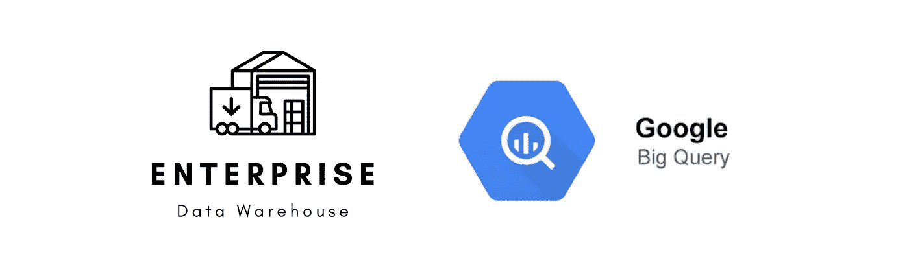
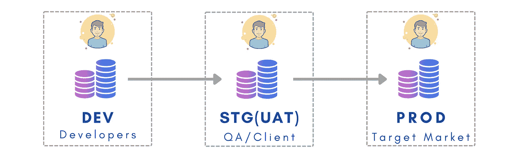
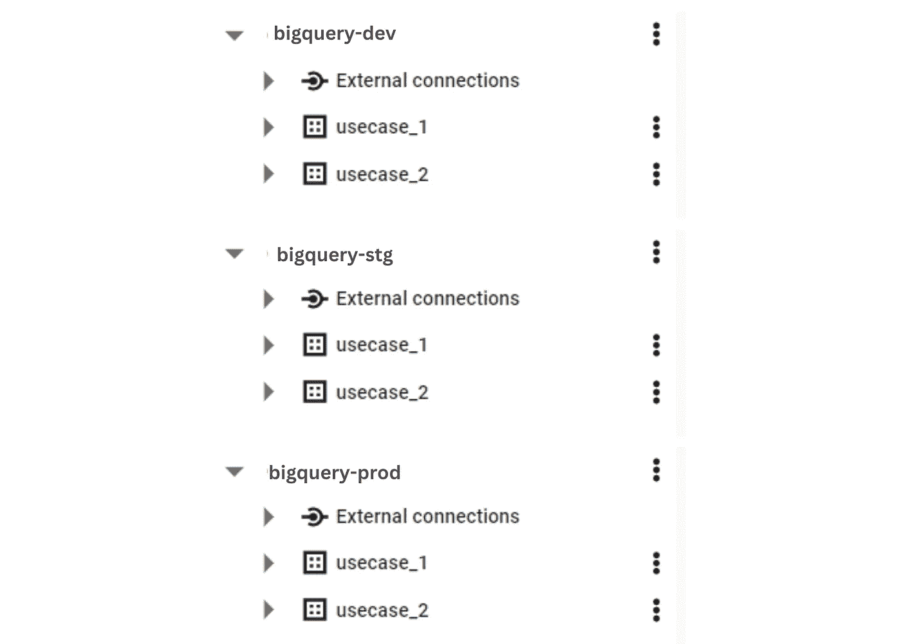
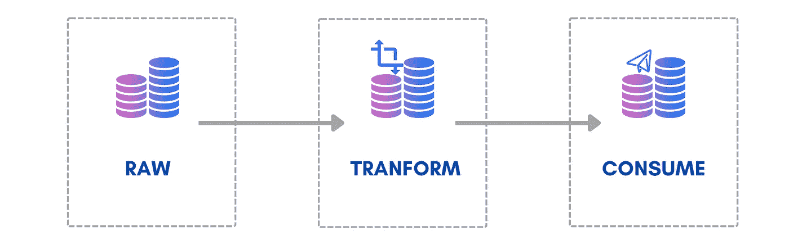

# 日常分析工作负载的大查询

> 原文：<https://medium.com/geekculture/big-query-for-day-to-day-analytical-workloads-b5a7af58aefb?source=collection_archive---------12----------------------->

## 设计和优化

Photo by [Author](https://harshkothari21.medium.com/)

近一年来，我每天都在使用 BigQuery，为组织的多个用例提供服务，包括仪表板、即席分析和报告以及数据科学用例(ML/AI)。我将分享我的经验、知识和一些设计想法。

# ⚜设计创意

组织通常使用包含开发(非生产)、试运行(生产前)和生产(生产)环境的部署环境结构。我认为它是组织企业数据的最佳方式之一，也是一个很有前途的运营环境。尤其是当你有一个/几个团队的数据工程师，每个人都处理多个用例的时候。

Photo by [Author](https://harshkothari21.medium.com/)

在 BQ 中实现相同的技术，您可以为每个环境拥有一个单独的项目，在其中您可以为每个用例创建一个数据集。这种情况的一个例子如下所示，

BigQuery Projects and Datasets

⚡If 一个团队需要一个隔离的地方来进行新的创新或实验，在这种情况下，你可以创建一个单独的项目，称之为“exp-project”，或者在开发环境中创建一个单独的数据集，如“sandbox_team1”或“sandbox_usecase1”。

> N 注意:-不需要复制在多个用例中广泛使用的多个数据集中的表(如发票表)。您可以将这些表存储在一个数据集中，并根据需要向团队提供读取权限。

## 好处:

1.  数据隐私—您可以在数据集级别限制对数据的访问。例如:一个工作在用例上的团队可以有他们自己的数据集，对数据集的访问可以被限制在开发团队，这样其他用户就不能查看/访问数据集。
2.  使团队能够独立地构建和测试基础设施和应用程序代码，并最终交付在生产中执行的高质量产品。
3.  定价——我相信，对于 GCP 来说，定价的透明性从来都不是一个大挑战，对于上述设计来说，它不会变得复杂，此外，它还提供了按用例级别计算成本的能力。

# 数据层📚

*创建分层数据仓库*

它可以实现为三个简单的层:

*   数据层 1 (DL1)，即原始数据:来自源的“原样”数据。
*   数据层 2 (DL2)，即转换后的数据:这里应用了任何种类的聚合、合并表或业务逻辑/过滤器。
*   数据层 3 (DL3)，即消费层:用于最终用户访问，包括联合视图。

Data Layer | Photo by [Author](https://harshkothari21.medium.com/)

在 BQ 中实现它的方法之一是在一个项目/环境下创建多个数据集。如下图所示，每个数据集上都使用了一个前缀来表示数据图层。

BigQuery DL

# 分区/聚类📦

google docs 上关于[分区](https://cloud.google.com/bigquery/docs/querying-partitioned-tables) / [聚类](https://cloud.google.com/bigquery/docs/querying-clustered-tables#python)(初学者*)的一些例子*

*如果您使用过 Big Query，那么您可能非常熟悉分区和集群。当您在一个表中存储大量数据(通常是数百 GB 和数 TB)时，您的分区/集群策略会对性能和成本产生巨大影响。这是我的建议，*

*   ***用例** —数据随着时间的推移不断增加，或者每天包含大量数据。例如，每天生成的发票、库存的历史版本等。*

> **分区—每日分区**

*   ***用例** —每天的记录数量相对较少，或者数据分布在很宽的日期范围内。*

> **分区—月/年分区**

*   ***用例**——除了“日期”过滤器，当数据经常按 Id(如项目编号和 DC)过滤时。一般来说，当你需要一个“盒子里的盒子”的时候。*

> **聚类**

*“日期”并不总是分区的最佳字段。我经常查找表的用法(如何使用/查询)，并查找用于过滤数据的字段(通常是“where”子句)。*

*注意:-不要选择一个最终会有数千个分区的字段。您不能超过 4000 个分区的限制。Google 建议每个 BQ 分区/集群应该至少有 512 MB。【[参考此处](https://cloud.google.com/bigquery/quotas#partitioned_tables)！]*

# *实体化视图和调度查询🕒*

*正如 Google 所推荐的，我使用物化视图来降低计算成本和提高查询性能。*

> *“您不仅可以直接查询这些物化表，而且 BigQuery optimizer 会使用它来处理对基表的查询”*

***概念** —非常简单，考虑在中间级别存储计算结果，并在将来的查询中使用这些结果。*

***实施** —*

1.  *确定对基表执行的查询集。*
2.  *提出一个查询，它的结果可以用来服务于多个这样的查询，就像一个表的聚合视图。例如:一个销售表，可以汇总到月度/年度，其统计数据被销售报告使用。*
3.  *管理刷新并监控使用的性能和 BQ 插槽*

> *注意:创建实体化视图时，不要试图为查询的每个排列创建实体化视图。相反，应该创建物化视图来服务更广泛的查询集。*

****计划查询*** —对于更复杂的查询，我经常使用计划查询来设置定期运行，并将结果存储在表中。*

# *资源*

*   *[谷歌文档:如何创建物化视图](https://cloud.google.com/bigquery/docs/materialized-views-create)*
*   *谷歌文档: [Bigquery](https://cloud.google.com/bigquery/docs)*
*   *向我提问— [我的 LinkedIn](https://www.linkedin.com/in/harsh-kothari21/)*

*按下鼓掌按钮👏如果你觉得这个有用！😊*