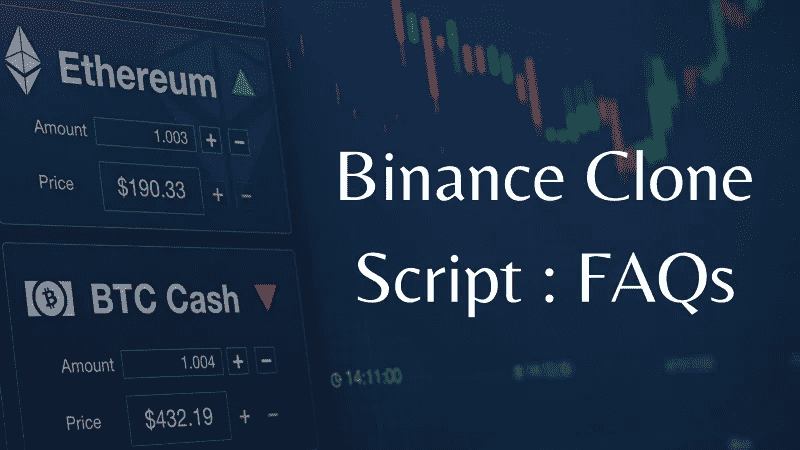

# 币安克隆应用开发|一个企业家的常见问题

> 原文：<https://medium.com/geekculture/binance-clone-app-development-31e3dd112712?source=collection_archive---------8----------------------->

Binance Clone App Development — An Entrepreneur’s FAQs

你们中的许多人可能知道，初创公司对创建加密货币交易平台表现出兴趣，因为他们认为这是一个成功的商业想法。谈到加密交换网站或移动应用程序，币安是 2018 年以来创业公司的最佳商业模式。一个令人惊讶的统计数据显示——许多企业家/初创公司都愿意像币安一样构建他们的密码交换应用。尽管有各种方式来启动一个类似于币安的加密交换应用程序，但许多企业家更喜欢白色标签币安克隆脚本。

但是他们脑子里有很多问题，比如，

1.  当我创建一个像币安一样的加密交换应用程序时，它会盈利吗？
2.  如何启动一个像币安一样的网站，或者像币安一样启动一个加密交换应用？
3.  什么是币安克隆剧本？
4.  建立一个像币安这样的交换应用程序需要多长时间？
5.  我如何才能获得先进的币安克隆脚本和最佳币安克隆应用程序开发服务？

这是社交媒体平台和密码论坛上的密码企业家和初创公司经常问的一些问题。

我们就要彻底解决这个问题了！！！

# 当我创建一个像币安一样的加密交换应用程序时，它会盈利吗？

坦率地说，答案是——是的，但是怎么做呢？？？

币安成立于 2017 年 7 月，功能非常简单，两年内，该交易所成为全球最好的加密交易平台之一。目前，币安在 45 多个国家提供非凡的加密交易服务，监管 500 多种不同的加密货币&他们的交易所有超过 1350 万活跃的加密用户。

与其他任何行业不同，加密货币行业没有在最近的疫情时代屈服。事实上，他们在 2021 年已经通过他们的服务和功能创造了超过 200 亿美元的收入。这吸引了崭露头角的初创公司通过推出像币安这样的交易应用来进入市场。

到目前为止，我们已经讨论了为什么企业家/创业公司想要像币安一样开始他们自己的密码交易所。现在，让我们消除进一步的疑问，比如— **“像币安这样的加密交易所是如何产生货币的？&他们的收入模块是什么？”**

嗯，下面是对那些问题的简单解释。

## 如何通过推出像币安这样的加密交换应用来创收？

这里我列出了币安遵循的一些税收方式。

*   交易费用
*   固定存款费
*   加密取款费
*   IEO
*   保证金交易[借贷]
*   通过 API 访问的后端/基础设施
*   代币上市费。
*   广告(谷歌广告和赞助广告)
*   赌注&更多

上述各方面都属于一个巨大的赚钱清单。对于类似币安的加密交易应用如何在市场上产生收入，人们有不同的看法。现在，我可以看出你非常想知道——如何启动一个像币安这样的加密交换应用程序？？？

# 如何像币安一样推出一个网站，或者像币安一样推出一个加密货币兑换应用？

这是大多数初露头角的加密企业家在打算开发自己的 exchange 应用时提出的基本问题。那么，你可以用三种很好的方法来创建像币安一样的交换网站。

*   开放源代码
*   从头开始交换
*   使用币安克隆脚本开发 exchange 应用程序

**开源代码** —不可靠，不太安全，&容易被黑客攻击。

**从零开始**——从基础开发一个 app 会花去你一年多的时间。此外，这种开发方法像迷宫一样工作，任何微小的技术问题都可能导致完全的安全混乱。它还需要大量的财政支持和时间投入来恢复。

**使用币安克隆脚本**启动——这是像币安一样启动你的加密交易应用程序的最安全、最划算的方式。当您获得理想的币安克隆应用程序开发服务时，您可以推出自己的加密交换应用程序，类似于币安，包含所有重要的交易模块。

现在，我们已经得出结论，推出像币安这样的加密交换应用程序，哪种方式最简单有效。考虑到上面的陈述，我们可以清楚地看到，获得一个优质的币安克隆脚本是启动像币安这样的加密交换应用程序的最简单的方法。

好了，伙计们！让我们看看下一个常见问题

# 什么是币安克隆剧本？

币安克隆脚本是一个现成的加密交换克隆脚本，具有类似于币安应用程序的集成功能。总的来说，愿意像币安一样开发加密货币兑换应用的企业家，正在通过获得最好的币安克隆脚本或币安克隆应用开发服务来实现这一目标。

## 币安克隆脚本的优势

**定制选项** —币安克隆脚本根据您的业务需求提供定制选项。

**监控并参与** —您可以轻松监控工作流程

**测试模块** —您可以在测试模块中测试您的交易

我希望这能给白牌币安克隆软件带来一个清晰的概念。

# 建立一个像币安这样的交换应用程序需要多长时间？

> **时间就是金钱**

这句话完全适合所有的加密初创公司和企业家。你知道为什么吗？？？从头开发一个加密货币交易平台并不是每个人都喜欢的，因为它需要更多的时间和金钱。根据您的业务理念和需求，大约需要 1 年或更长时间。

另一方面，如果你使用的是币安克隆脚本，那么你可以在一两周内以安全可靠的方式像币安一样发布你的加密交换应用。

# 我如何才能获得先进的币安克隆脚本和最佳币安克隆应用程序开发服务？

老实说，这个问题没有直接的答案。这是由于这里涉及的市场需求和复杂性。当你在谷歌上搜索如何或在哪里获得最好的币安克隆剧本时，你可以看到很多结果。到目前为止，许多没有经验的克隆脚本提供者正在密码生态系统中出现。然而，找到一个可靠的币安克隆应用程序开发服务提供商确实是一件困难的工作。

别担心，这次我会支持你的。我做了一些认真的基础工作和筛选，为您呈现最好的克隆脚本提供者。

经过大量研究，我知道在购买币安交易所克隆脚本或获得币安克隆应用程序服务之前，有一些因素需要检查。例如评论、反馈、多年经验、区块链实现、特性集成、演示、文件夹、脚本提供者的历史、软件成本以及客户支持。在从提供商那里购买脚本之前，这些是您需要验证的关键因素。

此外，脚本提供者必须能够清除所有必要的技术和非技术障碍。此外，他们的软件输出必须满足你的期望，脚本应该 100%没有错误&内置最新的交易功能。

有兴趣尝试免费演示吗？并愿意与密码专家讨论开始密码交换业务。马上连接！！！@ [**币安克隆剧本**](https://www.coinsclone.com/binance-clone-script?utm_source=binance&utm_medium=geekculture&utm_campaign=mediumFAQ)

我希望我已经回答了你所有的问题。如果您对币安克隆脚本或币安克隆应用程序开发还有任何疑问，请在下面发表评论。我是来帮助你的…