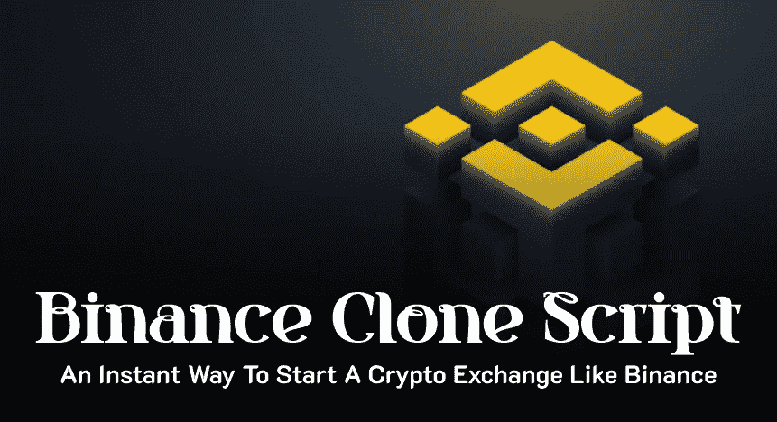

# 币安克隆脚本——启动加密交换的完美解决方案

> 原文：<https://medium.com/geekculture/binance-clone-script-42585a0e16b7?source=collection_archive---------6----------------------->

Binance Clone Script

在这个数字时代，经济的未来预计将是加密的，因为技术正在向在线市场发展。调查显示，许多美国人更喜欢使用密码进行网上购物和交易。因此，在那一刻，加密货币将发挥主要作用。

这促使许多企业主、投资者和企业家投资加密货币，而不是房地产。后来，意识到未来需求的普通人也开始投资加密货币。要投资或交易密码，你需要一个安全的密码交易网站或应用程序。

这引发了加密交易商对优质高效的加密货币交易的巨大需求。现在是创业公司开展加密货币交易所业务的高峰期，所以在开始交易所之前，你必须知道，加密货币交易所是市场上一种突出的商业模式。以便您可以使用相同的交换功能来开发加密货币交换流程，让所有用户都熟悉该流程。这就是领先的加密交易所币安进入画面。

# 什么是币安？

币安是行业领先、全球最受欢迎的加密货币交易平台，成立于 2017 年 7 月。“二进制”和“金融”这两个词组合在一起构成了币安这个名字。

低交易费用和即时加密交易因其在加密市场的指数增长而受到鼓励。此外，币安有自己的加密货币，被称为币安硬币(BNB)。

要为您的企业开发一个类似币安的 exchange 应用程序，您可以使用各种开发方法。但是许多像你一样的创业公司选择币安克隆脚本，这是对有抱负的创业公司和企业家最有效的方法。

# 什么是币安克隆剧本？

币安克隆脚本准备部署加密交换软件，帮助您开始像币安加密交换。它已经过预先开发和测试，可以随时部署。您可以根据自己的业务需求轻松定制这个脚本，

币安克隆脚本根据当前趋势进行了更新，因此用户可以在您的平台上体验最佳体验。不仅如此，它还具有成本效益，获得这个[**币安克隆脚本**](https://www.coinsclone.com/binance-clone-script/?utm_source=medium&utm_medium=binancetop&utm_campaign=sinu) 将帮助您立即开始您的加密交换业务。

接下来，让我们看看…

# 币安克隆脚本是如何工作的？

币安克隆脚本是特殊的现成的加密交换软件，因为它的工作原理与现有的币安交易所相同。但是您可以重新调整模块，为您的业务设计独特的工作流程。让我们讨论一下这个脚本的管理和用户门户工作流程。

## 管理门户

1.  一旦管理员登录，管理员有权查看或更新网站上的内容。
2.  管理员可以在交易费用设置中为用户指定要收取的交易费用值。
3.  管理员有权修改标志。管理员可以改变他们选择的任何新标志。管理员还可以禁止或允许用户访问 exchange。
4.  脚本的核心设置允许管理员选择可以交易的密码数量。
5.  币安克隆脚本的管理门户也有助于查看未决/已完成的订单，并批准用户的撤销。

## 用户门户

1.  像往常一样，要访问 exchange，用户应该通过 Gmail ID 登录或注册。
2.  登录后，用户必须提交 KYC 的详细信息，以获得交易验证。
3.  一旦 KYC 完成，用户可以添加他们的加密货币，并可以通过连接他们的银行账户存入法定货币。
4.  现在，用户可以在订单簿的帮助下进行密码交易。
5.  用户只需下订单，订单匹配算法就会找到用户请求的最佳匹配。
6.  最后，订单将根据用户选择的订单类型立即执行。
7.  订单执行后，密码将在几分之一秒内自动转移到默认保管钱包。

此外，还有一个共享模块，显示管理员和用户门户的通知，包括订单完成、交易损益的钱包借记或贷记以及用户钱包提款。

这就是为管理员和用户构建币安克隆脚本的方式。但是你可能会想…

# 选择币安的克隆脚本是商业的正确选择吗？

币安是世界上最知名的平台，所以你可以使用币安的精确克隆脚本来实现品牌识别。从头开始创建一个全新的交易所网站会让你在交易所开发的最后或中期陷入困境。这是由于与之相关的风险因素。而且需要一大笔资金来制作交易软件。

如果从基础上开发一个类似币安的交易所 app，需要投入 10 万美元以上。是的，很贵！

但是使用各自的克隆脚本解决方案创建一个像币安这样的加密交易所是划算的。因为只要投资**7000 美元——14000 美元**，你就可以推出一个类似于币安的功能强大的加密交易网站。

所以降低了开发成本，不会有风险。因此，与从零开始开发相比，它节省了超过**85，000 美元**。毫无疑问，这是购买最好的[**币安克隆脚本**](https://www.coinsclone.com/binance-clone-script/?utm_source=binancemid&utm_medium=geekculture&utm_campaign=medium) 来开展加密交易业务的主要原因。

除了这些原因，定制是币安克隆脚本的主要亮点。您可以根据您的业务理念个性化币安克隆软件，并将其快速部署到您想要的服务器上。

因此，使用这个克隆脚本创建一个像币安这样的交易所是发展你的业务的正确选择。

如果你要涉足交易所业务，你还需要推出一款移动交易应用。这就是你需要一个币安克隆应用的地方。你可能想知道为什么我需要一个币安克隆应用程序。下面让我解释一下对它的要求，

# 为什么一家加密初创公司需要币安克隆应用？

币安克隆应用程序是一个解决方案，可以帮助你推出一个类似于币安的超级加密交易移动应用程序。您推出的币安克隆应用程序可以帮助用户在任何时间、任何地点使用智能手机进行密码交易。近年来，使用移动应用程序的加密货币交易一直在增加。因此，币安克隆应用程序开发是企业家寻求扩大用户群和建立成功企业的最佳选择。

币安克隆应用程序允许管理员(你)跟踪用户的收入和支出，并根据这些信息推荐加密货币。在币安克隆应用程序中，用户可以定期查看更新和当前的市场趋势，这是币安克隆应用程序最值得感谢的功能。

部署后，您的用户可以用他们的母语使用币安克隆应用程序，因为它支持不同的语言。这是一个完全用户友好的克隆应用程序，因此使用币安克隆应用程序不需要任何授权或限制。在这里，用户可以选择获得他们购买的加密货币的当前价值的通知。这些因素清楚地说明了为什么需要币安克隆应用程序开发，以及它在您的业务中有多重要。

接下来，让我们在下面讨论币安克隆软件的特性，

# **币安克隆剧本的理想特征**

当谈到数字业务时，人们通常会优先选择该功能。因此，您需要关注从脚本中获得的特性。在这里，让我们看看币安克隆软件的顶级功能。

1.  用户仪表板
2.  管理仪表板
3.  定货簿
4.  扩展的贸易观点
5.  实时价格行情
6.  KYC/反洗钱
7.  支援系统
8.  多语言
9.  API 文档
10.  推荐计划
11.  加密/法定支付网关集成

## **币安克隆脚本的附加模块**

1.  高性能匹配引擎
2.  现款现货交易
3.  保证金交易
4.  期货贸易
5.  P2P 交易
6.  场外交易

有了这些功能，你可以吸引更多的用户，并创建一个类似于币安的加密交换软件。作为管理员，你可以根据你的商业计划顺利地修改克隆脚本。作为一家初创公司，自己启用功能是一个繁琐的过程。所以，为你的成功事业找到完美而专业的 [**币安克隆脚本**](https://www.coinsclone.com/binance-clone-script/?utm_source=binancemid&utm_medium=geekculture&utm_campaign=medium) 提供商，他们以低廉的成本提供这些一流的功能。

## **币安克隆软件的安全特性**

即使币安 exchange 克隆脚本在区块链技术上运行，您也必须优先考虑安全性，并且需要结合高端保护功能。当涉及到加密交换网站或移动应用程序时，您不应该在任何事情上损害安全功能。

这里是你能从无错误的币安交易所克隆软件中得到的防篡改安全模块列表。

1.  监狱登录
2.  双因素认证
3.  SQL 注入预防
4.  基于端到端加密的 SSL
5.  反拒绝服务(DOS)
6.  跨站点请求伪造保护
7.  服务器端请求伪造保护
8.  反分布式拒绝服务

通过了解币安的克隆，现在你可能想知道，我如何从这个脚本中获得收入。让我在下一节解释币安克隆软件的多种收入方式。

# **币安克隆剧本的 5 个秘密收益因素**

在使用最好的币安克隆软件部署了 exchange 之后，平台管理员可以通过多种方式赚钱。比如…

## **交易费用**

在您的加密交易所，您将向用户收取交易费，无论是现货交易、保证金交易、期货交易还是永久交易。如果用户希望将 crypto 转换为另一个 crypto 或 crypto 转换为 fiat，您将根据用户交易的硬币类型收取可变费用，但有时是固定值。

## **提现费用**

如果用户从交易所撤回他们的菲亚特，你可以从用户那里收取一定的费用。即使用户将其加密从您的交换转移到另一个交换或加密钱包，费用也会被扣除。

## **挂牌费用**

根据你的交易所表现，有些公司会倾向于你的交易所上市他们的代币或硬币。这让你赚取大量的收入。因为你将收取每一个代币或硬币的费用。

## **利息/借款/清算费用**

保证金交易是你将收取费用的另一个主要领域。保证金交易通常根据借入金额和利率收取费用，利率由所有交易者可获得的资金总额确定。

## **IEO 费用**

一些创业公司/企业家可能会通过 IEO 向你介绍他们的硬币。他们付钱通过 IEO 在交易所进行象征性销售，你也可以从他们的利润中得到一部分。

这些是令人大开眼界的收入流，帮助你通过使用币安克隆脚本建立一个加密交易网站和应用程序来赚钱。

好了，伙计们！我已经概述了创业公司或企业家需要了解的关于币安克隆软件的一切。但是大多数创业公司都没有意识到一个对你的企业成功起着至关重要作用的因素。那是什么？？？让我在下一个部分，也是文章的最后一个部分来揭示。

# **2023 年高级币安克隆剧本怎么上手？**

虚拟货币的采用现在正处于高峰期，许多新手正在建立自己的加密业务。如果你是一家新兴的创业公司，并希望在 2023 年统治加密市场，那么使用最新版本的币安克隆脚本来启动像币安这样的加密交易业务是最佳的想法。

现在，你会想我在哪里可以找到著名的币安克隆软件提供商，以及如何与他们合作。当你环顾全球脚本市场时，你会发现有几家软件提供商随时可以提供具有不同设计、框架和体系结构的现成的 exchange 脚本服务。

因此，对你来说，找到最好的脚本提供者可能是一项具有挑战性的任务。作为一家初创公司，要想与一流的脚本提供商合作，你必须考虑一系列因素。你应该检查他们在区块链领域的经验，投资组合，沟通，评论，技术栈和反馈。

万一你感到困惑，但想选择正确的供应商，然后直接实时验证脚本的质量。可能吗？？？是的，你可以检查它拥有什么功能，看看它是如何运行的，只需抓取高级 [**币安克隆脚本**](https://www.coinsclone.com/binance-clone-script/?utm_source=binanceend&utm_medium=geekculture&utm_campaign=medium) 的即时现场演示，而无需花费一分钱。在开始演示&选择提供商之前，请记住我之前说过的基本要素。并确保他们能够在期限内根据您的业务需求交付高质量的产品。