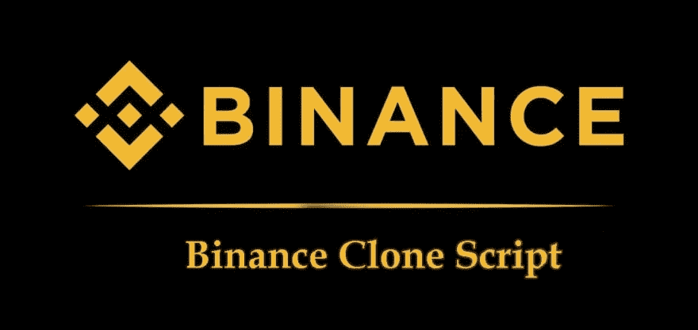

# 币安克隆脚本-开发加密货币交易平台的 7 个步骤

> 原文：<https://medium.com/geekculture/binance-clone-script-7-steps-to-develop-an-cryptocurrency-exchange-platform-babbc5c7a75c?source=collection_archive---------11----------------------->

对于市场中活跃的经济革命，加密货币被视为经济中发生的所有主要和次要演变的主要现象。随着 2009 年数字货币的入侵，它已经发展到对未来的经济结构产生巨大影响。其价值的波动在逻辑上被视为最佳的增长方式，这将对未来产生重大影响。与此同时，我们也可以注意到，crypto 随着业务的蓬勃发展而不断发展壮大。自从密码入侵市场以来，人们目睹了密码交易所高度抽空真空以获取收益。加密交换平台是区块链网络上的分散平台，其功能是将加密令牌和硬币交换或交换为等价的加密令牌或法定货币。

凭借加密交换平台在市场中的大量增长机会，企业家们根据其可行性，在各种区块链网络上开发币安克隆应用程序，以此来制定他们的社会基准。有了这样的机会，为什么不 [***开发你想要的链上的币安克隆脚本***](https://www.inoru.com/binance-clone) 为你的企业提供高级能力呢？假设这是你想要探索的东西。然后继续向上滚动！

# **首先，什么是币安和币安智能链？**

首先，币安是一个加密交换平台，旨在运营币安智能链，这是一个专属的区块链，支持这个分散的平台轻松执行其功能和能力。该平台主要专注于交易专用于加密对加密交易和交换的替代币，现有 500 多种加密货币和虚拟代币。这包括比特币、莱特币、以太币、Dogecoins 等等；交换和交换在具有潜在币安网络的平台中无缝发生。这种多层集群架构在安全性和安全性方面更胜一筹。虽然它的速度很有趣，但该平台每秒钟能够处理 130 万个订单。

此外，除了交易之外，币安的加密交换平台还可以列出加密令牌和硬币、退市、筹款、取款等等。所有这些都在一个空间中，该空间还接受交易订单，包括实时最佳价值的市价订单、交易员指定超过时具有价值的限价订单，以及最终以市价预设限价启动的止损订单。

进一步来说，币安智能链是一个强大的 NFT 区块链网络，它足够高效和有能力增加功能，提高安全性，最重要的是，费用和能源利用也得到优化，以获得更好的交易和安全性。

随着所有这些滚动下来，你不觉得开始与币安克隆应用程序开发类似的能力和功能的加密交换，并在加密市场开花结果？让我们深入了解推出您的独家币安克隆产品的详细开发过程。这里有一些基本的能力和检查，你应该重点发展你的白色标签币安克隆。

# **开发类似币安的加密货币交易平台的逐步过程**

Binance clone Script Development

## **#1 都是关于地下室的**

地下室将决定整个建筑的强度。在这种情况下，适当的规划是必不可少的，需要对市场进行深入分析，了解需求和要求等等。在分析的基础上，你应该为你的平台建立一个合适的结构和基础。确保进行适当的竞争对手研究，制定出他们的战略、战术和模式，并检查这是否有助于您克服困难，并通过您的加密交换平台的更好改进和功能产生更好的见解。

## **#2 特性和功能**

从那里，有了你的基本结构，你应该着手修复你的平台的特性和功能。检查所涉及的主要部件。

## 你的币安克隆版的特点

1.  去中心化——不涉及第三方中介，而您的交换平台直接将用户与他们的需求联系起来。
2.  流动性互换和功能——通过沉迷于互换流动性、赌注和交易程序等附加功能，您可以鼓励您的买家和用户将平台用于各种用途。
3.  点对点交易——作为币安克隆交易平台的一个核心目标，该平台可以被赋予在人们之间直接进行贸易和交易的能力。
4.  自动交易机器人——为了简化交易，可以将自动交易机器人引入平台，以帮助平台上的新手。
5.  匹配引擎——您可以为匹配引擎注入一流的能力，以实现各种分配和算法以及交易订单，从而计算和简化市场功能。

## 要引入的安全功能

1.  双因素授权—通过在加密交换脚本中添加安全层，它为该行中的所有通知提供适当的概念和警报。
2.  锁定时间—该功能应允许用户仅在特定时间进行交易。一旦超出限制，用户将不得不重新确认其身份才能继续进行处理。
3.  数据加密和 HTTP 协议—使用有效的加密算法保护用户数据。此外，引入 HTTP 协议可以确保服务器和平台之间的所有通信都受到保护。
4.  钱包安全性—通过多签名钱包、KYC 和 AML 验证，您可以提高安全性，保护用户的钱包，确保其安全性和可信度。
5.  糟糕的流量评估—引入跨站点请求伪造保护，这是一种新的网络钓鱼技术，可防止黑客提交恶意请求。防 DDoS 保护可防止空间受到不良流量的影响，并确保应用程序的最大安全性。

## **#3 开发模式**

正如你所知道的，在开发你的 NFT 或基于密码的分散平台的过程中，已经有不同的步骤。采用传统的方法从头开始开发你的加密交换平台真的会很累，而且是一个长期的过程。这涉及到许多测试、改变、变更和逻辑。而组装和调整它们都不是立竿见影的理想之举。相比之下，你应该专注于白色标签解决方案，以开发一个类似于币安的加密货币交易平台。有了白标脚本，你的开发过程就减少了，你将会看到一个更好的平台，具有开放定制和改进的能力。

## **#4 选择你的链条**

市场上有多种区块链。如你所知，币安属于币安智能链，它与另一个侧链一起运行。您可以选择最符合您需求的 apt 区块链网络，它将帮助您轻松成长，并确保数字化网络的安全性。

## **#5 谁来合并这一切？**

从各种选项中选择您的开发人员。许多大企业和科技巨头已经进入加密和区块链开发。检查他们的经验、客户历史、他们工作的回顾、开发时间、白标注入、劳动力、开发成本以及与开发您的加密平台相关的所有其他方面。Web 3 是为企业家带来先进商业机会的春天。在这种情况下，您可以选择您的开发商，并讨论您的白色标签币安克隆所需的要求和定制。

## **#6 将资本家抓进你的密码空间**

在基本结构都设置好之后，你就可以用 UX/用户界面和图形设计来包含在平台中了。这将欢迎用户使用和利用你的平台。白标特性最好的部分是，它们应该能够吸引和接受任何类型的进步，包括特性和功能，以方便和吸引市场中的用户交互。温暖会一直想要。

## **#7 去吧！—但在此之前要测试和再测试**

测试，试验，再测试在互联网上与各种观众。从试用版中获取建议和改进，将它们放在一起，并整理成一个完美的白色标签币安克隆。等等，挑选你的柜柜交换，克隆一个名字，并为品牌做适当的营销，以创造知名度和促销活动来吸引全球的注意力。毕竟，这是设定好的，你将进入市场。

[***在市场上推出类似币安***](https://www.inoru.com/binance-clone) 的加密货币交易，拥有完美的人群，在你不断积累自己的能力，让用户积极参与你的加密货币交易平台的过程中，品尝成功的滋味。

# **最终判决**

不要再拖延了！走出去，在市场上与您的诱人的密码交换市场与超级冷静的能力，减轻过程中的密码交换放心。联系你可以信赖的最好的开发人员，轻松开发并发布你的币安克隆版。