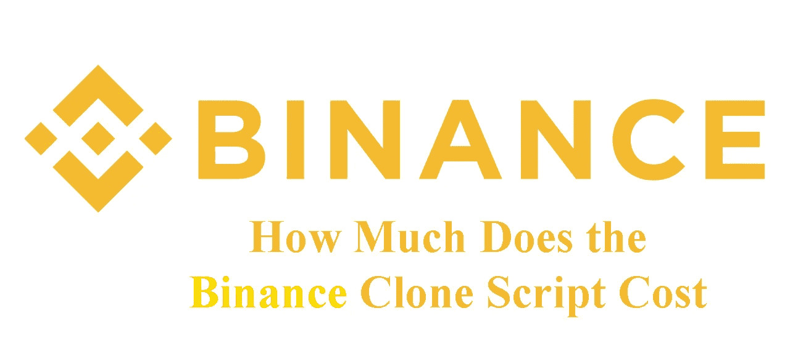
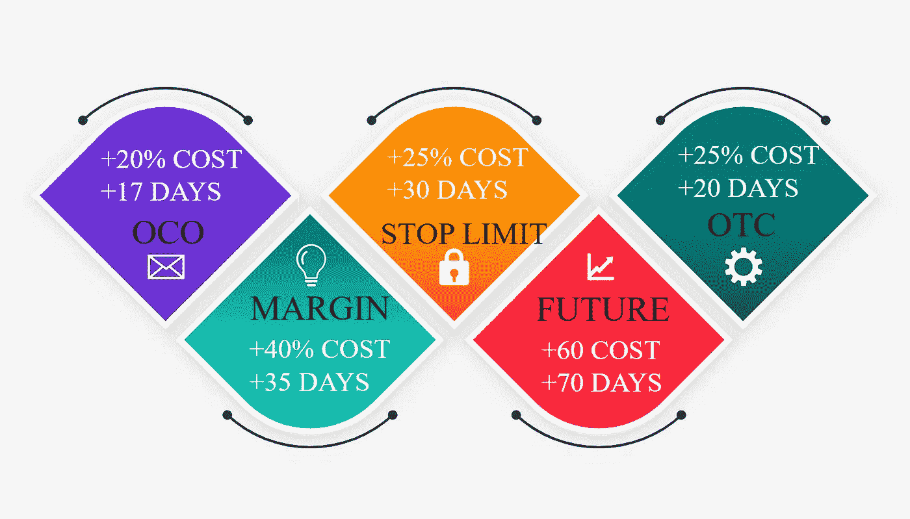
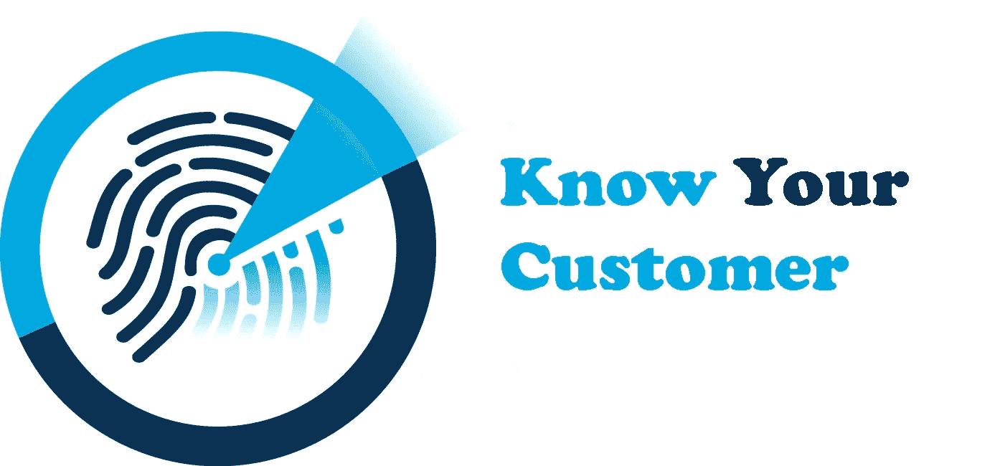
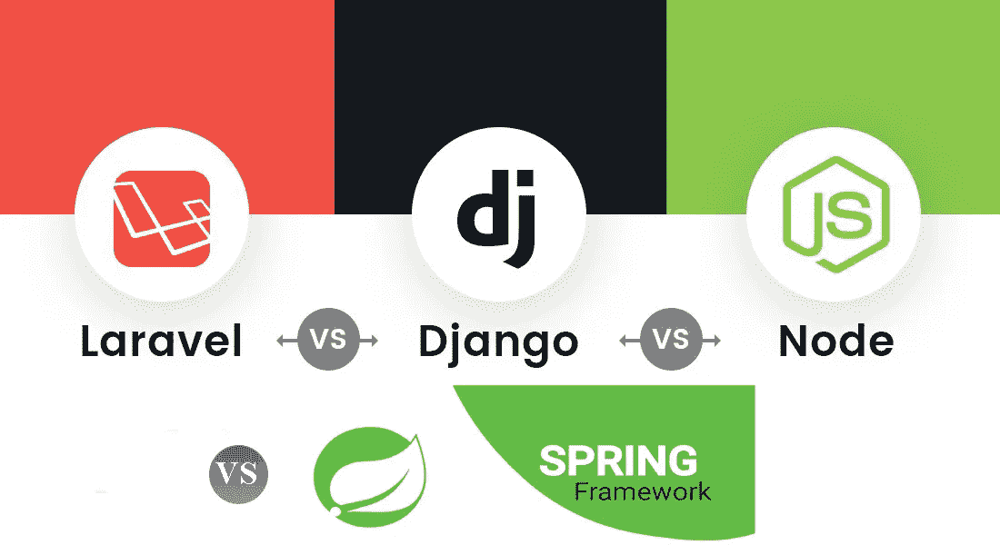
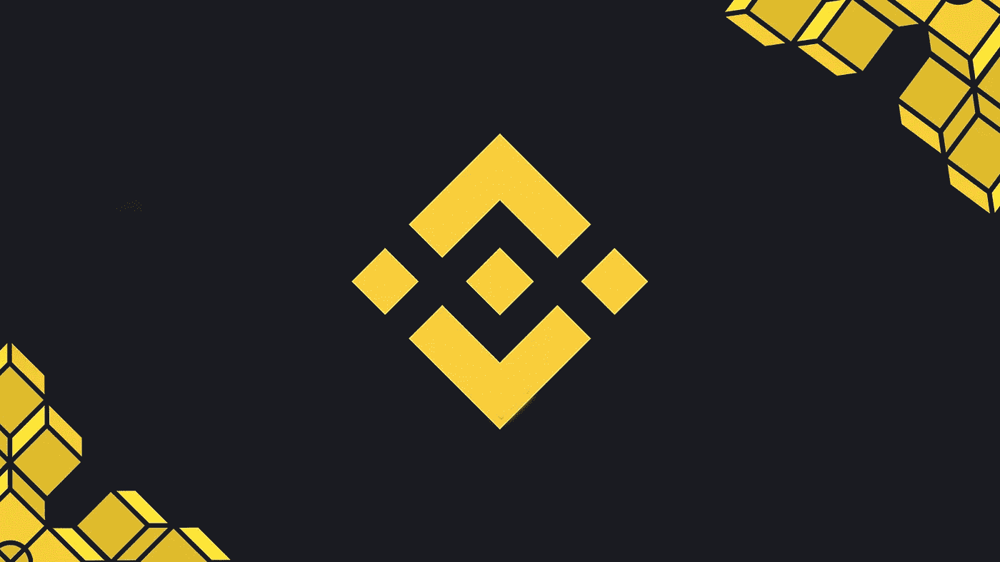

# 币安克隆剧本价格——2022 年币安克隆剧本多少钱？(完全分解)

> 原文：<https://medium.com/geekculture/binance-clone-script-price-how-much-does-the-binance-clone-script-cost-in-2022-full-breakdown-904631ed0877?source=collection_archive---------12----------------------->

需要关于**币安克隆剧本**及其**价格**的指导？嗯，你来对地方了！

# **关于币安克隆剧本价格**

币安克隆是原始软件的精确复制，具有额外的特性和功能。如果你是一个加密爱好者，那么开办一个像币安这样的加密货币交易所将是一个更有效的赚钱的商业想法。

币安克隆软件正迅速成为构建定制数字资产平台的首选解决方案。它们部署迅速，易于定制，而且价格低廉。

本指南详细介绍了币安的特色、一些服务及其开发成本。如果你想为加密市场建立一个像币安一样的网站，你肯定需要关于币安克隆脚本价格的信息。

# **2022 年开发一个币安克隆剧本需要多少钱？**

在这一部分，我们描述了币安的重要特征及其发展成本。

这个基础平台将具备所有必要的特性和功能，您可以使用这些特性和功能将您的币安交易所更快地推向市场。一般来说，开发成本大约在**5000 美元**到**50000 美元**之间。

# **币安交易所的特点**

**信息图说明:**举例来说，为了增加止损功能，加密货币兑换软件的价格由**增加到 25%，**和大约 **20 个工作日**增加到启动项目的时间。

我们在 ***币安克隆脚本*** 中开发的币安交易所的特点:

**现货和保证金交易:**币安的核心业务，一个交易资产现货或保证金(带杠杆)的平台，拥有超过 200 个密码的目录，购买比特币和更多密码所需的一切，最近和有前途的项目。添加这一功能会增加高达**4，700 美元**的开发成本。

**市价订单或限价/止损订单:**以下是可用的订单类型，您可以添加止损和止盈，以自动削减您的亏损或盈利头寸。添加此功能会增加高达**1200 美元**的开发成本。

**OCO 订单:**平台上还有更复杂的订单。增加这一功能会增加高达**1200 美元**的开发成本。

**币安手机应用:**另一方面，币安的安卓应用在超过 634，000 条评论和意见中获得了 4 星(5 星),这些评论和意见来自该手机应用的其他用户。iOS 版币安应用获得了 4.7 的积极评价，在苹果应用商店的金融类别中排名第九。

我们的币安克隆应用程序开发基于您请求的功能数量，将花费【2,500 美元到 6000 美元。

**币安期货:**币安期货是买卖与市场上主要加密货币挂钩的期货的交易平台。增加这一功能会增加开发成本**高达 7，500 美元**。

**OTC:** “场外交易(Over-the-counter trading)，即市场参与者在双方之间直接交易股票、商品、货币或其他工具，而没有中央交易所或中介的分散化市场，持续上升”。添加此功能会增加开发成本 **$1，400–3，000** 。

**UI/UX 设计:**用户界面和用户体验是任何 web/应用的重要组成部分。这就是为什么你花在他们身上的钱实际上是一种投资。没有良好的用户界面/ UX，你的业务将不会被看到，并被判失败。

**订单簿:**对于经验丰富的人来说，甚至可以看到订单簿，以查看不同的交易量和要求的价格。

**衍生品交易:**一种交易加密衍生品(期权和期货)的服务，这些产品本质上具有投机目的，因为它们使用杠杆来增加潜在收益。

**了解您的客户(KYC):** 了解您的客户，简称 KYC，受各国政府反洗钱(AML)法律监管，旨在防止洗钱和犯罪活动。

需要验证——币安允许新用户在未经验证的账户上交易，每天只能提取 2 BTC。然而，身份证件、移动电话号码和地址证明的传输对于取消这些取款限制和例如订购币安 Visa 卡是必要的。

激活两步认证:您可以在 Google 2FA 和 SMS 2FA 之间进行选择。一种是使用谷歌认证应用程序，另一种是在每次连接时通过短信发送到你的手机。

## **从零开始建立加密货币交易所**

建立一个交易所从来都不是一件容易的事情。作为一名加密货币企业家，你可能觉得有必要从头开始开发你的系统。这条路通常是最昂贵的，对一些人来说，也是最有回报的。

你也可以定制你的新比特币交易所的每一个细节。在极少数情况下，详细的规划、架构、设计和调试需要 12 到 14 个月的时间。

但是值得吗？如何开始流程？首先，让我们澄清不同类型的加密货币交易所及其区别:

**集中式加密交换**

这是最流行的加密交换类型。它由一家公司管理和控制。一个很好的例子是比特币基地和币安。这些交易所充当中介，确保用户之间交易所的运作，并为其资产的储存提供保管服务。

**分散加密交换**

分散交易所(dex)是使用智能合约执行交易的平台，绕过了中间商。它们提供加密用户之间的对等交换，这对于安全原因是至关重要的。多亏了这些交易，用户将不必将他们的硬币控制权让给第三方。一个很好的例子是币安德克斯和 PancakeSwap。

**点对点加密交换**

在 P2P 交易所，交易者之间是直接联系的，他们不通过中介进行交易，这通常更便宜，尽管可能不太安全。

当然，尽管仍然存在一些风险，但还是有软件可以为这个过程带来一定程度的安全性。

# 我们在币安交易所克隆中使用的编程语言和框架

框架是一个编程框架。这意味着在使用它们时，开发者必须遵循一系列规则，也有可能使用一系列已经建立的功能和资源。我们使用的语言是:

Django: 这个框架的主要目标是实现 web 应用程序的无障碍创建。它的意图是简单快捷，这样你就可以集中精力编写你的应用程序，而不必另起炉灶。对 Django 的一个近乎完美的总结就是网页和应用程序的快速编程。多亏了 Python 这种简单、直接、高效的语言，这才成为可能(编写任何数字项目所需的代码量都极低)。

**Spring 框架:**其主要思想是 Spring 将作为一个在开源 Java 中开发的平台，由于这一点，它的使用开始扩展，直到它成为企业环境中最流行的 Java 框架，以创建高性能、轻量级和可重用的代码。因为它的目的是标准化、简化、管理和解决方案编制过程中可能出现的问题。它的成功基于其开发团队不断进行的研究和创新工作。

Laravel 是一个开源工具，它提供了所有可用的选项来开发您的 web 项目，而无需浪费时间从头开始创建。它需要编写更少的代码，并且有一部分库是为简单和常见的任务设计的。Laravel 是编程领域最受欢迎的开源 PHP 框架之一，它之所以能取得这样的成就，要归功于其代码语法的简单性(易于理解)以及快速高效地开发项目的能力。它的工具也使它成为开发 web 应用程序的最佳选择之一。

**Node.js:** Node.js 是基于 JavaScript 的服务器层(在服务器端)跨平台运行时环境。Node.js 是一个事件驱动的环境，旨在构建可伸缩的应用程序，允许您同时建立和管理多个连接。由于这个特性，您不必担心阻塞进程，因为没有崩溃。

**增加了币安克隆脚本开发的特性**

**加密支付网关集成**

**加密钱包开发&集成**

**流动性 API**

**多币种支持**

**多语言**

**用户界面**

**交易引擎**

管理面板

交易引擎是平台的中心。它执行交易并结合买卖指令。特别是，它必须很快，能够在一秒钟内处理几个请求。我们的用户界面非常友好。

我们还增加了对多语言的支持。获得第一种额外语言的成本将增加【2,000 美元，并且对于将被添加到平台的每种语言将增加【2,000 美元。

Radin 的专家开发了一种专用的**加密钱包**来确保您资产的安全和保护。有一个具有高级功能的同步钱包，因此，您不需要另一家公司来提供加密钱包。总的来说，开发一个币安交换脚本的成本减少了 30%。

**流动性 API-** 该 API 旨在让 DeFi 开发人员以快速、可靠且易于使用的方式轻松利用 DEX 流动性。通过获得这一功能，你可以连接到大量的流动性。增加这项功能的费用从**$ 1000 到$ 2700**不等。

# 如何启动一个像币安一样的加密交易所？

评估币安平台的功能。了解币安的利弊。

意识到你的平台需要什么样的集成吗？你不想要什么？

分析你将在哪里推出你的平台，并检查管辖区。(大多数国家禁止加密货币)。

考虑并实现一组独特的需求。所以那个平台可以吸引很多观众。

选择最好的服务提供商，为币安购买一个具有所有要求和最佳客户服务的克隆脚本。

在估算实施平台的成本和时间后下订单。

一旦一切就绪，启动您的平台。

# **推出加密货币交易所后的成本**

**我们公司的 SEO 服务和营销费用是多少？**

每个项目:基于项目的搜索引擎优化服务的平均成本从 1000 美元到 1000 美元不等。

托管(服务器)一个网站的费用:每月从**100 美元**到不等

搜索引擎优化的成本:从每月 1000 美元到每月 11 美元

**关于币安交易所？**

在我们看来，[币安](https://www.binance.com/en)如今不仅仅是一个“专家”平台，由于其相当分支和复杂的运营，这个声誉长期以来一直受到拖累。通过提供最低的交易费用，币安针对所有配置文件提供了法定-加密对和加密-法定对。

另一方面，币安的期货、期权和保证金交易也迎合了更多人的需求。币安没有忘记更保守的储蓄和赌注计划。另一方面，币安不适合那些寻求匿名的人:在当前的监管环境下，币安的 KYC 规则不允许匿名交易。总的来说，我们认为币安是市场上最好的交易所。

## 关于币安的审议摘要:

**优点**

卓越的交易体验

许多服务

卓越的网络和移动平台

现在可以通过银行转账存款

多语言的优秀技术支持

流动性很强的交易市场。

交易的加密货币超过 600 种。

加密储蓄产品。

先进复杂的投资工具。

币安 NFT 电子风扇令牌。

分散式交易所币安指数。

**缺点**

持有 BNB 各种服务和福利的义务

没有模拟账户

## **最后的话**

在这篇文章中，我们向你解释了币安克隆脚本的价格。如你所知，交易所将跟随加密货币的发展。事实上，它们甚至有望在未来几年得到进一步发展。对于试图建立能够与业内最佳公司竞争的加密交易所的公司来说，有许多考虑因素。然而，考虑到成本和时间，白标解决方案是一个可行的选择。

简而言之，创建一个虚拟货币行业的网站比你想象的要容易得多。有了您可以使用的工具、脚本、主题和模板，您的商业想法很快就会变成现实。

我们公司根据您将在平台上享受的特性和功能收费。你可以联系我们开始。