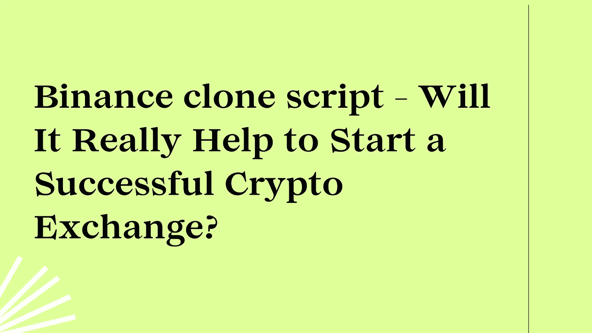

# 币安克隆脚本——它真的有助于开始成功的加密交换吗？

> 原文：<https://medium.com/geekculture/binance-clone-script-will-it-really-help-to-start-a-successful-crypto-exchange-e838a84345c?source=collection_archive---------18----------------------->

每个密码爱好者都希望能像知名的密码交易平台币安一样，创办一家密码交易所公司。我们可以看到，密码交换平台和密码产业近年来越来越突出。即使在疫情最糟糕的时期，密码行业也设法生存下来并获得更多利润。这就是为什么加密行业在创业公司中越来越受欢迎。虽然你可以通过很多方式从加密中赚钱，但用更新的交易能力开始一项新的加密货币交易业务将会带来更大的利润。

许多初创公司和投资者正在寻求建立一个密码交易所。这是由于其潜在的优势，并提供了许多赚钱的可能性。Ripple、以太坊、比特币、以太坊在所有数字交易平台上都获得了巨大收益。如果创业公司立即开展密码交换业务，他们将会获利。

虽然有许多全球加密交换平台，但并不是所有的都是最好的。只有少数几家成功获得了提供顶级加密货币兑换服务的殊荣。币安是这种加密货币交易的一个很好的例子。币安是一个加密交换平台，是市场上最赚钱的商业模式。通过创建一个与币安性质相似的交易所，有可能赚大钱。币安克隆剧本需求量很大。

我们都有这种想法。币安的克隆脚本能让我们在几天之内启动加密交易业务吗？

您可以通过阅读本文的其余部分了解更多信息。在这里你会发现关于币安克隆脚本的一切，以及它是如何被用来创建一个类似于币安的加密交换。

## 什么是币安克隆剧本？

币安克隆脚本是一个现成的脚本，允许您立即启动一个类似于币安的加密货币交易平台。币安克隆脚本包括币安的所有功能和插件。这个加密交换软件克隆是完全定制的尖端技术和选项。币安克隆软件脚本已准备好进行部署。它已经过彻底的设计、分析和开发。克隆脚本还可以用于支持各种加密货币，如比特币、以太坊或 EOS。

您也可以根据您的业务需求修改和添加交易功能到高级币安克隆软件。币安脚本受到复杂的安全系统的保护，可以防止黑客和恶意软件的攻击。币安克隆脚本软件是高度可定制的，具有成本效益，并且没有错误。投资币安克隆剧本的人能够在市场上赚一大笔钱。这就是为什么在加密世界中对最可定制和最有效的币安克隆脚本有如此高的需求。

## 币安克隆脚本是如何工作的？

币安克隆脚本的功能与币安交换相同。这个脚本对管理员和用户都很有用。

让我们先看看管理是如何工作的。它帮助管理员实时跟踪交易。如果有争议，系统将发送警报通知。它还有一个仪表板，可以立即给你实时更新。如果您是管理员，您可以使用高级币安克隆脚本访问加密货币钱包和您的业务所需的其他功能。

现在让我们来看看币安克隆脚本对用户的工作过程。首先，注册你的 KYC 认证帐户。接下来，它会在屏幕上显示一个小框来激活双因素身份验证。出于安全原因，该功能用于避免在交易平台上多次登录。用户必须提交政府文件证明，才有资格获得认证帐户。只有经过验证的用户账户才允许提取超过 100 BTC。非验证用户的最大提现限额为 2BTC。为了验证用户的身份、来自政府的文档以及任何其他详细信息，他们必须提交这些信息。

如果用户有存款，他/她可以通过币安克隆平台交易任何加密硬币。在存款和验证之后，用户准备好交易加密硬币。你可以使用先进的设备在币安克隆平台上交易。您可以存储多种数字货币，如币安币和比特币、以太坊、USDT 或以太坊。币安克隆脚本允许用户交易多种数字货币。一旦他们选择了方法，他们必须选择支付选项和他们希望购买的加密货币。一旦他们做出决定，他们就可以下订单了。一旦订单被管理员批准，加密硬币将在几分钟内转移到客户的加密钱包。

这就是币安的克隆脚本实时运行的方式。

## 币安克隆脚本出色的基础和安全特性

币安是一个加密货币交易所，具有出色的交易功能和安全功能。安全系统是加密交换生态系统的关键组成部分。安全漏洞会导致网络欺凌和其他欺诈活动。币安克隆脚本提供了先进的和专业的加密交易选项。这里有一个列表，突出了无错误的币安克隆脚本软件中最重要的特性。

*   订单系统
*   多语言支持
*   IEO 发射台
*   加密货币钱包集成
*   加密支付网关集成
*   带保证金交易 API 的实时交易图表
*   期货贸易
*   流动性 API
*   KYC/反洗钱
*   用户友好的 CMS
*   推荐选项
*   管理仪表板
*   加密货币报价器 API
*   高级用户界面/UX
*   数据加密
*   SQL 注入预防
*   2FA
*   反拒绝服务
*   监狱登录
*   跨站点请求伪造(CSRF)保护
*   服务器站点请求伪造(SSRF)保护

## 推出类似币安的加密交换网站的理由

币安仍然是国际市场上最受信任和最大的加密交易所。平均而言，他们每天有超过 13，000，000 个活跃的加密用户。与其他加密交易所相比，它们的交易量大，流动性高。

币安提供实时订单系统，允许即时加密对加密交易。币安的低转让费导致流量激增。币安也有一些吸引人的特点，鼓励加密用户开设交易账户。下面列出了这些功能。

*   保证金交易
*   期货交易
*   永久交易
*   堆垛
*   放款
*   市场定购单
*   限价订单
*   止损限价单

这一交易功能将吸引许多网上密码交易商开办类似币安的密码交易所。您还可以对每笔交易、取款、存款或密码交易收取佣金。这会让你在很短的时间内获得巨大的利润。像币安这样完美的策略对于吸引更多用户来你的交易所是必不可少的。比如…

*   低交易费用
*   更高的流动性
*   友好的界面
*   高端安全功能
*   实时订单系统
*   国际密码交易

这将有助于你为你的企业创收。这就是为什么如此多的企业家正在创建像币安这样的加密货币交易所。

## 如何创建一个像币安一样的加密货币交易所？

我已经说过，对于加密货币领域的企业家来说，币安等加密交易所是最好的创收模式。如果你的目标是建立一个类似于币安的加密交换平台，有两种选择可供你选择。首先，你可以选择从头开始创建自己的币安交易所。这大约需要 6 个月的时间来创建，而且成本更高。对于创业者或者创业公司，我不推荐这种方法。

第二，币安克隆脚本可以从最好的加密交换克隆脚本提供商处购买。币安克隆脚本是一个现成的加密货币交换脚本。有了它，你可以在 10 天内像币安一样推出一个功能齐全的加密货币交易所。

## 币安克隆脚本的优势

*   支持超过 150 种加密货币
*   基本和高级 exchange 视图都可用。初学者和专业人士都可以交易，购买和出售加密硬币。
*   将提供实时订单系统。您的交易者将能够立即安全地交易他们想要的密码。
*   您可以随时修改加密交易、取款和存款的费用
*   管理面板允许您列出所有加密令牌并添加交易对。
*   它每秒可以处理多个加密交易。支持多种语言。
*   流动性和交易量高
*   包括高级安全和交易模块

这些只是你可以享受到的最好的币安剧本的众多好处中的一部分。

**最后备注:**

加密市场发展迅速，在世界所有地区都越来越受欢迎。然而，加密硬币正变得越来越受欢迎，交易者正转向收取低交易费的加密交易所。这是开展像币安这样的密码交易业务的最佳时机。从全球市场上最好的币安克隆脚本提供商那里雇佣一个开发团队。他们将帮助您推出一个类似于币安的加密货币交易所，价格是您的企业可以承受的。

预订即时免费试玩@ [**币安克隆脚本**](https://www.clarisco.com/binance-clone-script)