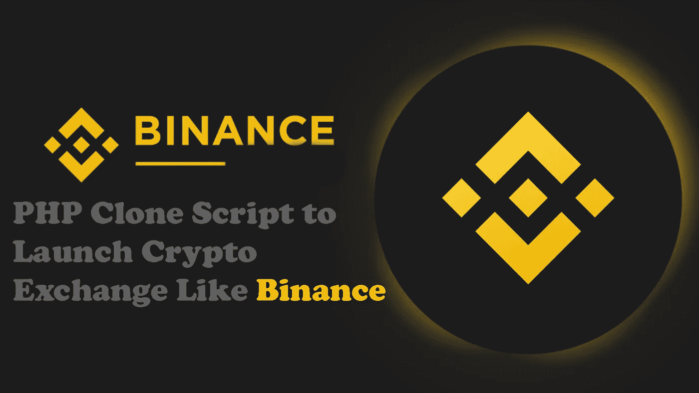
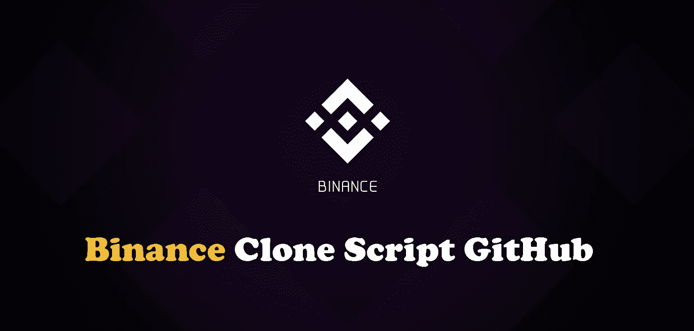
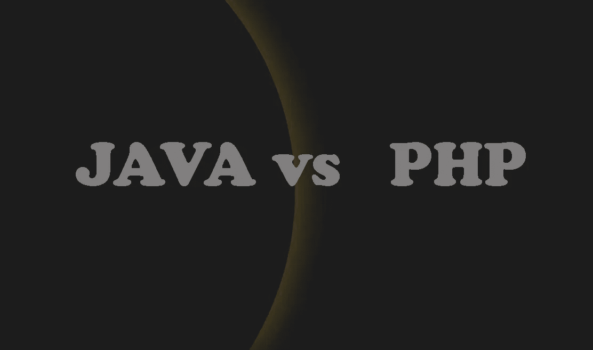
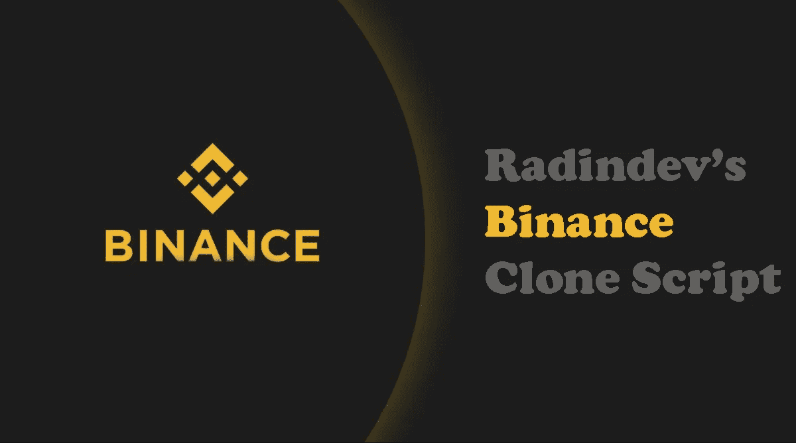

# 币安 PHP 克隆脚本，像币安一样启动加密交换

> 原文：<https://medium.com/geekculture/binance-php-clone-script-to-launch-crypto-exchange-like-binance-df12329c62e?source=collection_archive---------6----------------------->

想了解更多关于**币安 PHP 克隆脚本**？我们这里有很好的评价。

准备好了吗？享受这篇文章吧！

# **什么是币安 PHP 克隆脚本？**

币安 PHP 脚本用于制作一个币安克隆网站。

PHP 脚本为您提供了最简单的方法来创建您的币安副本。它具有创建加密交换网站的所有同等功能，如更好的用户界面、KYC/反洗钱流程、安全管理面板等。所以，当人们把他们的兴趣从银行等传统交易所转移到这个在线加密交易所时，你也应该努力开发一个这样的网站！

你可能会惊讶地发现，按收入计算，币安是世界上第一大加密货币交易所。因此，对于任何企业家来说，建立一个密码交易网站并赚一大笔钱都是一个绝佳的机会。

如果你正在寻找一个免费的解决方案，从 GitHub 下载的 [***币安 PHP 克隆脚本***](https://radindev.com/blog/binance-clone-php-script/) 是启动你的加密交换的一个不错的选择。

## **的特点**币安 PHP 克隆脚本****

**易于使用的高级 Web 界面**

**使用币安 REST API 的即时订单管理**

**自动化交易的可定制买卖规则**

**逃生计划规则定义**

**仅手动模式支持**

**自动模式下即时按需手动操作**

## ****关于 GitHub 的简要说明****

**GitHub 是一个 Git 版本控制 web 工具。使用这些工具，程序员可以在独立开发的同时，以协调的方式在相同的代码基础上工作。**

**GitHub 提供托管和代码审查、评论和反馈、协作和团队管理功能。程序员实时了解项目的进展情况。由于保存了所做的每一次修改、分支和分叉，还可以追溯代码的整个历史并恢复以前的版本。GitHub 还提供了一项名为 GitHub Gist 的服务，这对于快速粘贴和共享代码片段非常有用。**

****

****GitHub** 提供了一个用 PHP 语言开发币安克隆脚本的解决方案，可以快速建立你的网站。**

****使用 GitHub 的优势****

**免费服务，虽然也有付费服务。**

**在存储库结构中非常快速的搜索。**

**伟大的社区，很容易找到帮助。**

**它提供了与 Git 良好协作和集成的实用工具。**

**与其他第三方服务的集成很容易。**

**也与 TFS、HG 和 SVN 合作。**

**使用 GitHub 的缺点**

**不是完全开源的。**

**没有客户支持**

**有缺陷和错误**

**这有空间限制，因为您不能从一个文件中的 1mb 增加超过 100 MB，而免费版本的存储空间被限制为 1 GB。**

**缺乏安全感**

****

# **最好的后端语言是什么？PHP 与 JAVA**

**我们解释了关于币安 PHP 克隆脚本。现在我们想知道更多关于用 Java 开发币安克隆脚本的信息。**

**在 **Radin** ，我们用 **Java** 编程语言开发出了 [***币安克隆***](https://radindev.com/binance-clone-script/) 。**

**我现在将与你分享使用这种语言的好处。**

# ****关于用 Java 编程语言开发币安克隆脚本****

**Java 一直被推荐为第一编程语言，但是它真的适合那些像币安一样想建立密码交易所的人吗？Java 是最好的编程语言吗？**

**我不想和你谈论技术规范，但是我要回答一个创业者在决定使用 Java 时最常问自己的问题:**

****用 Java 可以创作什么？(应用、程序、网站等。)****

**Java 是世界上最流行的编程语言。注意:流行是指一般情况下最广泛。**

**它也是工作领域中使用最多的语言，事实上，它是计算机领域中最受欢迎的编程语言。**

**它几乎无处不在:web 开发、移动、软件等等。**

**它有一个庞大的开发者社区。这转化为许多免费和付费的优质资源:指南、课程、教程、手册等等。**

**尽管事实上有如此多的其他语言:**

## ****Java 如何脱颖而出？****

**让我们试着去理解这种被广泛使用的语言有什么特点。**

**首先，不得不说 Java 是一门非常“通用”的语言，因为它是面向任何目的而设计的。我来解释一下:**

**想象一种语言，它的唯一目的是用来创建计算机程序(软件)，特别是 Windows 程序。**

**它永远不能用于创建 Mac 软件，因为它不是为这样做而设计的，更不用说用于创建智能手机应用程序了。因此，它是一种局限于单个领域的语言。**

**与 Java 相反，它是完全相反的，它被设计成几乎可以在任何地方使用，没有这些限制。**

**你可能在想:**

**“好主意！拥有一门可以在任何系统上运行的语言，真是太棒了！”**

**问题是，实现这样的想法并没有那么简单。**

**Java 有一个特殊的“工具”，一个负责将 Java 代码(我们编写的代码)转换成机器(计算机)可以执行的代码的中介。**

**这样，我们只需编写一次 Java 代码，就可以在任何系统(Windows、Mac、Linux、web 或智能手机)上运行相同的代码。**

## **【Java 适合任何系统吗？**

**最优！我们有专家，所以我们可以承担任何类型的开发，从网站/网络服务到移动应用程序，从嵌入式系统到软件，从大数据，谁知道还有什么！**

**所有这些都由我们的 Java 专家来完成，不需要雇佣其他更合适语言的专业人员。**

**多么大的节约啊！当然，大量的节省是存在的，但只是在成本方面，好处的清单到此为止。**

****

# ****关于我们的币安克隆剧本****

**Radindev 的币安克隆脚本是原始软件的精确复制品，具有额外的特性和功能。如果你是一个加密爱好者，那么开办一个像币安这样的加密货币交易所将是一个更有效的赚钱的商业想法。币安克隆脚本是一个白色标签的加密货币交换软件。币安的复制品拥有币安交易所现有的所有功能。我们的白标币安网站帮助许多初创公司、企业家和公司获得了知名度，并增加了他们的公司价值&收入。**

## ****使用我们的币安克隆产品的优势****

*   **可扩展和可定制**
*   **快速启动**
*   **性价比高**
*   **高成功率**

## ****币安交易所克隆的主要特点****

**多语言**

**IEO 发射台**

**加密钱包**

**即时买卖加密货币**

**赌注和贷款**

**具有保证金交易 API 和期货 125 倍交易的实时交易图表**

**限价止损单和止损单**

**限制制造商订单**

**多种加密货币支持**

**推荐选项**

**管理面板**

**永久互换**

**高级用户界面/UX**

**还有更多…**

## ****遗言****

**一旦知道了我们开发的币安克隆脚本 GitHub 和币安克隆脚本之间的差异和相似之处，这些产品的优缺点就可以帮助你做出决定。**

**还有什么好说的？**

**每个人都有自己的方式。根据你的想法和优先事项选择你喜欢的语言。**

**既然文章写完了，我想请你帮个忙。**

**我希望你能和一个人分享这篇文章(或者如果你想要更多)，如果它对你有用，对别人也会有用！**