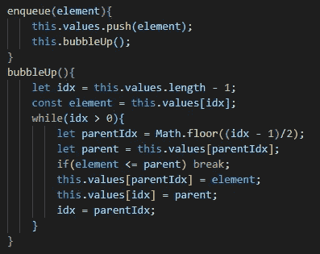
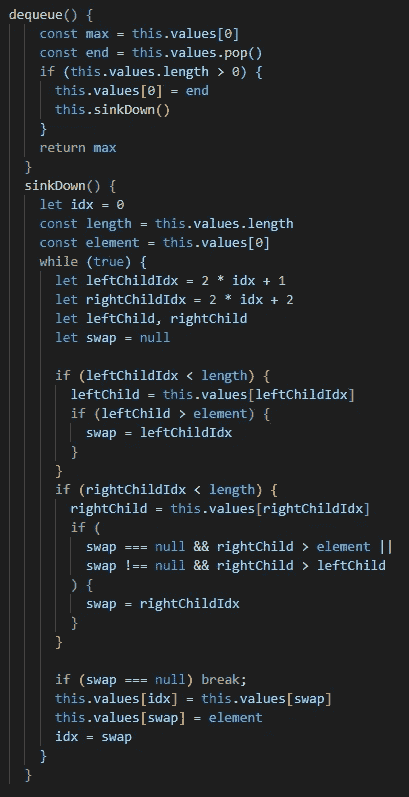

# JavaScript 中的二进制堆

> 原文：<https://medium.com/geekculture/binary-heaps-in-javascript-94900035ee0c?source=collection_archive---------9----------------------->

Min and Max Binary Heaps

作为本文数据结构系列的继续，我们将讨论二进制堆，我将包括用 JavaScript 实现二进制堆的代码。根据我之前的帖子，[柯尔特·斯蒂尔的 Udemy 课程](https://www.udemy.com/course/js-algorithms-and-data-structures-masterclass/)在我的学习过程中有着不可估量的价值。

# 什么是堆？

在计算机科学中，堆是满足堆属性的基于树的数据结构。最大堆是每个父节点大于其子节点的树。类似地，最小堆是每个父节点小于其子节点的树。类似于二叉树的二进制堆是一种最多可以有两个子节点的结构。

二进制堆存储得尽可能紧凑。每个节点的所有子节点都尽可能地满，并且首先填充剩余的子节点。兄弟节点，具有相同父节点的节点没有隐含的顺序。

# 二进制堆有什么用？

堆用于实现优先级队列，这是一种抽象的数据类型，在以后的文章中还会出现。当我们遍历图的时候会用到优先级队列，但是此时什么是优先级队列呢？

在我们讨论过的标准队列中，元素以 FIFO 为基础离开队列。元素被放入队列的顺序被保留。在优先级队列中，每个元素都包含一个优先级。我们可以为非整数元素分配优先级，并在执行“出列”操作时让优先级队列返回最高优先级元素或最低优先级元素。

我遇到的帮助我理解优先队列角色的最好的真实例子之一是急诊室队列。在任何给定的时刻，病人带着各种各样的疾病进进出出急诊室。护士和医生执行分流，并有效地分配一个*优先权*给每个进来的病人。脚踝扭伤的患者可能不舒服，但是对于另外两个患者来说可能是优先级 3，一个遭受枪伤(优先级 1)，一个腿骨折(优先级 2)。

Triage chart

根据每种情况的紧急程度，最优先的病人，受枪伤的病人，将被首先治疗。随着这个堆随着入队的每个患者的增长，我们可以确定具有最高优先级的患者将首先出队。该属性可用于其他抽象示例，如操作系统调度程序、A*搜索和路由。最后两个例子与图的遍历有关，将主要用于我们研究的优先级队列。

幸运的是，堆可以存储为数组或列表。

*   左子:2n+1
*   右子:2n+2
*   n 是父节点的索引

例如，在上面的列表中，17 的索引是 3。我们可以通过执行以下计算来确定它的左孩子:2(3) + 1 = 7，它的右孩子 2(3)+2 = 8。它的子元素位于数组[7]和数组[8]，这与上面的例子一致。

对于简单的问题，可以使用一个列表或一个数组以及上述逻辑来实现优先级队列，只是要注意，在 JavaScript 中使用数组来处理较大的数据集是一种开销很大的实现。

# 实现优先级队列//最大二进制堆

在这一节中，我将讨论与二进制堆相关的两个主要方法，入队和出队。如果您想查看整个实施，请点击[此处](https://github.com/maquino96/Colt-Steele-DSA-Udemy/blob/main/Course/Data%20Structures/binaryHeap.js)。

添加到最大二进制堆(入队) :

*   自动添加到数组末尾，并让元素“冒泡”
*   使用父子关系，我们可以比较最新添加的内容
*   如果子代大于父代，则交换这两个值。

从最大二进制堆中删除(出列):

*   删除根(这是具有最高优先级的值)
*   用最近添加的元素(最后一个元素)替换根元素
*   使用“下沉”功能调整堆
*   类似于 enqueue 方法，我们将利用上面提到的父-子关系(l: 2n+1，r: 2n+2)来比较根与其子节点的值，直到新的根向下渗透到其适当的点。

我包含了两个助手函数(bubbleUp 和 sinkDown ),这两个函数在柯尔特·斯蒂尔的课程中已经教过了，但是我们可以不使用助手函数直接编写代码，这样可读性更好，至少对我来说是这样的。

通过这两种方法，我们可以添加到我们的优先级队列中，并根据我们确定的优先级返回最小值或最大值。

**二进制堆的 BigO**

我们最喜欢的部分之一是讨论数据结构的 BigO。在数组上实现二进制堆有什么意义？当在数组上使用二进制堆时，时间复杂度大大降低。在二进制堆中插入和删除非常快，与使用数组时的 O(n)相比，这两个操作都是在 O(logn)中完成的。如果您的目标是不断地添加和删除节点，那么实现二进制堆是非常值得的。

谢谢你一直关注我！下周我们将讨论散列表。

资源:

*   【https://www.cs.yale.edu/homes/aspnes/pinewiki/Heaps.html 
*   [https://visualgo.net/en/heap?slide=1](https://visualgo.net/en/heap?slide=1)
*   [https://www . udemy . com/course/js-algorithms-and-data-structures-master class/](https://www.udemy.com/course/js-algorithms-and-data-structures-masterclass/)