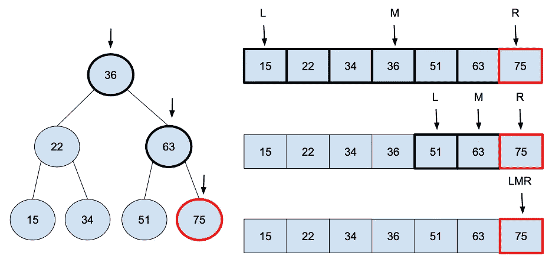

# 二进位检索

> 原文：<https://medium.com/geekculture/binary-search-bc12054cb3a?source=collection_archive---------20----------------------->

## 在有序数组或二叉查找树(BST 是一种有序数据结构)中搜索更有效，因为我们不必查看所有元素。

我们可以设计一些逻辑来快速查看其中的一部分。因为元素是排序的，所以我们可以把元素拆分成两部分；所以叫二进制。