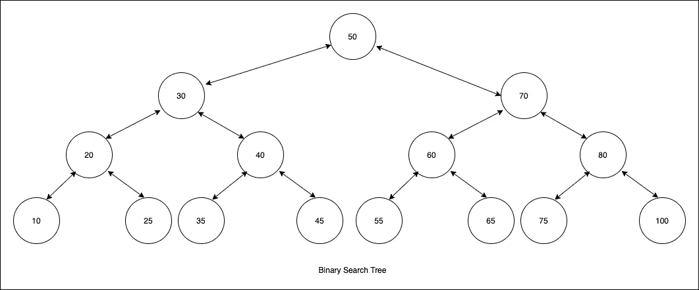

# 二叉查找树

> 原文：<https://medium.com/geekculture/binary-search-tree-8e6077316c3d?source=collection_archive---------42----------------------->

二叉查找树是一种树形数据结构，将值存储在左、右两个子树中。

# 性能

*   如果该节点是其父节点的左子节点，那么它必须小于(或等于)父节点
*   如果节点是其父节点的右子节点，那么它必须大于父节点。
*   左子树中的所有节点必须更小(或者…