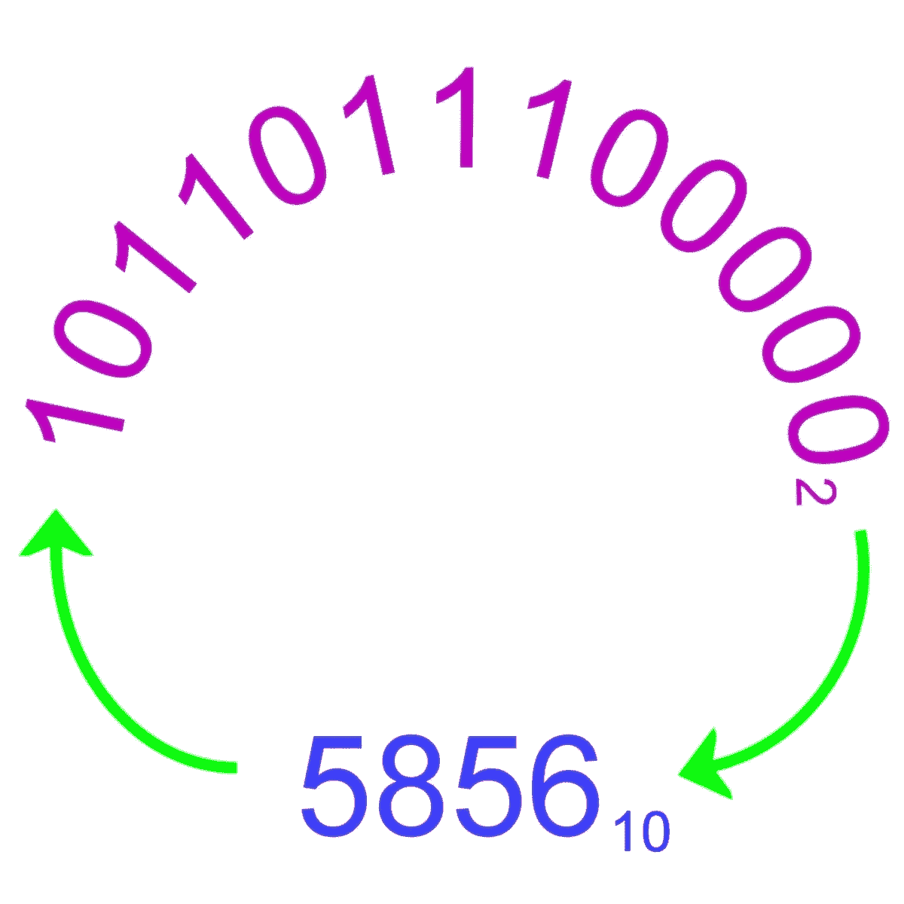

# 二进制，另一种计数系统

> 原文：<https://medium.com/geekculture/binary-the-alternative-numbering-system-b3e8b772b44c?source=collection_archive---------40----------------------->

二进制数系统是计算系统和电子设备中所有二进制代码和数据存储的基础。在本指南中，我们将探索这一切是如何工作的。

The representation of a number in both decimal and binary. © Eugene Brennan

# 十进制，以 10 为基数的计数系统

首先让我们从十进制的*开始。*