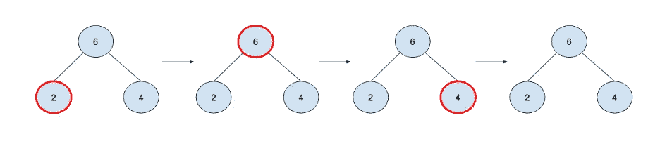

# 5.二叉树迭代器

> 原文：<https://medium.com/geekculture/binary-tree-iterator-43456b99e31c?source=collection_archive---------22----------------------->

## 问题:为二叉树实现一个迭代器，按顺序遍历节点。

## 提示:

- IteratorProtocol 定义返回下一个元素的下一个函数，如果没有更多的元素要迭代，则返回 nil。

-“按顺序”是指首先是左值，然后是节点值，最后是右值，