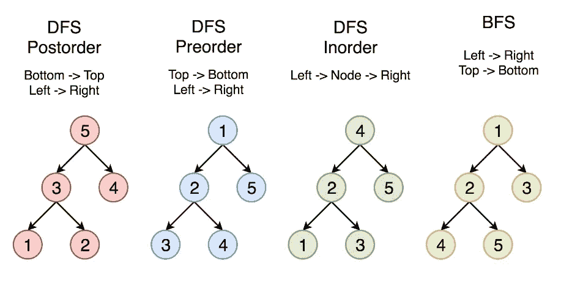

# 二叉树遍历

> 原文：<https://medium.com/geekculture/binary-tree-preorder-traversal-defe4b733470?source=collection_archive---------24----------------------->

在本文中，我们将讨论前序/后序/顺序遍历

[https://leet code . com/problems/binary-tree-in order-traversal/solutions/713539/python-3-all-iterative-traversals-in order-preorder-post order-similar-solutions/](https://leetcode.com/problems/binary-tree-inorder-traversal/solutions/713539/python-3-all-iterative-traversals-inorder-preorder-postorder-similar-solutions/)

# **1。预购:**

给定二叉树的`root`，返回*其节点值*的前序遍历。