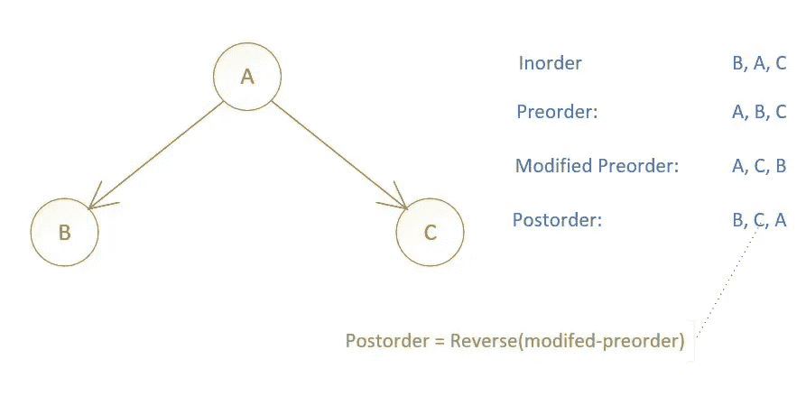

# Go 中的二叉树遍历—第二部分

> 原文：<https://medium.com/geekculture/binary-tree-traversals-in-go-part-2-1c0572c800a1?source=collection_archive---------17----------------------->

这是本系列的第 2 部分——在 Go 中使用二叉树。我将展示本系列第 1 部分中讨论的三种遍历算法的迭代实现。

*   第 1 部分二叉树在 Go 中遍历(访问它[这里](https://vnaveen9296.medium.com/binary-tree-traversals-in-go-2bce834f449c)
*   第 2 部分 Go 中的二叉树遍历——使用迭代(本文)
*   第三部分 Go 中二叉树的层次顺序遍历(此处访问)
*   第四部分 Go 中二叉树的曲折层次顺序遍历(此处访问)
*   第 5 部分 Go 中二叉树的右侧视图
*   第 6 部分 Go 中的二叉树序列化

顺序、前序和后序遍历的递归解很容易。这些算法的迭代副本稍微复杂一些。在这里，我将展示如何使用堆栈来编写迭代解决方案。

首先，这里有一个非常简单的堆栈介绍。堆栈是一种后进先出(LIFO)的数据结构。只能从一端插入或移除项目。下面是使用堆栈时需要的三个重要操作。

*   Push —将一个新项目推入(即插入)堆栈顶部的操作
*   弹出—从堆栈顶部移除项目的操作
*   Len —返回堆栈中项目总数的操作

要使用堆栈，我们可以在 Go 中定义/构建一个堆栈数据结构，并在其上实现上述方法。然而，我将展示如何在 Go 中使用切片作为堆栈数据结构。请参见下面的代码片段。

Using Go slice as a stack

**有序遍历迭代求解**

在 inorder 遍历的情况下，在访问节点之前必须完全访问左边的树。一旦访问了节点，就必须访问右边的子树。这个规则适用于每个节点。所以它要求我们跟随节点的左边链接，直到它是空的。此时，我们备份并访问父节点，然后移动到右边的子树。然而，这些链接只是单向的。因此，我们使用堆栈来保存节点，并在需要时备份到最后推送的节点，如下面的代码所示。

Inorder traversal using iteration

**前序遍历迭代求解**

在前序遍历的情况下，我们首先访问节点，并将其推入堆栈，然后跟随左边的链接。当我们遇到一个空的左链接时，我们从堆栈中备份并检索一个节点，然后跟随右链接。您可以注意到这和上面的 order 遍历实现之间的一些相似之处。它们在每个节点被访问的点上是不同的。

Preorder traversal using iteration

执行前序遍历的另一种方式如下所示。这里用根节点初始化堆栈，在处理循环中，首先访问该节点，然后将其左右节点按此顺序推入堆栈(如果它们是空的)。请仔细注意左右节点被推入堆栈的顺序。这是因为我们想首先访问左边的节点，因此它应该最后被推(即堆栈是后进先出的数据结构)

Preorder traversal using a slightly different approach

**后序遍历迭代求解**

后序遍历可以通过使用以下两个操作来获得

1.  执行修改的前序遍历
2.  反转上述操作的结果

其中修改的前序遍历被定义为

*   首先访问根节点
*   然后，访问右边的子树
*   最后，访问左边的子树

Different traversal results of a binary tree

下面的代码片段显示了实现。您可以看到，在返回最终结果之前，我已经反转了输出数组。

Postorder traversal using iteration

同样值得注意的是，栈可以用来反转一系列的项目。因此，上述实现可以修改为使用两个堆栈—一个堆栈用于修改的前序遍历本身，第二个堆栈用于在遍历期间收集节点值。我没有展示这个实现，因为它只需要对上面的代码稍加修改。