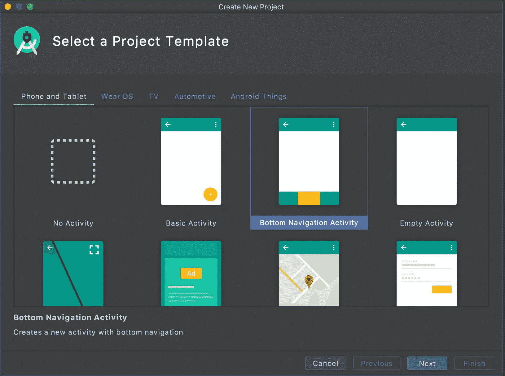
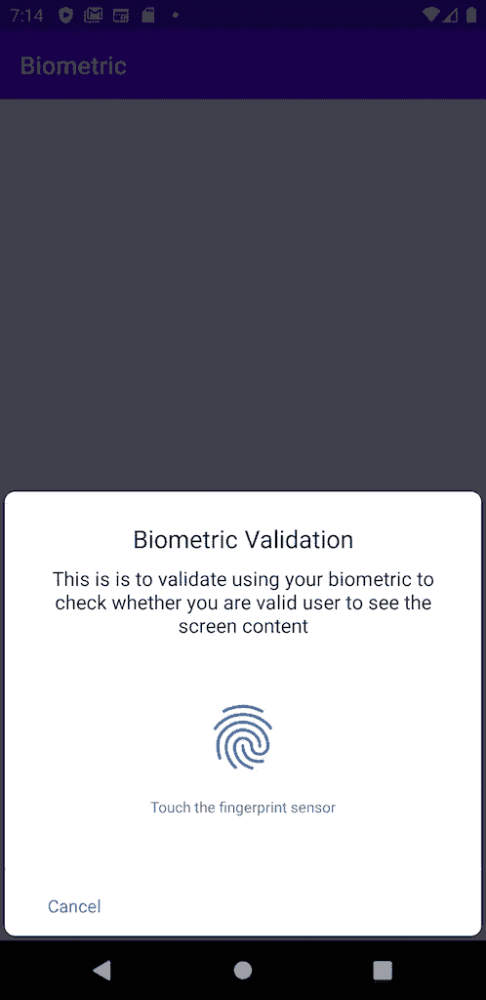
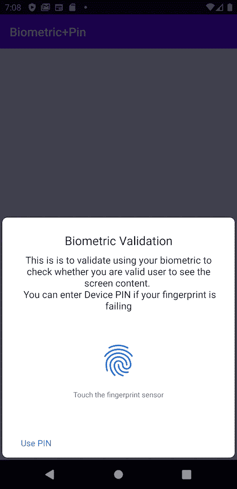
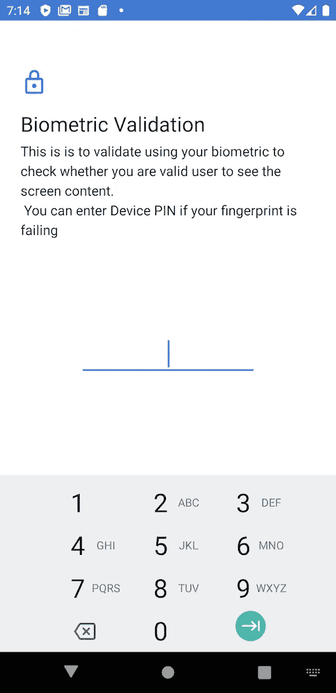

# 解码 Android 应用的生物认证

> 原文：<https://medium.com/geekculture/biometric-validation-in-your-android-app-e8eddbd8efca?source=collection_archive---------2----------------------->

# 介绍

在这篇博客中，我们将讨论生物识别验证，以在我们的应用程序中增加额外的安全层，同时确保最高水平的良好用户体验。在开始实现生物识别验证之前，我们将首先分析需求，以及如何在不影响用户应用体验的情况下保证用户的安全性和隐私感。

# 传统的方法

传统上，为了保护机密和敏感信息，大多数应用程序需要用户登录。为此，用户输入用户名和密码，应用程序将凭证发送到 auth 服务器，最终，服务器将返回某种令牌，应用程序将使用该令牌向远程服务器查询受限数据。

在 web 界面的情况下，这很好，很完美，但是对于移动，我们将用户体验提高了一个档次，同时增加了一层安全性。你一定想知道我们到底要解决什么。让我们举一些例子-

*   假设我们的应用程序像金融应用程序、银行应用程序等一样是基于会话的身份验证。、和都在给定的流中——用户每次启动应用程序时都被要求输入用户名和密码。在这种情况下，用户体验不会很好，因为我们不能在应用程序中保存他的凭据，并使用它们来自动登录，因为这很容易受到恶意欺诈。
*   社交网络或电子邮件等其他应用程序通常会要求一次登录凭据，并为即将到来的会话设置自动登录。在这些情况下，如果其他人解锁了你的手机，他们就可以使用你的账户。

# **生物识别方法**

上面讨论的所有缺陷都可以通过在另一层认证下保护登录凭证来解决，即使用指纹传感器的生物测定验证。这将解决每次会话认证的问题，而用户不必每次都输入凭证，他们可以只使用他们的生物特征，并且成功的验证将使他们保存的凭证能够自动登录。即使是像社交网站或电子邮件这样的应用程序，用户凭证也会受到生物识别的保护，以防止未经授权的用户自动登录。

这也可以用在没有登录流程的应用程序中，比如照片库。这样，人们可以通过另一层安全保护他们的个人信息，并确保下一级隐私。在接下来的部分中，让我们了解如何将生物识别验证添加到我们的 android 应用程序中。

# 入门指南

创建一个新项目，并选择您所选择的模板。

我将选择“底部导航活动”，因此我可以向您展示 2 组生物识别验证:

*   只有指纹的
*   另一个有指纹和设备密码

我将根据自己的选择重命名由该模板创建的类。

# 生物特征依赖性

打开 *build.gradle* (模块: *app* ，在*依赖*中添加如下库依赖:

> 实现“Android x . biometric:biometric:1 . 0 . 1”

打开 AndroidManifest.xml 并在 Manifest 元素中添加以下内容。

通过点击“立即同步”来同步项目。

# 设置生物识别 API

通过拨打以下电话，检查您的设备是否支持生物识别

> biometric manager . from(get context())。canAuthenticate()；

上述方法将让您了解用于生物识别验证的设备的状态。

*   生物识别错误硬件不可用:硬件不可用。请稍后再试。
*   BIOMETRIC _ ERROR _ NONE _ registered:用户没有注册任何生物特征。
*   生物识别错误硬件:没有生物识别硬件。
*   BIOMETRIC_SUCCESS:未检测到错误

这意味着我们可以毫无顾虑地使用生物特征进行验证。

**BIOMETRIC _ ERROR _ NONE _ ENROLLED**:这意味着用户拥有生物特征，但尚未启用，我们可以让用户知道，如果他们启用了生物特征并添加了他们的生物特征信息，他们就可以以更安全的方式使用应用程序。

# 设置生物识别提示

首先，我们需要创建一个实例执行器，用于在主线程上运行生物特征提示。

> executor executor = context compat . getmain executor(get context())；

为身份验证提示视图构建提示信息

*   **promptInfo** :一个构建器，它收集要在系统提供的生物特征对话框上显示的参数。
*   **setTitle** :必输项:设置要显示的标题。
*   **设置字幕**:可选:设置要显示的字幕。
*   **setNegativeButtonText** :必输项:设置负按钮的文本。这通常用作“取消”按钮
*   **构建**:调用这个来构建带有您上面指定的属性的对话框。

如果我们想要允许带有设备凭证的提示信息，我们需要设置 devicecredentiallabled。

*   **setdevicecredentialyallowed**:为真时，提示会返回询问用户的设备凭证(PIN、模式或密码)

## 身份验证回调

*   ***onAuthenticationError***:遇到不可恢复的错误，操作完成时调用。不会对此对象进行进一步的操作。
*   ***【onAuthenticationSucceeded】***:识别生物特征时调用。
*   ***onAuthenticationFailed***:当生物特征有效但未被识别时调用。

要使用 promptInfo 进行身份验证，请添加以下行

> biometric prompt . authenticate(promp info)；

现在，在看到它的运行之前，最后的集成将是使用生物识别可用性来决定流程。

*   ***is Biometric enabled***:这意味着我们都可以启动生物识别进行验证
*   ***isBiometricPresent***:这意味着我们在设备中提供了生物识别功能，但用户尚未启用，我们可以提示他们这一点，以便他们可以决定是否要启用它，以更安全的方式使用应用程序。

让我们看看应用程序的运行情况

Biometric without PIN option

Biometric with PIN option

PIN screen of Biometric with PIN option

我们详细解释了如何使用我们的生物特征凭证来隐藏或保护任何一组信息，我们还看到了设备 PIN。在生物特征崩溃的情况下，人们可以使用设备 PIN 来访问该信息。

要了解更多细节和更深入的观点，你可以在这里找到代码

*也发表于*[*https://www.talentica.com*](https://www.talentica.com/blogs/decoding-biometric-authentication-for-android-apps/)*由我*