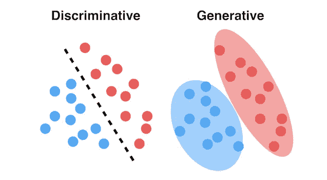
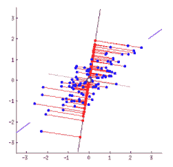
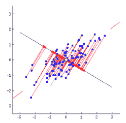
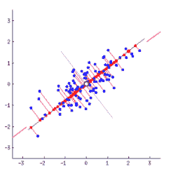

# 人工智能、机器学习、神经网络和语言的鸟瞰图第 1 部分

> 原文：<https://medium.com/geekculture/birds-eye-view-of-artificial-intelligence-machine-learning-neural-networks-language-part-1-802b35cf1873?source=collection_archive---------13----------------------->

在这个由三部分组成的系列中，我们将看看机器学习(ML)的许多方面，它如何与神经网络联系起来&许多 NLP(NLU)/NLG 实现。本系列是初学者的入门读物，也是中级和专家的有趣读物。现在让我们来鸟瞰一下机器学习以及一些常用术语的含义。

*Part 2:*[*https://tafydas . medium . com/birds-eye-view-of-artificial-intelligence-machine-learning-neural-networks-language-Part-2-a53d 93495 de 1*](https://taffydas.medium.com/birds-eye-view-of-artificial-intelligence-machine-learning-neural-networks-language-part-2-a53d93495de1)

*第三部分:*[*https://tafydas . medium . com/birds-eye-view-of-artificial-intelligence-machine-learning-neural-networks-language-Part-3-96 dacf 9 ba 74 b*](https://taffydas.medium.com/birds-eye-view-of-artificial-intelligence-machine-learning-neural-networks-language-part-3-96dacf9ba74b)

# 基础

机器学习是人工智能(AI)的一个子领域，机器可以通过算法学习和识别模式，并在最少或没有人工努力的情况下做出决策。

机器学习的主要种类有:

# 监督学习

机器有一个标记的数据集，它可以从中学习并产生结果。监督学习的一个流行的例子是通过标记的数据集和预测看不见的数据来机器学习猫和狗的图像。在监督学习下，问题集通常被定义为*分类*或*回归*问题。

# 无监督学习

机器可以识别未标记数据集中的模式，并基于所述模式将它们分组，而无需明确知道输出应该是什么。例子包括在没有可用的标记数据集的情况下，基于某些模式识别猫和狗的图像。在无监督学习下，最常见的问题集被归类在*聚类*方法下。

# 半监督学习

这是监督学习(标记数据)和非监督学习(未标记数据)的混合。当几乎没有标记数据可用时，可以添加未标记数据，并可以实施半监督方法来提高预测精度。这种学习类型确保在训练结束时，所有数据点都将具有标签，并且这些标签可以反过来用于训练另一个模型。这有时很重要，因为专家没有能力或没有时间来手动标记所有可用于训练的数据。增加小数据大小的另一种方法是调整现有数据，如扭曲、裁剪，甚至改变照片的色阶，以增加可用数据。*伪标记*是半监督训练的一种流行技术。它包括训练标签数据集，预测未标记数据集并将预测用作新标签，结合新旧已标记数据集，并再次训练模型。

# 强化学习

机器通过基于奖励的系统从环境中学习。它试图优化从起点到终点的基于奖励的路径。这种应用的一个例子是无人驾驶汽车和游戏。

数学模型被用来开发所有不同类型的机器学习。这些模型被分为不同的问题集。主要包括:

# 分类

此类别指的是监督学习下的问题集，可以通过基于训练数据集中提供的标签对数据进行分组来解决。用于解决分类问题的一些算法是 K-NN、随机森林、SVM 或神经网络。

# 回归

另一个问题集是在监督学习下的连续变量，如成本或权重值。线性回归，套索回归，SVM 回归算法的类型。

# 使聚集

此类别指的是无监督学习下的问题集，可以通过基于识别的模式对数据进行分组来解决，而无需显式标记组。聚类问题集下的算法包括 K 均值聚类、均值漂移聚类或 DBSCAN。

# 其他术语

以下是机器学习中使用的一些流行术语。请花些时间阅读这些内容，因为有些术语在本系列的下一部分会非常有用。我们才刚刚开始享受乐趣！

**对抗训练**

一种训练技术，通过向标记数据集添加噪声来最大化预测误差，并使模型能够从这种扰动/对手中学习。这有助于推广我们的模型，并使其对测试数据中的噪声具有弹性。大多数模型都是在相似的训练和测试分布的假设下训练的，但现实世界可能会产生超出所述分布的情况，从而影响预测模型。这种方法在半监督学习中特别有用，其中标记数据用于预测未标记数据。它最小化了未标记集合的预测误差。对抗性攻击的一个例子是当坏单词被拼错并且好单词被添加到电子邮件中以避免被垃圾邮件检测模型检测到时。

**迁移学习**

将从大型标记数据集的训练中学到的知识转移到只有少量数据或标记的数据集。例如，在 NLP 问题集中使用单词嵌入训练模型，如 word2Vec。单词嵌入比一包单词表示更好地表示单词，因此单词嵌入可以用在训练模型中，以可能训练文档分类任务。

**多任务学习**

这就是把几个需要学习的东西放在同一个神经网络里，而不是分成几个网络。一个常见的例子是在计算机视觉中使用，例如对象检测，其中自动驾驶汽车必须识别行人、交通灯和路标。尽管所有这些都可以单独完成，但是训练一个单一的模型可以利用这些任务中的一些共享相同特征的事实。

**一次性学习**

大多数分类问题依赖于大量的数据。在有些情况下，保存一个分类类型的各种示例是不可能的，或者计算量很大。一次性学习的一个流行用例是人脸识别，其中有一个可供模型学习的示例。当这个模型呈现出看不见的数据时，它应该能够正确地对人脸进行分类，并将其与数据库中的人脸进行匹配，从而对其进行识别。对于训练来说，可能必须有多个示例可供模型学习，但是对于测试和实时来说，只有一个示例就足以产生正确的结果。例如，在面部识别中，训练数据将具有一个人的几个面部示例，然而，当更多的面部被添加到数据库用于比较时，训练模型将能够准确地比较同一面部，而不用看到它的几个示例。

**零射击学习**

这是一种学习类型，其中对以前从未在训练集中出现过的数据进行预测，尽管可能有适用于它的类。学习方法使用它可以获得的可用信息进行一些推断并产生正确的类。例如，一个训练集在其训练集中没有斑马的图像，但在一些数据源中看到了斑马的描述，例如:*像马，黑白条纹*。然后，学习将使用这些信息来预测图像，尽管以前从未见过，但它是斑马。与其他主流学习任务相比，零投学习是一项具有挑战性的任务。

**特征提取**

特征提取是指识别数据并将其转换为机器可读的*特征*，以供算法分析。这可能是将单词转换成 n 元语法或计数，或者将图像转换成编号的像素数据，等等。最终提取可以表示为一个 ***张量*** ，即:**向量**或**矩阵**。向量只是一维数组，其中每一列可以表示一个特征，而矩阵是更高维的数组，其中的值可以表示多个文档的各种特征。

**特征转换**

修改特征以更好地提高模型的准确性。这可以通过归一化特征、填充缺失值等来实现。标准化数据的常见做法是应用 z 得分(用样本平均值减去每个数据点，然后除以标准偏差)。这种标准化技术有助于加快学习过程，因为所有数据要素都在相同的范围内，并且计算速度更快。这有时是为了降低维数。PCA(主成分分析)也是特征变换实现的一个例子。

**功能选择**

基于模型中的重要性或影响选择特征。这可以通过网格搜索、交叉验证、权重、统计方法等技术来实现。这适用于最初具有许多特征的问题，并且需要减小特征尺寸。

**相似性度量**

它指的是度量向量之间的相似性。最常见的例子是余弦相似性或点积相似性。唯一的区别是余弦相似性只关注方向而不关注大小。彼此成直角的向量的余弦值为 0。相同方向向量的值为 1，相反方向向量的值为-1。向量幅度中的点积相似因子，范围从 0-无相似性到 1-高度相似性。根据相似性要求的需要，可以使用任何一种。

**维度的诅咒**

这是指模型处理数据集的几个特征(维度)的挑战。太少的特征可能没有足够的信息来做出正确的预测，而太多的特征将使模型难以准确区分和识别常见模式。每个特征将包含一组有限的可能性，因此数据点之间所有可能的特征组合往往会使事情过于复杂，在某些情况下会降低准确性。像 PCA(主成分分析)、PLS(偏最小二乘法)或 LDA(线性判别分析)这样的方法被用于在监督或无监督学习中降低维度。

**交叉验证**

训练数据集是我们用来预测未来数据的。在这一阶段，模型在通过最大似然估计学习时拟合数据。在预测问题中实施交叉验证，以衡量模型在现实世界问题中的表现，而不使用数据集进行估计/模型拟合。它通常用于模型选择阶段，在此阶段，我们缩小最终选择的分类器，然后在测试集上测试算法。在这个阶段，超参数在模型中被微调以选择最佳的一个。交叉验证的主要类型有穷举和非穷举。穷举方法探索将数据集分割成训练集和验证集的所有可能方式，而非穷举方法不探索分割它们相当近似的数据的所有可能方式。穷举类型包括留一交叉验证和留一交叉验证。非穷举类型包括 k-fold 和 holdout 方法。K-fold 可以应用于较小的数据集，在这种情况下，我们不能为训练设置一部分数据。对于较大的数据集，一部分数据可能会被搁置，在训练阶段看不到。为了证明我们最终选择的模型是有效的，并且是无偏见的，我们在测试数据上测试我们的模型，对照一个选择的度量标准，如准确度、召回率、精确度等。如果错误在测试阶段增加，这可能意味着我们的模型过度拟合，我们将不得不做一些更多的调整。

**偏差/方差权衡**

偏差:这是预测值和真实值之间的差异。高偏差意味着你的训练模型不好，可能不合适。目标是通过调整一些参数来恰当地拟合数据集，并确保数据学习正确的特征。

方差:这是我们预测的可变性，即如何展开你的模型预测。高方差预测结果集是过度拟合的结果集，必须调整模型以降低拟合度。该模型的目标是始终保持正确的偏差和方差水平。

**生成模型和判别模型**

判别模型模拟类别之间的决策边界，而生成模型明确模拟类别的实际分布。生成模型使用贝叶斯定理**基于联合概率分布 P(X，Y)找到概率 P(Y，X) = P(Y)*P(X|Y)/P(X)** 其中 P(X)是数据集中恒定的数据点的概率。因此，生成模型方程可以简化为 **P(Y，X) = P(Y)*P(X|Y)/P(X)。**判别模型直接学习数据分布的条件概率 **P(Y|X)** 。如所见，生成模型学习数据的联合分布，尽管它根据贝叶斯定理实现条件概率。这些模型都用于监督学习和非监督学习，一些算法混合了两者。一般来说，判别模型更受监督，而生成模型更不受监督。判别模型不擅长基于看不见的例子进行预测，因为它发现概率取决于它从中学习的先前看到的信息。它更擅长预测异常值，但也容易过度拟合。与生成模型相比，它通常具有更少的计算时间，因为它仅学习条件概率来生成决策边界。给定概率分布，生成模型可以告知看到 X 输入和 Y 输出的概率，但是对于异常值来说可能不会太大，因为这往往会改变数据的分布。这可能会影响某些真实世界的情况，其中训练数据分布与真实世界的示例略有不同。尽管计算时间较长，但与判别模型相比，它不需要那么多数据就能有效地发挥作用。生成模型的贝叶斯定理表明 P(Y | X)= P(Y)* P(X | Y)/P(X)-后验概率[给定证据的事件的概率]等于先验概率[证据之前事件的概率]乘以似然比。

生成模型的类型有**朴素贝叶斯、贝叶斯网络、自动编码器&马尔可夫随机场**。判别分类器的类型有逻辑**回归、SVM、KNN、通用神经网络**。额外:联合概率 P(X，Y)是两个事件同时发生的概率。独立变量的联合概率= P(X) * P(Y ),而因变量的联合概率遵循贝叶斯定理。

进一步解释:【https://www.youtube.com/watch?v=gwV7spVO5Z0】T4

**PCA**

PCA 是一种提取最重要特征的统计方法，当试图基于所述特征重新创建数据分布时，通过找出哪些特征组合在它们之间具有最高的方差以及最小的误差量来提取最重要的特征。这两个目标使它成为一个非常强大的工作方法。不是 PCA 输出的最终组合的一部分的特征被认为是不太重要的，因为数据点可以在没有它们的情况下被重新创建，因此可以从特征列表中移除以降低维数。通过寻找数据点和特征线之间的正交距离(总最小二乘法)来找到方差。下图显示了 PCA 如何试图找到产生最小误差的特征组合，以再现具有最大方差的数据点。最后一个例子是最合适的例子。

**管道**

机器学习管道是训练和测试数据的端到端的流线型过程。这通常是一个迭代过程，通过频繁输入数据来提高准确性。它是高效的、可扩展的、模块化的，每个部分都可以单独改进，而不会破坏整个流程。一个例子是有一个良好的功能设计的管道，它可以获取数据集并转换它，以便通过模块化的机器学习模型进行学习。

感谢您抽出时间阅读。我们现在已经完成了机器学习的基础知识，但是我们仅仅触及了皮毛。我们需要仔细看看被称为神经网络的非常强大的机器学习模型&它们是如何工作的。这将在下一节中讨论，所以让我们深入到 ML 的*城市*，因为我们已经有了一个很好的鸟瞰图！

*第二部分:*[*https://tafydas . medium . com/birds-eye-view-of-artificial-intelligence-machine-learning-neural-networks-language-Part-2-a53d 93495 de 1*](https://taffydas.medium.com/birds-eye-view-of-artificial-intelligence-machine-learning-neural-networks-language-part-2-a53d93495de1)