# 人工智能、机器学习、神经网络和语言的鸟瞰图第二部分

> 原文：<https://medium.com/geekculture/birds-eye-view-of-artificial-intelligence-machine-learning-neural-networks-language-part-2-a53d93495de1?source=collection_archive---------20----------------------->

在前一篇文章中，我们讨论了 ML 的基础和术语。在这篇文章中，我们将深入探讨最流行和最强大的机器学习模型之一——人工神经网络(ANN)或简称神经网络(NN)。让我们马上开始吧！

*第一部分:*[*https://tafydas . medium . com/birds-eye-view-of-artificial-intelligence-machine-learning-neural-networks-language-Part-1-802 b 35 cf 1873*](https://taffydas.medium.com/birds-eye-view-of-artificial-intelligence-machine-learning-neural-networks-language-part-1-802b35cf1873)

*第三部分:*[*https://tafydas . medium . com/birds-eye-view-of-artificial-intelligence-machine-learning-neural-networks-language-Part-3-96 dacf 9 ba 74 b*](https://taffydas.medium.com/birds-eye-view-of-artificial-intelligence-machine-learning-neural-networks-language-part-3-96dacf9ba74b)

# 神经网络

神经网络是一组机器学习模型，其中神经元相互连接形成网络，有点类似于大脑中的神经连接。神经元群属于网络的不同层，通常被称为隐藏层。隐藏层中的每一层都侧重于学习一些关于数据的知识，并将输出转移到下一层进行进一步学习。神经网络可以识别用于聚类或分类目的的模式，每一层观察特定的特征。隐藏层中的神经元可以简单地认为是各种参数的投票机制，其中每个投票能力可以根据所学的内容增加或减少。

**深度学习**

这是指神经网络的几个堆栈，通常用于更复杂的问题集。比线性或一些非线性函数复杂得多的问题集可以使用深度学习来解决，其中每个神经层可以用于表示不同的复杂特征。

**前馈**

前馈神经网络是从输入到隐藏层然后到输出的单向网络。这与递归神经网络形成对比，在递归神经网络中，来自一层的输出被反馈作为网络中的输入。

**反向传播**

这是神经网络训练的一部分，用于计算找到局部误差最小值所需的梯度。它找到降低成本函数(误差)所需的建议权重微调，并将该信息发送回要实现的早期层。它是神经网络的微调引擎。链式法则用于寻找产生最小成本函数的小的推动/调整(导数)的总和。每一轮改进都基于模型实现的纪元/运行时间。

**成本函数**

对于所有示例，成本函数是期望值和预测值之间的误差计算:Yp-Pe。根据问题是分类还是回归，计算这种损失/误差的一些方法包括*、平均绝对误差(MAE)、均方误差(MSE)或交叉熵损失/负损失可能性*。MSE 主要用于线性回归问题，而交叉熵主要用于分类问题。损失函数和成本函数通常是同义词，但损失函数有时指的是给定数据点的误差，其中成本函数适用于整个数据。成本函数的选择取决于诸如更快收敛、异常值处理等因素。术语学习通常指的是最小化成本函数。

根据问题是线性函数(如线性回归)还是分类问题(非线性函数),假设成本函数本质上具有凸拓扑，以便于找到最小值。

**梯度下降**

这是一种最小化函数的数学方法。在神经网络中，梯度下降用于最小化成本函数。它涉及到参数 ***alpha*** ( **学习率**)，该参数指示多快接近成本最小值，如果太高则有可能超过它。其思想是在几次迭代(时期)之后，局部最小值与全局最小值收敛，尽管不是在所有情况下。有时一个更好的方法是有一个初始的较高的 alpha 值，并随着时间的推移在每个时期慢慢衰减/降低它，这被称为**学习率衰减**。这更好地接近最小值，而不增加超过它的机会。在几个时期之后，由于小的梯度变化，梯度可能不能有显著的更新，这被称为**梯度饱和**。为了改进某些神经网络的学习，可以将数据转换为具有零中心。这是通过从每个数据点减去平均值来完成的。以零为中心的数据分布将具有更接近平均值 0 区域的大多数值。在梯度下降中，这些是更新更快并且具有合理更新的部分。更远的值将具有更小的梯度更新。最后，零中心数据集使计算更快更容易。

**随机梯度下降**

用于查找局部最小值的随机小批训练集，其计算速度比在整个训练集上工作的梯度下降更快。随机梯度下降在寻找局部最小值方面做得很好。这类似于某人小心翼翼地沿着一条基于所有提供信息的路径(梯度下降)寻找局部最小值，而某人*醉醺醺地*沿着一条路径走向局部最小值。

**均方误差**

对于线性回归问题，均方误差很大，并且在梯度下降过程中调整权重以找到最优最小值。关于线性回归函数 h(x)及其对应的 MSE 函数 j，见下文。

在梯度下降过程中，调整权重，直到达到最小值，此时模型将以最小的误差很好地拟合数据分布。见下文，了解权重如何随着每次梯度下降而调整，直到达到最小值。

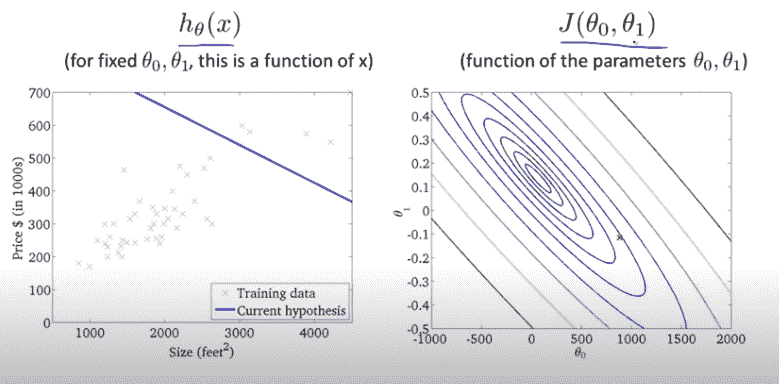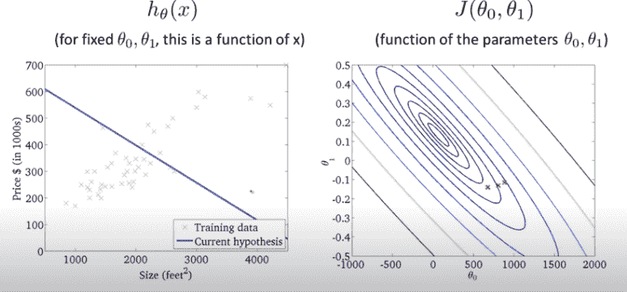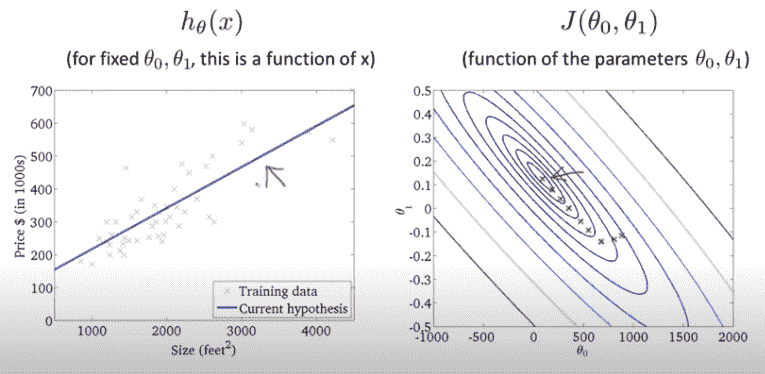

**交叉熵(对数损失)**

分类问题假设非线性函数，因此将模型预测插入 MSE 函数不是最好的，因为所得的成本函数导致非凸图，因此很难找到合适的最小值。查看 MSE 如何表示分类问题的示例。

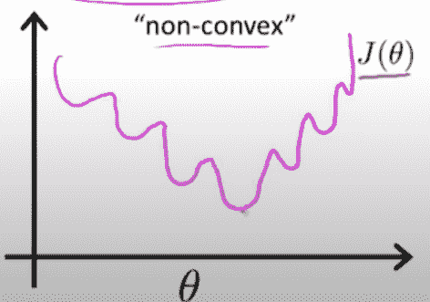

Source: Andrew Ng Lecture slides on deep learning [https://www.coursera.org/specializations/deep-learning](https://www.coursera.org/specializations/deep-learning)

交叉熵损失能够适应分类的非线性，并惩罚远离观察预测的模型预测。函数 h(x)的交叉熵方程在下面显示为分段函数，它也可以组合成一个方程。

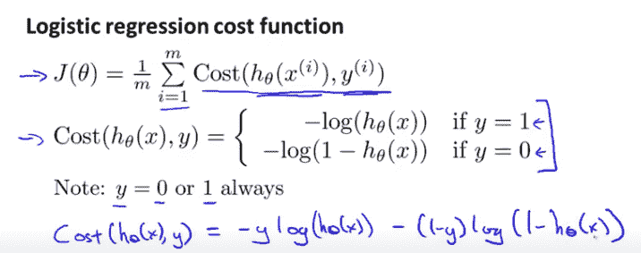

Source: Andrew Ng Lecture slides on deep learning [https://www.coursera.org/specializations/deep-learning](https://www.coursera.org/specializations/deep-learning)

对于输出 y [0，1]的逻辑回归或二元分类问题，如果预测值 h(x)与实际结果 y 相差甚远，则成本函数的误差会呈指数增长，见下图。

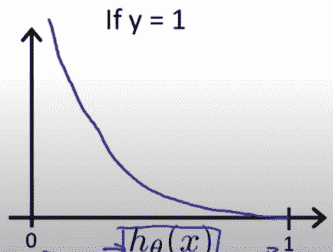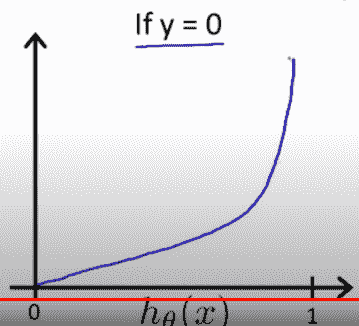

Source: Andrew Ng Lecture slides on deep learning [https://www.coursera.org/specializations/deep-learning](https://www.coursera.org/specializations/deep-learning)

成本函数源自最大似然定理，其中我们找到最适合输入数据的函数。对于像线性回归这样的线性连续函数，成本函数是 MSE 对于分类非线性问题，成本函数是对数损失。

**激活功能**

有时称为传递函数。它用于确定神经网络中层的输出数。这个数字可以表示是或否、范围、数量或概率。激活功能决定了哪些神经元应该开启或不开启。它还将非线性引入神经元，这有助于学习数据集中更复杂的特征。该函数可以是线性的或非线性的。线性函数不受任何范围的限制，而像 sigmoid 这样的非线性函数受一个范围的限制，这个范围有时可能很容易使用。以下是一些函数类型:

***Sigmoid(逻辑激活):*** 这使得输出数字在 0 和 1 之间，通常用于二进制分类。由于压缩会导致信息丢失，因此有时这种方法不太受欢迎。由于信息的大量丢失，这可能会对深度学习模型的输出结果产生负面影响。

***Softmax:*** 是介于 0 和 1 之间的 sigmoid 的概括，通常用于多分类。所有概率之和等于 1。这适用于结果互斥且只有一个答案是正确的情况。Softmax 应用于二元分类将产生与 Sigmoid 相同的结果。

***TanH(双曲正切激活):*** 这使得输出数在-1 和 1 之间。这是对 sigmoid 的修改，提供了稍好的结果，因为函数和梯度的范围很陡。它也是以零为中心的，这使得计算更加简洁。

***RelU(整流线性单元):*** 最流行的函数之一，输出 0 到输入值之间的值。它有问题，比如在 0 不可微，有不同的变量来解释它的一些缺点。负值零梯度的主要问题导致神经元呈现“死亡”状态。这种停滞状态意味着神经元不能得到更新，也不能对神经元进行学习。RelU 有助于解决消失/爆炸渐变问题，因为渐变要么是 1，要么是 0。不像例如 Sigmoids，其中梯度可以变得相对较小或较大。对 RelU 的一些改进是泄漏 RelU、参数化 RelU 和指数线性单元(elU ),所有这些都将一些值分配给负数而不是 0。这有助于解决 RELU 的“死亡”状态问题。

**阴性采样**

由于反向传播的结果，权重的调整是计算密集型的，因为网络中的每个神经元都必须调整以最小化总权重。有时引入负采样是为了减少调整每个目标的所有权重的工作量，并且只选择几个权重进行调整，以使整个过程更快。这主要用于训练单词嵌入模型，其中训练模型将输入和输出单词作为模型输入，并将目标数字作为标签。负样本是来自原始数据集的一串随机输出字，标记为 0。这些作为相反的数据点来训练我们的模型。负目标(0-非邻居)的样本与正目标(1-邻居)一起用于训练每个数据点的模型，而不是更新与具有不同目标编号的所有其他单词相连接的每个单词。这种方法在计算上更易于管理，但在统计上效率较低。

**多层感知器**

感知器只是一个前馈网络，意味着多层感知器是一个至少有 3 层的前馈网络——输入、输出和至少一个隐藏层。2 层网络是 1 个隐藏层和 1 个输出层，输入层通常不计算在内。MLP 不能捕获空间(位置)数据。传销有时被称为*香草网络*。问题越复杂，隐藏的层面就越深。随着隐藏层在网络中的发展，由于前几层中函数的总和，更复杂的特征被建模。

**消失和爆炸渐变**

这是一些神经网络在反向传播过程中存在的问题，这是由于前几层和后几层之间的长期依赖性，尤其是在深度神经网络中。在反向传播过程中，随着梯度在网络中越来越靠后，梯度不断增加。对于比零小得多的梯度，连续的矩阵乘法将导致早期层中非常可忽略的值，称为消失梯度。在这一点上，对权重所做的极小的调整不算数，并且网络不再真正学习。这种现象影响网络中的许多激活，并影响算法的整体训练。相反，对于大于 1 的大梯度数，早期层中的连续矩阵乘法可能会将值分解到超过其最大权重调整的点。这就是所谓的爆炸梯度。防止梯度过早消失或爆炸的一种方法是在合理的方差内初始化网络中的权重，使得权重一开始就不会太高或太低。一个例子是随机初始化，方差大约为 0 均值-> 2/n，其中 n 是网络中 ReLU 激活的层数。像 LSTM(长短期记忆)和 GRU(门控循环单元)这样的算法是通过引入门的概念来解决这个问题的。

**偏置**

神经网络中的偏差作为一个节点包含在每一层中。与用于计算下一层中节点值的总输入权重相结合。之后应用激活功能。偏差有助于转换函数，以便最适合模型。静态函数不够灵活，不允许函数探索更好的学习选项，因此偏差有助于网络更好地学习。偏差的初始化可以被设置为 0，并且仍然能够学习。另一方面，将权重初始化为 0 将无助于网络学习。初始化的 0 权重或相同值的权重给网络引入了对称性，因此每个神经元在网络中具有相同的效果。这导致梯度在反向传播中是相同的，并且网络不能辨别每一层中什么特征更强/更弱。

# 神经网络的变体

# 卷积神经网络(CNN，ConvNet)

这是一种网络，其中矩阵形式的过滤器(内核)充当模式标识符，例如:图像中的边缘或图像中的圆。该滤波器一次只覆盖几个节点，而不是一个普通的神经网络，其中一层中的每个节点都连接到下一层中的所有节点。将滤波器传递到输入的各个部分被称为参数共享。这使得机器能够识别图像不同部分的特定特征。神经元和滤波器之间的点积作为下一层神经元激活的一部分而产生。过滤生成给定输入的特征，生成的特征堆被称为特征图。过滤给定空间的所有部分的重复过程被称为卷积，并且这发生在卷积区域中。最小的过滤器是 1x1 过滤器，它只是查看进入的输入像素，但是它合并/减少层中的深度(通道)以加快计算速度。由于通道减少，1x1 滤波器降低了过拟合，从而降低了参数(尺寸减小)。另一层称为池化层，旨在通过在给定区域中查找最大值来缩小卷积层的输出。在给定区域内寻找模式而不是寻找单个神经元的好处是，这适应了模式的不同变化，而不是精确匹配。这在例如图像识别中非常有用，在图像识别中像素可能会有一点移动或旋转。矩阵的这种简化也有助于计算。也可能有称为全连接图层的图层，这些图层是最终输出的间歇性结果或预测。这些层被送入网络的其他层，作为进一步计算的输入。这些分数通常使用类似 RelU 的激活进行归一化，对于最终的预测概率，可以应用 softmax 方法。对 convnets 的其他调整包括:

*   填充:将额外的像素添加到图像的边界，以便边缘上的像素向内移动一点，并且可以被过滤器更多地检查。
*   步数:在卷积图像的一部分后，过滤器应该采取的步数。它可以是 1 步或更多步。
*   深度/通道:有时被称为通道的特征的深度也可以被改变为一个或多个步骤。黑白图像有 1 个通道，而标准彩色图像有 3 个通道(RGB)

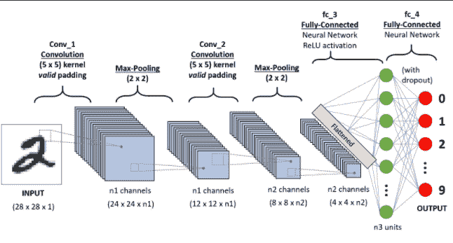

# 递归神经网络(RNN)

RNN 是一个神经网络，其主要特征是一个*循环回路*，为一个神经元产生输出，并反馈给同一个神经元以进一步激活。这对于序列信息非常重要，因为我们需要了解数据点的序列外观(相关性)以便进行预测。这适用于句子、演讲等等。当前神经元的输出基于当前输入和所有先前输入到神经元的输入。当前和先前输入的跟踪被称为时间步长。rnn 在不同的时间步长上共享参数/权重，称为参数共享，这降低了算法所需的计算成本。

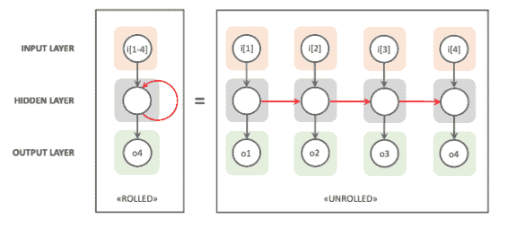

RNN 的其他变体如下所示。它们包括一个输入对多个输出(例如:音乐生成)，多个输入对一个输出(例如:情感分析)和多个输入对多个输出(例如:机器翻译)。这些例子显示的是测试时的模型，而不是训练时的模型。

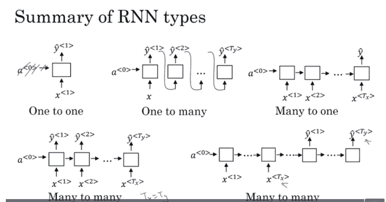

Source: Andrew Ng Lecture slides on deep learning [https://www.coursera.org/specializations/deep-learning](https://www.coursera.org/specializations/deep-learning)

最后，下图是训练时一对多的示例，其中正确的输出结果用作下一代的输入。

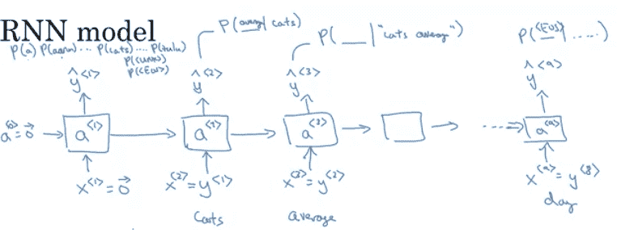

Source: Andrew Ng Lecture slides on deep learning [https://www.coursera.org/specializations/deep-learning](https://www.coursera.org/specializations/deep-learning)

# 长短期记忆(LSTM)

LSTM 是一个 RNN 建筑，主要是为了解决香草 RNN 渐变消失的问题而开发的。该算法实现了门的概念，门控制着进出单元的信息量。单元格充当隐藏层，接收输入并输出输出。系统中的门是输入门、遗忘门和输出门。被称为细胞状态的细胞部分充当记忆，通过训练来记录哪些是重要的要保留，哪些是重要的要放弃。

*遗忘门*:来自先前隐藏状态和当前输入的信息通过这个具有 sigmoid 函数的门。该值越接近 0，就越容易被遗忘。

*输入门*:为了更新单元状态，先前的隐藏状态和当前输入通过这个具有 sigmoid 函数的门。值 0 表示不太重要，1 表示非常重要，对先前的隐藏状态和当前输入也运行双曲正切函数。然后，sigmoid 函数将决定 tanh 输出中哪些信息需要保留，哪些信息可以放弃。

*单元状态*:为了更新单元状态信息，将遗忘门乘以单元状态，越接近 0 的值表示越容易被遗忘。来自输入门的信息然后被添加到单元状态，这更新了当前单元状态。

*输出门*:来自前一个隐藏状态和当前输入的信息通过一个 sigmoid，乘以当前单元状态，通过一个 tanh。这是为了确定隐藏状态现在应该携带什么。输出是隐藏状态，单元状态和隐藏状态然后被带到下一个时间步骤。

# 门控循环单元(GRU)

这是一个改进的 RNN 建筑，类似于 LSTM，但只有两个门。这些门是复位门和更新门。它没有单元格状态，但它使用隐藏状态来传递信息。它比 LSTM 快得多，但它们通常有相似的结果。

*重置门*:用于决定忘记多少过往信息。

*更新门*:其作用类似于遗忘和输入门。它决定哪些信息该放手，哪些信息该添加。

下面是 RNN 及其变体 GRU 和 LSTM 的对比图片

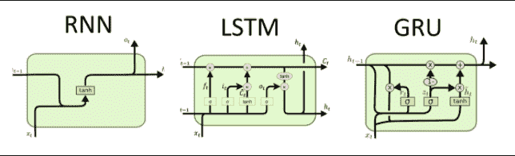

# 玻尔兹曼机器(具有隐藏单元的 Hopfield 网络)

据我们所知，这是深度学习之前的架构之一。这个网络没有输出，只有输入(可见单元)和隐藏单元。网络中的每个节点 *n* 在 n(n-1)个连接中连接到所有其他节点(输入和隐藏单元)。这是大量的连接，并且对于实用机器学习的通用训练解决方案是不可行的。该模型具有双向权重，指示打开或关闭节点的程度-节点是二进制值。在被称为**马尔可夫随机场**或**马尔可夫网络**的意义上，双向性质也可以被认为是无方向性的。这种架构通常被认为是一种循环网络。它是一个生成模型，旨在表示无监督数据集的概率分布，并可用于对不可预见的数据进行推断。该模型旨在将分布概括为一种平衡，其中全局状态已达到最佳水平，因此能够检测新的示例，即:异常情况或威胁检测机制。

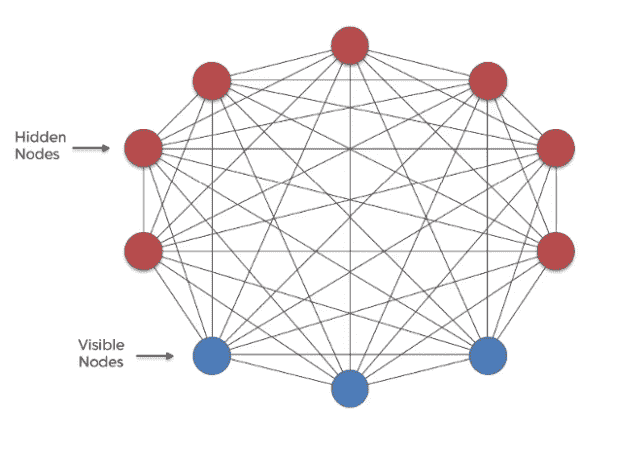

玻尔兹曼机器的一种变体——受限玻尔兹曼机器通过采用二分图方案缩小了连接数，因此一个节点不会连接到所有其他节点。这为特征学习、分类、回归和降维中的问题提供了更现实的应用。

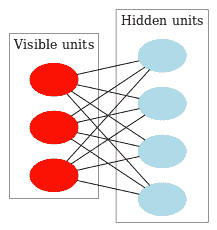

# 剩余网络(跳过连接)

残差网络(ResNets)是一种神经网络体系结构，其输出来自一个隐藏层，该隐藏层连接到最直接的层，但也跳过与网络中更远层的连接。这是为了确保正确的信息通过网络传播，以生成正确的预测。这样做的另一个原因是防止在反向传播期间早期网络中的消失梯度。深度网络可能面临更新早期网络中的特征的挑战，这是由于对于给定层中的所述特征，小的梯度变化相当于根本没有学习。ResNets 有助于网络了解已跳过几个图层的要素的变化，因为这些梯度不可忽略。这有助于梯度在网络中更平滑地流动，并且由于更快的学习而更快地收敛。

祝贺你完成第 2 部分！本文旨在向您介绍各种神经网络模型。还有很多我们没有讨论的，如暹罗网络、双编码器网络等。同时，本文所涵盖的内容是神经网络模型的一个良好开端&它们是如何在幕后运行的。我鼓励您探索本文中没有涉及的其他类型的神经网络，以拓宽您的知识并理解它们是如何工作的。最后，让我们谈谈机器学习中的自然语言&过去几年中令人兴奋的实现是什么样子的。我们将在下一篇文章中讨论这个问题，再见！

*第三部分:*[*https://tafydas . medium . com/birds-eye-view-of-artificial-intelligence-machine-learning-neural-networks-language-Part-3-96 dacf 9ba 74 b*](https://taffydas.medium.com/birds-eye-view-of-artificial-intelligence-machine-learning-neural-networks-language-part-3-96dacf9ba74b)