# 带示例的位操作

> 原文：<https://medium.com/geekculture/bit-manipulation-with-examples-fc44ae618da8?source=collection_archive---------17----------------------->

这篇文章将带你了解技术面试中最害怕的话题之一，那就是钻头操纵。


Photo by [Michael LaRosa](https://unsplash.com/@mlarosa97?utm_source=medium&utm_medium=referral) on [Unsplash](https://unsplash.com?utm_source=medium&utm_medium=referral)

首先，我假设你知道二进制数的基础知识，从二进制到十进制的转换和位移，如果没有，请参考我链接的一些资料。

1.  理解算术移位。
2.  理解逻辑转换。(示例)

[https://youtu.be/nSKT6Ph8u9Q](https://youtu.be/nSKT6Ph8u9Q)

3.(从 LSB 开始计数)提取第 I 位执行`(NUMBER & (i << 1))`

4.(从 LSB 开始计数)将第 I 位设置为 1 执行`(NUMBER | (i << 1))`

5.使用`NUMBER & ~(1<<i)`清除 ith 位

6.使用`(1<<i)-1 & NUMBER`清除 MSB 至 ith 的所有位

7.使用`(-1<<(i + 1)) & NUMBER`清除从第 I 位到 LSB 的所有位

8.使用`~(1<<i) & NUMBER | (value << i)`更新特定位

9.了解 XOR 运算符(示例)[https://www . khanacademy . org/computing/computer-science/cryptography/ciphers/a/XOR-bitwise-operation](https://www.khanacademy.org/computing/computer-science/cryptography/ciphers/a/xor-bitwise-operation)

好了，现在我们清楚了基础知识，让我们从 Python 中位操作的第一个问题开始。

## 示例 1:编写一个 python 代码来查找设置为 1 的位数

直觉:

**什么是右移**:从 LSB 中移除一位，并在 MSB 中加一个零。

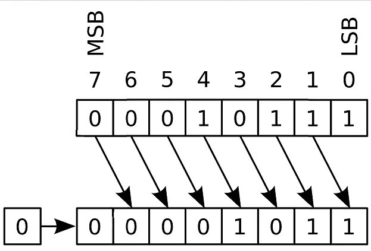

[https://en.wikipedia.org/wiki/Logical_shift](https://en.wikipedia.org/wiki/Logical_shift)

同样，如果我们对输入长度执行逻辑右移，我们会得到以下结果，我们可以观察到 LSB 是如何被替换的

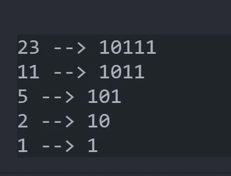

如果我们对这些结果执行按位 And 运算，我们会得到以下结果，因为我们可以观察到，在这种情况下，提取了 LSB

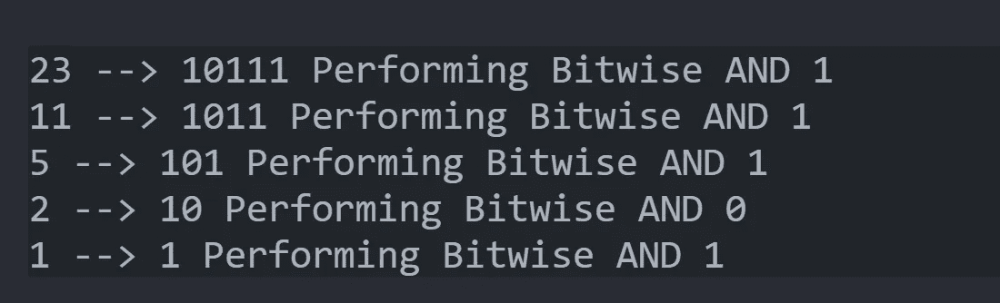

算法:如果我们观察右移和按位 and 的模式，我们得出一个结论，我们可以用这两个运算符来知道该位是 0 还是 1。因此，为了计算位数，首先定义一个名为`num_bit`的 int 变量，将其设置为 0，直到输入`x`存在，对 x 执行按位 and，并将结果添加到`num_bits`，然后执行右移。

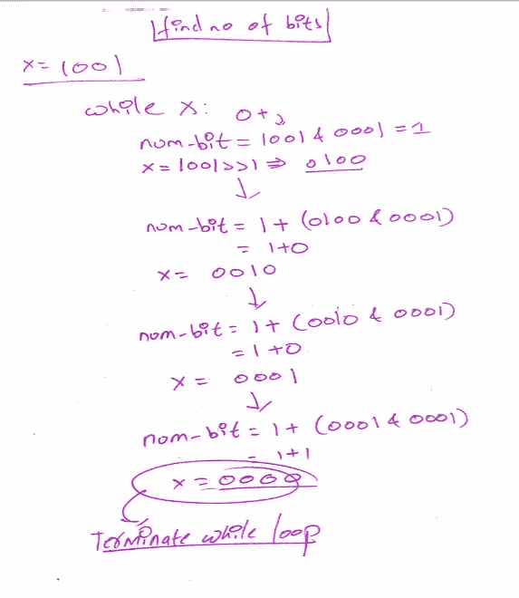

代码:空间 O(1)，时间 O(n)，其中 n 是输入的长度

```
def num_bits(num: int) -> int:
    num_bit = 0
    while num:
        num_bit += num & 1
        num = num >> 1return num_bit
```

**例 2:返回二进制数中最右边的 1(从 LSB 开始返回 1)**

对于 101101，返回 000001

对于 101010，返回 000010

对于 010000 返回 010000

**直觉**:`number -1`做什么，考虑下面的例子在每个例子中，当我们用 1 减去整数时，最右边的位 1 变成 0


如果我们对这些数字进行按位 And 运算呢？正如我们在下面的例子中所看到的，这将返回我们输入的所有数字，除了最后一个 1 是零。

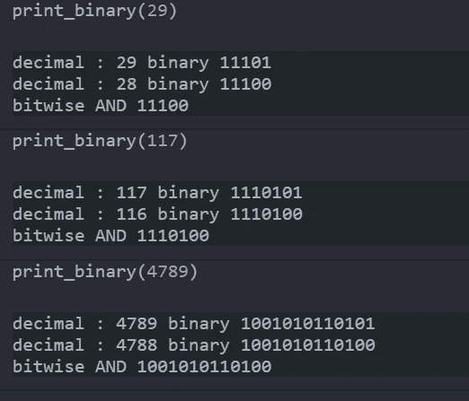

到目前为止，我们所做的是用一个数减去 1，然后对它进行按位 and 运算。现在我们想要的是得到最右边的 1。

在此之前，仔细考虑 XOR 真值表。如果两个值相等，答案是 0，如果两个值不相等，答案是 1。

那么，如果我们将从`NUMBER & (NUMBER -1)`获得的值与我们的初始数字进行异或运算(从`NUMBER & (NUMBER — 1)`获得的值是最右边的 1 翻转后的值)。因此，异或这将给出我们需要的结果

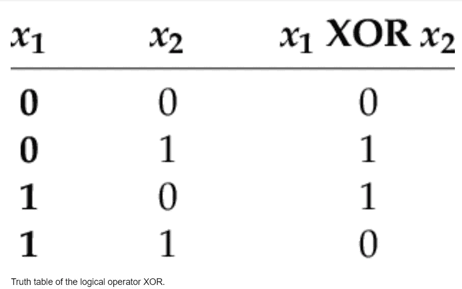

[https://www.researchgate.net/figure/Truth-table-of-the-logical-operator-XOR_tbl1_326006336](https://www.researchgate.net/figure/Truth-table-of-the-logical-operator-XOR_tbl1_326006336)

实时编码。

```
def rightmost_one(num):
    return num ^ (num & (num - 1))
```

## **例 3:计算一个词的奇偶性。**

如果一个二进制数中一的个数是奇数，则该数的奇偶性为 1，否则为 0。

101101101 的奇偶校验为 0

111101101 的奇偶校验为 1

我将给出三个例子，每个例子的时间复杂度都有所提高。

**解决方案 1:**

直觉 1 :我们已经知道执行`NUMBER`和 1 的按位 AND 运算会得到 LSB。在下面的例子中，我执行了`NUMBER & 1`，它给出了 LSB。

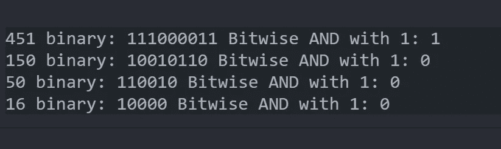

现在考虑数字 451，在纸上写下它的位，将它的值与零进行异或运算，记住结果，对 MSB 之前的位执行相同的操作。

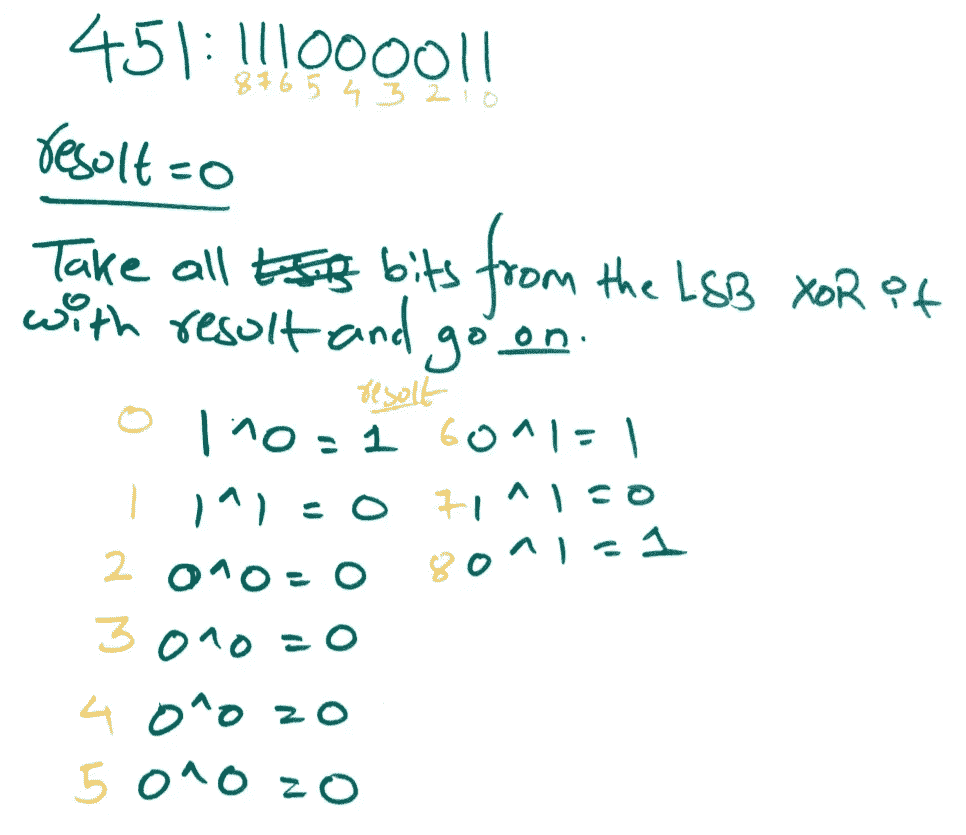

因此，我们观察到，如果此时你有类似*的问题，“我们如何在没有数组或 for 循环的情况下迭代二进制数呢？”* ***简单使用右移运算符。***

注意:我们将结果取为 0，因为由于 XOR 的特性，输入中的 1 将相互抵消，如果有奇数个 1，则该 1 与 0 的 XOR 将得到 1。

代码:时间 O(n): n 是输入的长度。

```
def find_parity_one(num):
    result = 0
what to write and what not to.ios the Question     while num:
        result = result ^ (num & 1)
        num = num >> 1
    return result
```

**解决方案 2**

直觉:正如我们在前面的例子中观察到的，当我们用 1 减去一个二进制数时，我们得到的是除了它后面的 1 之外的数。同样，如果我们对这个结果和初始数字进行按位 AND 运算会怎么样呢？

`NUMBER & (NUMBER-1)`


记住这个属性，如果我们取一个初始值为 0 的变量，然后执行按位 XOR 运算，直到输入中有 1，我们会得到我们的答案。

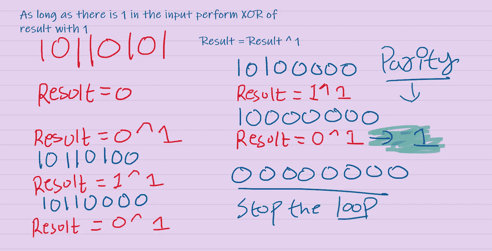

好了，太棒了，现在我们可以写一个非常有效的算法，只迭代输入中的 1。

代码:我们可以观察到时间复杂度大大降低

```
def find_parity_two(num):
    result = 0
    while num:
        result = result ^ 1
        num = num & (num - 1)
    return result
```

**方案三**

直觉 3:让我们在这里利用异或的基本性质，考虑我们有一个数字 abcxyz 比

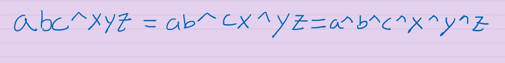

考虑例子

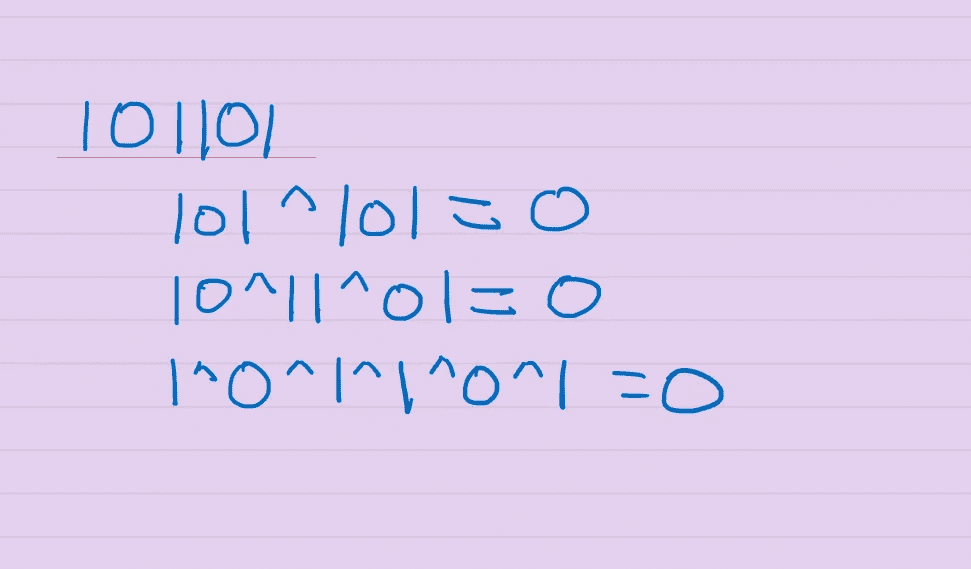

假设我们有一个 8 位输入，如果我们想计算这个数的奇偶性，我们需要做的就是执行前 4 位与后 4 位的按位异或，然后前 2 位与后 2 位的按位异或，依此类推。

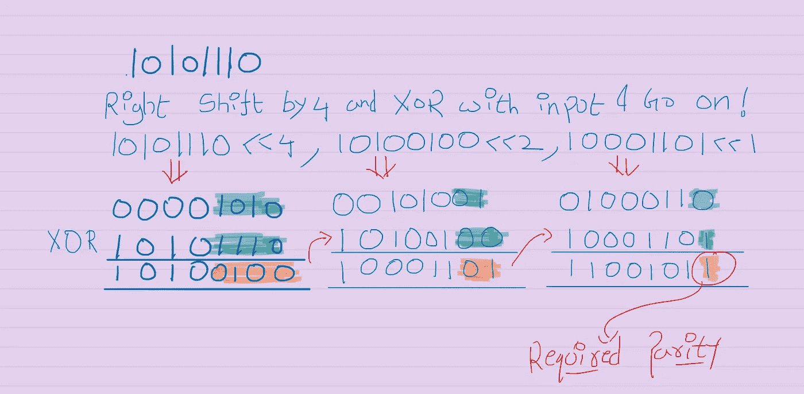

代码:

```
def find_parity_three(num):
    # my system is 64-bit so i will start with 32
    val = 64
    for _ in range(6):
        num = num ^ val
        val //= 2

    return num & 0x1
```

**例 4:给定两个整数 X 和 Y，找出将整数 X 转换成 Y 所需的位数。**

直觉:如果我们理解异或的性质，这是一个相对简单的问题。

考虑这个例子

x = 1011010

y = 1001000

要将整数 x 转换为 y，我们需要匹配为 1 的位。

从下面的例子中，我们观察到转换需要两位

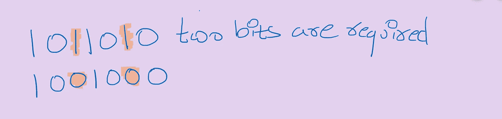

如果我们对“X”和“Y”进行异或运算，我们将只得到那些不同的位。

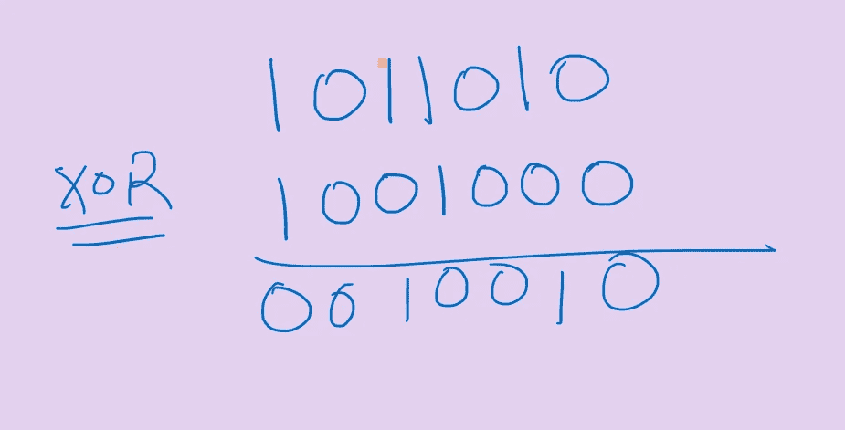

因此，我们可以使用第一个例子中使用的算法来计算位数。

代码:

```
def no_of_bits(X,Y):
    X_XOR_Y = X ^ Y 
    result = 0
    while X_XOR_Y:
        result += X_XOR_Y & 1
        X_XOR_Y >>=1
    return result
```

**例 5:给你一个整数输入和两个位置，你的目标是交换这些位置。**

输入:编号，第 I 个位置，第 j 个位置

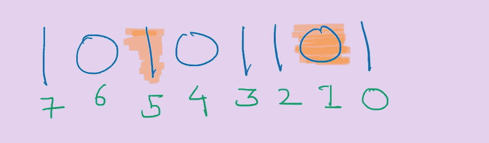

交换位置 5 和 1

直觉:要交换这两个位，我们需要首先找到给定位置的位的值，我们可以用各种方法来实现，但我将展示两种简洁的方法，一种使用左移，另一种使用右移。

> 使用右移位。

将输入 num 右移第 I 个位置，并执行按位 and，类似于第 j 个位置。`(NUMBER >> i) & 1`

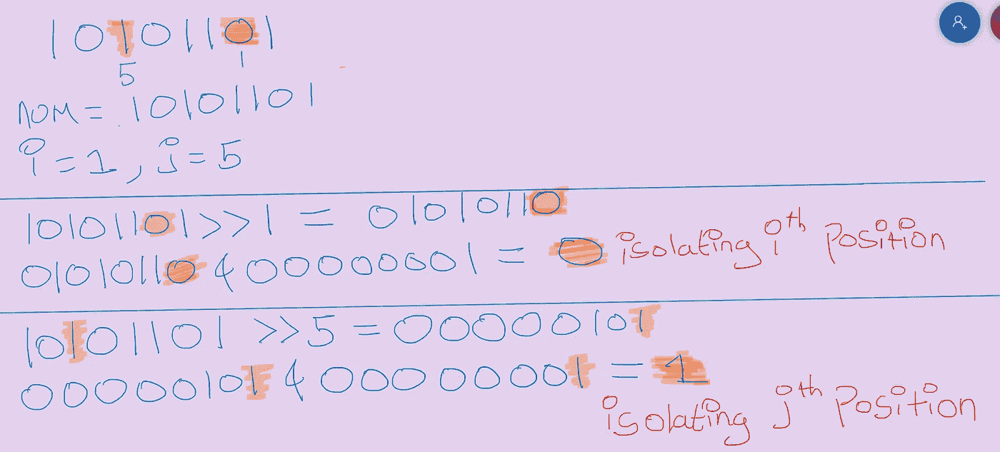

这样我们就可以提取位置。

> 使用左移

将 1 左移“I”并与 num 执行与“j”相似的按位 and。`NUMBER & (1 << i)`

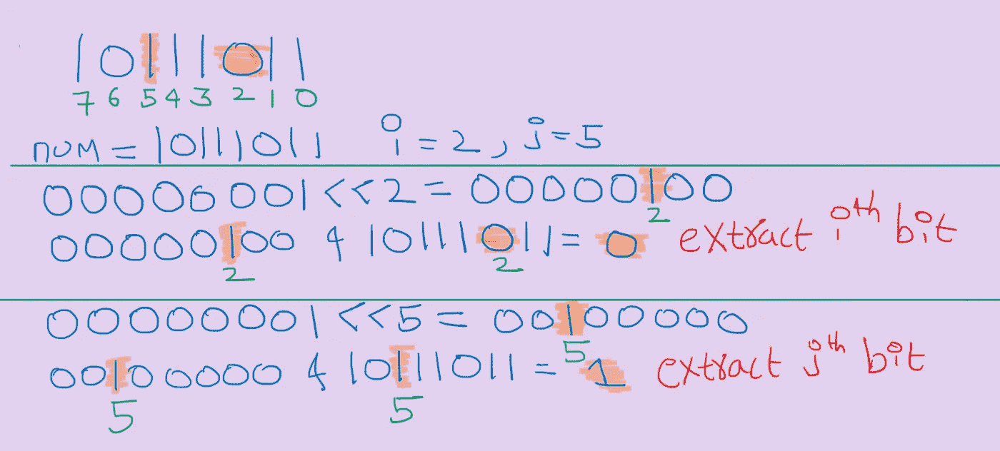

现在我们已经提取了这些位，我们要做的就是翻转这些位，只有当这些位不同时我们才会继续，否则返回输入的 num。

如果位不同，我们将使用 XOR 和 OR 的属性来生成位掩码。

使用左移中演示的方法，我们可以将 1 放在“I”和“j”的位置。如果我们执行按位或运算，我们将得到第 I 个和第 j 个位置的掩码。

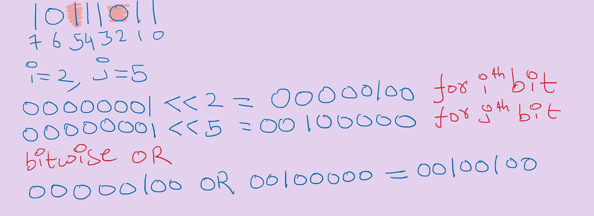

对 num 和掩码执行按位 XOR 运算，我们将通过翻转位得到我们需要的答案。

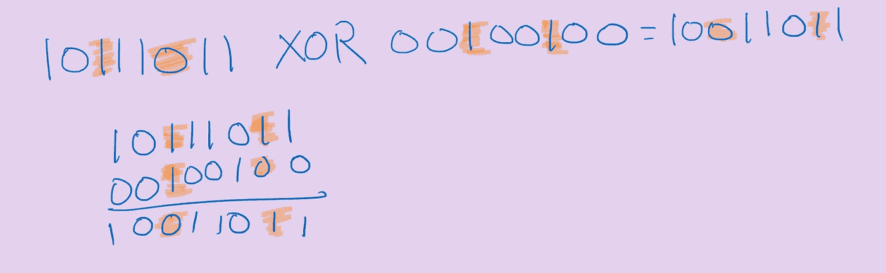

密码

```
def flipping_the_bits(num,i,j):
    # using right shifting
    if (num >> i) & 1 != (num >> j) & 1:
        bitmask = (1 << i) | (1 << j)
        num = num ^ bitmask
    return nu**m**
```

**例 6:给定输入的反转位**

10101010 -> 01010101

01101010 -> 01010110

**直觉和算法:**

EOP 的问题是 64 位，而 leetcode 是 32 位，但为了简单起见，我们将使用 6 位。

1.  我们将使用右移位来遍历这些位，并执行按位 and 来提取这些位。`(NUMBER >> n) & 1`
2.  一旦该位被隔离，我们将迭代地用幂左移该位，并执行按位或运算。

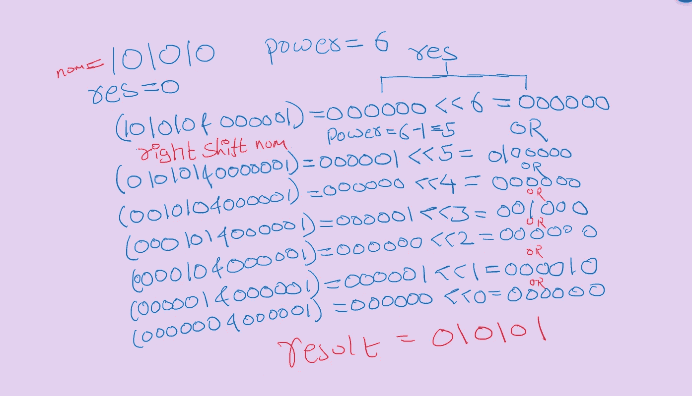

代码:

```
def reverse_bits_one(num):
    power,res = 32,0
    while num:
        res += (num & 1) << power 
        num >>= 1
        power -= 1
    return res
```