# Bitbucket vs Github vs Gitlab 详细对比

> 原文：<https://medium.com/geekculture/bitbucket-vs-github-vs-gitlab-detailed-comparison-a02dfbe7a624?source=collection_archive---------5----------------------->

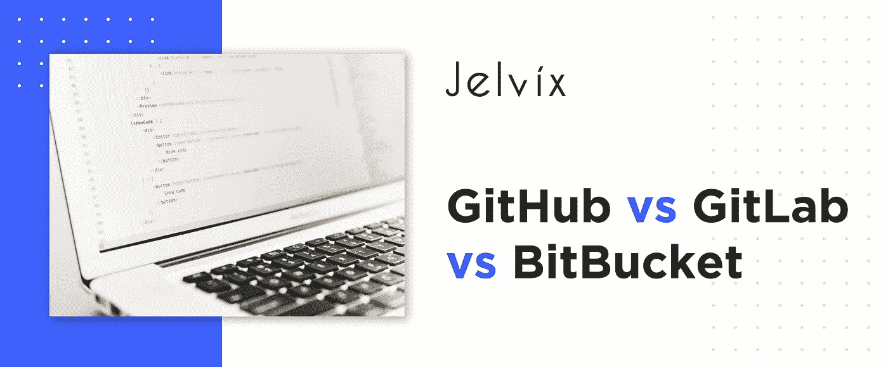

软件开发项目是基于团队合作的。所有成员都应该知道其他人在做什么，并且可以自由访问他们同事写的代码。有了版本控制系统——允许记录代码变化和上传新版本的软件，这是可能的。

存储项目以允许多台计算机和开发人员访问的服务称为项目托管服务。所有严肃的开发和科学项目都依赖于这些平台——它们允许跟踪团队的工作并从任何设备访问代码。

# 为什么我们需要项目托管服务？

当我们谈论协作工作和文件共享时，首先想到的服务是 Dropbox 和 Google Drive。这些系统很容易上手，有一个直观的界面，并允许控制文件。然而，它们并不适应开发者的需求。

特别是 Google Drive 和 Dropbox 都没有详细的版本追踪系统。很难合并所有的编辑，获得多个版本的同步视图，并查看对性能的影响。有更适合这个任务的系统——GitHub、Git Lab 和 BitBucket。

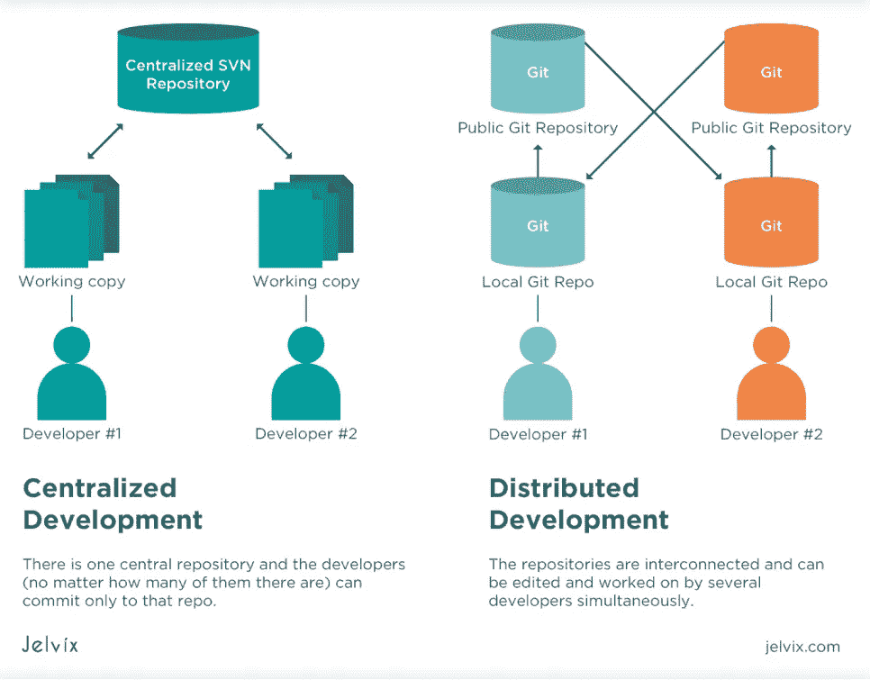

# Git 是什么？

大多数流行的版本控制工具依赖于[Git](https://git-scm.com/)——一个分布式版本控制系统。其目的是帮助团队跟踪变更并改善开发人员之间的协作。Git 的创建目标是促进合作并为开源社区提供工具。随着版本的合并和验证，文件会越来越厚。

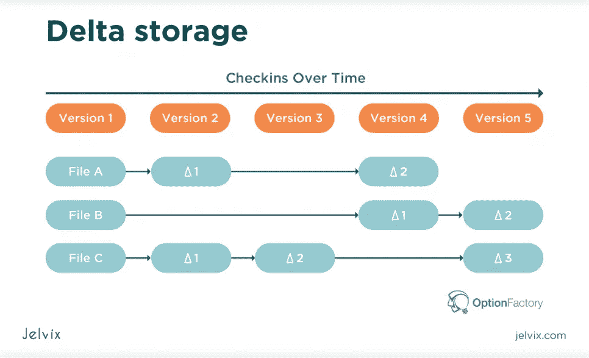

## Git 和 Github 有什么区别？

虽然 Git 被描述为一个版本控制系统，但是为了使它更简单，我们可以将这个定义分成三个部分:

*   **控制系统** : Git 是一个帮助社区成员跟踪内容(更新、参与者等)的系统。).控制系统允许存储代码和显示代码的变化。
*   **版本控制系统**:开发者不断地在 Git 中添加更多的代码；通常，许多用户同时工作(并行编辑)。版本控制系统维护这些更改的实时历史，允许合并编辑和分支版本。
*   **分布式版本控制系统**:所有版本都存储在存储库中——一个在云上，每个人都可以访问，一个在本地，可以在开发人员的设备上访问。这很方便，因为如果服务器或互联网连接出现问题，用户仍然可以访问他们的工作。

简而言之，Git 是一个存储代码，实时跟踪其变化，并在本地和云存储库上同步更新的系统。它不是一种特定的服务——这是 Git 和 GitHub 的区别——而是一种技术。Git 和 GitHub 的区别在于 GitHub 是一个使用 Git 的服务——但是其他服务也可以使用 Git。

## 你需要知道的 Git 定义

在我们开始比较单个服务之前，看一下整体术语是有意义的。GitHub、GitLab 和 BitBucket 可能在提供的内容或具体特性上有所不同，但关键原则是相同的。因为它们对于所有三个平台都是通用的，所以让我们做一个简单的回顾。

本地存储库是存储你的代码的地方。你可以把它想象成你电脑上的一个文件夹。像任何本地文件夹一样，它可以在没有互联网连接的情况下访问，但只能从该设备访问。

为了与其他开发者共享代码，你需要一个**远程存储库**。它是您的本地文件的副本，将存储在云上，可供协作使用。

**文件暂存**是准备将文件转移到远程存储库的过程。开发人员定义他们想要共享的文件，确保它们被正确命名和保存。

**Git commit** 在本地存储库中保存更改的过程。

**文件推送**是将文件传输到远程存储库的过程。提交包括关于在新提交的版本上执行的文件更改的信息。

**Git status** 是一个命令，允许查看哪些文件被修改，以及哪些文件在暂存区中，准备提交。

**Git log** 是一个用于查看用户执行的所有提交的命令。开发人员可以看到哪些代码版本可用于协作编辑。

**合并**是指合并两个提交历史。当您需要将并行编辑上传到单个文件中时，这些会非常有用。没有任何进展丢失。

**拉请求**允许开发者让其他开发者知道对代码库的更新。

**希望这些定义能让你对基于 Git 的服务的主要功能有一个基本的了解，以及它们实际上是如何实现的。**上述所有过程都需要命令才能开始。如果你想看看在 Git 中创建和共享简单存储库的快速指南，看看这个[指南](https://www.freecodecamp.org/news/what-is-git-and-how-to-use-it-c341b049ae61/)。

# GitHub 是什么？

所以，为了消除对 Git 和 GitHub 是什么的疑虑，让我们适当地介绍一下 GitHub。GitHub 是最大的基于 Git 的版本控制平台。现在它托管了超过 3800 万个项目，是开源社区最常用的。

GitHub 有一个简单的用户界面，可以让开发人员快速进入 Git 算法的工作流程。另一个决定性的特征是它的速度——服务推送和拉取请求并快速合并版本。

GitHub 的免费版本允许开发人员与公共和私有存储库一起工作，为它们做出贡献，并进行协作。费用取决于用户数量。

# BitBucket 是什么？

和 GitHub 一样，BitBucket 也是在 2008 年推出的。它由一个澳大利亚团队创建，后来在 2010 年被 Atlassian 收购。然而，该服务直到 2011 年才支持基于 Git 的版本控制。

BitBucket 的主要卖点是可以为小型团队(1-5 个用户)托管无限数量的私有存储库。然而，Bitbucket 的 UI 最初并不像 GitHub 那样简单，功能也不完善。然而现在，这两种服务越来越相似 BitBucket 也越来越受欢迎。

# GitLab 是什么？

GitLab 成立于 2011 年，是 GitHub 和 BitBucket 的替代品。它的主要卖点是广泛的功能，不管它的多功能性如何，它都被整齐地打包到一个伟大的 UI 中。

最近，团队正在积极地从其他服务转向 GitLab。特别是由于 GitLab 对 [CI pipeline 和 Docker](https://jelvix.com/blog/best-ci-cd-tools-comparison) 的无缝支持(这些的使用最近有了巨大的增长)。

比较 Gitlab 和 Github，后者的弱点是受欢迎程度(社区没有那么活跃)和速度。

# 比较 GitHub、BitBucket 和 GitLab 的功能

让我们来看看这三个平台的特点。其中许多会重复出现—为了使比较更加明显，我们将特别强调所有独特的点。尽管如此，我们相信一个有根据的比较需要对功能有一个全面的了解，这样你就知道该用什么了。

## GitHub 特性

GitHub 的主要功能是库分支和分叉、拉取和合并请求、代码库克隆。主要功能运行很快——也许是三者中最快的。开发人员可以快速将文件上传到远程存储库，并从其他贡献者那里收到即时通知。

GitHub 还支持 wiki 一个用于制作和共享版本文档的内置工具。该服务支持多种文本格式，包括[降价](https://en.wikipedia.org/wiki/Markdown)。

**附加功能**

*   问题跟踪器，用于检测代码库中的问题并提醒合作者；
*   发布板支持看板和 Scrum，并允许结构化任务；
*   GitHub 支持允许跟踪团队进展的 epics
*   路线图有助于规划团队项目和确定关键里程碑；
*   估算和点数:开发者可以估算每个问题的努力点，并与合作者分享细节；
*   同步合并版本、GitHub 问题和 pull 请求；
*   Windows 和 Mac 的桌面应用程序，以及 Android 的移动应用程序
*   200 多种编程语言的支持
*   [集成【Asana、](https://github.com/integrations) [AWS、Windows Azure、Google Cloud](https://jelvix.com/blog/aws-vs-google-cloud-vs-azure) 、Code Climate
*   GitHub Pages 是一个内置的服务，用于使用 GitHub 构建和托管站点。
*   语法突出显示(在 BitBucket 中不存在)
*   流行的开源社区

GitHub 为提高开发效率和改善协作提供了许多附加组件。可以说，BitBucket 在这个方向上走得更远，而 GitLab 只是提供了更多的选项。然而，虽然 GitHub 没有最通用的功能，但它为[提供了最快的性能](https://github.blog/2012-09-05-how-we-keep-github-fast/)。

还有，在微软收购 GitHub 之后，很多用户开始怀疑:Github 安全吗，尤其是对于开源社区？目前，还没有任何理由认为该平台存在任何安全问题。如果你想知道 GitHub 到底是如何保护用户的，我们推荐你看一看他们的官方展示。

## Bitbucket 与 GitHub 功能

BitBucket 是作为 Mercurian 版本控制平台而创建的。Mercurial 是另一个版本控制系统，一个不太受欢迎的 Git 替代品。现在，该平台不再支持 Mercurian，完全专注于 Git。

*BitBucket 的主要特性*

BitBucket 允许开发人员在私有和公共存储库上托管代码。用户可以创建无限数量的私有存储库——只要不超过 5 个用户使用它们。这个平台的主要区别是它与吉拉和 Asana 的集成。自从 Atlassian 收购 BitBucket 以来，它已经成为他们生态系统的一个本地组件。

因此，开发人员可以轻松地监控吉拉的 BitBucket 活动，测量他们的工作效率，并将组织委员会连接到协作存储库。这很方便，因为项目经理可以很容易地跟踪项目的组织和技术方面。

*附加功能*

*   Pipelines 是一种 CI/CD 服务，显示产品的整个开发生命周期。在 BitBucket 上，开发者可以跟踪软件的部署进度。
*   分支权限:开发人员可以允许特定的人访问存储库；
*   与 Slack、Bamboo、Jenkins、HipChat、Crucible 和其他工具的集成；
*   一个 Mac 和 Windows 的客户端，还有一个 Android 的 app，叫 Bit Beaker
*   BitBucket Snippets:为代码库创建代码段；
*   文档和维基；
*   代码库导航的搜索面板；
*   Atlassian marketplace 上的许多附加组件，其中大多数可以轻松集成到整个生态系统中。

在我们看来，使用 BitBucket 的主要优点是管理项目的简单性。当业务所有者和项目经理可以直接在吉拉看到存储库文件时，他们节省了大量时间。此外，BitBucket 很好地利用了许多吉拉特性，包括报告和通信。

## GitLab 的功能

由于越来越多地采用 [CI/CD 和 DevOps](https://docs.gitlab.com/ee/ci/) ，GitLab 越来越受欢迎。其他代码库在其高级版本中提供 CI 特性，但在 GitLab 中，CI 支持包含在免费计划中。此外，开发人员可以在其服务器上托管 CI GitLab 集成。

*附加功能*

*   子组、合规管理和审计事件:GitLab 允许限制对项目的访问，并查看每个参与者的合规状态；
*   项目规划:开发人员通过内置的任务列表、描述模板和问题管理面板来跟踪代码问题；
*   沟通:开发人员可以交换附加文件，创建线程并参与其中，跟踪变更，用标签区分讨论的优先级，设置里程碑，并最终确定迭代；
*   源代码管理:GitLab 因其用于分支、合并、文件锁定、报告的直观界面而受到赞赏。GitLab 还提供免费的源代码模板和 JIRA 集成；
*   持续集成:平台的主要卖点是免费的 CI 工具，包括父子管道、横向自动缩放、HTML 工件和受保护变量的可视化等。；
*   包构建:开发人员可以根据他们的技术栈使用不同的包——有 PHP、Node.js、Java 和其他包；
*   安全:GitLab 提供安全扫描，允许动态安全测试(然而，只在最昂贵的黄金和终极计划)；
*   配置和开发运维:免费计划中提供自动开发运维功能，而专业附加服务仅受金牌和旗舰计划支持。

GitLab 以其出色的界面和功能而闻名，特别是 GitLab 和 GitHub 之间的主要区别是广泛的 DevOps 和 CI/CD 免费功能。然而，访问主要功能和执行快速推送和合并可能会很困难。

# GitHub vs GitLab vs BitBucket 接口

一般开发者都认同 GitLab 和 GitHub 的界面最好。许多开发者更喜欢 GitHub，因为它更受欢迎，他们习惯于导航。然而，使用吉拉的团队受益于与 Atlassian 生态系统的无缝集成——因此 BitBucket 是一个自然的选择。

因此，下面是每个平台界面的简短总结:

*   **GitHub** :大量的指南和教程，基本功能可以快速访问，界面简约易懂。缺点是缺乏与吉拉的本机集成，并且缺乏高级 CI 功能。
*   **BitBucket** :界面可能会令人困惑，但随着平台越来越受欢迎，资源也多了很多。使用吉拉的团队通常更喜欢 BitBucket，因为它提供了整个项目更好的可见性。
*   **GitLab** :这项服务不像竞争对手那样成熟，所以仍然缺乏界面指南和教程。然而，界面本身组织得非常好——即使是高级的附加组件也很容易找到。

## GitHub vs BitBucket vs GitLab 的视觉对比

**用户仪表板**

GitHub 用户仪表板

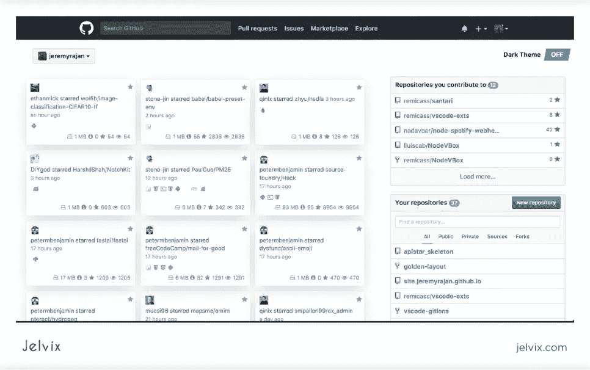

BitBucket 用户仪表板

GitLab 用户仪表板

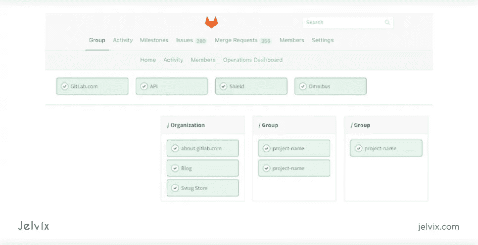

**创建分支机构**

GitHub 中的分支

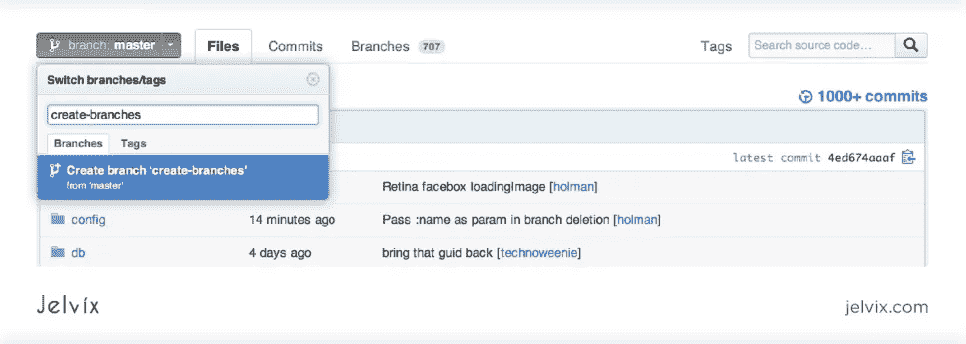

位桶中的分支

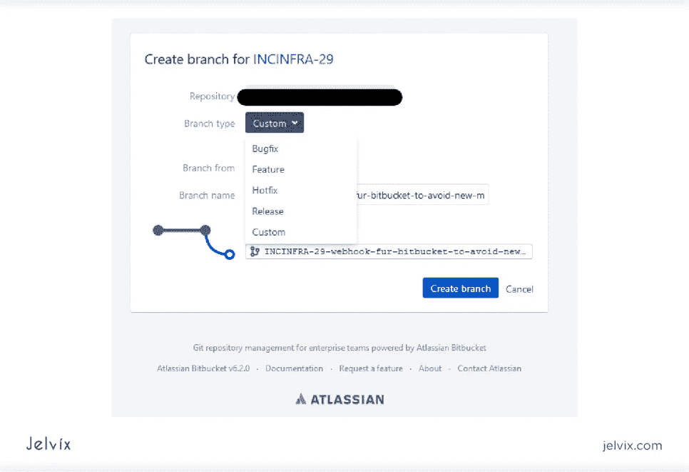

GitLab 中的分支

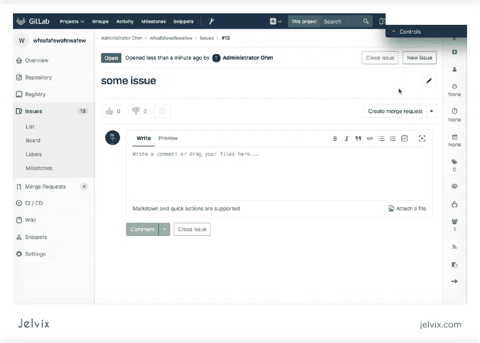

**查看提交和提交代码**

开源代码库

比特桶

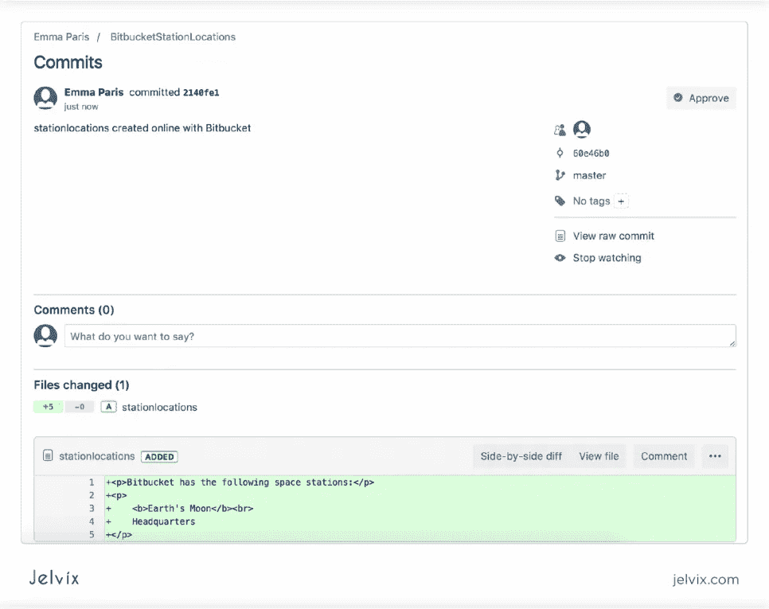

GitLab

# GitHub、BitBucket 和 GitLab 的价格

三个平台都有付费和免费版本。让我们看一下定价计划和包括的功能。请记住，所有服务都是按用户收费的，而不是按团队收费的。所以，你需要用订阅成本乘以团队人数。

**GitHub 定价**

*   **免费:**无限的公共和私有库，无限的合作者数量，500MB 的存储空间；
*   **团队(4 美元/月)** : 2GB 的存储库和免费计划的所有功能；
*   **企业级(12 美元/月)**:团队计划所有功能，50GB 存储，高级审计，SAML
*   **GitHub One(定制定价)**:获得 24/7 官方支持、增强安全性和持续学习奖金的终极计划。

**比特桶定价**

*   **免费(每月 0 美元)**:最多 5 个用户的私有存储库，每月 50 分钟的构建时间，1GB 的文件存储，吉拉软件集成，CI/CD 特性
*   **标准版(每月 3 美元)**:不限用户数量，每月 2，500 分钟的构建时间，吉拉集成，不限拉取请求，免费计划的所有特性；
*   **Premium(每月 6 美元)**:团队计划的所有功能，还包括客户支持、合并检查等

**GitLab 定价**

*   **免费($ 0/月):**支持所有 DevOps 阶段，支持定制 CI runners，不限库数，400 CI/CD 分钟；
*   **免费+($ 4/月)**:支持团队计划所有功能，2000 CI/CD 编码分钟
*   **铜牌/首发($ 4/月):**支持 10000 CI/CD 分钟，多审批角色，支持优先级和多区域；
*   **银卡/高级卡(19 美元/月)**:也称为企业计划，它提供增强的安全性、管理洞察、合规性检查、访客用户和 50，000 CI/CD 分钟。

**价格对比汇总**

在这些平台中，BitBucket 提供的价格最具竞争力。然而 GitHub 却一直呈现降价趋势。事实上，文章中描述的成本是最近[更新的](https://www.businessinsider.com/microsoft-github-free-plan-coronavirus-crisis-2020-4)——在 2020 年 4 月。

*   GitHub:非常适合个人项目和小团队；
*   BitBucket:使用吉拉和 Asana 的中小球队；
*   GitLab:使用 CI/CD 工具的中型团队和企业。

# 受欢迎程度和增长

即使该工具的受欢迎程度在开发过程中并不那么重要，最好还是激励您的开发人员学习趋势分析工具。招聘有服务工作经验的候选人、引入新的实践以及推动组织[的转型将变得更加容易。](https://jelvix.com/blog/how-start-digital-transformation-of-business)

所以，让我们来看看当前的受欢迎程度、增长动态、未来趋势和用户概况。用户数量很重要，但知道这些用户是谁也很重要。例如，GitHub 是 Ruby 和 Ruby on Rails 开发人员的首选，因为它托管了大多数 gem 和插件。

## GitHub 统计

GitHub 是最大的代码库，被组织用于私人访问和开源协作。该平台如此受欢迎，以至于人们经常认为它是 Git 本身的同义词——因此，Git 和 GitHub 之间的矛盾出现了。据 Statista 报道，GitHub 拥有领先的开源工具，包括 Flutter、微软的 VS Code 和 Azure Docs、脸书的 React Native、Tensor Flow、Kubernetes 等。

根据 2020 年 1 月公布的数据，目前 GitHub 有[4000 万用户](https://en.wikipedia.org/wiki/GitHub#:~:text=As%20of%20January%202020%2C%20GitHub,source%20code%20in%20the%20world.)在使用。它被微软、脸书、谷歌和其他大公司使用。从受欢迎程度来说，这种分布式版本控制服务是领先的。

根据 Google Trends，GitHub 的受欢迎程度在过去的两年里相当稳定。该社区可能会继续增长。

## 比特桶统计

吉拉的受欢迎程度在不断增长，这一趋势也在推动新用户使用 BitBucket。BitBucket 被 Slack、埃森哲、Figma、Paypal 和其他公司使用。BitBucket 上的开源社区要落后很多。该平台的典型客户是 Atlassian 生态系统的活跃用户，而不是开源贡献者。

不幸的是，BitBucket 并不定期公布用户数量的统计数据。根据他们的官方消息，2019 年，该产品被[1000 万开发者](https://bitbucket.org/blog/celebrating-10-million-bitbucket-cloud-registered-users)使用。根据搜索趋势，这项服务现在的受欢迎程度低于 GitHub 或 GitLab。

## GitLab 统计

根据 [GitLab 的案例研究页面](https://about.gitlab.com/customers/)，该工具被 Drupal、Ticketmaster、BI Worldwide 和其他企业使用。

这里是 GitLab 上托管的开源项目列表。它容纳了科学倡议和非政府组织，而不是大型商业项目。

不幸的是，GitLab 没有官方的用户统计。根据一些消息来源，有 200，000–500，000 个组织和开发者在使用这项服务。至于谷歌搜索趋势，这项服务比 BitBucket 得到更多的提及，但比 GitHub 少得多。

# GitHub、BitBucket 和 GitLab 的 Google 趋势比较

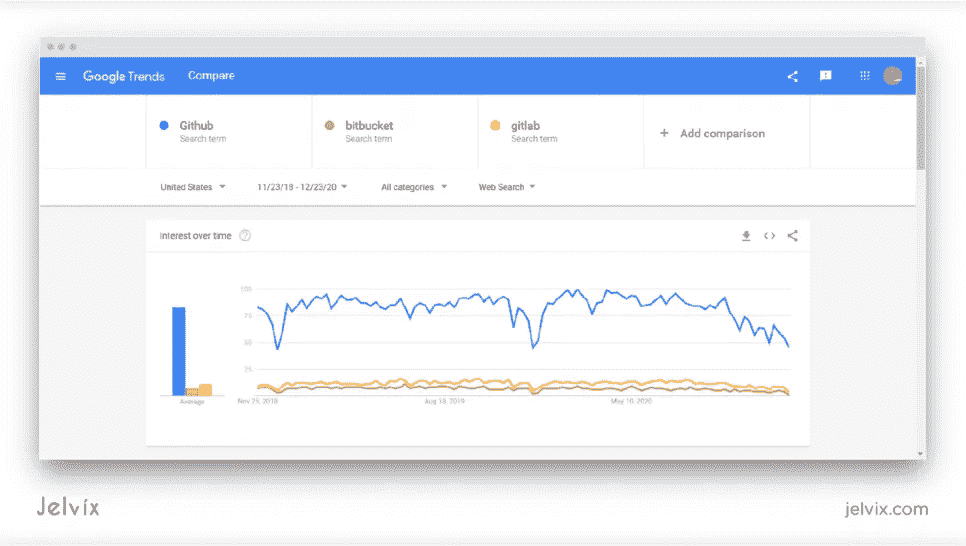

# 摘要

为了总结我们的比较，让我们看一下每个平台的主要优点和缺点，并确定它们的使用案例。

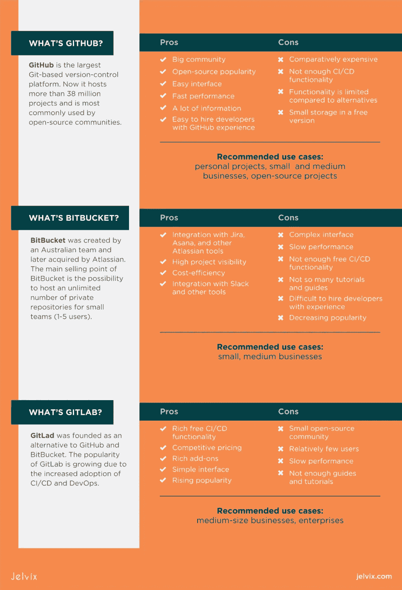

如果你想在自己的项目中实现 GitHub、GitLab 或 BitBucket，可以考虑联系对这三者都有经验的专业开发人员——他们可以帮助你做出正确的选择。我们的团队很乐意分析您的项目、团队规模、软件需求、工作流程，并找到符合您需求的存储平台。[给我们写封短信](https://jelvix.com/contact-us)开始讨论你的项目，并获得基于经验的评估。

*最初发表于*[*【https://jelvix.com】*](https://jelvix.com/blog/bitbucket-vs-github-vs-gitlab)*。*