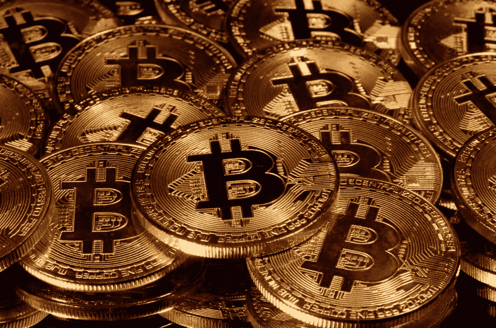
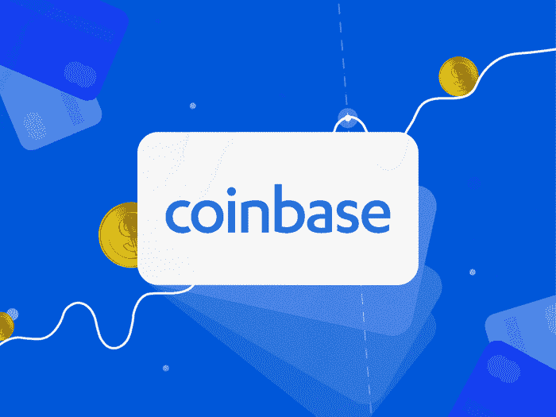
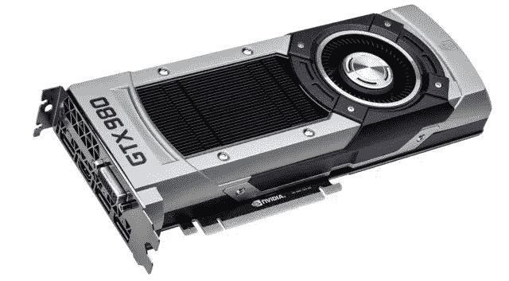
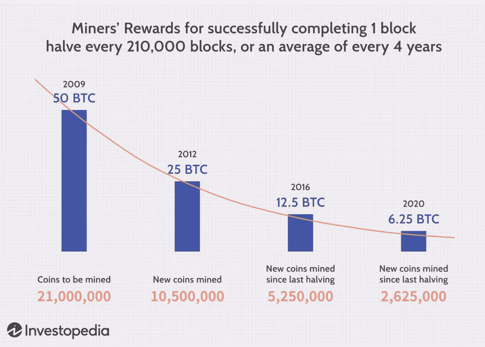

# 比特币被分解了

> 原文：<https://medium.com/geekculture/bitcoin-broken-down-16c5cea50269?source=collection_archive---------14----------------------->

## 我们都需要阅读的*“像我五岁一样给我解释一下”*版本。

[Credit](https://www.google.com/url?sa=i&url=https%3A%2F%2Fgadgets.ndtv.com%2Finternet%2Fnews%2Fbitcoin-price-slide-usd-40000-below-ether-ethereum-tumble-2444724&psig=AOvVaw3NZd3nVo3JnCADksIaXKBY&ust=1621657622569000&source=images&cd=vfe&ved=0CAIQjRxqFwoTCIDijsf32fACFQAAAAAdAAAAABAE)

成立于 2009 年的比特币仍然是顶级的数字货币，它使用区块链系统来验证和跟踪交易。回想一下，在区块链上，记录下来的就是被记录下来的。您无法更改网络上的任何内容。在写这篇文章的时候，比特币价值 51541.50 美元。

对于那些刚接触区块链或需要复习的人，请点击这里查看我为初学者写的关于区块链的 4 分钟文章:

 [## 区块链崩溃了

### 区块链初学者指南，这项技术正在席卷全球，而这仅仅是个开始。

medium.com](/analytics-vidhya/blockchain-broken-down-b1a3fcdcc1e7) 

继续前进…

比特币的创造者制造了 2100 万个比特币。他们以一种固定金额的方式制造比特币——在区块链系统中增加更多的比特币不是一种选择。

截至目前，已经有 1800 万个比特币被挖掘。只剩下 300 万了。随着比特币热潮的高涨，这个数字每秒都在减少。

但是为什么要大肆宣传呢？

我们来分解一下。

# 如何持有比特币

从技术上讲，拥有一枚比特币有两种方式:通过挖掘或从另一方购买。

**购买**

许多人从一家**经纪公司**购买比特币，比如*比特币基地*。*比特币基地*类似于股票市场，但用于加密货币。

[Credit](https://www.google.com/url?sa=i&url=https%3A%2F%2Fwww.businessinsider.com%2Fpersonal-finance%2Fcoinbase-investing-review&psig=AOvVaw1FZWgeeWZgIyN1Ws3YTAG5&ust=1621657868476000&source=images&cd=vfe&ved=0CAIQjRxqFwoTCOCO4bz42fACFQAAAAAdAAAAABAD)

其他公司包括 Robinhood，它最近在投资组合中加入了 crypto exchange。

这个想法很简单。你只需在像 *Robinhood* 这样的应用程序上的加密交易所购买比特币，并祈祷飙升继续，马斯克*不会再发布另一条导致市场崩溃的推文。*

## *采矿*

*当比特币刚刚起步时，拥有它的唯一方式就是为他们“挖矿”。*

*对我来说意味着什么？想想黄金。*

*虽然你不是在生锈、挖空的沉积区域进行物理开采，但概念是相似的。*

*现在，澄清一下，从技术上讲，你不是在挖掘这些比特币。你只是在验证比特币区块链的交易。通过核实交易，矿商们有助于防止“双重支出问题”。*

## *双重支出问题*

*当一个比特币所有者将同一个比特币消费两次时，就会发生双重消费。对于数字货币，存在持有人可能复制数字令牌并将其发送给另一方同时仍拥有原始令牌的风险。*

*比特币矿工**所做的**是检查交易，以确保用户没有非法尝试花费相同的比特币。*

*为了挖掘比特币，你需要一个 GPU，或者一个图形处理单元。这在游戏行业非常流行，所以要抓住这些坏男孩中的一个很难 ***。****

**

*[Credit](https://www.google.com/url?sa=i&url=https%3A%2F%2Fwww.extremetech.com%2Fgaming%2F264692-cryptocurrency-era-approach-used-gpus-caution&psig=AOvVaw120ySXJnv3wVFT0YwuIvHM&ust=1621658466979000&source=images&cd=vfe&ved=0CAIQjRxqFwoTCNi13tj62fACFQAAAAAdAAAAABAK)*

*尤其是现在，找一个 GPU 难上加难。市场上最初售价为 1，000 美元的 GPU 现在以 3，000 美元的价格转售，而且购买速度很快！*

*GPU 越高，计算机的计算能力和速度就越强。*

**但是为什么需要快速的计算能力来挖掘比特币呢？**

***采矿过程***

*一旦矿工验证了价值 1 MB 的比特币交易(称为“区块”)，这些矿工就有***潜力*** 获得一定数量的比特币作为奖励。*

*需要注意的是 ***不是*** *每个验证交易的人都会得到报酬。**

*1 MB 的事务在理论上可以小到一个事务(尽管这并不常见)或几千个事务。这取决于事务占用了多少数据。*

## ***赚一个比特币***

*要赚一个比特币，需要满足两个条件**。***

1.  ***你必须验证 1MB 的交易。(努力)***

***2.你需要成为第一个得到数字问题正确/最接近答案的*T21 矿工。这就是所谓的**工作证明。它包括解决一个谜题，以防止任何人利用系统。(运气)******

***但是，澄清一下:***

***他们实际做的是试图成为第一个得出小于或等于目标散列的 64 位十六进制数(一个“散列”)的矿工。它不涉及高等数学。换句话说，这实际上只是一个数字游戏。您不能根据以前的目标散列来猜测模式或做出预测。***

******

***[Not Bitcoin-related, but a simple debrief on the linked transactions](https://www.google.com/url?sa=i&url=https%3A%2F%2Fmedium.com%2Fswlh%2Fblockchain-characteristics-and-its-suitability-as-a-technical-solution-bd65fc2c1ad1&psig=AOvVaw3iB3jLpW5mj19nD45mtxcp&ust=1621658520666000&source=images&cd=vfe&ved=0CAIQjRxqFwoTCMj2h_P62fACFQAAAAAdAAAAABAD)***

***为了有更高的机会成为第一个找到答案的矿工，一个人需要有很高的“散列率”。***

## *****哈希速率*****

***Hashrate 是挖掘时使用的每秒计算能力的度量。更简单的说，就是挖矿的速度。它以哈希/秒为单位来衡量，即每秒可以执行多少次计算。例如，1 Mhash/s 表示每秒进行一百万次哈希计算。***

## *****矿工奖励*****

***比特币挖矿的奖励每四年或每 21 万块减少一半。当比特币在 2009 年首次被开采出来时，开采一个区块可以获得 50 BTC。2012 年，这一数字减半至 25 BTC。到 2016 年，这一比例又减半至 12.5 BTC。***

******

***[Credit](https://www.investopedia.com/tech/how-does-bitcoin-mining-work/#a-new-gold-rush)***

## *****激励*****

***概括地说，矿工的作用是保护网络，处理每一笔比特币交易。***

***矿工们通过解决一个计算问题来实现这一点，这个问题允许他们将交易块链接在一起(因此比特币著名的“区块链”)。***

***矿工获得的比特币奖励是一种激励，激励人们协助采矿的主要目的:***

******对比特币交易进行合法化和监控。******

***因为这些责任分散在世界各地的许多用户中，所以比特币是一种“去中心化”的加密货币，或者说不依赖于任何中央权威机构(如中央银行或政府)的加密货币。***

## ***失败***

***是的，我知道。一大堆知识炸弹压缩成一篇短文。***

***很难否认区块链没有对我们的未来产生重大影响。重要的是，我们都要保持对当前话题的了解，希望这篇文章在比特币的话题上为你做到了这一点！***

# ***个人笔记***

***查看我的[**LinkedIn**](https://www.linkedin.com/in/fatimah-hussain/)[**insta gram**](https://www.instagram.com/fxtimxhh/?hl=en)，关注我的 [**中**](/@fatimahandhussain) 。我最近更新了我的 [**个人网站**](https://fatimahhussain.com/)**；**来看看吧！当我写这些文章的时候，我总是付出 100%的努力和奉献，所以我希望你过得愉快！敬请关注，点击“关注”按钮，获取每周更新和引人入胜的项目！***