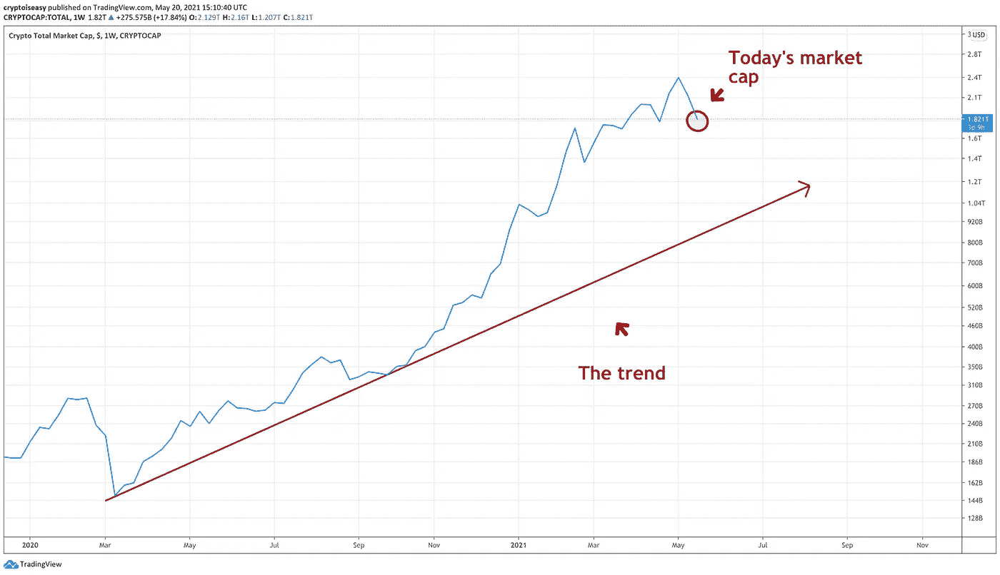
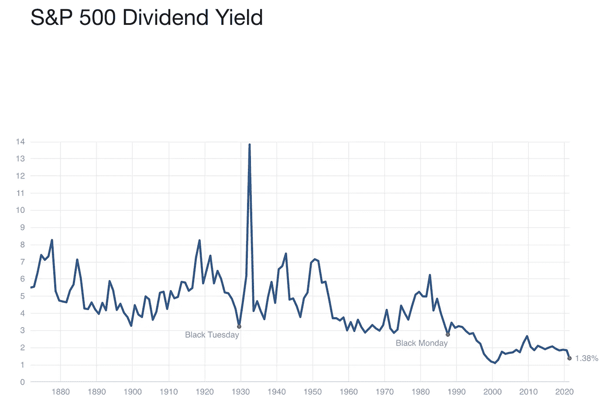
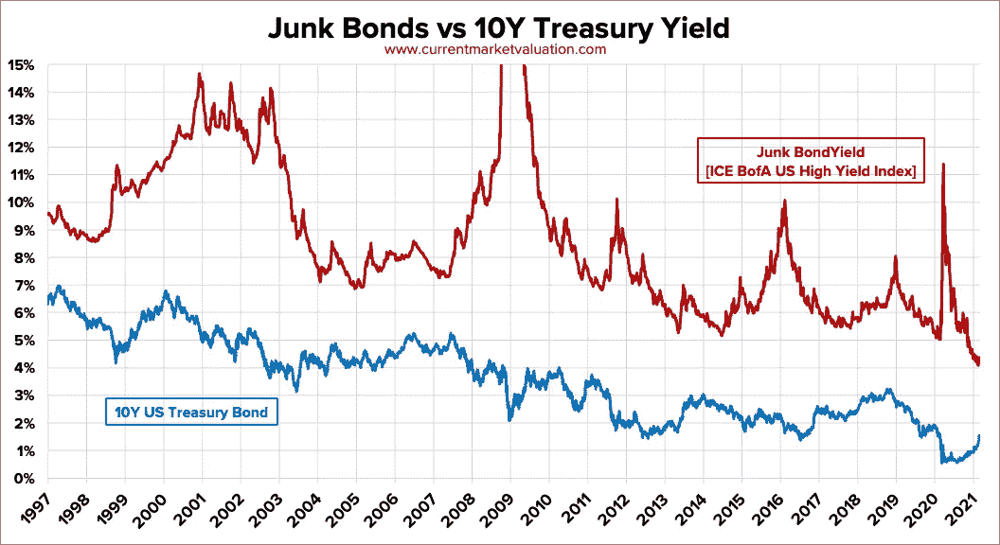
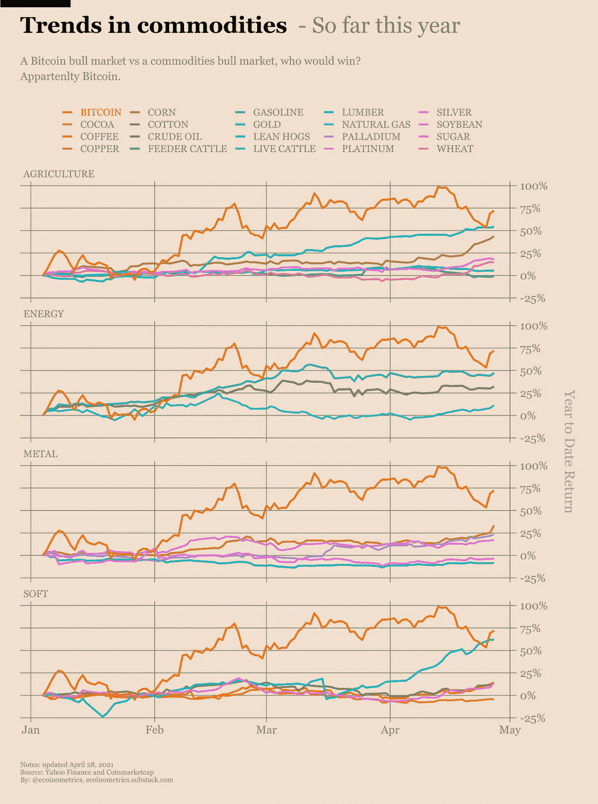
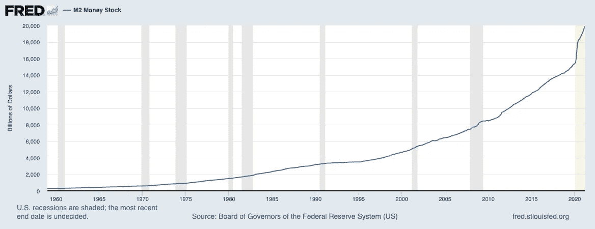
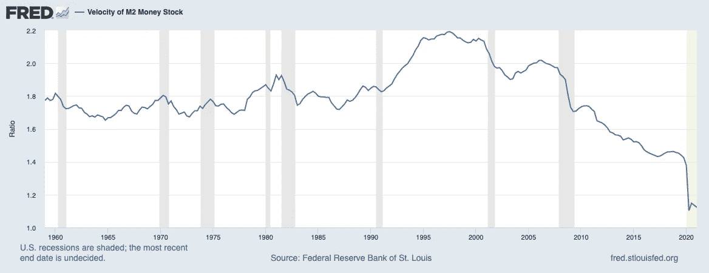

# 比特币牛市:漫漫下跌路

> 原文：<https://medium.com/geekculture/bitcoin-bull-market-a-long-way-to-fall-26b76002210f?source=collection_archive---------1----------------------->

Photo by [Kamil Pietrzak](https://unsplash.com/@kpietrzakweb?utm_source=medium&utm_medium=referral) on [Unsplash](https://unsplash.com?utm_source=medium&utm_medium=referral)

随着加密市场陷入低迷，本月的帖子着眼于下一阶段的主要驱动力:Web 3.0 和创造者经济。此外，这也提醒了人们关注全球金融体系的宏观趋势。

*** *本文转自五月号的* [*密码易*](https://cryptoiseasy.substack.com/p/crypto-is-easy-may-2021) *。****

*If you don’t want to read, listen to the podcast version.*

# 漫长的堕落之路

自 4 月份达到峰值以来，整个加密货币市场已经下跌了 40%。

一些人称之为熊市的开始。

真的吗？

总加密市值可能会再下降 50% *，甚至不会打破去年开始的上升趋势。*

看看这张图表，2019 年末是一个额外的奖励:

这让你担心吗？

如果是的话，那就不要看传统市场的情况了。

# 任何地方都不安全

股票股息年化率降至 1.38%，延续了多年来的下降趋势。

与此同时，美国主要股指的所有长期交易图表都显示出看跌背离，表明动能已经开始消退。

最重要的是，创纪录的退休速度应该会导致更多的美国人从退休账户中取钱，并从投资于股市的基金中提取养老金。

储蓄账户几乎没有利息。实际上，他们是赔钱的人。

今年负收益债务从 18 万亿美元下降到 13 万亿美元，这听起来不错，但也使欧洲和日本为政府支出融资的成本更高。

此外，中国的金融业正显示出压力迹象。

与此同时，垃圾债券利率已降至 4%。换句话说，投资者现在接受了可能永远也不会偿还的债务的 4%的利息，而就在几年前，甚至 8%都似乎是一种奢望。

不像美国国债做得更好。这张图表比较了两者:

新兴市场债券的风险调整回报率略高，但大多数人无法进入这个市场，如果美元反弹会发生什么？如果发生这种情况，新兴市场经济体将面临更高的债务偿付和更低的大宗商品价格，这对任何需要美元偿还债务的国家来说都是双重打击。

与此同时，随着无利可图的企业倒闭和僵尸企业激增，SPACs 已经开始内爆。

几乎在每个大型经济体中，房地产价格都在持续上涨，而越来越多的抵押贷款却让越来越少的人负担得起。在美国，家庭收入中值去年增长了 2.6%，但房价中值的增速是后者的两倍多(同期为 5.6%)。

供应链仍然紧张，企业无法获得赚钱和偿还贷款所需的供应和材料。对于太多的人来说，房租仍然太高。就业并没有像大家预期的那样恢复。

你担心密码吗？

# 橡皮糖和橡皮筋

目前，央行、401(k)和养老基金可以通过稳定的现金注入支撑表现不佳的投资。永远不要低估政府印钞机、被动投资者和迫使数万亿美元生产性资本投入低回报投资的法律的力量。

世界金融体系是由橡皮筋和橡皮筋维系在一起的。现在还好，但是什么时候事情会真正得到解决呢？

随着婴儿潮一代继续从他们的退休基金中取钱，会发生什么？当市场崩溃吓得人们转向更安全的资产时。当货币刺激最终耗尽其收益递减时。当第一个养老基金宣布破产时。当下一次经济衰退让一代房主拖欠抵押贷款时。

当你听到传统投资者拥抱比特币的谈论时，这不仅仅是因为他们喜欢自主货币或摆脱邪恶的“法定”货币。

这是因为他们意识到越来越多的人每天都开始意识到的事情:

再也没有低风险投资了。

安全资产亏钱。风险资产的回报很低。

投资基金开始购买房地产，富人囤积汽车和珠宝，这有什么奇怪的吗？

传统金融投资烂透了。没有人会因为他们的风险而得到公平的补偿。你可以忘记现金流。

你担心密码吗？

# 当然，crypto 看起来很糟糕，但是你看到另一个人了吗？

自年初以来，原材料和半成品的价格已经上涨了 50%或更多。

相应地，随着汽车、卡车、食品、建筑材料和天然气价格的大幅上涨，美国消费者价格指数同比涨幅超过 4%。

肉眼看来，这像是通货膨胀。

当你看数据时，它似乎更像是一个供应冲击。这里说的太多了，就拿这个轶事来代替吧。

木材和水泥价格今年大幅上涨。这并不是因为政府印了更多的钱，而是因为生产商和供应商无法制造足够的钱。

对一些人来说，新冠肺炎和 2020 年金融危机迫使他们削减开支，现在他们没有能力满足新的需求。对其他人来说，需求太高了，他们没有能力满足顾客的所有需求。

船运和卡车运输公司没有足够的能力来运输商人希望他们运输的所有货物。与此同时，他们也面临着与买家同样的问题——制造商无法以足够快的速度获得足够的原材料来制造更多的船只、卡车和火车，而这些船只、卡车和火车是船运和货运公司提高产能所需要的。

最重要的是，苏伊士运河的一次反常事故导致全球交货延迟了数周，这已经够糟糕的了，但现在全球港口无法处理大量试图卸货的船只。

亚洲缺少微芯片。持续的干旱正在摧毁美国农民和牧场主。中国和美国仍未想出如何解除特朗普时代的贸易限制。工厂等待时间是 1987 年以来最高的。

网上企业已经开始将空置的城市办公场所转变为送货仓库。他们支付更多的租金和劳动力，但它的成本低于运输从一个中心设施。

换句话说，运费如此昂贵，以至于人们现在都在转移他们的业务，而不是转移他们的货物。

你担心密码吗？

一些人称这种现象为供应链的暂时中断——这是一种轻描淡写的说法。无论如何,“暂时”是暂时的吗？

# 如果你认为物价上涨是不好的，那就等着看通货膨胀吧

当库存减少和供应短缺结合在一起时，价格就会受到挤压。再加上美元贬值、中国的金融问题和运输瓶颈，你可以预期成品、商品和任何以美元定价或需要长途运输才能进入市场的产品的价格都会上涨。

有些人认为物价上涨是通货膨胀的迹象。

从某种意义上说，的确如此。在传统意义上，它不是，它只是简单的市场动态。

当新货币的创造推动价格上涨，而不是供求等市场力量推动价格上涨时，就会发生通货膨胀。这种情况发生在金融市场，但还没有发生在实体经济中。

要获得真正的通货膨胀，你需要资金在经济中流动。那是不可能的。

看看 M2，银行和储蓄账户里的钱。

仍然很高，这意味着人们没有花光政府印的钱。相反，他们正在囤积。

与此同时，资金的流动速度仍然很低。

这意味着钱很难转手。

在这种情况改变之前，你不可能得到传统意义上的通货膨胀。货币流通不足以推高食品和服装等消费品的价格。

这可不是什么好事。这是一件坏事。

如果在没有资金流动的情况下，价格已经在上涨(T2)，你认为一旦资金再次开始流动，会发生什么？当所有闲置现金开始流动时。

这就是真正的通货膨胀，没有人可以通过砍伐更多的树木或挖掘更深的土壤来逃避这种价格上涨。

你担心密码吗？

# 为创造者经济让路

在传统金融体系的视线之外，加密货币悄然诞生了一种新经济:创造者经济。

投资者、艺术家、表演者、作家、艺人和内容制作人现在可以以前所未有的方式将他们的作品货币化。

有了 NFTs，创作者现在有了一种技术，可以对他们的作品申请专利、版权、许可、分发和赚取版税，而不用将他们的利润分给赞助商、赞助人和发行商。

他们可以简单地将他们的创作嵌入到可验证的独特的、加密的安全资产中，并以他们选择的任何条款立即、直接、一次性地向全球观众发布这些资产。

想想每一个专利。每篇作文。每一件艺术品。每一个 YouTube 视频。每部电影。每一项医学发现。

价值数万亿美元的资产最终从苹果、苏富比、YouTube、网飞和大型制药公司手中转移。

今天，这种价值通过遗留系统流动，这些系统向创作者支付其作品价值的一小部分。

明天，这种价值将在巨大的全球网络中流动，直接从创作者到想要他们作品的人。

或许他们会为粉丝和追随者创造新的订阅模式？把他们的作品拍卖给出价最高的人？铸造品牌代币作为贵宾的收藏品或作为访问或利益的交换？

[Cryptowriter](https://crypto.writer.io/) 使用 CryptoFinney NFTs 来引导其平台并支付其作者。当作者提交内容时，他们会得到一枚芬尼硬币 NFT，可以兑换成一枚印有[的 CryptoFinney](https://crypto.writer.io/p/chapter-1-finneys-arrival) 。每一条鱼都可以被烧成特殊或更稀有的鱼，在[原子博物馆](https://atomichub.io/)出售，或者作为收藏品储存在蜡像区块链上。

或者，作家可以放弃芬尼硬币，而是自己出售或保存芬尼硬币。

与薪水不同，作者拥有这些 NFT 作为独特的数字资产，代表他们对社区的贡献。他们可以随心所欲地处理它们——将它们存入 DeFi 协议以获取利息，拍卖它们以获取现金，或者在像 DODO NFT 这样的平台上将其分割以获取收入。

NFT 从几行计算机代码中产生持久的价值，这些代码由区块链保护，用蜡令牌交换。

赞助商、广告商和承销商在哪里？

不一定要有。没有人需要为每次订阅支付 10%的 Substack，也没有人希望 YouTube 的算法能让他们获得足够的浏览量来赚几个钱。

他们只需要建立一个社区并收获回报。

科学家、工程师和发明家牺牲了他们的时间，妥协了他们的视野，把他们的专利让给了企业。艺术家们很难找到愿意接受他们作品的画廊，更不用说付钱给他们了。音乐人几乎把所有的利润都让给了制作公司和发行商。

就像 Kanye West 说的，“一个白人得到了所有这些。”

大多数人会同意这是一个公平的交易。你需要有人投入时间、金钱和劳动来保护你的权利，并把你的创作与重视它们的人联系起来。

有了加密货币，区块链将会得到这一切。正如网飞和 YouTube 让好莱坞的商业模式变得过时一样，创造者经济将让网飞和 YouTube 变得过时。

# web 3.0——互联网的价值层

但这不会发生，除非建设者们完成支持创造者经济的基础设施:Web 3.0。

我们的现代互联网依靠看门人来引导流量和将用户整合到社区中。

Web 3.0 用开放的、不可信的、无权限的网络取代了它们，每个人都可以在没有中介的情况下访问它们。

想象一下，在你的控制下，你可以直接从你自己的个人存储账户提供 YouTube 视频。想象一下，开发一个应用程序或应用编程接口，让全球创作者和消费者网络能够查找、共享和支付人们存储在个人设备上的内容，或者开发一个企业，将未使用的存储和未充分利用的内容重新分配给需要的人，而成本只是当今集中式平台的一小部分。

虽然这听起来可能很平凡或多余，但它解决了当今互联网的两大问题:

1.  互联网公司从创作者、广告商和用户那里收取租金或报酬。这增加了成本，抑制了创新。
2.  人们无法将内容从一个平台转移到另一个平台。你必须导出或下载内容，或者用 API 连接平台，一旦你移动，你就有失去你建立的社区的风险。

借助 Web 3.0，智能合约和加密货币可以处理内容的存储、处理、服务和监管。私人钱包允许你跨网站发布或查看内容。在一个平台上与你联系的每个人都可以在你所有的平台上与你保持联系。

商业起起落落，但是以太坊的地址永远存在。

你不会在意 Twitter 禁止你最喜欢的 Tweeter，也不会在意不同平台上的多个个人资料和支付系统。你不需要使用你的信用卡(以及其中包含的私人信息)。你不需要将 Stripe 或 PayPal 连接到你的在线商务网站(并为每笔交易支付 3-5%的费用)。

你只需要下载正确的应用程序或找到正确的区块链。

Web 3.0 还满足了更深层次、更人性化的需求:

控制我们所拥有的东西的需要。

我们喜欢收获自己努力的回报，掌控我们的生活和我们关心的事情。

我们的传统系统恰恰相反。别人收获了我们的劳动成果。

阅读 Diana Chen 的这篇文章，了解更多关于 Web 3.0 的信息。

 [## 什么是 Web 3.0，为什么要关注它？

### 什么是 Web 3.0 (Web3)？这是区块链和分散技术世界中的一个流行术语，但它仅仅是一个…

medium.com](/unstoppabledomains/what-is-web-3-0-and-why-should-you-care-6a6feef13f1c) 

# 很好，马克，但那是未来。今天，市场在下跌

没错。我们花了好几个月等待另一只鞋落下。现在有了。

自 2020 年 12 月以来，比特币从强者手中转移到弱者手中，因为 OGs，所谓的最大化主义者，以及卖给只想赚钱的人的机构为了更多的政府资金而翻转他们的比特币。

如果你错过了，请观看我最近更新的的前六分钟，快速总结我在过去几个月指出的一些主要趋势。

然而，尽管每一个新的历史高点都伴随着疲软，但价格仍在上涨。人们赚了很多钱。也许你也是。

你可以在你当地的赌场玩 21 点。你反而买了比特币和 altcoins。你成功了。

直到它没有。

虽然你可能担心末日即将来临，但数据显示并非如此。有时候，市场发展过快对自己不利。它需要冷却几个月。

许多人看到他们投资组合的价值快速增长——在某些情况下，增长了 500%或更多。很难坐享其成。毕竟不能用比特币还房贷。

如果你卖了，我不怪你。

我没有卖，因为我知道这条路通向哪里。我的计划有非常具体的买卖规则。我坚持。

 [## 加密很容易特刊:我充分利用比特币牛市的计划

### 最后，我可以分享一下我充分利用比特币牛市的计划。为什么花了这么长时间？嗯，咄，这是…

cryptoiseasy.substack.com](https://cryptoiseasy.substack.com/p/crypto-is-easy-special-issue-my-plan) 

在这次回调后，任何遵循我的计划的人都应该在比特币上获得 300%到 500%的收益。这意味着市场必须下跌 75%以上，你才会有任何资金处于风险之中。

根据你持有的替代币和你买入的时间，你可能会有更大的收益——尽管有这次回调*。*

虽然我们有一些买入的机会，但我们还没有任何卖出的理由。高级订户们，我会让你们知道那个时刻的到来——如果真的到来的话。

# 新的繁荣

看看全球经济形势，低风险投资的死亡，以及不愿解决问题的政府(在某些情况下，还公开承诺保护现状)。

现在把它与 Web 3.0、创造者经济和去中心化金融协议的潜力相比较，以释放巨大的价值，并在我们创造、分配和货币化“东西”的方式中产生巨大的效率。

哪个更有优势？

太多的人没有钱让自己快乐。他们没有他们为自己设想的生活，他们也无法从遗留的金融体系中获得。

政府已经摧毁了被动产生收益的投资。商品价格使得普通商品更加昂贵。自动化和机器人抢走了薪水不错的工作。银行几乎停止了对小企业的贷款。

整整一代人所依赖的经济体系不再能够满足他们的需求。

不像过去的几代人，人们不需要联合起来反对国家或者请愿改变。他们不需要抗议、示威或立法。

他们会简单、和平、平静地选择一个比他们的政府、银行和传统企业更好的替代方案，并因此变得异常富有。

为钱而来，为革命而留。

这是我们可以期待的未来。

今天，我们继续购买我们在金融网络中的股份，未来将建立在这个网络上。

明天，我们将收获回报。

放松，享受旅程！

马克·赫尔夫曼发布了 [*加密易*](https://cryptoiseasy.substack.com/) 简讯。他还是三本书的作者，也是*[*黑客正午*](https://hackernoon.com/u/MarkHelfman) 的顶级比特币作家。在他的简历中了解更多关于他的信息。*