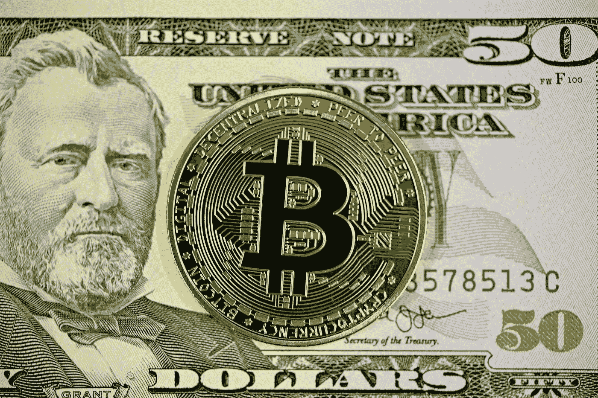

# 比特币终于准备好取代美元了

> 原文：<https://medium.com/geekculture/bitcoin-is-finally-ready-to-replace-the-dollar-5e60cd880ef9?source=collection_archive---------13----------------------->

## …但这会发生吗？

Photo by [Executium](https://unsplash.com/@executium?utm_source=unsplash&utm_medium=referral&utm_content=creditCopyText) on [Unsplash](https://unsplash.com/s/photos/dollar-bitcoin?utm_source=unsplash&utm_medium=referral&utm_content=creditCopyText)

美元相当令人敬畏。它是事实上的国际货币，债务以美元计价，石油以美元交易，它也是世界储备货币。

当像马来西亚这样的国家从沙特阿拉伯购买石油时，他们用美元支付，而不是各自的货币，即使美国不接受…