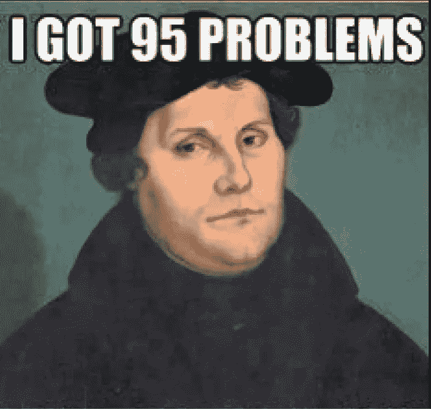
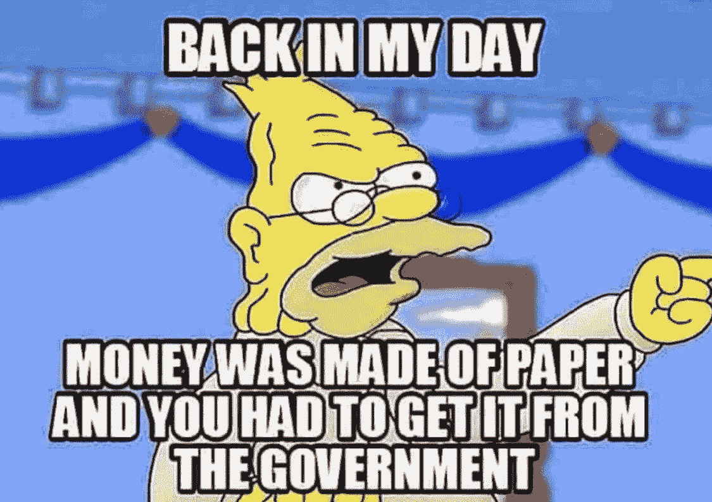

# 比特币仍在胜出

> 原文：<https://medium.com/geekculture/bitcoin-is-still-winning-c0cfbeb11fb3?source=collection_archive---------61----------------------->

比特币最近一直在遭受打击——无论是市值还是声誉。许多人在网上或面对面表达的主要绝望情绪似乎最终源于他们希望这会让他们变得富有。现在他们处于一个不舒服的位置，他们以高于其价值的价格买入。然而，比特币永远不会成为人们快速致富的方案。你可以低价买入，然后以 1000 倍的价格卖出的日子已经一去不复返了，很难找到有这样回报的替代货币。然而，投机和高额回报从来都不是比特币的承诺或优点。尽管当前经济低迷，但其真正的价值正日益在世界各地被人们所认识，我相信这种技术进步将会继续蓬勃发展。

为什么？是什么让我如此自信？

比特币不是“神奇的互联网货币”。起初，加密货币和其他基于区块链技术的创新似乎有悖直觉，甚至是荒谬的。最近围绕 NFT 的热情和困惑是这种耻辱的一个很好的例子。很多人问为什么数字艺术可以卖到数千到数百万美元，而它看起来可以像过去一样容易地被复制和传播。Napster 不是已经演示了虚拟世界是如何没有产权的吗？

# 区块链实现了什么

我在[的上一篇文章](https://christopher-guarnera.medium.com/what-the-hell-is-going-on-with-cryptocurrencies-aa957f1be524)中更详细地解释了区块链，但我想从鸟瞰的角度强调它的一些能力和含义。有三点，我特别想强调一下:

1.  **所有权**:如果你拥有比特币、NFT 或区块链上的任何东西，那么这就是属于你的独特交易。你对它的权利是可证实的和不可改变的。你有购买证明。
2.  **独创性**:资产本身是独特的。即使看起来有人可以复制和粘贴你刚买的 NFT——NFT(无论是图像、歌曲等。)嵌入在区块链总账上不可复制的唯一可识别令牌中。*我们知道原作是什么。一个简单的例子:每个人都知道《蒙娜丽莎》长什么样——从廉价的重印品到 1000 块拼图，它的复制品无所不包。但是，无论任何人创作的复制品有多精确，坐落在卢浮宫的蒙娜丽莎仍然可以被证实是真迹，并且是唯一具有价值的作品。*
3.  **去中心化**:没有一个中央权力机构作为看门人，可以否认或使你对资产的所有权无效，也没有任何中央权力机构可以模糊资产的唯一性和可验证性。一切都是分散的。

Napster 及其后继者是为那些不关心所有权或具有独特身份的项目的人准备的——我们很多人都是这样。谁不使用 Spotify、网飞、Youtube——不停地使用？这就是为什么订阅模式对大多数企业来说如此成功。通常我们并不关心所有权，也不关心音乐流被拷贝了多少次，或者从哪里拷贝的。

然而，在一些重要的情况下，我确实关心所有权和某样东西是真正的原作。例如，美元。我不想用伪钞付款。还有——艺术品、书籍等收藏品。区块链赋予人们数字产权，实现并保留这种类型的价值，这是巨大的。

但第三点是革命性的进步:取消中央权威。

Martin Luther

# 印刷机革命

我见过一些将比特币比作印钞机的伟大类比——我不认为这是夸张。在印刷机出现之前，信息(尤其是圣经)来自权威。教堂。国王。但是随着印刷机的出现，信息从集中走向分散。你不再需要一个满是独身僧侣的修道院，专注于把一份文件转录成另一份。取而代之的是，科技让信息变得如此容易获取，以至于人们可以拥有书籍，写书，并广泛发行书籍。

这引发了一些恐慌，因为当局和精英们开始意识到他们失去的权力意味着什么。[一位方丈被记录为指责人们*“因为印刷术而停止写作热情的人不是真正的经文爱好者。”*](https://www.techdirt.com/articles/20110119/05022912725/fifteenth-century-technopanic-about-horrors-printing-press.shtml)

这很荒谬。我认为引起恐慌的真正原因是，一旦人们能够真正拥有并阅读圣经，他们就可以清楚地看到他们是如何被这些“圣经爱好者”操纵和压迫的。这直接导致了宗教改革。

# 比特币革命

类似于教会从控制圣经的可及性中获得权力，大量的权力来自于控制货币政策。我们应该相信掌管我们钱的当局，而不是相信脸书的数据。如果货币政策和社交媒体与中央集权脱钩，会是什么样子？

它将和印刷机一样重要。

早些时候我说过我不想用假币支付。但是我也不想得到美联储决定年复一年膨胀的钱。我想让我拥有的东西保持真正的价值。有些人可能会说，如果没有政府和银行的解释，人们没有足够的金融素养来理解货币——但这些都是反对印刷机的相同论点。正如印刷术普及了实际知识一样，我相信区块链将推动金融知识的普及。知道得越多，了解得越好，对我们越有利。正如迈克尔·塞勒所观察到的，如果有一个“不以暴力威胁为基础的货币体系”会有多大的改变

同样，我不希望我的社交媒体反馈被操纵。更严重的是，我越来越有这种恶心的感觉，这让我在购买电子书时持怀疑态度。这是剪辑过的吗？我哪里知道？是否有人，在某个地方决定“明智地删节”(或一些其他新的口语词汇)我下载的《哈克贝利·费恩历险记》，这样一些特别冒犯的内容就被删除了？同样，信任问题可以通过区块链来解决。这个系统可以保证数字资产的完整性，同时绕过任何可能的审查，因为它消除了中间人。

# 为了胜利

是的，比特币最近受到了打击——从超过 6 万美元的历史高点下跌。比特币将继续波动。会有新的历史高点，也会有崩盘。

但是越是被采用，就越是稳定。萨尔瓦多已经这样做了，巴拉圭也很快会这样做，南美和非洲似乎还有更多国家正在制定立法，承认比特币为法定货币。一位批评者可能会说，他们是“微不足道的小国”——但也许正是因为这种边缘化，他们才有资格认识到，在一个排斥他们的世界里，比特币如何能够增强他们的力量。此外，如果你的储蓄账户利率为 1%，而通货膨胀率为 3% + …也许你不应该嘲笑。比特币仍然是我们一生中表现最好的资产之一。

我希望人们理解这是一项多么成功的技术——T2，以及比特币价值 1 美元是多么重要和具有革命性。这表明了区块链技术不仅在加密货币领域，而且在许多其他行业的前景。

我们有一个印刷的时刻。获得所有权、真实性和不受审查的机会。区块链技术将像互联网一样戏剧性地改变世界。比特币是这种技术的首批例子之一——自由人类精神和独立思想的明亮火花，我希望这是许多例子中的第一个，最终像启蒙运动一样席卷全球，并改革我们社会已经成为的帕累托分布。