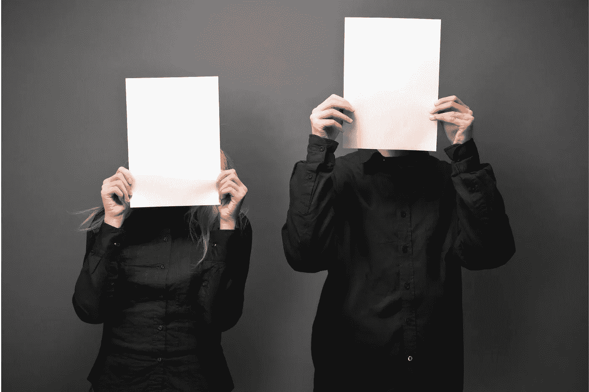

# 比特币不是匿名的。是伪匿名

> 原文：<https://medium.com/geekculture/bitcoin-isnt-anonymous-it-s-pseudo-anonymous-c38376ad9b06?source=collection_archive---------17----------------------->

## 关于比特币有很多误解，最糟糕的是它的匿名性。

Image courtesy of [Canva](https://canva.com)

还记得你年轻的时候，你做了一件聪明的事吗？除了你没人知道发生了什么？你那么聪明，每个人都被你的欺骗所迷惑。现在想想都觉得很好笑，除了这件事没有发生。你不聪明，每个人都知道你在做什么。见鬼，他们甚至对你窃笑了几次，让你知道他们知道了，但你没有得到。你发誓你知道一些别人不知道的事情，他们因为不知道而变得愚蠢，但是，最终，是你不知道。

比特币匿名就是这样。只不过更糟。每个人都认为他们知道比特币是匿名的，因此充斥着犯罪活动，但他们 100%错了。

当你读完之后，你会知道为什么比特币根本不是匿名的而是伪匿名的，是什么让它比人们意识到的更透明，以及如何结束关于它是犯罪分子的完美硬币的讨论。

让我们得到它。

# 对比特币匿名有什么误解？

很多人理解的问题是，执法部门无法将一个投资者的比特币钱包地址与该投资者绑定。虽然钱包的地址不包含持有钱包的人的信息，但提供钱包的机构却有。例如，像维护这样的交易所需要 KYC(了解你的客户)验证来注册他们的服务，包括热钱包和交易所访问。虽然这还不是加密的法律，但几乎所有的加密交易所都在这样做，以走在潮流的前面。此外，这是明智之举。使用 KYC 验证的交易所要求您在创建帐户前出示有效的带照片的身份证件。因此，通过服务提供商，[执法部门](https://www.justice.gov/opa/pr/department-justice-seizes-23-million-cryptocurrency-paid-ransomware-extortionists-darkside)可以将你与你的加密地址联系起来。因此，虽然没有直接的联系，但联系是存在的，而且将永远存在。比特币是伪匿名的。

# 让比特币透明的部分有哪些？

比特币的区块链是比特币上所有交易的完美记录者。见鬼，你可以去网站自己看看。然而，要确定什么时候发生了什么交易，这不仅仅是点击几下鼠标的事情。你需要分析流量、区块创建时间和奖励，并将所有这些数据与现实世界的活动联系起来。执法部门在那里部署区块链分析师来关联数据并确定可能的因果关系。然而，如果执法部门无法从交易所获得信息，这些都不重要。

大多数加密交易所要求 KYC 开户。在美国，执法机构可以向地方法官提出实质性证据，说服他们签发扣押令。一旦执法人员获得搜查令，他们就可以带着足够的法律支持来到交易所，要求允许执法人员进入可疑账户。当然，这一切都依赖于该国的法律，并不是所有的扣押程序都是一样的。

# 如果它不是匿名的，为什么这么多人抱怨它的犯罪联系？

简而言之:无知。这些呼吁关闭比特币和加密的呼声大多源于两件事:政治家的巨大无知能力和华尔街控制或摧毁比特币和加密的决心。

政客们与他们所统治的社会如此脱节，他们的智慧如此有限，这令人尴尬。例如，前参议员特德·史蒂文斯在 2006 年反对一项委员会法案修正案时，将互联网称为“一系列管道”。另一个案例，也是我个人最喜欢的，是众议员汉克·约翰逊(D-Ga。)在 2010 年众议院军事委员会会议期间表示担心，在美国关岛领土上集结军队可能会“掀翻整个岛屿”。你不能瞎编。因此，如果我们的国会议员不能使用基本的逻辑或懒得做一盎司的研究，这不应该让我们感到惊讶，他们相信他们在互联网上看到的一切。这包括仅使用比特币进行邪恶活动的犯罪分子。然而，不幸的是，我们不仅在一个方面面临无知，而且在另一个方面面临贪婪。

华尔街希望 crypto 要么在它的控制之下，要么出局。但不幸的是，太多庞大的银行和投资巨头联合起来反对比特币，他们与华尔街的联系显而易见。见鬼，他们有些人说一句话就能操纵市场。在下面的文章中，我报道了华尔街如何对比特币实施价格控制以做空它。

 [## 华尔街和比特币:他们是在用老把戏强迫新的大空头吗？

### 华尔街不以利他主义或对比特币的热爱而闻名，那么如果他们想控制 BTC 呢——

medium.com](/the-capital/wall-street-and-bitcoin-are-they-using-old-tricks-to-force-a-new-big-short-721baf485773) 

这和他们很久以前用黄金玩的游戏是一样的，只是他们还没有控制所有的比特币。因此，华尔街将继续敲锣打鼓，警告我们所有人硬币的波动性和犯罪基础(我觉得这很好笑)。与此同时，他们的政治傀儡敲响了监管和改革的警钟，以打击那些保护美国弱势公民的卑鄙骗子。什么非凡的英雄(插入讽刺的闸门)。

# 结论

大多数人认为，没有人能够将比特币的钱包地址与所有者联系起来。然而，这种联系在于设立外汇账户的人。交换是钱包和用户之间的连接。然而，要建立这种联系，从法律上讲，执法机构必须遵守适当的程序，才能进入交易所的账户。访问帐户的过程在每个地方都不一样，所以虽然可能有一些地方法律不能将你联系起来，但它们是如此之少。因此，比特币不是完全匿名的。所以，对于那些认为你可以用他们的 BTC 账户实施一些聪明计划的人，不要犯傻。

说到愚蠢，随着政府在全国和全球范围内延续其无知，人们将继续相信比特币是地下犯罪集团的货币。与此同时，华尔街真正的犯罪头目试图控制或根除比特币。

这个故事的寓意是，如果你知道有人认为比特币是完全匿名的，教育他们。那么，让我们努力把一些关于比特币的真相带给世界，而不是当权者喜欢宣扬的错误信息和恐慌。

你相信你持有的比特币是匿名的吗？

哦，还有一件事，如果你想直接**支持我的写作**，你可以通过我的链接**报名参加 Medium** [**。当你这么做的时候，你的部分订阅会归我。另外，**](https://tcgunterwriter.medium.com/membership) **[**多阅读**](https://tcgunterwriter.medium.com) 对我的工作也有帮助。谢谢你。**