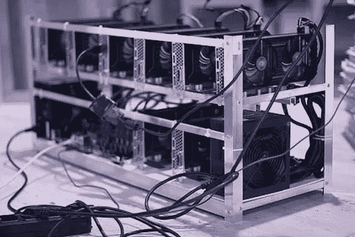

# 比特币矿业公司 Cipher Mining 寻求上市

> 原文：<https://medium.com/geekculture/bitcoin-mining-company-cipher-mining-looks-to-go-public-93baf491220c?source=collection_archive---------33----------------------->

Image credit: [Piqsels](https://www.piqsels.com/en/public-domain-photo-ffltx)

随着围绕比特币的炒作增加，比特币挖矿业务也在增长。比特币挖矿就是产生新的比特币并投入流通的过程。这是一个能源密集型过程。总部位于美国的比特币挖掘公司 Cipher Mining Technologies 就是这样一家行业公司。

## 与特殊目的收购公司合并

7 月中旬，Cipher Mining 宣布将与一家上市的特殊目的收购公司(特殊目的收购公司)Good Works Acquisition Corp .合并。交易完成后，Cipher Mining 的价值约为 20 亿美元。该交易预计将于 2021 年第二季度完成。

在特殊目的收购公司合并完成后，Cipher Mining 将在纳斯达克证券交易所上市。美国商品期货交易委员会(CFTC)前主席吉姆·纽森将担任 Cipher Mining 的董事会成员。

## 关于比特币挖矿

比特币挖矿涉及运营发电厂和购买高速设备。该设备使用称为专用集成电路(ASIC)芯片的专用硬件。该公司正在德克萨斯州扩大开采能力。与美国其他州不同，德克萨斯州的电网已经解除管制。该公司还在俄亥俄州建设采矿能力，该州电力价格低，来源低碳。

Photo by [Executium](https://unsplash.com/@executium?utm_source=unsplash&utm_medium=referral&utm_content=creditCopyText) on [Unsplash](https://unsplash.com/s/photos/bitcoin-mining?utm_source=unsplash&utm_medium=referral&utm_content=creditCopyText)

Cipher Mining Technologies Inc .是总部位于荷兰的 Bitfury Holding 的美国分公司。Bitfury 专门提供比特币挖矿硬件和区块链软件及服务。虽然 Cipher Mining 是一家相对较新的公司，但 Bitfury 可以追溯到 2011 年。自成立以来，Bitfury 已经负责挖掘了超过 60 万个比特币。与 Bitfury 关联将使密码挖掘能够利用额外的资源和规模。

竞争对手包括 Riot Blockchain、Marathon Digital、Greenidge Generation、Bitfarms Technologies 和 Hive Blockchain Technologies。这些竞争对手也试图在工业规模上挖掘比特币。Cipher Mining 的目标是到 2025 年底拥有 745 兆瓦的开采能力。

Cipher Mining 的首席执行官泰勒·佩奇(Tyler Page)希望这家初创公司能够成为美国领先的区块链矿业公司。佩奇毕业于密歇根大学法学院，在涉足加密货币行业之前，曾在多家大型金融机构工作。

## **关注环境的比特币开采**

根据最近的统计数据，全球约 65%的比特币交易发生在中国。邻国哈萨克斯坦也因其低廉的能源价格而成为一个重要的比特币开采中心。哈萨克斯坦和中国新疆地区较低的温度也是防止采矿设备过热的最佳条件。这些地区的大量电力来自燃煤和燃气发电站。

根据专门报道最新加密发展的新闻网站 coin desk 2021 年 4 月发表的一篇文章，如果比特币是一个国家，它的能源消耗将排在第 29 位，在乌克兰和阿根廷之间。

## 碳足迹问题

鉴于比特币开采中使用的巨大能源，对其碳足迹的担忧已经达到顶点。使用清洁能源以可持续的方式开采加密货币已经成为加密社区的一个重点。人们一直在努力鼓励使用可再生能源。许多公司签署了加密气候协议，承诺帮助该行业实现 100%可再生能源消耗的目标。

剑桥比特币电力消耗指数的另一项研究估计，全球比特币开采每年使用约 105 太瓦时的电力。客观地说，这比菲律宾一年的用电量还要多。

几个月前，埃隆马斯克(Elon Musk)宣布，特斯拉将暂停使用比特币购买车辆，原因是比特币挖矿对环境造成了负面影响。埃隆·马斯克(Elon Musk)在一篇 Twitter 帖子中表示，“当确认矿工合理(~50%)使用清洁能源且未来趋势积极时，特斯拉将恢复允许比特币交易。”

## 地球友好型比特币采矿

专注于环境可持续加密货币开采的比特币开采公司将从这一增长趋势中受益。

2021 年 6 月，萨尔瓦多总统宣布将成为首个采用比特币作为法定货币的国家。萨尔瓦多总统也表示，他们将利用火山产生的电力开采比特币。

像 Cipher Mining 这样的公司拥有必要的基础设施和有竞争力的定价能力，将在未来占据竞争地位。比特币将继续存在。尽管最近价格下跌，比特币的支持者对长期潜力充满热情。

Square 和 Twitter 的首席执行官杰克·多西表示，“对我来说，比特币绝对改变了一切。它最吸引我的是它的精神气质，它代表了什么…无论我能做什么，无论我的公司能做什么，让每个人都能使用比特币，这就是我余生要做的事情…我认为没有什么比这更能让世界各地的人们受益。”