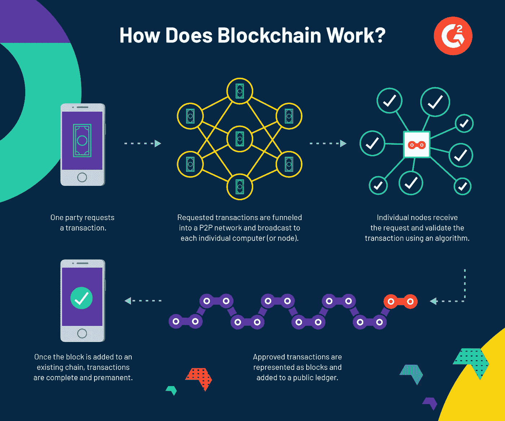
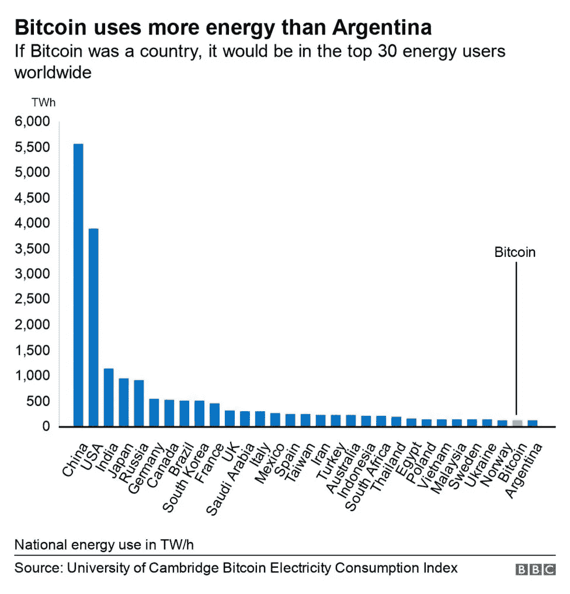

# 比特币挖矿对环境很可怕。加密不一定是。

> 原文：<https://medium.com/geekculture/bitcoin-mining-is-terrible-for-the-environment-crypto-doesnt-have-to-be-c204b2a784a3?source=collection_archive---------10----------------------->

*加密货币有必要“挖矿”吗？以太坊 2.0 是什么？*

Photo by [Dmitry Demidko](https://unsplash.com/@wildbook?utm_source=medium&utm_medium=referral) on [Unsplash](https://unsplash.com?utm_source=medium&utm_medium=referral)

比特币通常被誉为可以改变世界的加密货币；然而，比特币挖矿并不像看起来那么环保。事实上，为了保护比特币的数字安全，需要消耗大量的电力。

> 今年，加密货币开采估计每年消耗约 121.36 太瓦时(TWh)。除非货币贬值，否则这个数字不太可能很快下降。相比之下，阿根廷每年消耗约 121 万亿瓦时，荷兰(108.8 万亿瓦时)和阿拉伯联合酋长国(113.20 万亿瓦时)。完整的报告。你可以在这里找到文章[。](https://www.bbc.com/news/technology-56012952#:~:text=Cambridge%20researchers%20say%20it%20consumes,Bitcoin%20undermines%20its%20environmental%20image.)

# 区块链简单解释

如果你听说过比特币，那么有 10，000%的可能你也听说过区块链。区块链是帮助其运作的核心协议，并确保比特币和其他加密货币交易可以被信任，而无需经过任何中央管理机构的验证。去中心化本身就是加密货币相对于传统货币的关键优势之一。

[https://www.g2.com/categories/blockchain](https://www.g2.com/categories/blockchain)

那么，区块链协议是如何确保交易不是欺诈性的呢？比特币网络上的每一笔交易都要经过一个“矿工”网络的验证。简而言之，矿工们使用计算机来破解复杂的数学问题，以验证网络上的交易。但并不是每个验证这些交易的人都能得到回报。只有第一个成功“破解谜题”以验证一个“区块”或一组交易的矿工才能获得奖励。比特币挖矿基本上是一场在网络上处理交易的比赛，你可以通过为这场比赛贡献计算能力来赚取比特币。你的计算能力越强，你赢得这场比赛的机会就越大。

**因此，挖掘的全部意义在于处理区块，并将它们添加到区块链中，这样你就可以因此获得比特币奖励。如果有人在挖掘比特币，他们本质上是在利用强大的硬件来验证比特币交易，并收取费用。**

如果你够书呆子气，坐下来看 20 分钟的比特币工作原理剖析，看看下面的视频。很长，但解释得很好。

# 为什么比特币挖矿对环境有害？

这些前面提到的“难题”不是任何一个聪明人能简单解决的。他们需要特殊的计算机硬件和大量的电力来解决这些复杂的数学问题。由于许多矿工竞相同时解决相同的谜题以获得区块奖励，许多能量被浪费了。虽然处理区块和赚取比特币本身被认为是浪费能源，因为它不是非常有效，但另一个问题在于硬件。目前，许多矿工使用专用集成电路(ASIC)，这是专门为比特币采矿目的设计的硬件，比普通计算机多使用 10 倍的电力。这些专用集成电路只能用于开采比特币，因此一旦它们过时，它们对其他任何事情都没有用——包括其他重要任务，如科学研究或视频游戏图形渲染。

**今年，加密货币开采预计每年消耗约 121.36 太瓦时(TWh)。**除非货币贬值，否则这个数字不太可能在短期内下降。相比之下，阿根廷每年消耗约 121 万亿瓦时，荷兰(108.8 万亿瓦时)和阿拉伯联合酋长国(113.20 万亿瓦时)。完整的报告，你可以在这里找到[的文章。](https://www.bbc.com/news/technology-56012952#:~:text=Cambridge%20researchers%20say%20it%20consumes,Bitcoin%20undermines%20its%20environmental%20image.)

bbc.com

除了消耗大量电力，比特币采矿也对环境有害，因为它使用产生大量热量的专业采矿设备。硬件系统通常位于电力便宜的地区，但这些地区通常位于人类发展指数较低的国家，并且依赖煤炭发电，因此对当地人口的环境影响和成本很高。

最后，是矿池的概念。这些矿工组合他们的计算能力来处理区块。然后，根据每个矿工完成的工作量，在团队中分享矿池奖励。这种机制激励矿工加入矿池，从而提高网络安全性，但也意味着给予的奖励更少。因此，作为这种机制的结果，拥有更强大硬件和更多电力的矿商往往会在这些池中赚取大部分利润。但这些矿池的主要问题是，随着它们变得越来越大，区块链的网络变得越来越分散。一旦矿池的计算机资源份额超过 51%,就会出现更大的问题。这将使池的运营商获得对网络的多数控制权，并可用于对区块链发动攻击。你可以在这里了解更多关于 51%攻击[。](https://www.investopedia.com/terms/1/51-attack.asp)

# 解决办法是什么

人们对比特币开采的环境影响有很多担忧。这个问题的最佳解决方案是改变比特币交易的验证方式。目前，这些交易通过一个称为工作证明(我们之前讨论的采矿过程的名称)的过程，该过程有利于在专业硬件和电力上花费大量资金的矿工。

相反，通过“利害关系证明”来验证交易会更有效率。利益证明协议不是奖励第一个验证交易的矿工，而是在网络上随机选择一个“验证者”来验证下一个交易。为了成为验证者，他们必须提供自己的加密货币的“股份”，比验证奖励更多，作为抵押品，以防止他们恶意阻止或试图欺骗系统。这个验证器不需要解决任何复杂的数学问题，只需要在交易发生时在线即可。验证完这个块之后，下一个验证器被选中。如果随后的验证者发现之前的区块是欺诈性的，这可能导致该区块的创建者失去该交易的股份。这种方法激励验证者诚实，因为任何不诚实的行为都会导致他们失去投资。这也将允许网络运行在更强大和更便宜的硬件上。

以太坊，最受欢迎的加密货币之一，正计划从工作证明协议转向以太坊 2.0 的利益证明。最终目标是一旦变革实施，将不再需要矿工。出于类似的考虑，另一种加密货币 NEO 也在开发一种利益证明协议。

交易验证的未来在于利益证明协议。他们不太依赖硬件，因此更加民主和分散。这意味着它们对环境几乎没有威胁，因为它们不需要大量的电力来运行。然而，这些协议需要进一步发展，才能用于智能合约或比特币交易等主流应用。开发人员必须小心，确保这些协议不会被不诚实的验证者利用。如果成功，加密货币交易将变得更加高效、廉价和可持续。