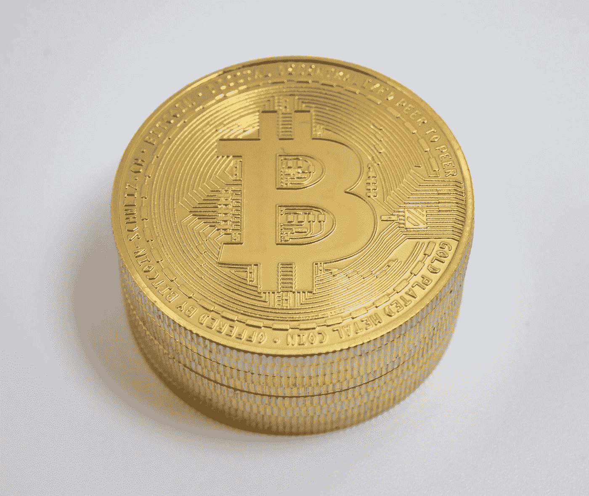

# 比特币价格暴跌至 24000 美元？

> 原文：<https://medium.com/geekculture/bitcoin-price-crash-to-24-000-usd-bc6b155a02c3?source=collection_archive---------59----------------------->

分析师预计会大幅下跌

Photo by [Jürg Kradolfer](https://unsplash.com/@bitcoin_schweiz?utm_source=medium&utm_medium=referral) on [Unsplash](https://unsplash.com?utm_source=medium&utm_medium=referral)

我们会面临下一次比特币价格暴跌吗？罗伯特·清崎现在看到了这一点。在过去的几天里，比特币的价格已经开始下跌。

在比特币价格上涨到略高于 40，000 美元后，投资者徒劳地等待着许多分析师宣布的 100，000 美元的大幅上涨。现在比特币价格报价 35800 左右…