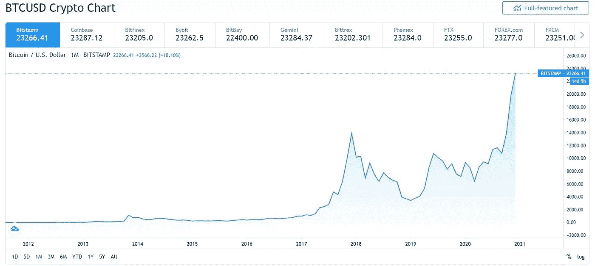

# 比特币系列#5:比特币投资入门

> 原文：<https://medium.com/geekculture/bitcoin-series-4-getting-started-with-bitcoin-investing-be294138283e?source=collection_archive---------59----------------------->

## 常识性的建议，使数百万人不被骗！

Photo by [Jason Briscoe](https://unsplash.com/@jsnbrsc?utm_source=medium&utm_medium=referral) on [Unsplash](https://unsplash.com?utm_source=medium&utm_medium=referral)

你知道比特币已经从 0.0008 美元涨到 58959 美元了吗？你的 FOMO 起作用了吗？

Image courtesy Investopedia.com

在你能够开始使用比特币之前，尽可能多地了解这项技术以确保你不会犯代价高昂的错误是很重要的。

在本文中，我们将介绍以下内容:

*   迈出你的第一步。
*   创建钱包。
*   选择一家声誉好的交易所。

## 第一步

如果你对比特币、替代币、区块链或其他词汇一无所知，那么看看我的比特币系列的其他部分吧:

 [## 比特币系列#1:比特币和加密货币的温和介绍

### 编辑描述

thinkpader.medium.com](https://thinkpader.medium.com/a-subtle-intro-to-bitcoin-and-cryptocurrency-bde9a65c60c6)  [## 比特币系列#2:比特币简史

### 编辑描述

thinkpader.medium.com](https://thinkpader.medium.com/bitcoin-series-2-a-brief-history-of-bitcoin-630a9ed6c847)  [## 比特币系列#3:是什么让比特币独一无二？

### 编辑描述

thinkpader.medium.com](https://thinkpader.medium.com/bitcoin-series-3-what-makes-bitcoin-unique-7236a601358e)  [## 比特币系列#4:你想知道的关于区块链的一切

### 编辑描述

thinkpader.medium.com](https://thinkpader.medium.com/bitcoin-series-4-everything-you-wanted-to-know-about-blockchain-70ff19cc62b0) 

## 创建钱包

在你能够购买比特币之前，你需要一个地方来储存你的数字货币。这就是所谓的钱包。这类似于实体钱包。

然而，你的比特币钱包的特别之处在于，你的比特币钱包是由一个最好保持安全的代码或地址来表示的。该地址在整个区块链网络中使用，将引导至您的个人钱包。

比特币钱包有多种形式——有桌面钱包、移动钱包和纸质钱包。

**桌面钱包**

这些位于您的桌面计算机上，是最安全的。这些可以从你的电脑上访问，位于平台上，如比特币交易所，为你保存硬币。

这样做的好处是你的账户很难被黑或者存款被盗。

桌面钱包最大的缺点是，如果平台崩溃，你可能会失去你所有的积蓄。桌面钱包的另一个缺点是缺乏灵活性。它们不能随身携带，也不像移动设备那样适合放在口袋里。

**手机钱包**

这些类似于桌面钱包；然而，该软件是在手机上运行的，因此提供了更大的灵活性。

缺点是，如果你的手机被盗，你的存款可能有被抢劫的潜在风险。

**纸钱包**

这是一张打印好的纸，包含从你的钱包接收和发送比特币所需的公钥和私钥。

纸质钱包的优势在于它们不以数字方式存储，这意味着它们完全不会受到黑客和网络攻击。

然而，纸质钱包是脆弱的，因为它们很容易丢失或毁坏，这最终意味着钥匙丢失，因此无法存取资金。

## 向您的钱包中添加资金

买卖比特币最简单的方法是去比特币交易所，在那里进行你的第一笔交易。

所有主要的比特币交易所都有桌面和移动应用，它们让比特币的买卖像在亚马逊购物一样简单。

你需要在你选择的比特币交易所创建一个账户。如今，大多数交易所还要求您输入个人详细信息和一种 ID 形式，以符合洗钱法和欺诈。这是一件好事，因为这表明比特币已经不再只被极客或罪犯使用。

然后，您可以使用信用卡、银行账户、Paypal、现金存款或钱包提供的任何其他方法将资金添加到您的钱包中。

## 寻找信誉良好的交易所

比特币变得更加主流，被广泛接受，并不代表你不会遇到诈骗。

理想情况下，你会希望选择一家声誉好、信誉卓著、公平对待用户的交易所。有很多方法可以做到这一点，通过问自己一些基本的问题。

**比特币交易所在哪里？**

最好从位于你自己国家的交易所购买比特币。这一点很重要，因为不同国家的法律法规可能会有所不同，这可能会影响他们与您的交易。

你可以选择国外的交易所，但要确保交易所接受多种货币，以避免汇率的双重下跌。你可以通过搜索一家交易所的网站找到所有这些信息。

**怎样才能买到比特币？**

不同的交易所将有不同的支付方式。最常见的支付方式是电汇、现金存款、信用卡、PayPal 以及其他次要方式。

在决定使用要求您提供个人详细信息的支付方式(如信用卡)或无法追踪的支付方式(如电汇)时，请牢记您的隐私和安全。

**兑换手续费是多少？**

你选择的交易所应该公开他们的交易费用，并允许你与市场上的其他交易所进行比较。货比三家，以获得最好的交易。

**我的交易所透明吗？**

确保您选择的 exchange 发布其审计信息。这将告诉你交易所是否是流动的，是否涵盖所有比特币交易所销售，或者这是另一种欺诈。

我的交易有多安全？

确保您使用的 exchange 保护您的隐私，并具有安全功能来避免您的信息

在创建帐户之前，它应该提供安全登录和双重身份验证。

**多快可以访问我的比特币 post 交易？**

比特币价格波动很大。在大多数情况下，交易所会为你提供锁定价格，这意味着你支付的价格不会高于或低于屏幕上显示的价格，即使比特币可能需要一段时间才能到达你的钱包。

其他交易所将立即存入你的钱包，你能够在任何重大波动发生之前获得它们。

所以简而言之，在选择比特币交易所之前，要确定这些事情:

*   查找位于您所在国家的交易所。如果没有，了解所有相关的费用和税收。
*   交易所接受的支付方式是你觉得舒服的方式。
*   货比三家，寻找最低的交易费用。
*   确保交易的透明和安全。
*   选择锁定价格或即时购买的交易所。

## 结论

比特币和加密交易如今风靡一时。虽然投资加密货币在经济上非常有回报，但请确保你做了尽职调查，以做出安全的选择，避免成为欺诈的受害者。