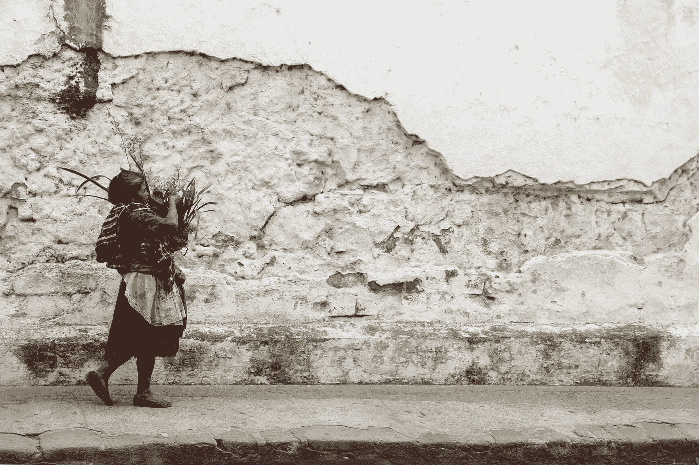

# 比特币将成为萨尔瓦多的法定货币

> 原文：<https://medium.com/geekculture/bitcoin-to-become-legal-tender-in-el-salvador-77261ee063d1?source=collection_archive---------57----------------------->

## 为什么这改变了一切

Photo by [Scott Umstattd](https://unsplash.com/@scott_umstattd?utm_source=unsplash&utm_medium=referral&utm_content=creditCopyText) on [Unsplash](https://unsplash.com/s/photos/latin-america?utm_source=unsplash&utm_medium=referral&utm_content=creditCopyText)

在迈阿密举行的 2021 年比特币大会上，发布了许多重要消息，大部分都是积极的。但没有被忽视的是萨尔瓦多总统纳伊布·布克莱关于采用比特币作为法定货币的声明。