# 上的按位实现。网络 6

> 原文：<https://medium.com/geekculture/bitwise-implementation-on-net-6-7704265fd40f?source=collection_archive---------2----------------------->


大家好，今天我们将讨论按位运算符和运算在现实生活中的优缺点。

**场景:**我们将向经销商发送活动消息。而且这些经销商下面有很多用户。我们将尽力记录谁读了这条信息，谁没读。

# C lassic 道

这些是 MsSqlDB 表:“经销商”、“消息”关系表“用户消息”，当然还有“用户”表。

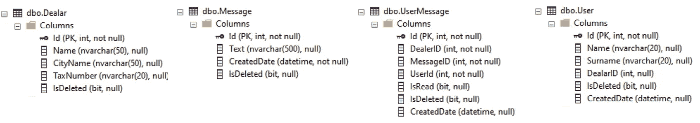

BitwiseDB’s Tables Schema

在经典的方法中，我们在“UserMessage”表中保存谁读取了消息数据，该表被绿色矩形包围，如下所示。

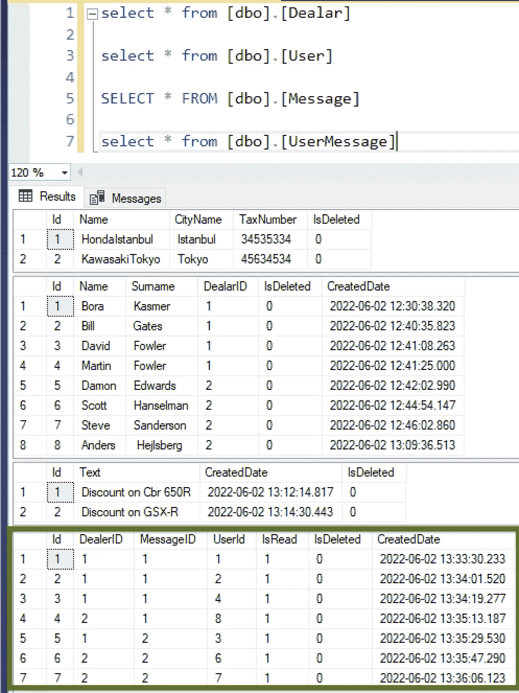

1 **-)** 让我们一起创造。Net 6.0 Web Api 项目“BitwiseDealers”。并将 DB 类库项目添加到解决方案中。

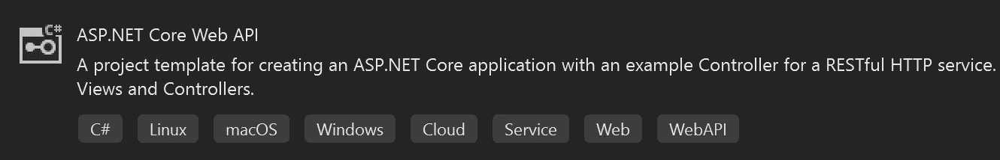

Visual Studio 2022 .Net Project Template

A 使用 Nuget 将下面的库添加到 DB 项目中。

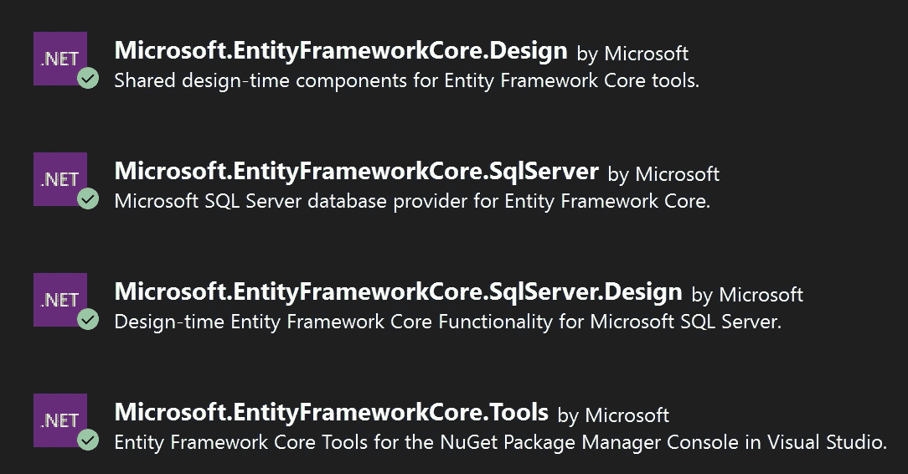

创建实体和数据库上下文

数据库已经存在，因此我们将在此解决方案中首先使用数据库。打开终端，用“ ***cd DB*** ”命令移动到 DB 文件夹。下面我们称之为“**脚手架**命令。所以我们会自动创建实体和 BitwiseContext。

```
dotnet ef dbcontext scaffold "Server=.;Database=BitwiseDB;Trusted_Connection=True;"
Microsoft.EntityFrameworkCore.SqlServer -o Entities --context-dir "Entities\DbContexts"
--no-pluralize -c BitwiseContext -f
```

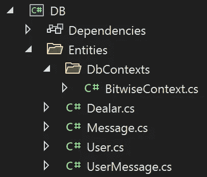

This is new DB Layer

**bitwise dealers/appsettings.json:**我们为 WebApi 服务在 appsettings . JSON 中添加了 DB 连接设置。

***** *不要忘记加密发布版本的所有配置文本。*

```
"ConnectionStrings": {
  "DefaultConnection": "Data Source=.;initial catalog=BitwiseDB;Trusted_Connection=True;"
}
```

2 **-)** 创建服务层:创建“BitwiseService”类库项目。

**BitwiseService/iuser service:**我们会得到，阅读具体消息的用户列表。

```
using Core.Model;
using System;
using System.Collections.Generic;
using System.Linq;
using System.Text;
using System.Threading.Tasks;namespace BitwiseService
{
   public interface IUserService
   { 
       List<UserMessageViewModel> GetUserListByMessageID(int messageID);
   }
}
```

**BitwiseService/UserService:**我们将从这个*GetUserListByMessageID()*方法中返回自定义的“***UserMessageViewModel***”。我们将获得用户全名，交易名称和读取状态。并将其返回给控制器。

```
using Core.Model;
using DB.Entities;
using DB.Entities.DbContexts;
using System.Linq;namespace BitwiseService
{
   public class UserService : IUserService
   {
      BitwiseContext _context; 
      public UserService(BitwiseContext context)
      {
         _context = context;
      }

      public List<UserMessageViewModel> GetUserListByMessageID(int messageID)
      {
         var data = (from um in _context.UserMessage
         join u in _context.User on um.UserId equals u.Id into us
         from u in us.DefaultIfEmpty()

         join d in _context.Dealar on 
                         um.DealerId equals d.Id into de
         from d in de.DefaultIfEmpty()

         join m in _context.Message on 
                         um.MessageId equals m.Id into me
         from m in me.DefaultIfEmpty()

         where um.MessageId == messageID
         select new UserMessageViewModel
         {
            UserName = u.Name,
            UserSurname = u.Surname,
            DealerName = d.Name,Message = m.Text,
            IsRead = (bool)um.IsRead
         }).ToList();
return data.Count > 0 ? data : new List<UserMessageViewModel>();
      }
   }
}
```

**Program.cs:** 不要忘记将 userService 添加到 Program.cs 中，如下所示。

```
builder.Services.AddTransient<IUserService, UserService>();
```

3 **-)** 创建核心类库项目并添加模型文件夹。

**Core/Model/UserMessageViewModel**:这是自定义的 UserMessageViewModel

```
namespace Core.Model
{
   public class UserMessageViewModel
   {
      public string UserName { get; set; }
      public string UserSurname { get; set; }
      public string Message { get; set; }
      public bool IsRead { get; set; }
      public string DealerName { get; set; }
   }
}
```

4**-)BitwiseDealers/Controller/dealer Controller:**我们将从 bitwise dealers 控制器获取用户列表。

```
using BitwiseService;
using Core.Model;
using Microsoft.AspNetCore.Mvc;namespace BitwiseDealers.Controllers
{
   [ApiController]
   [Route("[controller]")]
   public class DealerController : ControllerBase
   {
      IUserService _userService;
      public DealerController(IUserService userService) { _userService = userService; } [HttpGet("GetUserListByMessageID/{messageID}")]
      public IEnumerable<UserMessageViewModel> GetUserListByMessageID(int messageID)
      {
         return _userService.GetUserListByMessageID(messageID);
      }
   }
}
```

这样，我们必须为每个经销商逐一保存所有用户的记录。如果你有 10K 用户，每条信息你都要重复这个。所以到了月底，你必须为每条消息保留数百万行。这是我无法接受的:)

> 为了优化和提高性能，如何用少得多的行数保存相同的数据？


# B itwise Way

1 **-)** 首先，我们将在用户表中添加“ ***BitwiseID*** ”列。我们将创建一个新的"***UserMessageBitwase***"表，如下所示。毕竟，我们将使用“***user message bitwise***”表来代替“ ***UserMessage***

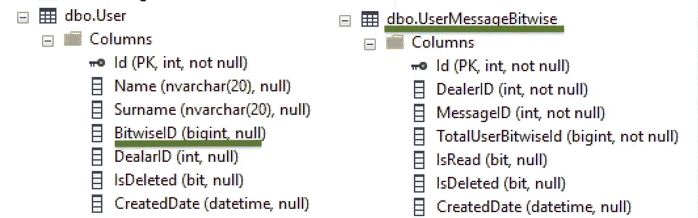

***** 别忘了再次调用**脚手架**命令。因为更新后端 DBContext 和实体。我们将更新用户实体并添加 UserMessageBitwise 表。

用户的 BitwiseID 将通过“*”公式增加+1。*

*例如:“1，2，4，8，16”。我们将通过 DealerID 为每个用户组设置“***”BitwiseID***”。如果 DealerID 发生变化，我们将从 1 重新启动 BitwiseID，如下所示。*

**

*我们将把新数据添加到“***UserMessageBitwise***”表中。*

> *诀窍是我们将用户的“BitWiseID”相加，这些用户与 DealarID 在同一个组中阅读消息。*

***例如**:如果您检查“用户消息表”中 MessageID =1，并且在 DealerID =1 的情况下，组用户为“ **1、2 和 4** ”*

*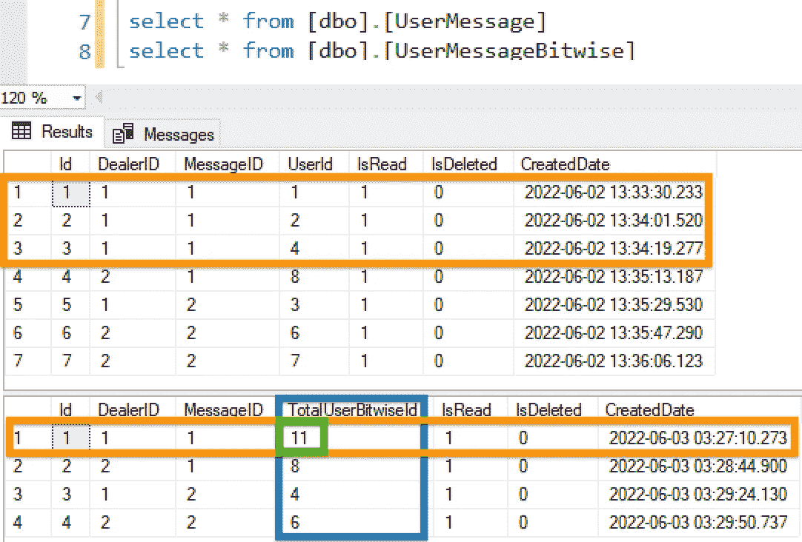*

***We will write only 1 row to the UserMessageBitwise Table instead of writing 3 rows to the UserMessage Table***

*我们将对 DealerID=1 且用户 ID=1、2 和 4 的用户的“BitWiseID”求和，如下所示。它是 1 + 2 + 8= " **11** "，并将这个总数放入如上所示的" **UserMessageBitwise** "表的" *TotalBitwiseId* "列中。 ***所以我们会写 1 行而不是 3 行。****

*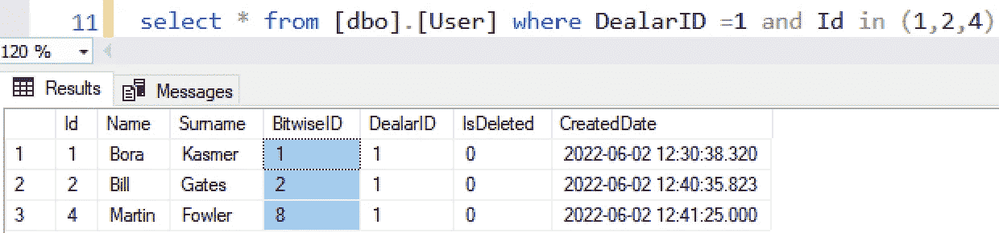*

*Sum Spesific User’s BitwiseID*

*2*

## ***Redis 实现***

*首先，我们需要 Redis 从内存中获取每个经销商的所有用户" **BitwiseId** "回答数据，以提高性能。我们的主要目标是通过将 SQL 上的负载转移到 Redise 来提高性能。*

**

*在“核心”文件夹下创建“缓存”文件夹。并添加如下图所示的“ *RedisCacheService* ”。*

***核心/缓存/IRedisCacheService:***

```
*using System;
using System.Collections.Generic;
using System.Text;namespace Core.Caching
{
   public interface IRedisCacheService
   {
      T Get<T>(string key, long db = 0);
      IList<T> GetAll<T>(string key, long db = 0);
      void Set(string key, object data, long db = 0);
      void Set(string key, object data, DateTime time, long db = 0);
      void SetAll<T>(IDictionary<string, T> values, long db = 0);
      void Remove(string key, long db = 0);
   }}*
```

*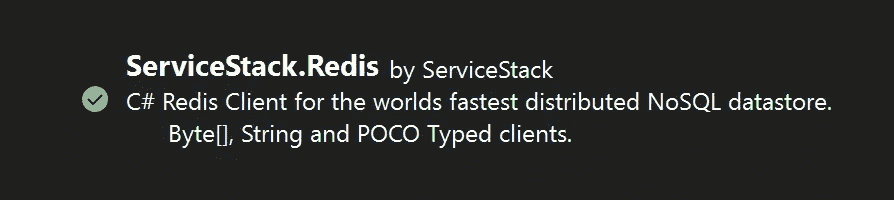*

*Don’t Forget the Download “ServiceStack.Redis” Library for Core Project*

***bitwise dealers/appsettings . JSON:**将 Redis config 添加到 appsetting.json 中，不要忘记加密发布版本的所有配置文本。*

```
*.
.
"BitwiseConfig": {
   "RedisEndPoint": "127.0.0.1",
   "RedisPort": "6379",
   "RedisPassword": "t@stPassword"
},*
```

***Core/Configuration/BitwiseConfig:**我们将使用 BitwiseConfig 类，从 appsettings.json 获取配置。*

```
*using System;
using System.Collections.Generic;
using System.Linq;
using System.Text;
using System.Threading.Tasks;namespace Core.Configuration
{
   public  class BitwiseConfig
   {
      #region Props
        public string RedisEndPoint { get; set; }
        public string RedisPort { get; set; }
        public string RedisPassword { get; set; }
      #endregion
   }
}*
```

***bitwise dealer/Program.cs:**别忘了给 program . cs 添加“BitwiseConfig”类，如下图所示。因此，我们将把“【appsettings.json/BitwiseConfig】”部分与 BitwiseConfig 类进行匹配。*

```
*.
.
builder.Services.Configure<BitwiseConfig>(builder.Configuration.GetSection("BitwiseConfig"));*
```

***核心/缓存/RedisCacheService:** 这是一个基本的简单 RedisCache 服务。您可以通过使用该类来添加、获取和移除基本操作。*

```
*using Core.Configuration;
using Microsoft.Extensions.Options;
using Newtonsoft.Json;
using ServiceStack.Redis;
using System;
using System.Collections.Generic;
using System.Linq;
using System.Text;
using System.Threading.Tasks;namespace Core.Caching
{
   public class RedisCacheService : IRedisCacheService
   {
      #region Fields
      public readonly IOptions<BitwiseConfig> _bitwiseConfig;
      private readonly RedisEndpoint conf = null;
      #endregion //config set requirepass fl@rp1$19C23public RedisCacheService(IOptions<BitwiseConfig> bitwiseConfig)
      {
         _bitwiseConfig = bitwiseConfig;
         conf = new RedisEndpoint { 
         Host = _bitwiseConfig.Value.RedisEndPoint, 
         Port = Convert.ToInt32(_bitwiseConfig.Value.RedisPort), 
         Password = _bitwiseConfig.Value.RedisPassword };
      }
      public T Get<T>(string key, long db = 0)
      {
         try
         {
            conf.Db = db;
            using (IRedisClient client = new RedisClient(conf))
            {
               return client.Get<T>(key);
            }
         }
         catch
         {
            throw new Exception("Redis Not Available");
         }
      } public IList<T> GetAll<T>(string key, long db = 0)
      {
         try
         {
            conf.Db = db;
            using (IRedisClient client = new RedisClient(conf))
            {
               var keys = client.SearchKeys(key);
               if (keys.Any())
               {
                  IEnumerable<T> dataList = client.GetAll<T>(keys).Values;
                  return dataList.ToList();
               }
               return new List<T>();
             }
         }
         catch
         {
           throw new Exception("Redis Not Available");
         }
      } public void Set(string key, object data, long db = 0)
      {
         Set(key, data, DateTime.Now.AddMinutes(60), db);
      }
      public void Set(string key, object data, DateTime time, long db = 0)
      {
         try
         {
            conf.Db = db;
            using (IRedisClient client = new RedisClient(conf))
            {
               var dataSerialize = JsonConvert.SerializeObject(data, Formatting.Indented, new JsonSerializerSettings{
PreserveReferencesHandling = PreserveReferencesHandling.Objects
});
               client.Set(key, Encoding.UTF8.GetBytes(dataSerialize), time);
            }
         }
         catch
         {
            throw new Exception("Redis Not Available");
         }
      } public void SetAll<T>(IDictionary<string, T> values, long db = 0)
      { 
         try
         {
            conf.Db = db;
            using (IRedisClient client = new RedisClient(conf))
            {
               client.SetAll(values);
            }
         }
         catch
         {
            throw new Exception("Redis Not Available");
         }
      } public void Remove(string key, long db = 0)
      {
         try
         {
            conf.Db = db;
            using (IRedisClient client = new RedisClient(conf))
            {
               client.Remove(key);
            }
         }
         catch
         {
            throw new Exception("Redis Not Available");
         }
      }
   }
}*
```

***bitwise dealer/Program.cs:**别忘了给 program . cs 添加“RedisServices”类，如下图所示。*

```
*builder.Services.AddTransient<IRedisCacheService, RedisCacheService>();*
```

*3 **-)** 接下来，我们将创建“UserRedisModel”作为模型保存在 Redis 中。我们将在 Redis 中使用该模型保存用户详细数据。*

*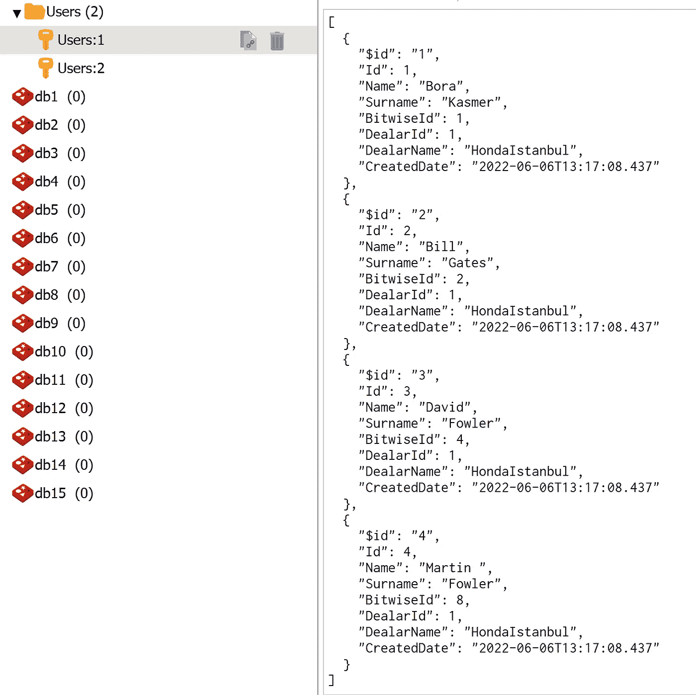*

***List of UserRedisModel Data for DealarID=1 on Redis***

***核心/模型/用户再模型:***

```
*using System;
using System.Collections.Generic;
using System.Linq;
using System.Text;
using System.Threading.Tasks;namespace Core.Model
{
   public class UserRedisModel
   {
      public int Id { get; set; }
      public string? Name { get; set; }
      public string? Surname { get; set; }
      public long? BitwiseId { get; set; }
      public int? DealarId { get; set; }
      public string DealarName { get; set; }
      public DateTime? CreatedDate { get; set; }
   }
}*
```

*我们做好了一切准备。接下来，我们将把 **GetUserListMessageID()方法**改为**逐位**算法，如下所示*

*   *在开始的时候，我们会获取所有阅读消息的人的数据，并设置“answerData”参数。*
*   *我们将通过“messageID”获取消息文本，并设置消息变量。*

*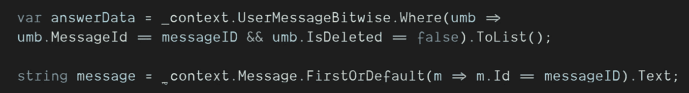*

*   *“resultList”是模型的返回列表。我们将在开始时创建一个空模型。我们将开始循环输入“answerData”。*

*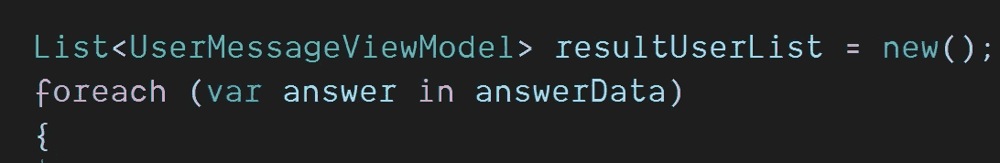*

*   *我们将尝试从 Redis 中获取带有特定 dealerID 的用户数据。如果为 null，将从 SqlDB 中获取所有数据。*

*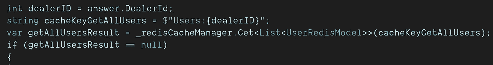*

*   *如果 Redis 为 null，我们将使用 LINQ 从 DB 中获取用户数据，如下所示。我们将连接用户和经销商表，并返回 UserRedisModel。最后，将该经销商的用户数据保存到 Redis。*

**

*   **这是最重要的部分。在我们从 Redis 或 SqlDB 获得用户数据之后，我们将在 UserList 中循环。我们将检查**是否为*用户。BitwiseID* 中的**是总答**中的 *TotalUserBitwiseId* 中的**。它的意思是，这个用户是否阅读此消息。*

> *用户。BitwiseID[4]=(TotalBitwiseID[8]& user。BitwiseID[4]) = >结果为“是”*

*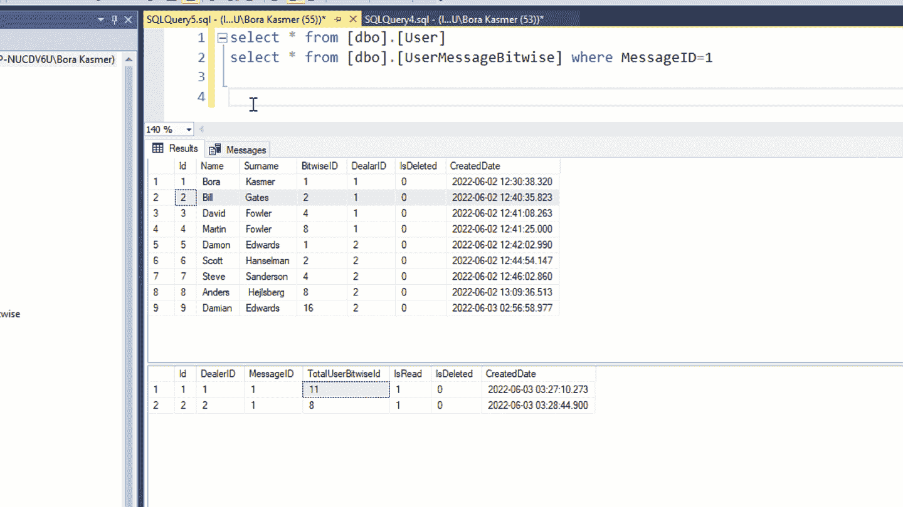*

***Bitwise Operation Example***

*   *如果为真，我们将把这个用户添加到“ *resultUserList* ”中。最后还回来。*

*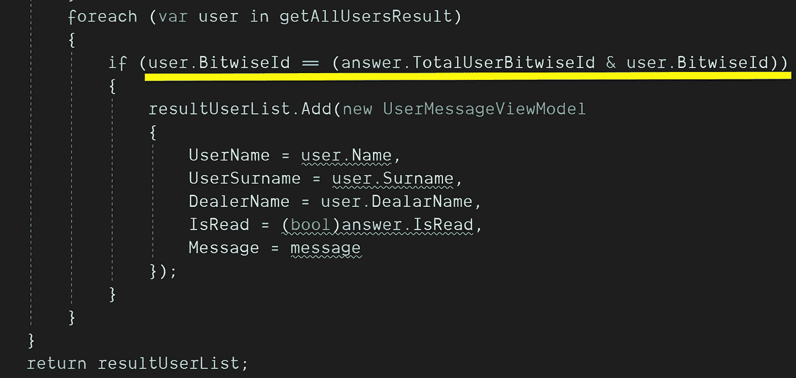*

*We Checked if Is User Read the Message or Not by Using **Bitwise***

***BitwiseService/UserService(版本 2):***

*我们得到了所有的用户，他们通过使用" ***按位* "** 读取 MessageID=1，如下所示。*

*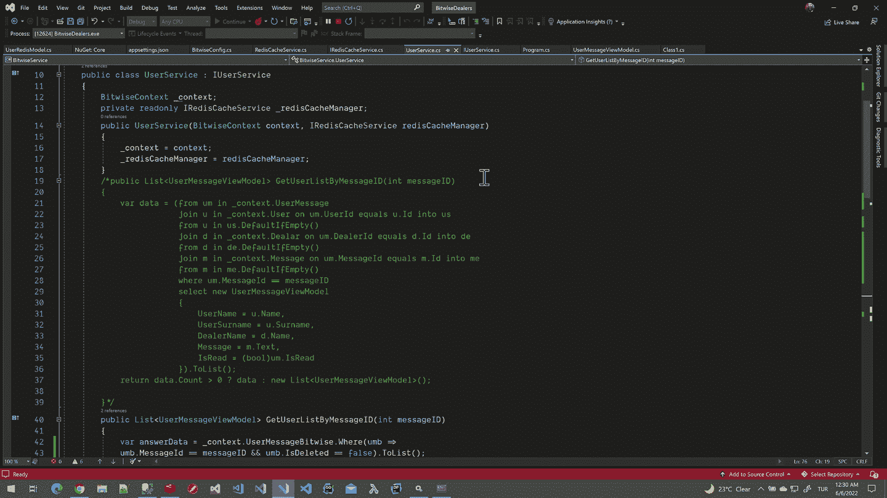*

*Which Users Did Read the MessageID =1 ?*

***结论:***

*您可以对许多父子场景使用逐位算法。例如树形菜单、州/城市或产品/子产品。您可以对最多 63 个子项目使用位元。因为处理器不能识别大于“***”***”的数字。但是我觉得大多数情况下 63 就够了。你可以在线写 1 行而不是 63 行。诀窍是在一个组中使用子类别。正如在本文中，我们将用户分组到经销商下面。所以对于不同的经销商，我们从 1 重新启动用户 BitwiseID。我们为新经销商赢得了 63 个用户。*

*不用担心循环所有用户来检查他们的 BitwiseId 是否在 TotalBitwiseID 中。因为按位检查是一个非常性能的操作。*

*下一篇文章再见。*

**“如果你读到现在，首先感谢你的耐心和支持。欢迎大家到我的博客*[](http://www.borakasmer.com/)****了解更多！”*****

****源代码****

*   ****Github:**[***https://github.com/borakasmer/Bitwise***](https://github.com/borakasmer/Bitwise)**
*   ****BitwiseDB 脚本:**[***https://borakasmer.com/projects/BitwiseScript.sql***](https://borakasmer.com/projects/BitwiseScript.sql)**