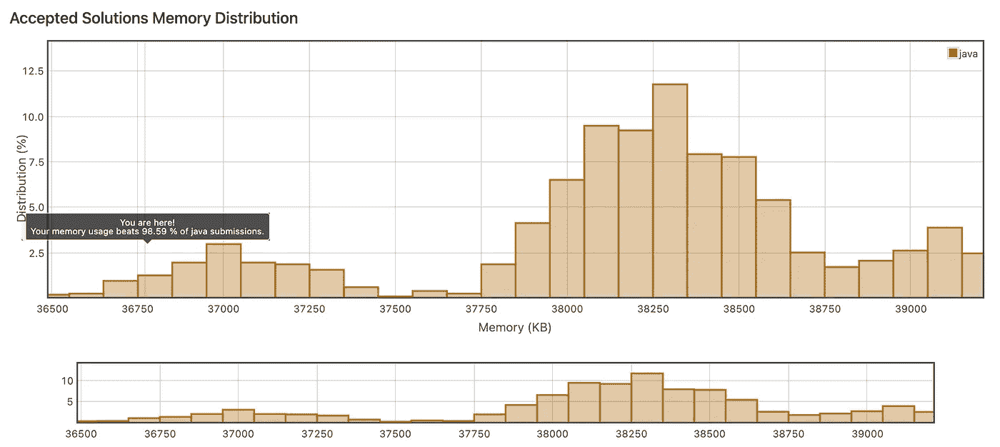

# 被低估的函数式编程之星。

> 原文：<https://medium.com/geekculture/bitwise-operators-the-underrated-stars-of-functional-programming-b159602adeae?source=collection_archive---------22----------------------->

如果你学过编程语言，按位运算符通常很早就出现了。毕竟，比特对于技术就像原子对于宇宙一样。

但是当你转向更多的功能方面时，按位操作符往往会退居幕后。按位“或”|“或”和“&”很少用于计算条件。可能有很好的理由。双操作符“||”和“&&”允许您简化计算，通过返回第一个匹配项(或不返回)来提高性能。大多数程序员基于这种短路原则来构建他们的代码和编写函数。

另一方面，按位条件不考虑顺序计算所有条件。从长远来看，这可能会很昂贵。但是，如果使用得当，位运算符可以显著提高性能，并有助于编写简洁的代码。

我们举个例子。这是 [Leetcode#250](http://eetcode.com/problems/count-univalue-subtrees) 。给定指向根节点的指针，问题要求你在二叉树中找到单值子树的计数。在递归 DFS 方法中，使用按位“|”运算符，可以计算一个节点的两个子节点及其子树，而如果其中一个条件失败，则不计算当前节点。

这个解决方案比所有其他提交快 100%,并且在内存使用上超过 98.59%。这是代码。

That’s an impressive performance.

好吧，这是一个为面试编造的问题！但是，在现实世界的编程场景中，您不仅可以基于所有或任何情况来评估条件，还可以通过确保被评估的每个函数都执行一次来触发二次可执行操作。

仅此而已！