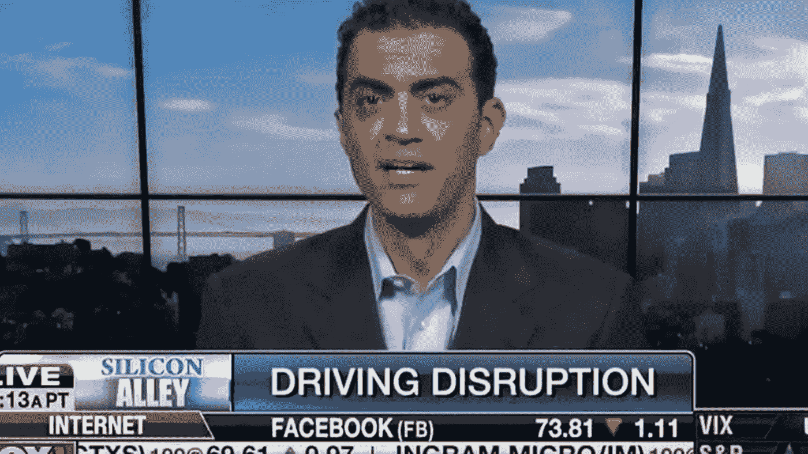
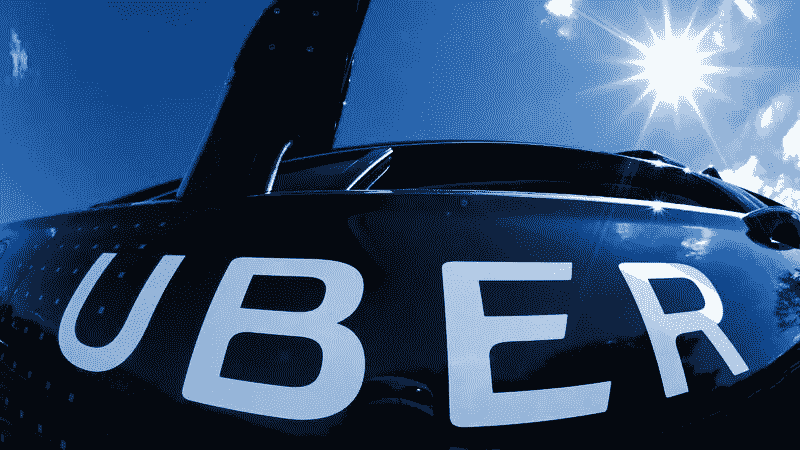

# 商业案例(1):优步侵入你的生活了吗？

> 原文：<https://medium.com/geekculture/bizcase-2-when-uber-exposed-ethics-b075dcdb7922?source=collection_archive---------5----------------------->

# 数据滥用是指以非预期的方式误用数据。

在 2014 年 11 月的一次私人晚宴上，Emil Michael 建议优步用 100 万美元的预算雇佣一个由反对派研究人员和记者组成的团队，去挖掘那些负面报道优步的媒体人物的个人生活和背景的丑闻。

Emil G. Michael was the Senior Vice President of Business at Uber.

这导致了公众对该公司的愤怒，促使该公司否认在任何情况下都不会进行这种手术，埃米尔不得不公开宣布他的歉意。

Emil 在 2017 年离开了优步，此前发生了一系列其他道德可疑案件，如在印度被询问一名强奸受害者的医疗记录。

Uber is one of the most sparking start-ups over business history

而在 2016 年，优步自己也震惊了世界，一些泄露的推文透露了一个(上帝之眼)系统，使许多员工能够监视和跟踪骑手的运动，尤其是名人，追踪他们的前伴侣和配偶。

优步已经向媒体发表声明:

> “**‘所有’或‘几乎所有’员工**无论是否经过批准，都可以访问客户数据，这绝对是不真实的。这不仅仅是基于‘荣誉系统’:我们已经建立了一个完整的系统来实施技术和行政控制，以限制需要它来完成工作的员工访问客户数据。”

用粗体字表示——优步似乎试图抹去一个事实，但没有成功，暗示着窥探消费者的行为以这样或那样的方式存在。

*_ _ _ _ _ _ _ _ _ _ _ _ _ _ _ _ _ _ _ _ _ _ _ _ _ _ _ _ _ _ _ _ _ _ _ _ _ _ _ _ _ _ _ _ _ _ _ _ _ _ _ _ _ _ _ _ _ _ _ _ _ _ _ _ _ _ _ _ _ _ _ _ _ _ _ _ _ _
* biz case 是关于商业领域发生的有趣新闻、事件、事情的简短剧集。*