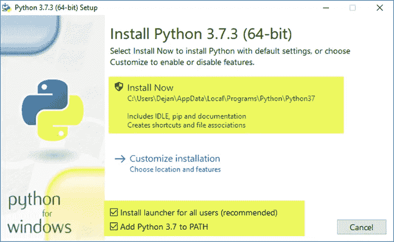
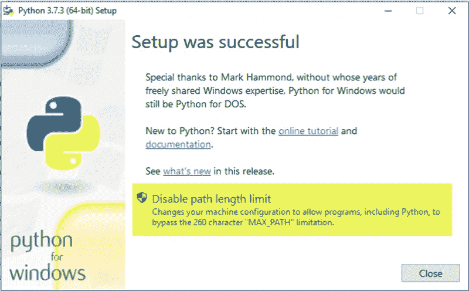
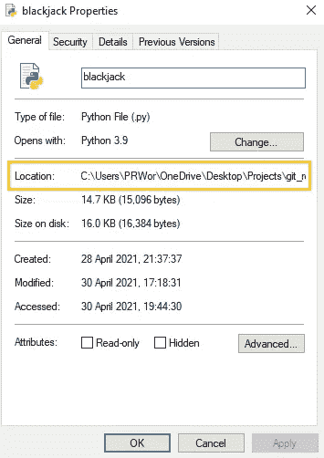
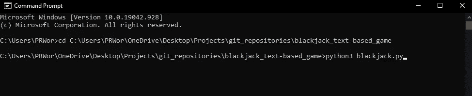

# 21 点下载&快速 Python 安装教程。Windows/Mac/Android

> 原文：<https://medium.com/geekculture/blackjack-download-quick-python-install-tutorial-windows-mac-android-246cc10310fd?source=collection_archive---------31----------------------->

对于那些已经知道如何运行 Python 的人来说，游戏下载在以下链接:[这里](https://github.com/Phill-inC0DE/blackjack_text-based_game/archive/refs/heads/main.zip)

您将看到“black jack . py”python 文件在文件夹中运行。

对于任何有经验的程序员来说，如果可能的话，我想在我的 GitHub repo 上回顾一下我的代码。我还建立了一个讨论区，如果你想问任何问题或者指出我的代码中的任何改动。我的 GitHub: [这里](https://github.com/Phill-inC0DE/blackjack_text-based_game)

现在来看教程…

# 步骤 1 |下载 Python:

对于那些不知道的人来说，Python 是一种允许我们人类与机器对话的编码语言。下载不会更改或损害您的电脑或电脑设置。单击下列选项之一:

对于 Windows:[python-3.9.4-amd64.exe](https://www.python.org/ftp/python/3.9.4/python-3.9.4-amd64.exe)

**对于 MAC OS:**[python-3 . 9 . 4-MAC OS 11 . pkg](https://www.python.org/ftp/python/3.9.4/python-3.9.4-macos11.pkg)

**对于 Linux:** *你真的应该知道…*

如果你不知道，这里有一个帮助链接:[在 Linux 上安装 Python 3](https://docs.python-guide.org/starting/install3/linux/)

**安卓手机(仅限):** [pydroid3](https://play.google.com/store/apps/details?id=ru.iiec.pydroid3)

我不确定苹果有哪些运行 python 的应用，你可以在应用商店里搜索到一个评价很高的应用。上面的 **blackjack.py** 文件的链接由于某种原因无法在手机上运行，所以我通过 onedrive 将它包含在一个共享链接中:[单击此处](https://1drv.ms/f/s!AjKsW6x6CaPfgZJoAP4W26Boty_qHw)

如果你想选择哪个 Python 版本，去看看他们的[网站。](https://www.python.org/)

# 步骤 2 |安装 Python:

1.  首先在你保存的位置找到下载的安装文件并双击。
2.  确保您选择了所有用户的**安装启动器**和**将 Python 3.7 添加到路径**复选框。后者将解释器放在执行路径中。
3.  选择**立即安装** —推荐安装选项。

4.下一个对话框将提示您选择是否**禁用路径长度限制**。选择此选项将允许 Python 绕过 260 个字符的 MAX_PATH 限制。实际上，它将使 Python 能够使用长路径名。

**禁用路径长度** **限制**选项不会影响任何其他系统设置。打开它将解决在 Linux 中开发 Python 项目时可能出现的潜在名称长度问题。

现在应该已经安装了 Python，如果你想对 Python 的安装有更复杂的理解，请访问这个[链接。](https://phoenixnap.com/kb/how-to-install-python-3-windows)

# 步骤 3 |运行 **blackjack.py** 程序:

1.  首先，从我的 GitHub repo 下载 zip 文件: [main.zip](https://github.com/Phill-inC0DE/blackjack_text-based_game/archive/refs/heads/main.zip)
2.  将文件保存在你记得的地方&下载后找到文件。
3.  右键点击文件，左键点击**全部提取。**
4.  浏览您想要放置解压缩文件的位置，然后按 **Extract。**
5.  找到提取的文件，并进入其中找到文件 **blackjack.py**
6.  对于初学者来说，最简单的方法是右键单击文件并转到**属性**选项。
7.  在这里，您将看到文件的详细信息，我们想要的是位置，您的位置与截图相比可能略有不同。

8.右键单击**位置**，按**全选。**

9.选定位置后，按住 **Ctrl** 并同时按下 **C** 。这将复制文件的地址位置。

10.接下来点击左边的 Windows 搜索栏，输入**命令提示符**，然后找到它，左键点击运行它。

11.从这里剩下要做的就是键入 **cd** 后跟一个空格，然后**右键单击它旁边的**，这将粘贴我们之前复制的地址。如果这不起作用，尝试 **Ctrl+V** 然后继续并点击回车。

12.现在剩下的就是输入 **python3 blackjack.py**

在你按下回车键之前，它应该是这样的…

如果是这样，请继续并按回车键。

# 现在你可以玩我的游戏了！！！呜！

# 21 点比赛详情

别忘了比赛，第一个达到 100，000 并在我的 GitHub 或博客上给我反馈的人赢得 50 比特币！请参见下面的详细信息…

> 赢得₿₿₿比特币！！₿₿₿
> 
> 周末，我将发布一篇博文，介绍我开发的基于文本的 21 点游戏。我花了 40 多个小时编写代码，这绝对是我经历过的最具挑战性的任务。
> 
> 我将包括一个链接，让你们所有人都可以下载文件，并保留一份副本免费播放！
> 
> 对于任何知道如何运行 python 文件的人来说，他们应该没有问题，但对于那些不知道的人，我将包括一个如何免费下载 python 到您的计算机的快速指南，然后是如何运行 Python 文件。最多需要大约 5 分钟。
> 
> 如果你帮我玩这个游戏，我挑战你找到任何错误，并达到超过 100，000(不是真钱)的游戏！如果你把金额截图发给我，然后在游戏 GitHub 页面的讨论区进行评论。我将奖励第一个这样做的人价值 50 英镑的比特币作为感谢！
> 
> 如果你想要任何额外的功能使游戏更有趣，让我知道，如果我认为它会成为游戏的一个很好的补充，我会试着根据你的需要定制它。
> 
> 我希望在周日之前完成博客页面，所以保持警惕。
> 
> 如果晚了，我会让你知道的。

赢家必须有一个 BTC 钱包地址来转移硬币。它们通常是免费下载的。

挑战结束后将很快宣布获胜者。