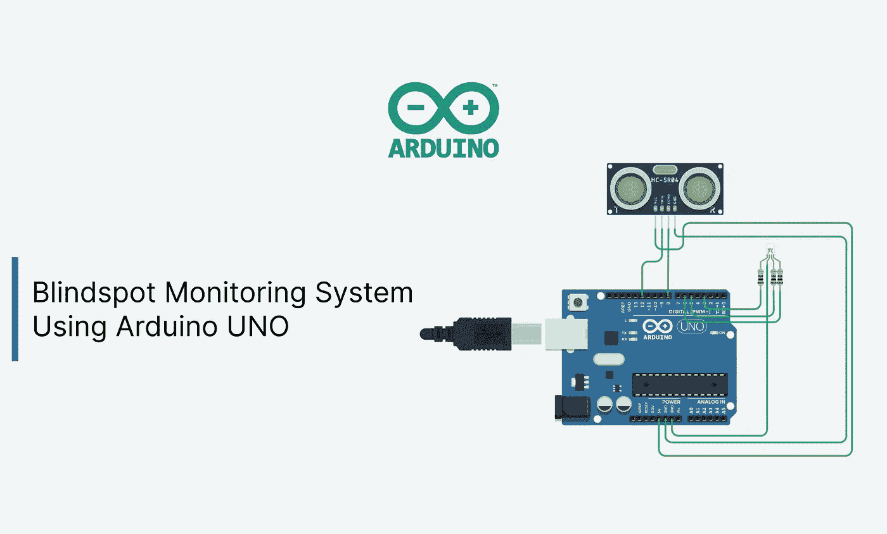
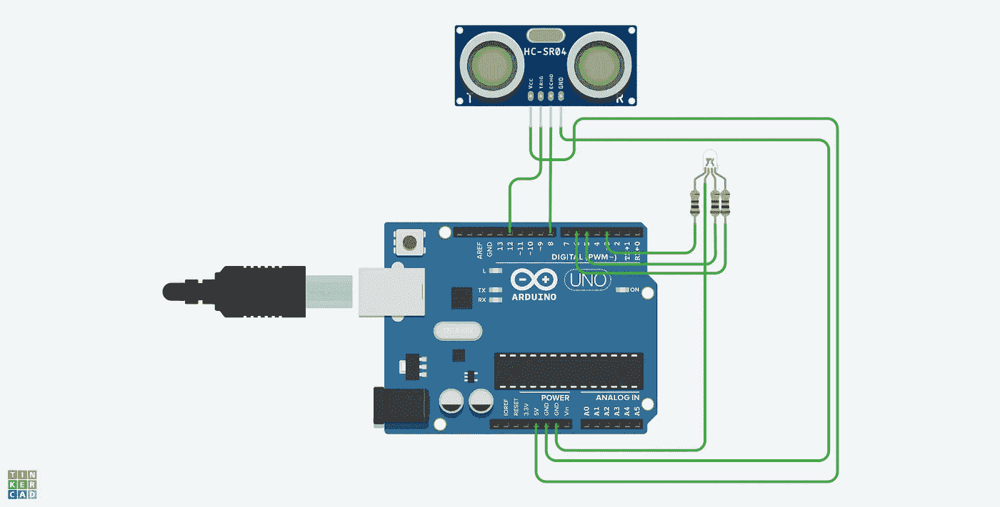
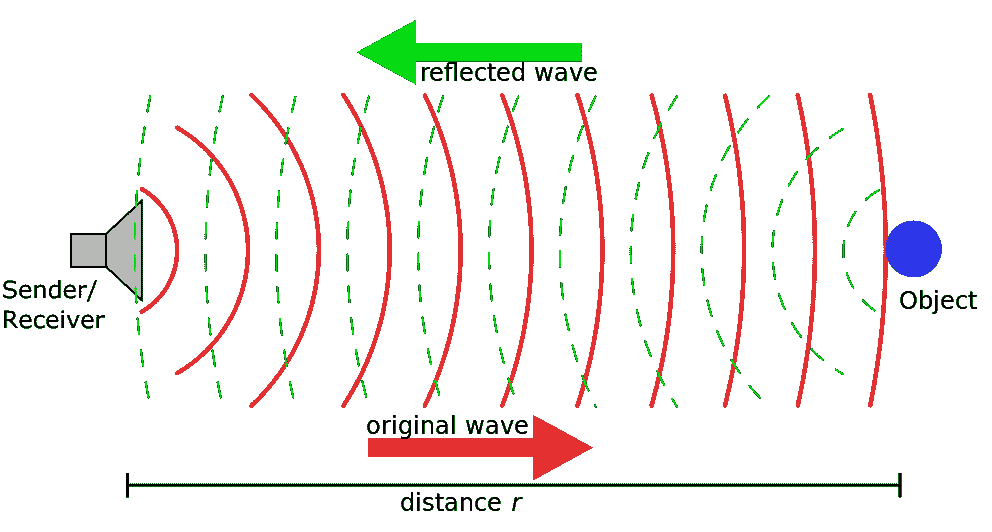
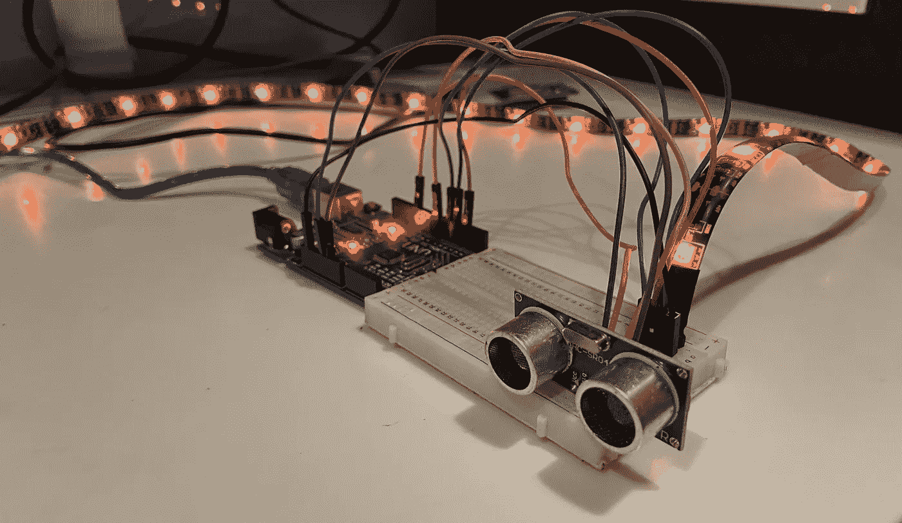
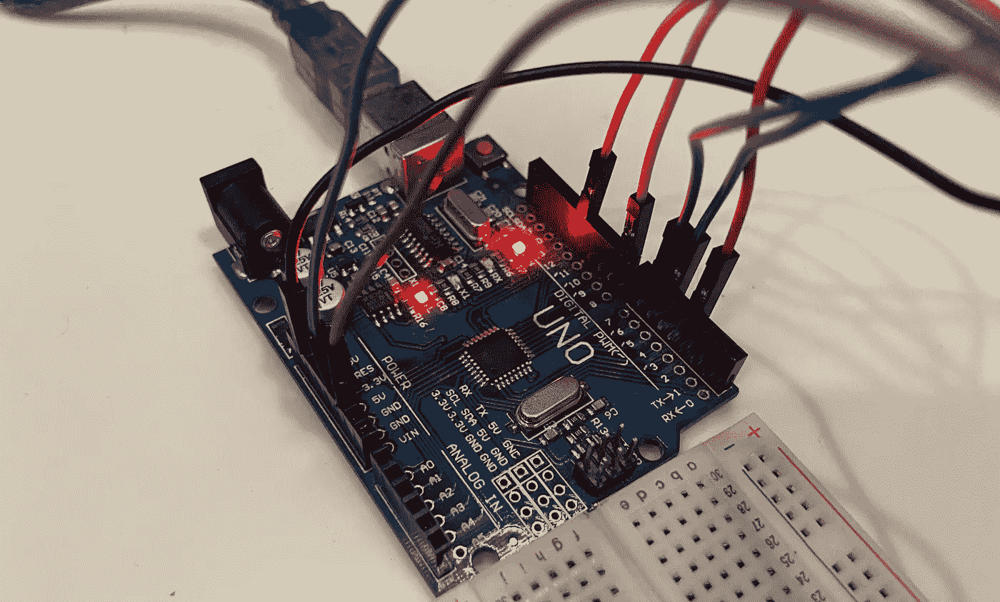

# 使用 Arduino UNO 的盲点监测系统。

> 原文：<https://medium.com/geekculture/blindspot-monitoring-system-using-arduino-uno-a5a8dd074280?source=collection_archive---------1----------------------->



我目前正在度暑假，我最喜欢的打发时间的方式之一是看 YouTube 上的汽车视频，这些视频是我永远也买不起的。当我在 YouTube 上浏览汽车评论时，我看到了对 2021 款奔驰 S 级的评论，并对一个漂亮的小功能非常着迷，其中车门侧的环境灯一旦检测到盲点中的汽车就会闪烁红色(我想是主动环境照明)。简单而有效——这就是德国工程。


Active Ambient Lighting on the Mercedes Benz S-Class.(Credits: Faisal Khan)

这是我正在看的[评论](https://youtu.be/safekQZPeaU?t=1273)的链接。

最近，我还尝试了 Arduino Uno，这是一种小型开发板，内置 AtMega328P 微控制器。由于我对 2021 款奔驰 S 级上的盲点警告系统非常着迷，我决定用 Arduino UNO 为自己建造一个。

## 组件和供应品

1.  Arduino Uno
2.  试验板(可选)
3.  RGB LED 灯条(≤1 米)
4.  HC-SR04 超声波传感器
5.  安装了 Arduino IDE 的笔记本电脑/台式机

## 电路设计



Note: I have used a single LED only for demonstration purposes as Tinkercad didn’t have a strip.

## 密码

这里是[代码](https://gist.github.com/Om-Kamath/a73fd38ea3b72feea18412af733d605a)的链接。

## 逻辑

1.  初始化引脚和触发距离。
2.  计算主体和对象之间的距离。
3.  将计算的距离与触发距离进行比较，并相应地闪烁颜色。
4.  在我的代码中，我将 LED 灯条设置为当物体在 30 厘米以内时闪烁橙色，当物体在 10 厘米以内时闪烁红色。当没有检测到物体时，LED 灯带会变成蓝色。你可以根据自己的喜好改变颜色。



Sonar Principle. Source: Dr. [Schorsch](https://commons.wikimedia.org/wiki/File:Sonar_Principle_EN.svg)

## 代码解释

**初始化变量和常量。**

首先，我们将需要初始化所有的变量和常数，我们将在以后的编码中使用。常量`g, b, r`用于定义 RGB LED 灯条的引脚。`echoPin`和`trigPin`是用于超声波传感器的常数。

*注意:我们在 Arduino 上使用 PWM 引脚来控制 LED 灯条的亮度。*

```
//initializing the rgb strip pins
#define b 6 
#define g 5 
#define r 3 //initializing the ultrasonic sensor pins 
#define echoPin 8
#define trigPin 12
```

由于盲点警告有两个阶段，我们必须初始化两个常量`trigDist1`(第一次触发)和`trigDist2`(第二次触发)。变量`duration`和`distance`将用于计算传感器和物体之间的距离。变量`fade`为布尔类型，将用于空闲时 led 的淡入效果。

```
#define trigDist1 30
#define trigDist2 10long duration;
int distance;

bool fade=true;
```

**设置**

一旦我们初始化了所有的变量和常量，我们将继续设置引脚模式，并以波特率 9600 开始串行。函数`setup()`将在编译完代码后首先执行(只执行一次)。

```
void setup() {
 Serial.begin(9600);  
 pinMode(g,OUTPUT);  
 pinMode(b,OUTPUT);  
 pinMode(r,OUTPUT);  
 pinMode(trigPin, OUTPUT);  
 pinMode(echoPin, INPUT);
}
```

**声明功能**

1.  `**calDistance()**`

计算主体和对象之间的距离。

```
void calDistance(){  
 digitalWrite(trigPin, LOW); 
 delayMicroseconds(2); 
 digitalWrite(trigPin, HIGH); 
 delayMicroseconds(10); 
 digitalWrite(trigPin, LOW); 
 duration = pulseIn(echoPin, HIGH); 
 distance = duration * 0.034 / 2; 
 Serial.println(distance);
}
```

`pulseIn()`等待引脚从`LOW`到`HIGH`，开始计时，然后等待引脚到`LOW`，停止计时。以微秒为单位返回脉冲的长度，如果在超时时间内没有收到完整的脉冲，则放弃并返回 0。

2.`**fadedRed()**`

该功能在脉宽调制和 for-loops 的帮助下，使 LED 灯条逐渐闪烁(脉冲动画)。第一个 for-loop 将逐渐增加 LED 的亮度，第二个 for-loop 将逐渐降低 LED 的亮度。`val`作为可以控制眨眼频率的参数。

```
void fadedRed(int val){ 
 for(int i=255; i>0; i-=val){    
  analogWrite(r, i);        
  analogWrite(g, 255);    
  analogWrite(b, 255);    
  delay(5); 
 }   
 for(int i=0; i<255; i+=val){   
  analogWrite(r, i);         
  analogWrite(g, 255);     
  analogWrite(b, 255);     
  delay(5);  
 }
}
```

> **注**:在我的 LED 灯带里，有一个阳极而不是阴极。因此，当阳极和 LED 引脚之间的电位差较大时，相应的 LED 就会亮起。所以，如果你想在 RGB 条上输出红色，你需要把所有其他颜色`HIGH`也就是 255 和`R -> LOW`也就是 0。

3.`**fadedOrange()**`

这个函数和上一个相似，尽管我花了很大的力气通过混合红色和绿色来生成橙色。它仍然不完美，但我通过使用三元运算符来限制绿色的百分比，尽了我的最大努力。如果你对此有更好的解决方案，请在评论区告诉我。

```
void fadedOrange(int val){ 
 for(int i=255; i>0; i-=val){     
  analogWrite(r, i);          
  analogWrite(b, 255);    
  analogWrite(g, i>230?i:230);    
  delay(5);  
 }   
 for(int i=0; i<255; i+=val){    
  analogWrite(r, i);         
  analogWrite(b, 255);    
  analogWrite(g,i<230?240:i);   
  delay(5);  
  }
}
```

4.`**fadeInBlue()**`

该功能不会使 led 闪烁，但为了从闪烁 led 过渡到静态 led，我使用布尔变量`fade`添加了一个渐变效果。这个变量将检查发光二极管是否已经变成蓝色，如果不是，那么它将变成蓝色。

```
void fadeInBlue(){  
 if(fade==true){   
  for(int i=255; i>0; i-=1){     
   analogWrite(g, 255);     
   analogWrite(r, 255);     
   analogWrite(b, i);      
   delay(5);    
  }  
 }  
 fade=false;  
 analogWrite(g, 255);  
 analogWrite(r, 255); 
 analogWrite(b, 0);
}
```

**在**中把一切都捆绑在一起`**loop()**`

一旦代码开始执行，就会重复执行。所有预先声明的函数都将在`loop()`中被调用。它将从计算距离开始。然后，它会将距离与触发距离进行比较，并输出适当的颜色。

```
void loop() {  
 calDistance(); 
 if(distance<=trigDist1 && distance>trigDist2){  
  fadedOrange(3);  
  fade=true; 
 }
 else if(distance<=trigDist2){  
  fadedRed(3);  
  fade=true; 
 } 
 else{  
  fadeInBlue(); 
 }
}
```

总的来说，这个项目的逻辑非常简单，代码很容易调整。

下面是该项目的**视频演示**:



Arduino with ultrasonic sensor and LED strip.



Arduino UNO

## 未来的改进

*   用 WS2812B 可寻址 LED 灯取代普通 RGB LED 灯。与 FastLED 库配对的 WS2812B LEDs 将实现一系列广泛的功能，如动态滑动模式，并且生成不同的颜色也将更加容易。

## 我为什么创建这个项目？

只是为了好玩。这是我有史以来第一个基于 Arduino 的项目，我想构建一些有趣的东西，我会彻底享受。汽车和技术是我最感兴趣的两个话题。此外，我已经很久没有写中型文章了，我觉得这是一个很好的项目，可以和大家分享。我希望这篇文章给你的生活增加了一些价值，并且你和我一样喜欢这个小而有趣的项目。如果你有任何与项目相关的疑问，请在评论区发表，我会尽力解决。再见。

如果你喜欢我的博客，你可以[给我买杯咖啡](https://www.buymeacoffee.com/omkamath?source=about_page-------------------------------------)。