# 使用 Julia 进行区块链分析

> 原文：<https://medium.com/geekculture/blockchain-analytics-using-julia-7bf76124a8f2?source=collection_archive---------10----------------------->

## 让我们解析一些块，并找出真正的内容

Photo by [Shubham Dhage](https://unsplash.com/@theshubhamdhage?utm_source=medium&utm_medium=referral) on [Unsplash](https://unsplash.com?utm_source=medium&utm_medium=referral)

理解区块链的工作原理可能很棘手，尤其是对初学者而言。许多受欢迎的区块链项目(如比特币、以太坊等。)已经存在，尽管它们在底层结构上可能有一些相似之处，但最终的实现可能会完全不同。关于这个主题有一些很好的文献，但是，我认为数据驱动的实践方法是真正满足好奇心的最好方法之一。

为此，我们将重点关注比特币，这是首批区块链项目之一，也可以说是最受欢迎的项目。其区块链的复杂性和绝对大小(约 424 GB)也是一个具有挑战性的数据科学问题。在本文中，我们将学习如何从原始数据块中解析和提取有价值的信息。我们将利用 [BTCParser.jl](https://github.com/gdkrmr/BTCParser.jl) ，一个纯粹用 Julia 编写的快速解析器。代码在 [Pluto.jl](https://github.com/fonsp/Pluto.jl) 笔记本中执行，可以从[克隆到这里](https://github.com/vnegi10/BTC_blockchain_analytics)。

# 获取原始数据

比特币区块链可以在你的本地电脑上下载。为此，首先你需要使用[比特币核心](https://bitcoin.org/en/bitcoin-core/)运行一个完整的节点。一旦 GUI 启动，该软件会将整个区块链的副本下载到您的磁盘上。这意味着您将拥有从第一个区块(2009 年开采)开始的数据，也称为 genesis 区块。默认下载位置通常在`~/.bitcoin/`，但是您可以自由选择另一个位置。请记住，您需要大约 424 GB 的空间(截至 2022 年 4 月 11 日),以防您需要最新的数据块。您也可以提前停止同步，在这种情况下，您将只有该特定时间点之前的数据。这是获取真实可靠数据的推荐方式，因为数据是从一组可信的对等点获取的，这些对等点通常是运行在世界各地计算机上的其他节点。不要相信任何其他来源是明智的。然而，如果你真的没有耐心，你可以从一个朋友的本地节点复制数据。

初始同步可能要求很高，无论是在电脑上还是在网络上。在我的台式电脑上，我配备了锐龙 5 3600、快速 PCIe gen3 NVMe 固态硬盘和 32 GB 内存(16 GB 分配给比特币核心的 dbcache 以加速同步)，花了大约四个小时才达到最新的块高度。

# 解析块

[BTCParser.jl](https://github.com/gdkrmr/BTCParser.jl) 尚未注册。有两种方法可以使用该软件包:

*   在您的系统上克隆存储库，然后执行:`Pkg.add("<your path>").`我还在包源代码中硬编码了我的区块链数据目录的定制路径。
*   直接从资源库添加:`Pkg.add("https://github.com/gdkrmr/BTCParser.jl")`

解析将在 **blk*上完成。位于**块**文件夹中的 dat** 文件。该目录的当前大小约为 424 GB(检查日期为 2022 年 4 月 11 日),并且预计会随着时间的推移而增长。我 PC 上的磁盘 IO 相当快！即便如此，解析所有数据也需要大约 10-12 分钟。

比特币区块链是一个分布式账本，包含有序的区块序列。块数据(用于解析)是网络格式，包含关于块散列、输入/输出事务、块奖励、时间戳、难度等信息。我们可以遍历类型为`BTCParser.Chain`的`chain`对象，这对于收集所选块的统计数据非常方便。注意，索引从 0 开始(这与 Julia 不同)，以保持与区块链实现的一致性。

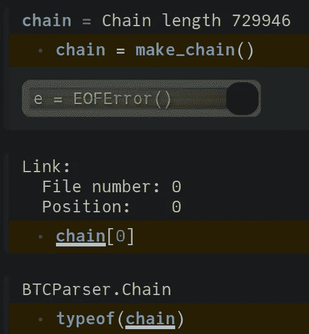

Parsing chain data and checking object type

链的大小等于找到数据的块数。如果我们继续同步本地节点，大小会增加，因为大约每 10 分钟就会添加一个新块。一旦同步完成，我们将拥有数据，直到具有最新*高度*的块。在这里，块*高度*简单地指链上距离 w.r.t .到 genesis 块。

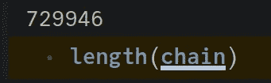

# 收集有用的信息

通过迭代选择的块，我们可以收集相关信息，并使用以下函数将其存储在数据帧中:

此处显示了一个示例数据帧:

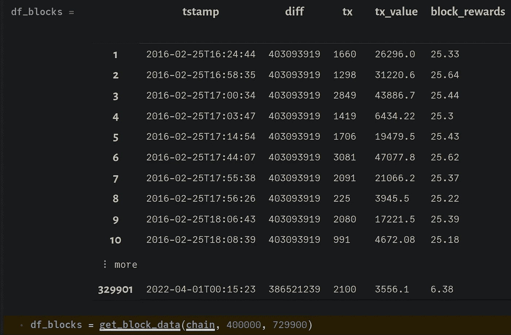

DataFrame with information for block numbers 400000 to 729900

在 **df_blocks 中，tstamp** 指的是块的创建时间， **diff** 是目标难度， **tx** 是块中包含的事务数量， **tx_value** 是通过使用下面所示的函数对给定块中的所有输出求和而获得的总事务值。

我们的最后一列是 **block_rewards** ，这是每个区块创造的新硬币和相关交易费用的总和。请注意，基本单位是 Satoshis，其中 1 比特币= 10⁸ Satoshis。每个区块的奖励和交易费归成功验证并将相应区块添加到区块链的矿工所有。这种机制对利用自己的资源来帮助保护网络的矿工来说是一种财务激励。关于如何管理奖励的更多细节可以在[这里](https://en.bitcoin.it/wiki/Controlled_supply)找到。

# 每日块数据

我们的原始数据帧包含时间间隔约为 10 分钟的数据块。为了形象化，查看每天的时间间隔更有意义。因此，我们将组合给定日期的块数据，并创建一个新的数据帧。

我们的示例数据帧将如下所示:

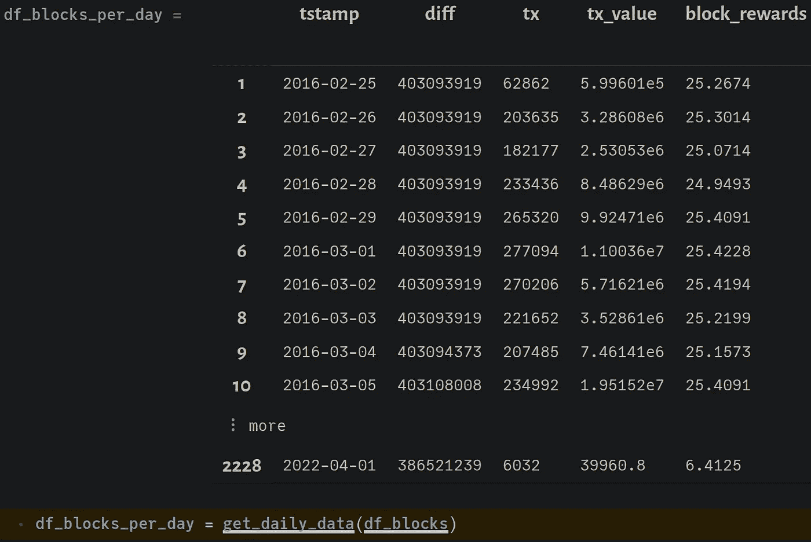

DataFrame condensed into daily data

Pluto.jl 最棒的一点是能够设置交互式过滤器。

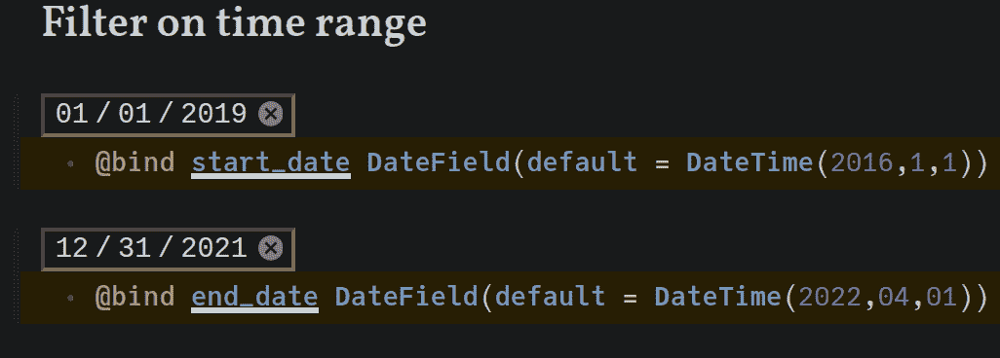

Interactive selection for dates

我们可以根据所选的时间范围过滤 **df_blocks_per_day** ，如下所示:

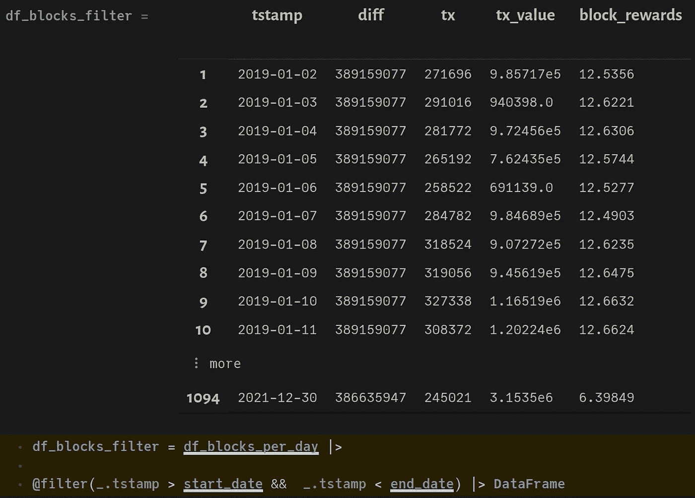

Filtered DataFrame

# 交易数量

我们现在可以使用 [**VegaLite.jl**](https://github.com/queryverse/VegaLite.jl) 包中的 **@vlplot** 宏来绘制给定时间范围内的每日事务数。

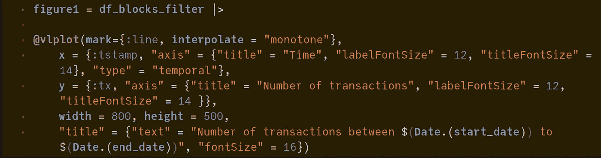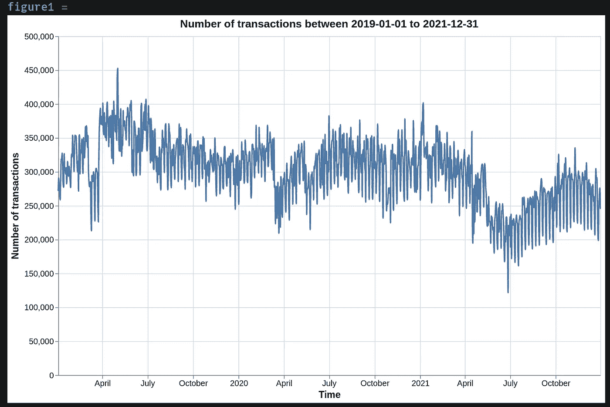

# **总成交金额**

与前面的例子类似，我们也可以看到每天交易的比特币总量。

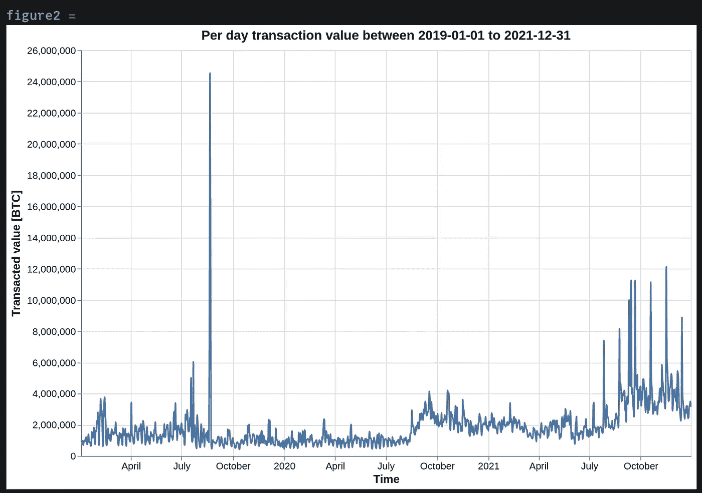

与前几年相比，2021 年下半年的平均交易活动似乎更高。这可能是由于交易导致的有利价格行为。在 2019 年期间，似乎还有一个数据点出现了巨大的峰值。我们可以通过我们的数据框架进行过滤，以准确定位这种情况发生的日期(2019 年 8 月 21 日)。

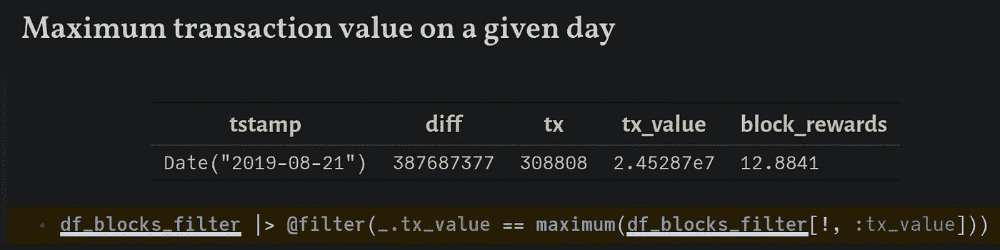

# 平均阻塞时间

使用时间戳，我们可以计算连续块之间经过的时间。比特币网络调整难度，平均 10 分钟左右生成一个区块。因为难度调整不是瞬间的，所以也有持续时间更短或更长的区块。当网络速度显著增加，难度逐渐调整到一个更高的值时，块将更快地生成。相反，网络散列值的突然下降会增加块生成时间，直到难度重新调整到一个较低的值。

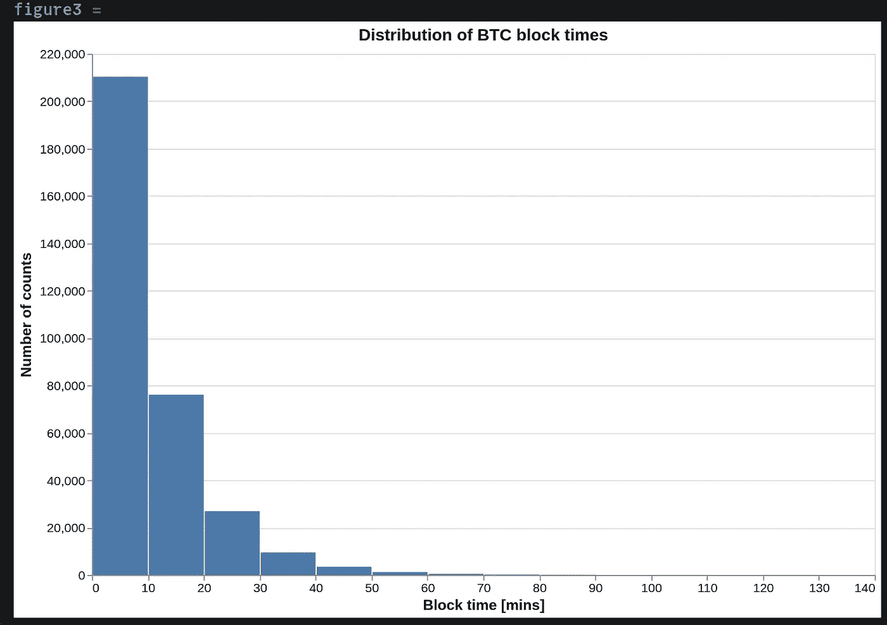

事实上，我们的样本时间范围内的大多数块都是以大约 10 分钟的平均持续时间生成的。

# 阻止奖励

比特币协议在每个区块发行固定数量的新币，与交易费一起作为对矿工的激励。创世积木的奖励从 50 个硬币开始。它被编程为每 210，000 个数据块减少 50%，这大约需要 4 年时间。这就是俗称的*减半*。通过绘制**块 _ 奖励**列 w.r.t. **tstamp，**我们可以可视化减半事件何时发生。如下图所示，到目前为止已经发生了 3 次减半事件(50–25–12.5–6.25)。

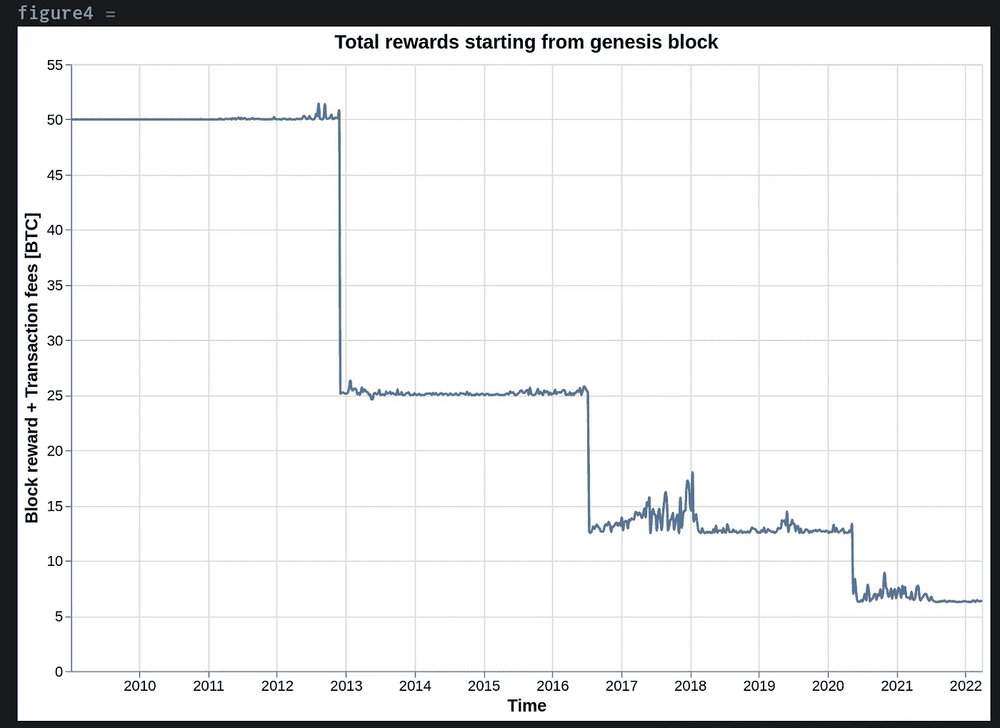

如果你仔细观察，你会发现在某些时间段(如 2017–2018 年，2020 年年中至 2021 年年中)，总奖励明显高于块奖励。这意味着交易费在大宗报酬中的贡献高于通常水平。看历史价格图，比如这里的[这里的](https://bitinfocharts.com/comparison/bitcoin-price.html#alltime)，和价格有明显的相关性。随着价格的上涨，人们开始更频繁地进行交易，这导致了网络拥塞。在这种情况下，您最终要支付更高的费用来确保您的交易包含在一个块中。很迷人，不是吗？

# 结论

区块链正在成为 Julia 快速和可扩展的数据科学图书馆的一个令人兴奋和具有挑战性的游乐场。我希望你在看完这篇文章后学到了一些有价值的东西。感谢您的宝贵时间！如果你想联系，这是我的 LinkedIn。

# 参考

1.  [https://files . ifi . uzh . ch/CSG/staff/scheid/extern/themes/BA-D-Sommer . pdf](https://files.ifi.uzh.ch/CSG/staff/scheid/extern/theses/BA-D-Sommer.pdf)
2.  [https://bitcoindev . network/understanding-the-data/](https://bitcoindev.network/understanding-the-data/)
3.  [https://en . bitcoin . it/wiki/Controlled _ supply # What _ happens _ when _ all _ the _ bit coins _ are _ mined . 3f](https://en.bitcoin.it/wiki/Controlled_supply#What_happens_when_all_the_bitcoins_are_mined.3F)