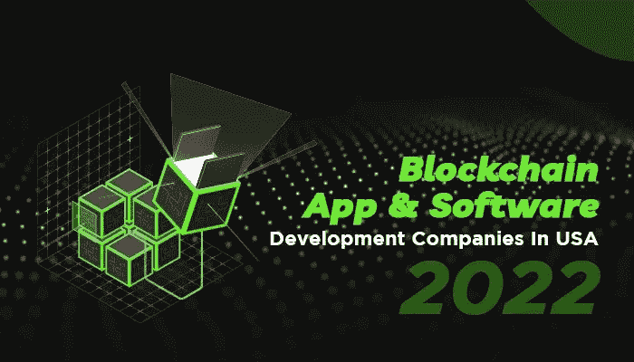

# 美国加利福尼亚州顶级区块链应用和软件开发公司

> 原文：<https://medium.com/geekculture/blockchain-app-software-development-companies-in-usa-a24d9c9efc7?source=collection_archive---------15----------------------->

来自美国的区块链开发 IT 公司在将技术与全球业务整合方面发挥着重要作用。在这篇文章中，我们列出了各种初创公司以及在美国提供有前途的区块链开发服务的老牌 IT 公司。我们列出的所有区块链发展公司都来自美国，属于不同的城市，如纽约、三藩市、加州等。

这些美国的区块链技术公司凭借其多年的经验和专业知识，为全球客户提供一流的软件开发解决方案和服务。

# 2023 年加州顶级区块链应用和软件开发公司列表

## #1. [Suffescom 解决方案](https://www.suffescom.com/blockchain-development) —最佳区块链应用开发

Suffescom Solutions 是一家值得信赖的美国区块链开发公司，拥有超过 10 年的经验。这家 IT 公司为全球的企业和初创公司提供端到端的区块链开发服务。他们的开发团队了解区块链领先技术的来龙去脉，如人工智能、机器学习、聊天机器人、AR、VR 等。该公司利用其区块链和软件开发专业知识，通过数字解决方案为客户获得最佳投资回报。

## 2.[Appinventiv](https://appinventiv.com/blockchain-application-development/?utm_source=Medium&utm_medium=refferal&utm_campaign=Blockchain&utm_term=Appinventiv&utm_content=Top_Blockchain_App_Software_Development_Company_In_California_USA)

Appinventiv 是一家一站式数字化转型推动者，拥有 1000 多名敏捷开发人员，他们配备了移动、AR/VR、区块链、云和 DevOps、Web、数据和分析领域的尖端技术。

凭借以客户为中心和以设计为导向的工程方法，他们为全球客户提供了愿景，包括美国运通、沃达丰、毕马威、亚洲银行、阿联酋银行、维珍集团、阿迪达斯、Americana Group 和 Bodyshop，提供了帮助他们数字化转型和扩大运营规模的解决方案。

在过去的 7 年多时间里，他们为我们尊敬的客户提供服务，从初创公司、专注于数字的企业到财富 500 强公司，涵盖金融科技、健康科技、食品科技、媒体、OTT、商业和教育科技等领域。他们以成为领先印度企业首选的数字化转型合作伙伴而自豪，同时加强了我们在美国、中东和北非地区、澳大利亚和欧洲的业务，以及卡塔尔和印度政府的公共部门实体。

## #3. [RisingMax](https://risingmax.com/blockchain-technology-company) 区块链软件开发公司

RisingMax 是一家来自美国纽约州的高级区块链开发公司。该公司已成功向医疗保健、金融、电子商务、房地产等领域的客户交付了 250 多个应用。RisingMax 提供定制开发、app 开发、咨询、智能合约开发等开发服务。开发团队遵循定制的开发流程，并为您的项目提供关于最佳技术堆栈的反馈。凭借他们的创新、奉献和卓越的开发服务，这家来自美国的 IT 公司帮助世界各地的企业实现盈利性增长。

## #4.[bestblockschaindevs](https://services.bestblockchaindevs.com/)

最好的区块链开发者为他们全球的客户提供顶尖的开发和商业解决方案。这家 IT 开发公司成立于 2012 年，现已发展成为 IT 项目开发和业务咨询的一站式目的地。Best Blockchain Devs 聚集了一些业界最优秀的全栈开发人员、软件工程师、业务分析师、前端工程师、UX/UI 设计师和项目经理。他们凭借在开发全球解决方案方面的专业知识，巧妙地引导客户完成数字化之旅。

## #5.[智软](https://blockchain.intellectsoft.net/)

Intellectsoft 是一家区块链开发和 IT 咨询公司，为全球组织提供尖端的 web 和移动解决方案。IT 公司提供诸如全栈开发、技术咨询、UX/UI 设计、系统集成、区块链应用架构等服务。Intellectsoft 专注于通过创新的技术解决方案引领数字时代，无论是企业解决方案还是面向消费者的应用。

## #6. [AppsChopper](https://www.appschopper.com/) —美国区块链应用开发者

AppsChopper 是一家总部位于纽约的老牌移动和网络应用开发公司。区块链专家成立于 2011 年，已经为不同垂直行业的客户开发了许多高性能、可扩展、定制和安全的解决方案。来自美国服务组合的 IT 公司包括 UI/UX 设计、网络/移动战略咨询、[渐进式网络应用](https://docs.microsoft.com/en-us/microsoft-edge/progressive-web-apps-chromium/)，以及物联网、可穿戴、AR & VR 等技术的智能实现。

## #7.[芝士蛋糕实验室](https://cheesecakelabs.com/en/)

Cheesecake Labs 是一家来自美国旧金山的软件设计和开发公司。该公司利用其在最新技术方面的专业知识，帮助不同垂直行业的客户开发一流的商业软件解决方案。芝士蛋糕实验室的软件工程师和专家提供端到端的软件解决方案，从构建到提供售后支持。多年来，他们已经获得了包括区块链开发、JavaScript、Java、PHP、Nodejs 和 Reactjs 在内的优势。

## #8. [Talentica 软件](https://www.talentica.com/)

Talentica Software 是一家位于区块链的开发公司，主要专注于受资助的初创公司和高增长公司。多年来，该公司已成功帮助全球 170 多家企业开发和部署尖端解决方案。开发人员帮助企业在其业务中开发和集成下一代软件解决方案。这家 IT 公司拥有技术专长，包括人工智能、ML、区块链、[、大数据](https://www.oracle.com/in/big-data/what-is-big-data)、DevOps、物联网、AR、VR、RPA、UX/UI 等。

## #9.[unisoft](https://unicsoft.com/)

Unicsoft 是一家可靠的区块链开发和咨询公司，为全球的初创公司和企业提供商业解决方案。该公司的专业领域包括区块链、人工智能、人工智能、NLA、大数据、智能合同、数据分析领域等。Unicsoft 通过透明的定价政策、及时的沟通和敏捷的开发流程来满足客户的期望。

## #10.[ideal logic](https://idealogic.dev/)—区块链软件开发公司 2023

Idealogic 成立于 2016 年，是一家全周期开发公司，擅长产品设计、区块链开发、质量保证和发布后支持。这家软件开发公司聚集了一些业内最好的 UI/UX 设计师、BA、项目经理、软件工程师和 QA 专家，他们致力于您的项目，将您的想法变为现实。他们的开发团队精通主流编程语言，如 [Javascript](https://www.javascript.com/) 、Reactjs、Nodejs、React Native、Python、Swift、solidity、Hyperledger Fabric、EOS、Stellar 等。

## #11.[网络软件解决方案](https://www.netsetsoftware.com/)

NetSet Software Solutions 是一家领先的区块链开发公司，专注于构建下一代商业解决方案。该开发利用其在领先技术和商业战略方面的专业知识，将现代技术无缝集成到企业中。在他们 10 多年的开发公司经验中，他们成功地满足了初创企业、中型企业和大型企业的需求。

## #12. [RWaltz 集团有限公司](https://www.rwaltz.com/)

RWaltz Software 成立于 2000 年，是一家领先的区块链开发服务提供商公司，总部位于美国亚特兰大。该公司利用其人工智能、人工智能和区块链技术专业知识，为其全球客户开发下一代解决方案。RWaltz 的开发团队提供关于技术堆栈的反馈，并为特定项目实施最佳区块链开发流程。该公司的专业领域包括 web 和移动开发、dApps、AI/ML 工具、[加密钱包开发](https://www.suffescom.com/cryptocurrency-wallet-development)、ICO &智能合约开发等。

## #13. [App Maisters Inc](https://www.appmaisters.com/) —最佳区块链应用开发公司

App Maisters Inc .是美国一家历史悠久的区块链开发公司。这家来自美国的 IT 公司一直积极参与为初创公司、企业和政府机构开发最先进的业务解决方案。该公司的专业知识包括移动和 web 应用开发、区块链、人工智能、物联网、商业智能、企业应用和集成、dApps 等。8 年多来，该公司已经为美国、欧洲、澳大利亚和中东的数百家客户构建了软件解决方案。

## #14.埃尔纳

Errna 是一家来自圣何塞的高级区块链开发公司，为全球企业提供定制开发服务。他们的开发团队在领先的分布式分类帐技术方面拥有实践经验，包括 Hyperledger、Ethereum、R3Corda 和 Hashgraph。凭借对 [AI](https://builtin.com/artificial-intelligence) 、物联网、区块链、[云](https://aws.amazon.com/what-is-cloud-computing/)服务和 ML 的深刻理解，他们已经为全球客户成功交付和部署了 100 多个企业解决方案。

## #15. [Velvetech LLC](https://www.velvetech.com/)

Velvetech LLC 成立于 2004 年，是一家屡获殊荣的区块链和定制软件开发公司。该公司聚集了一些最优秀的区块链专家、开发人员、业务分析师和软件工程师，他们虔诚地为客户项目工作。Velvetech 正在帮助企业提高业务效率、制定决策、支持投资回报率，并轻松实现业务目标。这家来自美国的 IT 公司遵循透明的定价政策，以确保没有隐藏的费用和最大限度的客户满意度。

## #16.[重塑](https://reinvently.com/) —顶级区块链软件开发解决方案

Reinvently 是美国加州最好的区块链发展公司之一。多年来，这家软件开发公司已经成功地帮助初创企业和中型企业在其业务中开发和集成了最新的技术。该 IT 公司遵循以客户为中心的业务解决方案开发方法来实现成功和客户满意度。多年来，该公司采用了敏捷开发方法和比大多数解决方案提供商更具创新性的解决方案。

## #17.[研究所](https://www.instinctools.com/)

Instinctools 是一家领先的区块链开发公司，以采用最新的技术趋势而闻名，如 [dApps](https://ethereum.org/en/dapps/) 开发、 [NFT 游戏开发](https://makeanapplike.com/best-nft-game-development-companies/)、分散交换、智能合同开发等。他们的服务包括全周期软件开发、云计算、DevOps 服务、大数据&商业智能等。

## #18. [Dash Technologies](https://dashtechinc.com/)

Dash Technologies 成立于 2010 年，是美国俄亥俄州发展最快的区块链和应用开发公司。该 IT 公司通过了 ISO 9001 认证，遵循行业最佳开发标准、软件解决方案和业务模式，以提高整体业务效率和运营。他们提供软件咨询和开发服务，为客户提供卓越的成果。凭借他们在人工智能、 [ML](https://developers.google.com/ml-kit) 、区块链和领先技术栈方面的专业知识，他们为客户提供成功和未来的商业解决方案。

## #19.[阿库德科技](https://www.akoode.com/) —区块链发展公司

Akoode 是一家多才多艺的区块链开发公司，提供从构建 it 到售后支持的端到端业务解决方案。这家软件开发公司提供全天候支持和灵活的定价模式来满足客户的需求。来自美国的区块链开发公司将结构化和非结构化数据转换为精确数据，以帮助客户了解什么对业务最有利。该公司的用户群主要来自美国、北美、欧洲和亚太地区。

## #20.[申请](https://applicature.com/)

自 2011 年以来，Applicature 一直是区块链最好的开发公司，生产最值得信赖的区块链项目和加密货币解决方案，以帮助区块链的初创公司和公司实现他们的目标。营销、技术战略、创意、白皮书、令牌机制、区块链架构、一套令牌化[智能合约](https://www.ibm.com/topics/smart-contracts)、投资者仪表盘以及定制区块链解决方案，这些都是 Applicature 团队擅长的领域。

## #21.[quanteral](https://www.quanterall.com/)

Quanterall 专注于开发高度可扩展的、无缺陷的、端到端的定制业务和企业软件解决方案。自 2016 年成立以来，这家区块链和应用开发公司已为金融科技、电信、医疗保健、保险、自动售货、零售、通信等不同领域的客户提供服务。这家 IT 公司的技术团队由 90 多名工程师组成，他们精通领先的区块链技术，如人工智能、人工智能、区块链技术、增强现实、虚拟现实、物联网、人工智能聊天机器人、 [RPA](https://www.ibm.com/cloud/learn/rpa) 等。