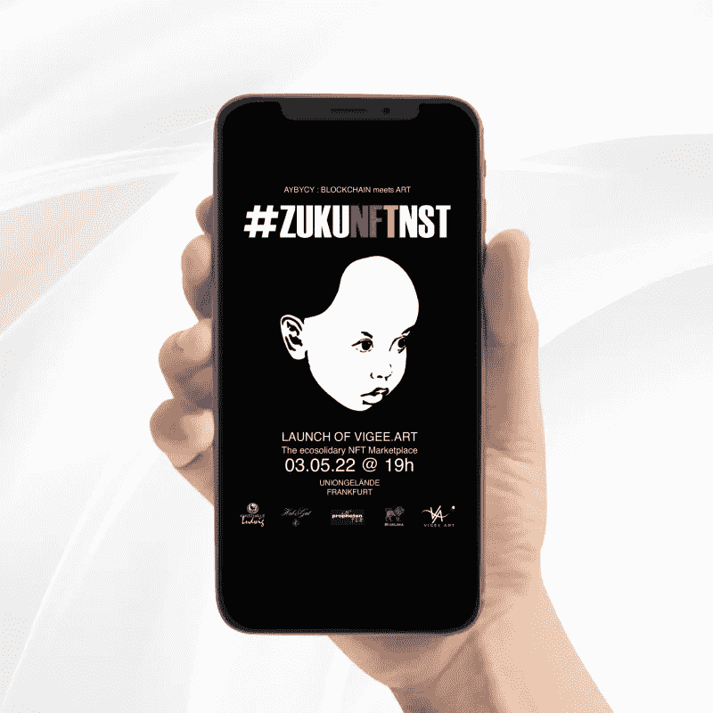
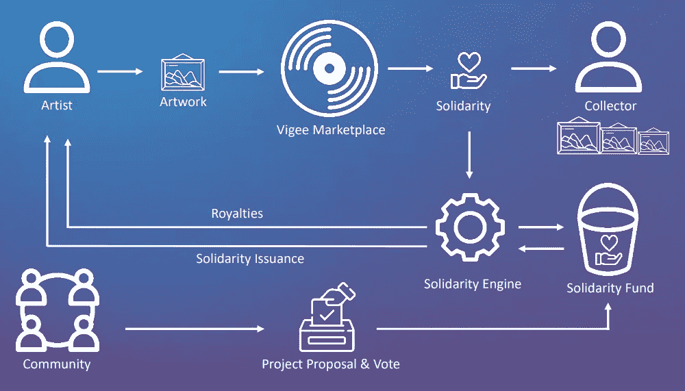

# 基于区块链的 NFT 社区由 Algorand 提供支持

> 原文：<https://medium.com/geekculture/blockchain-based-nft-community-powered-by-algorand-6a1fa69ce44?source=collection_archive---------5----------------------->

## 开发位于区块链的 NFT 艺术品交易市场，通过各种文化活动支持艺术家和创作者。

[维吉。Art](https://vigee.art/) —世界上第一个以社区和团结为重点的 NFT 艺术品交易市场。这个平台的独特之处在于它创造了一个社区的概念，在这个社区里，所有的艺术家都可以提议并投票支持不同的艺术项目。

# 挑战

由于疫情，音乐会、画廊和展览等公共场所和活动完全关闭。许多艺术家失去了主要收入来源，被迫寻找其他方式出售他们的艺术品。那时，不可替代的令牌(现在称为缩短的 NFT)开始以指数形式流行起来。

我们的客户希望为分享观点的艺术家创建第一个基于社区的市场，因此要求我们的团队帮助开发和推出 NFT 平台。

量子 T2 的任务是与维吉合作。艺术团队和发展不仅仅是一个基本的市场，而是一个艺术家的社区。

# 解决办法

维吉。艺术平台诞生于一个基于艺术家社区团结的生态系统的理念。社区成员不仅能够在拍卖会上展示和出售他们的艺术品，而且能够通过各种文化活动相互支持。

开发该平台时，我们满足了特定的要求:

—标记和出版艺术品的低费用
—快速和安全的交易
—避免潜在的 NFT 艺术品复制
—可持续的区块链技术，不需要大量的电力来采矿

考虑到我们的所有要求，我们决定在 Algorand 平台上建立市场。Algorand 满足了我们的所有需求:它是一个完全碳中和的区块链网络，拥有区块链最低的交易成本，使用纯粹的利害关系证明协议来验证其安全性，每秒钟可以进行数千次交易，并且零宕机。

对于智能合约集成，我们的团队使用 PyTeal python 库来简化更复杂逻辑的实现。

# 技术细节

为了开发前端部分，确切地说，我们使用了 JavaScript 或其 React.js 库。后端开发基于 NodeJS 框架 NestJS 使用 Typescript 进行。

市场建立在阿尔格兰德区块链网络的基础上。

平台开发中使用的其他工具是数据库:
— NFT。IPFS 上的存储(为不可替换的令牌存储和寻址数据)。
— Couchbase(存储交易信息。例如:铸造、上市、投标、购买组件)。
— Cloudflare(存储图片的缩小版)。

