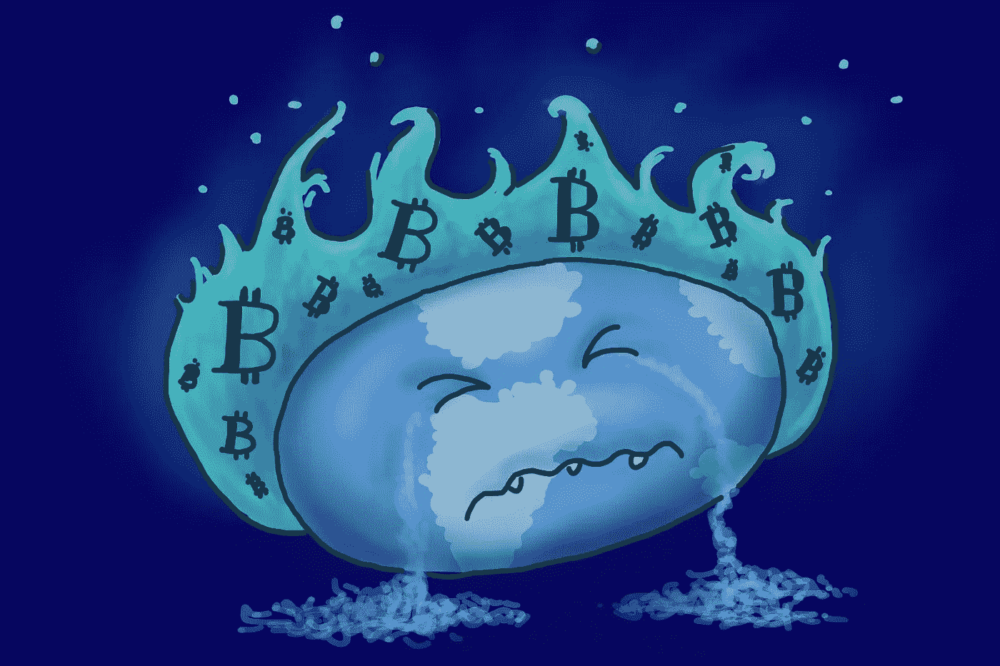

# 区块链真的可以让互联网变得更好。如果不先破坏环境

> 原文：<https://medium.com/geekculture/blockchain-could-really-make-the-internet-a-better-place-if-it-doesnt-ruin-the-environment-first-c65e5ea80?source=collection_archive---------15----------------------->

## 它的设计原则让人们充满希望

If we’re not careful, blockchain will make carbon emissions much, much worse.

如果你在过去的几年里没有生活在岩石下，你肯定听过互联网大师告诉你区块链技术将如何改变你的生活。