# 如何用 Python 创建区块链

> 原文：<https://medium.com/geekculture/blockchain-explained-and-how-to-create-d897bc20db64?source=collection_archive---------15----------------------->

Picture Credit: [Pierre Borthiry](https://unsplash.com/@peiobty) on [Unsplash](https://unsplash.com/)

所以耶！现在轮到你和我，讨论互联网上最热门、最流行、最老套的话题。如果你以前听说过这个术语，你会觉得有点不安全，因为你不知道它到底是什么。

不管怎样，让我们讨论一下“区块链”。并回答一些问题，比如，什么是区块链？它是如何工作的？有什么不同？它解决什么问题？我为什么要关心这个？

我在文章末尾回答了一个加分题，所以一定要看完整篇文章。bee-hook！！！

# 什么是区块链？

这是许多加密货币所基于的底层技术，被认为是 21 世纪最重要的发明之一。

## 根据谷歌的说法:

“在一个系统中，用比特币或另一种加密货币进行的交易记录在几台连接在对等网络中的计算机上进行维护。”

## 据我说:

一个**线性块链**，每个**块**包含一些信息。该链是不可变的，这意味着没有人能够偷偷溜进来并改变任何块中的数据。

我的稍微容易一点，对吗？😄

# 它是如何工作的？

区块链，顾名思义，是由多个区块链接在一起形成一条链。

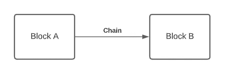

每个块通常包含以下信息:

*   **数据**:这可以是任何类似交易数据的东西。
*   **哈希值**:这基本上就是块的 ID。
*   **前一个哈希值**:跟踪前一个块 ID。现在，你只需要知道我们使用这个值在当前块和前一个块之间形成一个链。我将在本文的后面解释为什么这个值很重要。
*   **时间戳**:这告诉我们块是何时创建的。
*   **工作证明**:这是一个数字，表示找到当前块的哈希值所付出的努力。如果你听说过挖掘，这个值代表机器计算散列值需要多长时间(以数字的形式)。

在现实世界中，块要比这复杂得多，但我想保持简单:)

让我们进入有趣的部分，编码！

在我们开始之前，我想指出，如果你了解一些基本的编程，这篇文章会更容易理解。但是，如果你不担心，因为我会尽力详细解释每一段代码。

# 让我们用 Python 创建一个区块链

## 导入必要的模块

让我们在`blockchain.py`的顶部导入一些模块

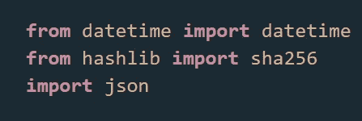

## 创建块类

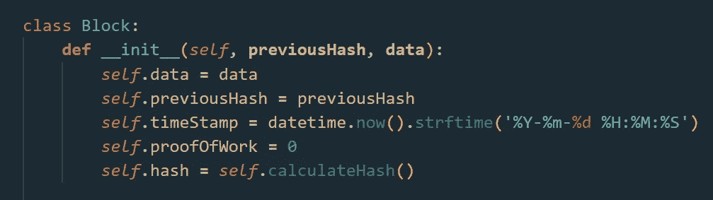

这个类接受两个参数。第一个是前一个块的哈希值，第二个是当前块的数据。

在`__init__()`函数中，我们用构造函数参数初始化块数据。我们将`timeStamp`设置为当前时间，将`proofOfWork`设置为 0。

还记得我说过我们需要计算哈希值吗？是的，哈希值不仅仅是一个随机的字符串，为了安全起见，我们需要根据当前数据和以前的哈希值找到当前的哈希值。

如果黑客改变了一个数据块的数据，他们还必须重新计算前面所有数据块的哈希值，以使数据链有效(如果他们和我使用同一台计算机，这可能需要几千年)

对于那些不了解散列的人来说，它基本上就是我们如何将数据转换成一串随机字符。例如，单词“hello”可以被散列成“e2d48e7bc…”。因为哈希只在 ***一个方向*** *起作用，给定输入很容易找到哈希输出，但是从哈希输出预测输入却非常困难。*

我们来看看`calculateHash`的方法。

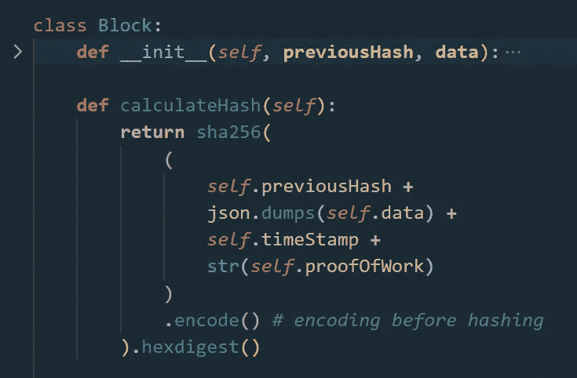

这个函数基本上基于以前的散列、当前数据、当前时间戳和工作证明的组合生成一个散列值。

我们使用`hashlib`内置库中的`sha256`函数。这个库基本上允许我们使用几种散列方法。在本教程中，我们使用安全散列算法 256 (SHA 256)。如您所见，我们在文件顶部导入了`hash`。

我们来看看`Block`类的最后一个函数。`mine`功能。

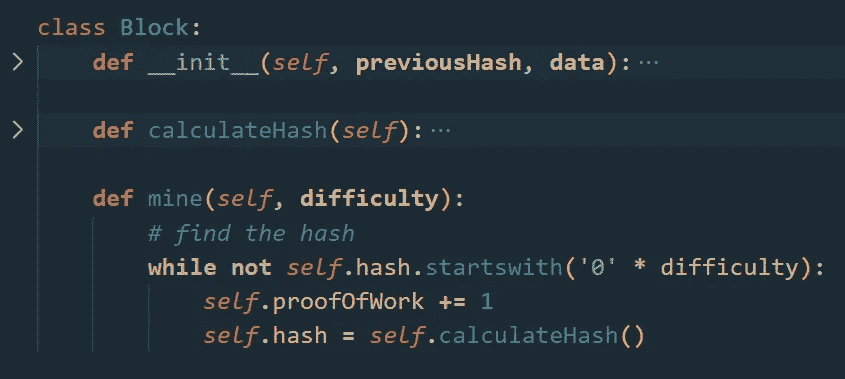

这个`mine`函数不断增加`proofOfWork`，直到我们找到一个从我们想要的数字 0 开始的散列(我们称之为`difficulty`)。难度越高，创建哈希所需的时间就越长。这是因为从散列输出中找到输入的唯一方法是逐个尝试不同的输入。

下一步是创建区块链来存储所有的区块。

## 创建区块链类

让我们创建一个`Blockchain`类

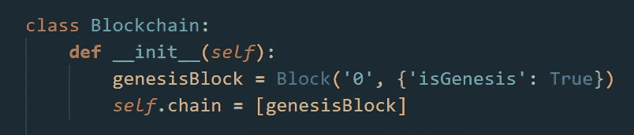

我们的区块链存储 1 数组叫做`chain`。我们还将在链中添加一个`genesisBlock`。创世纪区块基本上是链中的第一个区块。因此，我们可以传递“0”作为前一个哈希值，因为没有前一个块。

接下来，我们将实现`addBlock`方法，向链中添加一个新块。

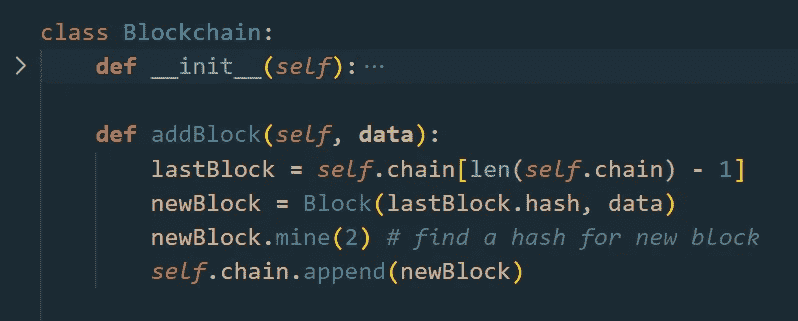

该函数接受 new `data`作为参数，并基于该数据和前一个块的散列创建一个新块。

记住，当我们创建一个新的块时，我们必须使用`mine`函数来计算它的哈希值。为了更快，我只将`diffifulty`设置为 2，所以新的哈希值必须以 2 个零开始。

找到哈希值后，我们只需要将新的块添加到链中。

最后，我们需要`isValid`函数来验证当前链是否有效。

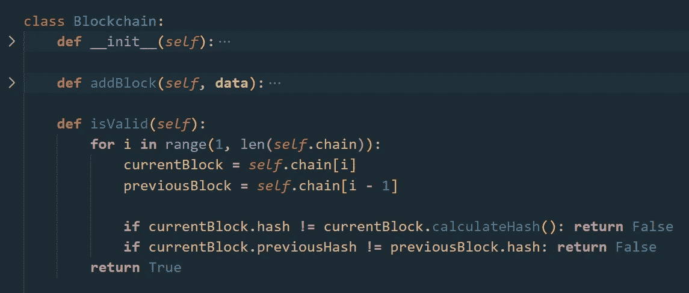

这个函数基本上遍历每个块(除了 genesis 块)，并检查哈希值中是否有任何违规。如果没有违反，它返回`true`。

## 获取最新的块

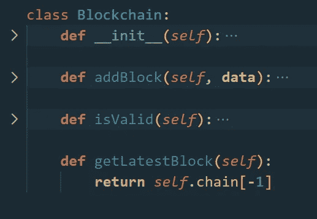

这不是必须的，但是您也可以添加一个`getLatestBlock`方法来将最后一个块添加到链中。

恭喜你！你已经成功建造了一个区块链。

让我们在下面的示例部分看看它是如何工作的。

## 用法示例

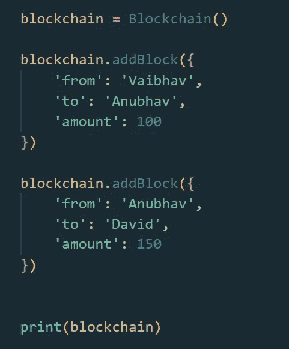

如果你读到这里，我不需要解释什么是 Python 类。我有吗？只需检查打印的类对象，并在您最近的项目中实现它。

就这样，现在去炫耀你的朋友说你们在讨论什么，我可以建立！

但是等等，还有更多…

# 它解决什么问题？

它解决的最大和最主流的问题是它提供了一个**去中心化的数据共享平台**。

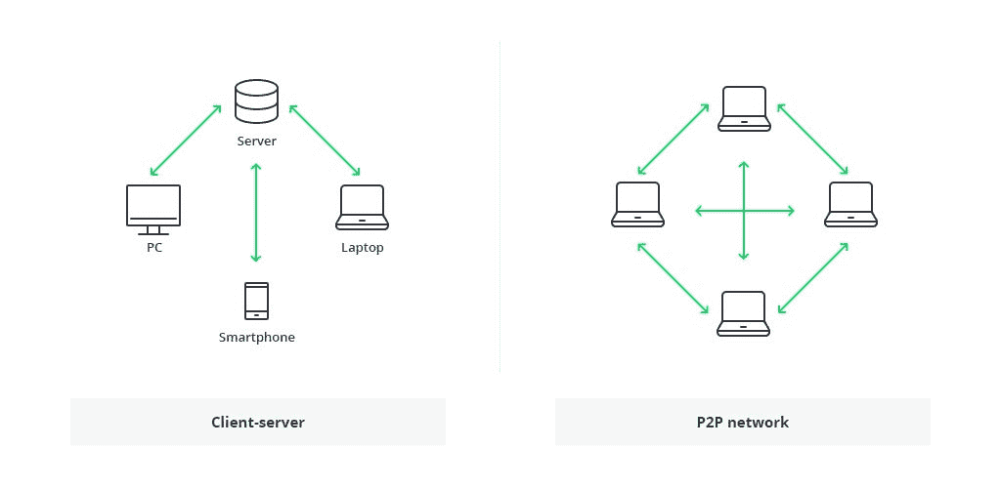

以上是一个**集中式**和**分散式**网络基础设施的演示。

除此之外，也正因为如此……区块链解决了
存储和安全问题，
数据传输——将更快，
电子投票、慈善、众筹——将更容易(因为没有人控制流量)

# 我为什么要关心这个？

回答我这个问题:

*   您上一次关心 XYZ 银行的支付网关是如何工作的是什么时候？
*   谷歌如何通过第三方服务认证其用户？
*   有没有想过 Instagram 如何/在哪里存储数据？

如果你不能回答这些问题，就没有必要了解区块链。我的意思是你可以，但没有必要。

就像你不需要懂 JavaScript 就能使用 Instagram 一样。你不需要区块链就能投资比特币。

现在是奖金时间。

# 区块链不是比特币

如果你是一个 Python 爱好者，你可能已经注意到上面的标题是一个合法的代码语句😅

基本上，我要说的是，如果你明智地使用区块链，它是一项有很大潜力的技术。

基于区块链的实现，人们几乎可以做出任何东西。从加密货币到云存储、社交媒体、搜索引擎和一大堆东西。

让我们不要饱和，把区块链限制在只有比特币。

> 区块链是一种基于密码学的技术。
> 比特币是一种利用区块链构建的加密货币。

> 感谢阅读，如果你觉得这篇文章有帮助，你可以为它鼓掌。
> 我也希望有关注:)