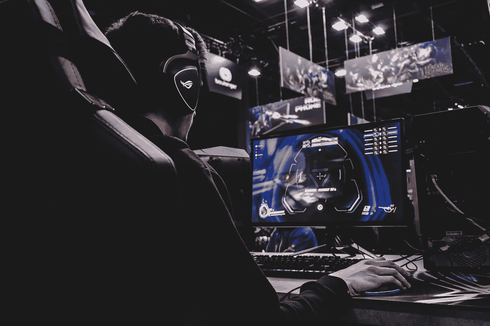

# 区块链游戏将彻底改变游戏行业

> 原文：<https://medium.com/geekculture/blockchain-games-will-revolutionize-the-gaming-industry-4da0c199f84f?source=collection_archive---------10----------------------->

## NFT 家族注定会永生

Photo by [Florian Olivo](https://unsplash.com/@florianolv?utm_source=unsplash&utm_medium=referral&utm_content=creditCopyText) on [Unsplash](https://unsplash.com/s/photos/gaming-inustry?utm_source=unsplash&utm_medium=referral&utm_content=creditCopyText)

区块链技术的应用在过去几年里迅速发展，其原因是需要一种新的系统来解决传统纸币系统中已经存在的问题，这种系统具有全新的革命性。

区块链不仅仅关乎金钱，因为它影响着许多其他领域的活动，游戏是其中最重要的领域之一。为什么？因为区块链技术将彻底改变游戏开发、管理和玩的方式。

当区块链被用作游戏时，会发生不寻常的事情，我会解释这一点。

# 区块链游戏

## 怎么可能呢？

简单地说，区块链是计算机网络上的一系列数据块，对所有用户和任何人都是透明的。它不能被改变或移动。以这种方式，保存了网络上发生的关于数据的所有事情的完整历史。

该系统是分散的，这意味着没有中央权力机构拥有和控制游戏，但用户拥有游戏的一部分，如游戏中的数字资产和项目。

在一个用于游戏的区块链上，就像在加密货币区块链你拥有一定数量的加密硬币，如比特币、以太坊或莱特币，你拥有的是被称为 NFT 的数字资产。这些实际上是游戏中的物品，但你真的拥有它们，就像你拥有加密货币一样，它们不仅可以转移到钱包，还可以转移到游戏之外。

# NFT 的角色

## 永远拥有传奇的数字资产…

N FT 是独一无二的，不可伪造，可以像硬币一样寄到钱包地址。仅供参考，在游戏中，NFT 可以是剑、弓、盾、杖或药剂。它可能是任何东西，这些只是类比。如果你拥有这样的数码产品，它们将永远属于你。

还有通常与区块链技术相关的稀缺元素，这意味着这些项目的数量有限。

就像你玩在线 RPG 游戏如《魔兽世界》,或任何其他类似的游戏一样，游戏中有些物品是普通的，有些是特殊的，有些可能是稀有的，有些甚至可能是史诗或传奇。最稀有的应该是传说中的物品。

在区块链类型的游戏中，你可以看到游戏中有多少传奇物品，比如说 35 个。这个数字一旦确定，就不能再有其他这种类型的项目了。即使这 35 件物品是相同的，它们中的每一件都有其独特的方式，因为它可以包括该物品如何被使用的所有历史。它可能属于游戏中最好的玩家，并且这些信息将永远和物品在一起，甚至在它被其他人买走之后。

但是，如果你玩的游戏突然死了会怎么样？你猜怎么着？你的物品不会！因为它可以在区块链或元宇宙的另一个区块链转让。你仍然可以拥有它，并在新的游戏中使用它。你可以把它存在你的加密货币钱包里。这就是 NFT 的酷。

NFT 的实际上是一种形式的内容，一种永远不会消亡的内容……它将永远存在于元宇宙。

# 一个流行的区块链游戏的例子

## 外星世界

我玩的第一个也是唯一一个区块链游戏已经非常流行了。它叫做[外星世界](https://alienworlds.io/)，你可以在浏览器中直接播放。这个游戏非常吸引人，尤其是在开始阶段，尤其是因为你知道你在游戏中获得的一切，实际上都是你的数字资产。

你需要使用简单的工具在某些星球上从延龄草中采矿，比如一开始用铲子。然后，你可以买更好的工具，比如一个标准的电容器，更有效地采矿。Trillium 可以在区块链上兑换它所属的其他加密货币，如 WAXP，并最终兑换为 EOS，这是一种已知的加密货币。

正如所见，与迄今为止的游戏方式相比，区块链游戏是一次彻底的范式转变。游戏玩家现在可以保证他们的数字资产不会被游戏所有者删除，但他们将终身保留这些资产，并可能在其他游戏中使用它们。他们也可以通过在市场上出售来赚钱。这种体验是有益的，给了他们极大的灵活性和更高的安全性。

传统游戏即将被彻底改造，这可能比我们想象的要快…