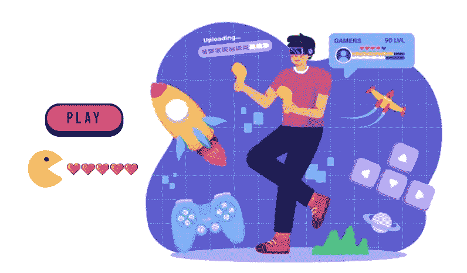

# 区块链游戏平台:为什么这个特殊的领域现在蓬勃发展？

> 原文：<https://medium.com/geekculture/blockchain-gaming-platform-why-is-this-particular-domain-flourishing-right-now-e55e037dce0c?source=collection_archive---------17----------------------->

自 20 世纪 70 年代首次出现以来，游戏一直是一种狂热的爱好。对游戏平台的狂热依然如故，尽管多年来用来访问它们的媒介已经发生了演变和变化。现在， [**区块链科技**](https://bit.ly/3QRQyg1) 是游戏领域的最新参与者，它努力改变公众对游戏的看法，认为游戏不仅仅是一种爱好。虽然区块链游戏平台可能会改变游戏玩家的事情，但它将提升行业的视角，从以数据为中心转变为以**用户为中心的收入模式**。随着我们的进一步发展，我们会看到更多。

Blockchain Game

# 什么是基于区块链的游戏平台？

一个基于区块链的游戏平台是用户可以玩在区块链开发的游戏。游戏中的资产将在区块链上注册为 [**不可替代代币(NFTs)**](https://en.wikipedia.org/wiki/Non-fungible_token#:~:text=A%20non%2Dfungible%20token%20(NFT,to%20be%20sold%20and%20traded.) ，让用户完全控制他们的购买。如果他们选择退出游戏，他们可以在游戏环境中使用它们，然后二次出售。区块链游戏平台可以是以下三种激励模式之一(或这些模式的组合):

*   [**【P2E】**](https://bit.ly/3AuVUIP)，玩家通过玩游戏来**赚取现金奖励。**
*   [**【M2E】**](https://bit.ly/3CcHhee)，玩家通过移动身体来赢取可兑现的奖励。
*   NFT 出租，玩家出租游戏中的资产来赚取被动收入。

> 这种游戏可以基于几乎任何游戏类型，包括动作、冒险、战斗、模拟、战略、赛车、RPG、MMORTS、MMORPG、体育、幻想体育，甚至在某种程度上是**meta vers**。区块链顶级游戏平台包括分散地、 [**元板球联盟**](https://bit.ly/3PvytmP) 、 [**沙盒**](https://www.sandbox.game/en/) 、 [**Axie Infinity**](https://axieinfinity.com/) 、 [**夹板地**](https://splinterlands.com/) 、Sorare、Zed Run、REVV Racing。

# 基于区块链的游戏平台给玩家带来的好处

*   一个基于区块链的游戏平台可以成为游戏玩家的被动创收模式，因为他们可以获得可兑现的代币作为完成游戏任务的奖励。
*   这种游戏提供了稀缺的游戏内资产，使平台生态系统内的经济蓬勃发展。一旦释放，任何人不得以任何理由操纵这些资产。
*   顶级**区块链游戏平台**启用**多链 NFT** 资产，用户可以二次出售或出租，获取被动收入。
*   这些平台有多种支付选项(加密/菲亚特)来购买 NFT 资产，使广大玩家能够进入区块链游戏世界。
*   在区块链上将游戏中的资产令牌化为 NFT 确保了这些物品的所有权被授予游戏玩家，而没有任何中央权力机构来控制它们。

# 区块链游戏为游戏工作室带来的好处

*   区块链游戏平台提供了一个利润丰厚的商业模式，因为它可以有多种收入来源，如本地代币收入、市场费用、NFT 销售等。
*   区块链博彩运动正在迅速发展，这使得企业可以通过提前进入来赢得声誉。这方面的一个很好的例子是 OpenSea，虽然它是一家 NFT 市场，但它是一家早期出售非金融资产的公司，现在控制了大多数交易。
*   与顶级品牌合作开发区块链游戏的机会越来越大，因为这样的平台将拥有庞大的用户群。这种合作关系将使游戏能够通过游戏内积分或奖励来提供对品牌产品和服务的访问。
*   基于区块链的游戏平台市场预计将在 2025 年增长到近 400 亿美元(来源:TOI)。如此巨大的市场潜力可能是游戏初创公司的完美目标，这些公司希望在未来钻研 **Web3 空间**并创造财富。

# 顶级区块链游戏公司

# 天空梅维斯

[**Sky Mavis**](https://www.skymavis.com/) 是区块链票房最高的游戏平台 Axie Infinity 背后的一家越南游戏工作室。这款游戏因其战斗性质而获得成功。虽然这款游戏一直高居游戏排行榜榜首，但它的 NFT 市场和本地令牌(AXS)引起了 NFT 爱好者的巨大兴趣。

# Dapper 实验室

[**Dapper Labs**](https://www.dapperlabs.com/) 是区块链最好的游戏平台之一 CryptoKitties 背后的区块链顶级游戏公司之一。虽然游戏的受欢迎程度降低了，但这些数字小猫的市场仍然活跃，因为我们可以从收集中看到 NFT 赚得很多。

# GuardianLink

[**GuardianLink**](https://www.guardianlink.io/) ，一家 NFT 发射台提供商，创建了 Meta Cricket League，自成立以来的几个月内，它已经成为区块链顶级游戏平台之一。该游戏的 [**Jump.trade**](https://www.jump.trade/) NFT 市场也因其出色的功能和无缝交易而在区块链游戏社区中广受欢迎。

# Zed 运行

Zed Run 是一家总部位于区块链的流行游戏平台公司，运营一款数字赛马游戏，引起了人们的极大兴趣。这个游戏的流行源于传统的赛马并不是每个人都可以参加的，而 Zed Run 只是通过数字方式让人们可以参加。

因此，如果你想开发这样一个应用程序，并担心区块链游戏平台的开发成本，你不必担心。这是因为有公司可以根据你的需求以合理的价格制作游戏。