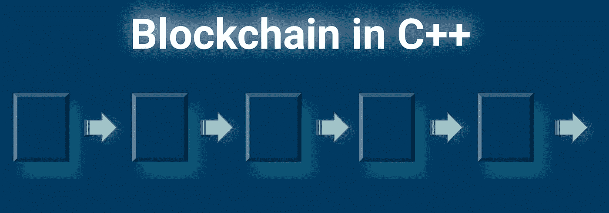
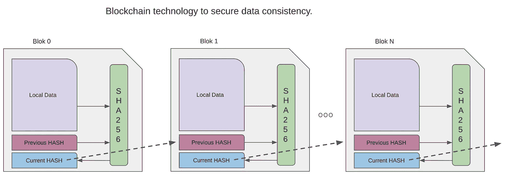
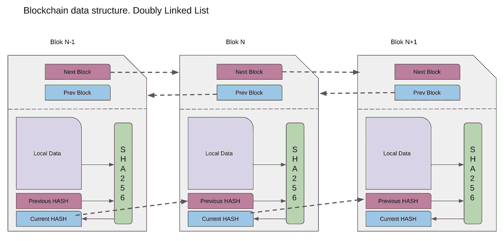
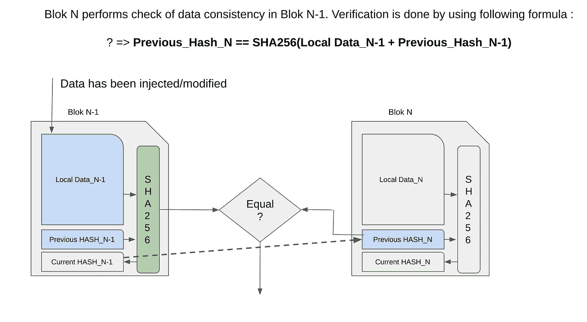
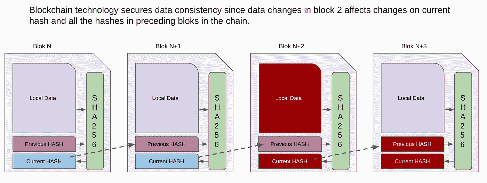

# C++中的区块链实现

> 原文：<https://medium.com/geekculture/blockchain-implementation-in-c-390f465991d6?source=collection_archive---------21----------------------->



by author

下面的文章讨论了区块链技术在 C++语言中的实现。理解示范技术和广义哲学的原理为在广泛的领域中进行填充提供了极好的机会，在这些领域中，信息必须是一致的，并且受到某些规则的保护。我将概述加密货币中常用的相关概念。请注意，下面的讨论是简化的 ve，但是区块链技术的核心机制概念已经被继承。
这个迷你项目的目标是链接节点(块)，这些节点可以由操作系统进程、机器或其他数据源来表示，它们会受到未经请求的数据注入(块数据中的更改)的影响。“截取的”块数据的修改通过链中的前进块来检测。关于检测(链安全)是由块之间创建的“软件链接”——[**散列算法 SHA256**](http://www.zedwood.com/article/cpp-sha256-function) 提供的。



by author

在我的 [**Github 库**](https://github.com/markusbuchholz/chain_block) 中可以找到所呈现的区块链在 C++中的实现。

# **系统架构**

在下面的文章中，我开发了区块链，如下图所示。链滑车由滑车组成。根据实施情况，我们可以将块关联为一个过程，该过程可以从传感器、工业过程收集数据，或者仅存储数据(您的事务)。从概念上来说，每个块可以被分成两个抽象部分。一部分负责**构建数据结构**，同时新的块进入链中或被移除(在这个例子中，我展示了添加过程)。在下面的例子中，区块链是通过使用双向链表建立的。每个块(作为一个数据结构)存储两个指针，一个 ***next** 指向下一个块，另一个 ***prev** 指向前一个块。在 C++中，每个块都由 struct 表示。这些块一起创建了一个双向链表。除了“数据结构抽象层”允许建立一个链块和操作数据(例如遍历链(列表)，修改某个块或其他块中的数据)，每个块包含**内部结构来存储数据和保证区块链**的一致性(见下图)。通过计算当前数据块的 **actual_hash** (64 个字符)和 **prev_hash** (前一个数据块)来保证安全性，考虑下图。



by author

特定 block_N 的数据变化会影响该特定 block_N 的 actual_hash_N 的变化。在每个扫描时间进行 block_N+1 比较存储在该块中的 prev_hash_N+1 与实际计算的(尚未存储！！)第 N 块的 actual _ hash _ N .
如果第 N 块的数据已经改变，则比较过程失败，并发出警报。“警报”可以通过重新计算链(遍历链并重新计算所有块散列)来确认。

```
struct Block{ Block *next; //address of next block
   Block *prev; //address of previous block
   std::string actual_hash; // stores actual hash
   std::string prev_hash; // stores hah for previous block
   std::string data; //data for current block};
```

正如您所看到的，区块链技术提供的机制不是阻止变化，而是检测变化。在块(N+1)中存储已经在**时间 t** 为块 N 计算的散列允许在**时间 t+1** 检测块 N 中的数据变化。



by author

# **部署和测试。**

我上面提到的链条由滑轮组成。每个区块可以抽象地分为两部分。一部分负责保存有关数据块地址(下一个和上一个)的信息，另一部分保存数据块数据和哈希，允许在整个区块链中提供一致的数据块数据(检测更改)。

在下面的例子中，区块链被创建为类**区块链()**的对象。链的主要特征是保存链头和块 0 的地址。请注意，块零是保存数据和散列的块，但它不用于评估，因为无法计算该块的先前散列值(我们生成随机值)。

```
class BlockChain{private:
       Block *previous;
       Block *head;public:static int numberOfBlocks;BlockChain() {}                    //constructorstd::string random_string();      //generate random stringstd::string generateHashSHA256(std::string toHasing) //generate hashvoid addNode(std::string new_data) //add block(node) to chainvoid traverseBlokChain(BlockChain &chain) //traverse the chainint getNumberOfBlocks() //returns the number of blocks in chainvoid checkChainConsistency(BlockChain &chain) //checks if the data //for each block has been modified void recalulcateChain(BlockChain &chain) // recalculate hashes for  //each block of the chain (after data injection) into a data blockvoid injectDataInBlock(BlockChain &chain, int injectToBlock, std::string injectData) // data injection in certain block of chain};
```

这个例子从 **main()** 开始，在这里启动了区块链类的对象链。用简单的字符串创建了 10 个块 **addNode()** 。在下一步中，我们验证了数据的一致性，调用方法**checkchainconstance()**。方法，该方法使用前面讨论的算法，检查块 N-1 和 N 中的某些哈希是否相等。根据验证结果，生成适当的信息:
**哈希正常== >块健康！！**或
或**哈希错误== >块被操纵！！**

接下来，对于块 5(下图块 N+2 ),数据被改变。通过运行与之前**check chain consistency()**相同的方法来检测数据更改事件。然而，这一次散列是错误的，所以关于块数据操作的信息被打印出来。



by author

为了消除给定的警报，必须重新计算区块链中的所有散列。请注意，通常需要从数据已更改的数据块重新计算所有后续数据块的哈希，但是在此示例中，我们重新计算整个区块链。重新计算后，调用**check chain consistency()**再次检查一致性。重新计算后，整个区块链都可以。

请运行您自己的场景，享受您的链。

感谢阅读。