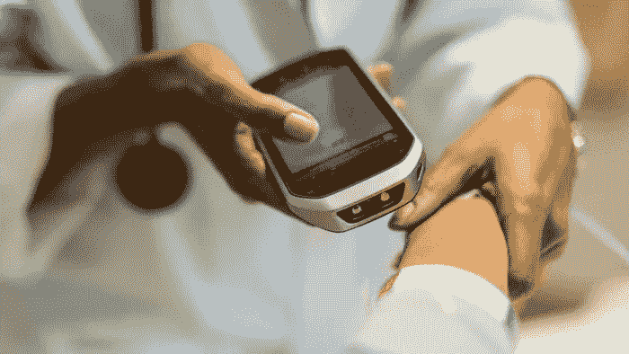

# 健康信息交换中的区块链

> 原文：<https://medium.com/geekculture/blockchain-in-health-information-exchange-700de7dd7884?source=collection_archive---------25----------------------->

在当今时代，医疗保健行业已被证明是最大的行业之一，占所有发达国家总 GDP 的至少 10%。即使在医疗保健、药物和医疗政策方案中进行了实际创新，医疗保健行业也需要在离开医疗保健信息时进行相关维护。

主要问题仍然是存储机密数据和共享数据，因为数据标准和格式也有所不同。因此，数据变得非常容易被破坏。患者在篡改数据中扮演的角色可以忽略不计。在理解如下所述的医疗数据传输机制时，有两个要点需要考虑:

*   隐私维护因为法律制度的失败。
*   集中式数据共享系统及其数据安全风险。

因此，[医疗信息交换](https://www.leewayhertz.com/blockchain-health-information-exchange/)HIE——一个基于云的数据存储系统——被医疗保健部门所利用变得至关重要。

# 什么是健康信息交换(HIE)？

HIE 或健康信息交换可以被描述为一种系统，该系统允许健康护理部门的工作人员，例如医生、药剂师、护士，访问和共享与他们相关的患者的重要医疗信息。这一共享过程必须经过大量的审查，以保持其质量并确保患者信息的安全。

自古以来，医疗保健部门一直遵循记录患者重要数据的传统方式。这种传统的方式主要包括用笔和纸记录的数据，这说明了它记录信息的质量和记录数据的安全性。这就是健康信息交换或 HIE 发挥重要作用的地方，因为它有助于存储与人们的健康相关的信息以及由各种医院有效且高效地向其患者提供的其他个人凭证，进一步帮助人们去拜访他们的医生和健康实验室，而不需要携带所有医疗信息的硬拷贝。

虽然 HIE 不能颠倒或交换医疗信息查询者的特定角色，例如，病人和医生，但是它可以通过向医疗权威提供病人的疾病、药物和治疗的整个病史来帮助他们。随着 HIE 系统的普及，患者病历的完整性得到了维护，因为它得到了精确的共享和标准化。这些信息也会被添加和更新给 EHR 的每个收件人。HIE 应用有三种类型，即直接交换应用、基于查询的交换应用和消费者中介交换应用。医疗保健部门可以信任[区块链](https://www.leewayhertz.com/what-is-blockchain/)平台，以实现医疗记录的标准化和安全交换。

# 区块链如何帮助 HIE 发展？

某些区块链元素具有显著改善医疗保健信息共享系统的潜力。它们如下:

*   区块链技术的分散性质及其分布式总账系统消除了对中央机构的需要。因此，区块链技术可用于管理患者信息、验证临床测试，以及维护整个医疗供应链中的医疗凭证和安全性。
*   支持区块链的 HIE 可以理解各种医疗信息技术系统的互操作性和集成流程。它将降低现有中间商的成本，提高信息传递的效率。
*   区块链技术消除了数据交换过程中对中介的需求。它将保护数据，并对管理保险索赔、受保护的健康信息和其他医疗记录极为有益。
*   随着众多组织探索和试验区块链在医疗保健领域的潜力，区块链已被批准为不可或缺的医疗保健平台技术。

从药品到增加支付选择和患者健康记录的分散化，区块链技术有潜力显著加强医疗保健信息交换治理。

HIE 使护理人员能够同时达到两个目标-

*   保护公共健康记录的机密性。
*   让患者参与自己病历的管理。

以下是区块链引入的主要安全增强措施:

*   通过使用公钥/私钥提供足够的保护。
*   通过使用分布式分类帐，增强了数据完整性。
*   以平稳的方式将内部系统与 API 集成。
*   通过分散的、基于信任的和安全的数据交换增强电子处方。

健康信息交换中的区块链更像是一场革命，因为它在没有任何实际硬拷贝记录的情况下编译和存储健康记录，从而保持了安全性和便携性