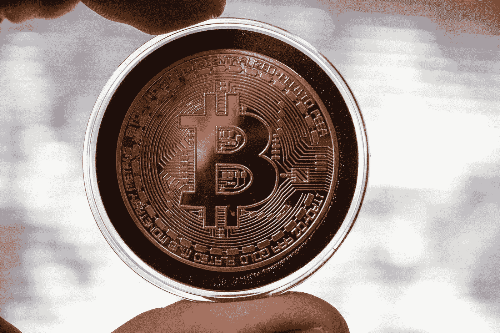

# 区块链不是元宇宙的全部

> 原文：<https://medium.com/geekculture/blockchain-is-not-all-of-the-meta-universe-e04853866da0?source=collection_archive---------38----------------------->

## 元宇宙的流行不是偶然的。无论是在投资圈，还是在行业圈，我们都看到了元宇宙的存在。“元宇宙+”成为了一个全新的风口。

Photo by [Brian Wangenheim](https://unsplash.com/@brianwangenheim?utm_source=medium&utm_medium=referral) on [Unsplash](https://unsplash.com?utm_source=medium&utm_medium=referral)