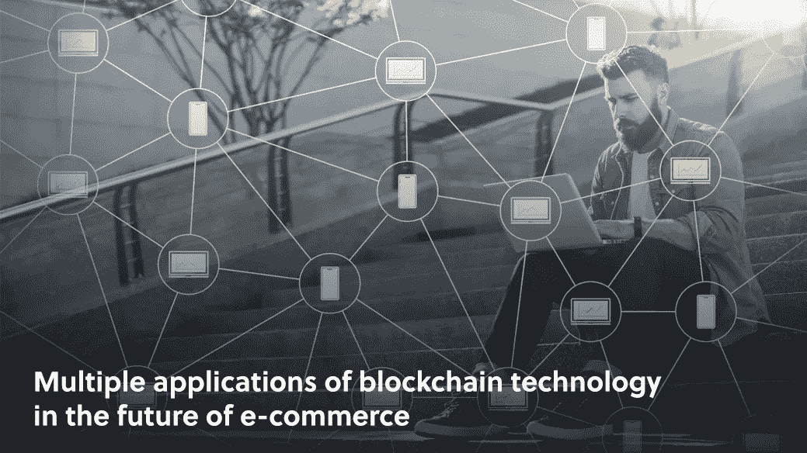

# 区块链技术在未来电子商务中的多重应用

> 原文：<https://medium.com/geekculture/blockchain-is-the-future-of-e-commerce-5981756eb9d6?source=collection_archive---------28----------------------->

## **区块链和电子商务**

最近，似乎每个人都在谈论区块链，这成了热门话题。

更重要的是，似乎每个人都试图参与进来，并确保自己分一杯羹。很多流行语满天飞，大多数人都能对加密货币产生模糊的联系，但很多人仍然很困惑:**区块链到底是什么，它和电子商务有什么关系？**

# 什么是区块链？

最初，区块链是作为一种给数字文档打上时间戳的方法开发的，这种方式使得处理这些信息非常困难。简而言之，[区块链起源于一种数字安全手段。](https://101blockchains.com/history-of-blockchain-timeline/)

简单来说，想象一个电话的游戏，除了在我们的版本里，没有交流，但是每个人都有前一个人的信息清晰的写下来。这创造了一个值得信赖的信息链:即使每个人只知道他们自己的信息，他们也可以很容易地参考前一个人的信息。

现在想象你接近链条中的一个人并改变他们收到的信息。不管你的意图是什么，篡改的证据非常明显。在链中的一个非常具体的点之后，所有的个体开始接收不同的信息。这意味着，如果你试图在信息链的任何一点改变信息，不被发现是不可能的。

现在，考虑每个个体持有的信息是关于交易的信息，并且称每个个体为*块*——现在我们有了一个区块链。

这种向后引用数据结构的分类帐，由于其结构和另一个因素:去中心化，为我们提供了一种跟踪事务的可靠而安全的方法。

不是让整个结构在一个地方运行，而是希望参与的每个人都收到一份链的副本，这意味着对链的任何改变都可以被个人网络实时观察到。

一段时间后，人们意识到这种保护数据交易的方法是使加密货币更加强大的一种好方法，因此比特币成为第一种利用区块链力量的加密货币。

如果你还记得的话，围绕比特币的传言是，交易是如此安全，以至于尽管有任何有形的表示，比特币也无法被复制。

比特币证明了区块链记录交易和资产的****方法非常安全，但这又引出了我们的下一个问题:这对电子商务有什么帮助呢？****

****让我们来看看区块链在电子商务方面的一些令人兴奋的应用。****

# ****成本优化****

****还记得关于分权的观点吗？区块链运营的 P2P 网络对交易有着重要的影响。这些发生在一对一的同行之间，没有中间人。****

****通常，在交易中，个人和品牌都必须考虑到银行和其他金融机构将收取交易费。对于区块链，交易费几乎可以忽略不计，从成本角度来看，这是显而易见的选择。****

****不仅交易成本显著降低，而且速度也更快。区块链通常是即时的，这将使等待数小时甚至数天的交易成为过去。****

****这对于品牌来说非常有用，因为品牌可以通过几乎即时发货来建立客户信心和忠诚度。****

# ****安全性****

****我们已经提到这项技术如何使数据存储和传输变得非常安全，这对电子商务有直接的好处。对一个品牌的可信度最大的打击之一是低于标准的安全性，尤其是在处理敏感的客户数据时。****

****似乎就在不久前，苹果公司还因其臭名昭著的隐私后门而遭遇品牌危机。虽然这个价值数十亿美元的品牌已经成功反弹，并将自己重新标榜为[安全前锋](https://www.youtube.com/watch?v=8w4qPUSG17Y)，但较小的品牌可能承受不起这种公关冲击。****

****强大的非对称加密与哈希系统和区块链的分散化相结合，使其值得信赖的安全性受到任何担心处理敏感信息的人的热烈欢迎。****

****无论是私人信息还是[产品数据](https://www.amberengine.com/blog-content/6-signs-you-should-be-concerned-about-your-product-data?utm_source=blog&utm_medium=referral&utm_campaign=medium-blogs)，妥善安全地处理您管理的数据都不是一件小事。****

# ****供应链和透明度****

********

****成功的电子商务品牌和营销的一个稳定趋势是你的过程中的每一步都是透明的。**消费者希望信任他们承诺的品牌，信任来自透明度**。幸运的是，区块链也能在这里帮忙。****

****链的分散意味着它是一个公共记录，并且链很难被单独操作意味着公共记录没有被篡改。因此，客户能够检查供应链的细节，并亲自查看他们是否同意该流程。****

****虽然消费者不太可能进行这种程度的审查，但区块链带来的至少是透明度。这有助于提升品牌形象，当然还有顾客忠诚度。****

****这些只是区块链能给电子商务带来好处的几个例子，但是，说实话，好处实际上是无限的。区块链是现代史上最令人印象深刻的技术进步之一，我们只是触及了表面。****