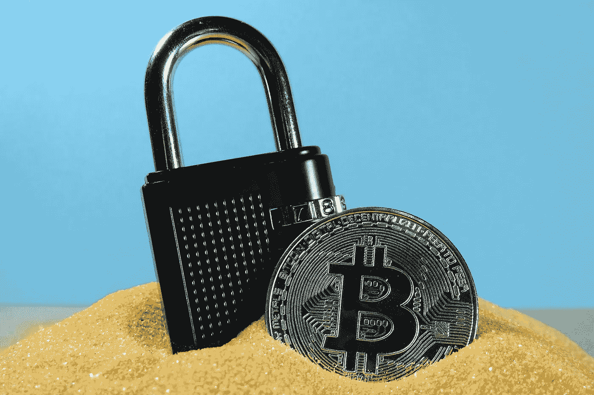

# 区块链安全可能会受到损害

> 原文：<https://medium.com/geekculture/blockchain-safety-may-be-compromised-20698253f098?source=collection_archive---------53----------------------->

## 量子计算机能分解区块链吗？

Photo by [Ewan Kennedy](https://unsplash.com/@ewankennedy19?utm_source=unsplash&utm_medium=referral&utm_content=creditCopyText) on [Unsplash](https://unsplash.com/s/photos/bitcoin-sand?utm_source=unsplash&utm_medium=referral&utm_content=creditCopyText)

他们说加密货币不会被偷，因为区块链不会被破解。嗯，事情发展得真的很快，就像黑客说的，任何由人类制造的东西也可能被人类破坏。当谈到打破区块链，事情可能会有点不同。不过有一种可能性:使用量子计算机。他们仍处于起步阶段，但请记住，根据[摩尔定律](https://ourworldindata.org/technological-progress)，技术正呈指数级增长！

# 区块链的数据是如何保护的？

我们可以用不同的方式说拥有加密货币是安全的，因为区块链技术是分散的。这意味着货币储存在不止一个地区，没有一个中央实体拥有你的硬币。

crypto 一词来源于加密货币是区块链上的加密数据。这是另一个安全因素。

区块链数据也有私钥保护。它们很长，要打破它们，你需要巨大的力量和大量的时间。但是，公钥可能会暴露，这就是量子计算机可以帮助的地方。

# 什么是量子计算机？

Photo by [Ash Edmonds](https://unsplash.com/@badashphotos?utm_source=unsplash&utm_medium=referral&utm_content=creditCopyText) on [Unsplash](https://unsplash.com/s/photos/abstract?utm_source=unsplash&utm_medium=referral&utm_content=creditCopyText)

为了理解[量子计算](https://en.wikipedia.org/wiki/Quantum_computing)的概念，我们必须首先知道是什么导致了创造量子计算机的需要。事实是，正如我们今天所知，计算机已经达到了极限。目前，我们已经接近制造原子大小的计算机部件，这是我们所能达到的最大限度。这些部件实际上是晶体管，可以在 0 和 1(你知道，二进制代码)之间转换一位(信息的最小单位)的值。

在量子计算机中，我们使用量子物理学的原理。携带称为量子位的信息的光子可以根据其偏振在 0 和 1 之间切换，可以处于中性状态，根据要求可以是 0 和 1。一个基本上不同的改进原理来获得与常规计算机相同的东西，但规模更大，因为一个量子位可以同时处于 0 和 1 的多个位置，结果是惊人的。

## 量子计算改变了 IT 安全的游戏规则

为了找到私钥的组合，普通的计算机将花费大量的时间，因为计算机将以线性方式通过反复试验来完成这一过程。与此相比，量子计算机将使用概率的同时计算，并在更短的时间内获得结果。漏洞在于公钥，因为私钥是基于那个公钥生成的，而公钥在事务中是可见的。

## 用量子计算机能破解区块链吗？

加密货币使用多种算法加密，数据不可更改，交易由区块链的其他参与者确认。这些事实使得即使使用当今最强大的计算机也很难破解密码。

有了量子计算机，也许有可能，但第一代可能就不行了。当更复杂的量子计算机被制造出来时，区块链的加密可能会被破解，但在那之前，肯定会采取措施，利用量子计算机技术，进行更强大的加密，并提供更好的保护。

结论是，我不会那么担心区块链是否能被量子计算机破解。反击这种企图的办法可能会出现。担心就想想这个吧！如果量子计算机能够被普遍使用的话，可能还需要很长一段时间。有可能发现甚至更好的其他技术。谁知道呢？我们会看到的。