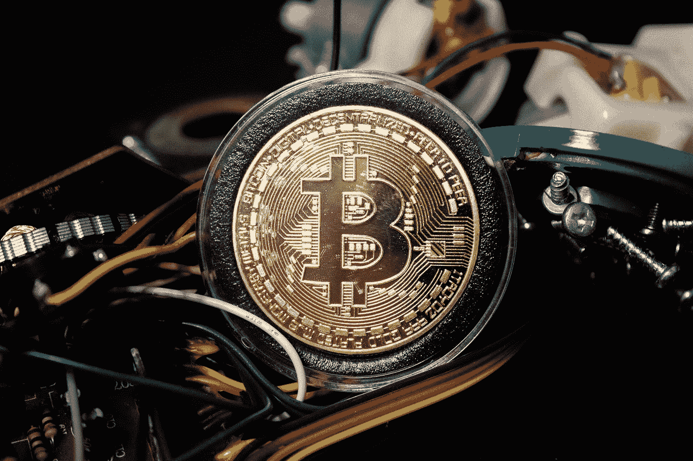

# 区块链技术解释

> 原文：<https://medium.com/geekculture/blockchain-technology-explained-686962b3ad58?source=collection_archive---------11----------------------->

区块链不仅仅是比特币，它是一个分布式数据库，允许安全、透明和防篡改的交易。下面我们来详细了解一下。

Photo by [Brian Wangenheim](https://unsplash.com/@brianwangenheim?utm_source=medium&utm_medium=referral) on [Unsplash](https://unsplash.com?utm_source=medium&utm_medium=referral)

区块链技术是一种促进互联网交易的方式。

区块链类似于电子邮件的工作方式，但它是用于将钱或财产从一个人直接转移到另一个人，而不经过…