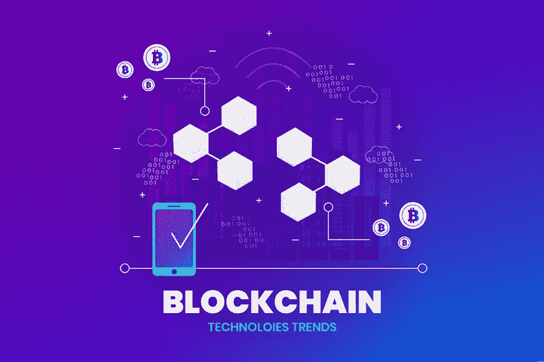
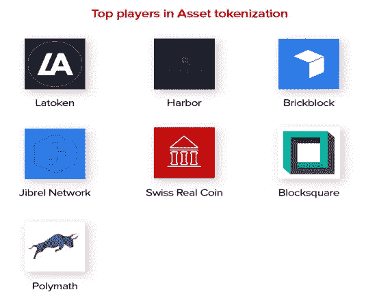
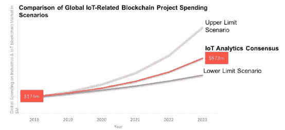

# 2022 年区块链技术趋势:超越炒作

> 原文：<https://medium.com/geekculture/blockchain-technology-trends-in-2022-beyond-the-hype-67298855e01d?source=collection_archive---------10----------------------->

想象一下这样一个世界，你不必花费巨额美元作为法律费用来执行合同；或者一个不再需要银行作为交易中介的世界。

想象一下这样一个世界:每一台带有开关的设备都相互连接，识别盗窃已成为过去。

“一个基于信任的世界”。

听起来很好笑？再想想。

早在一段时间以前，区块链技术趋势走出了它在什么和为什么上运行的区域，并介入了如何运行的可能性。

有人说，它对我们生活的影响可能会像互联网一样深远。虽然目前其中大多数都与加密货币有关，但这只是触及了其功能的表面，它对从医生如何跟踪和存储我们的医疗记录到如何在机场安全可靠地验证我们的身份的一切都产生影响只是时间问题。

用最简单的术语来说，区块链是一个去中心化的点对点网络，允许双方直接相互交易，而不需要媒介。它们依赖于独特的密码，这种密码提供了完全透明的按时间顺序排列的事件，对所有在网络上注册的用户都是无可争议和可见的，同时保护了相关人员的身份。这种类型的网络的好处是，它们通过省去中间人、增强用户信任以及减少因等待交易验证而造成的时间延迟，提供了潜在的成本节约。

毫无疑问，区块链还有很多需要学习的地方。但有一点是明确的:无论你是在经营一家企业，还是只是一个具有前瞻性思维的人，现在了解更多关于区块链新兴技术趋势的**将会让你为即将到来的世界做好更好的准备。**

**虽然加密货币飙升，但 2018 年对支撑比特币和其他许多硬币的技术区块链来说是伟大的。由于区块链有大量加密货币之外的案例，甲骨文、亚马逊、IBM 和其他价值数十亿美元的跨国公司试图押注于这种颠覆性技术。**

**因此，让我们来看看 2022 年及以后区块链会有什么样的发展:**

****1。ICO 预警:STO 换 ISO 的****

**安全令牌一直是加密空间的烫手山芋，而且似乎还会继续烫手。它变得比 overstock 的 tZERO 宣布推出新的 STO(安全令牌产品)平台更热门。**

**这个以区块链为动力的平台将为任何公司提供机会，通过推出自己的 STO 来筹集资金。在此之前，这家初创企业宣布完成其公用事业令牌分发。**

**STO 的加密货币结合了股票市场和加密货币的最佳特性，已经成为一种完全受监管的替代品，取代了过去几年风靡一时的 ICO。**

****2。令牌化:转换资产所有权****

**资产令牌化的过程包括使用数字令牌来验证真实资产的所有权。它的主要目的是通过证券的购买和销售过程，从而成为利用区块链技术的最大的科技巨头之一。**

**其他令牌化的好处包括——更快的交易、更大的流动性和更广泛的可访问性都有助于吸引无数玩家进入**区块链开发。**这些围绕资产令牌化的**技术趋势**是列表中的附加内容。**

****

**总部位于爱沙尼亚的 DEX 最近以 ERC20 token 的形式购买了全球最大公司的股票，validate 2022 的推出完全是为了令牌化。此外，这家以以太坊为动力的初创公司将授权投资者参与美国证券交易所，而不受地点或投资额的限制。**

**虽然令牌化在 2018 年已经是一个无处不在的趋势，远远超出了股市，但这是一切都将被令牌化的时候——葡萄酒、房地产、面包、艺术，以及你能想到的一切。**

****3。一个联盟:物联网和区块链联盟****

**分散市场已经发现了几个融合物联网和区块链技术应用的用例。事实上，以最大的安全性传递数据是区块链技术**的核心，它几乎自然地适合物联网的工作。这推动了连接设备和在不同平台之间传输信息的便捷方式。****

****

**早在 1 月份，顶级领先的数字安全公司金雅拓发布了一份报告，该报告得出结论称，23%的受访者认为区块链技术可以成为保护物联网设备的好运气。然而，91%不使用区块链的企业考虑在不久的将来使用它。**

**与此同时， [Statista](https://www.statista.com/statistics/471264/iot-number-of-connected-devices-worldwide/) 预测 2020 年物联网设备的数量将达到 307.3 亿，但不到一半的企业能够跟踪他们的设备是否遭遇了安全漏洞。**

**区块链和物联网机制的便利性使数字景观在我们到达 2024 年时成为新的潮流引领者。**

****1。互操作性:一个新的区块链网络****

**区块链大规模采用的关键因素在于可扩展性，这是 2022 年区块链趋势**的最大好处之一。此外，只有当区块链网络运行或相互交互没有任何麻烦时，才能实现真正的可扩展性，这在最前沿培育了区块链互操作性的理念。****

**区块链互操作性旨在改善多样化网络或区块链系统之间的信息共享。这些跨链服务凑合了区块链互操作性，并使它们成为日常使用的实用选择。**

**例如，选择区块链互操作性，您可以轻松地将信息从 EOS 传输到区块链以太坊。目睹区块链趋势如何朝着互操作性的方向发展，很快用户将能够从他们的区块链层次结构向其他人共享某些东西的时代就要到来了。**

****2。区块链即服务(BaaS)****

**毫无疑问，区块链是 20 世纪的革命性技术之一。这被认为是一个改变游戏规则的概念，许多创业公司和企业都在开发自己的区块链解决方案。然而，开发、支持和培育您的区块链解决方案并不总是轻而易举的事情。**

**这就是区块链即服务(BaaS)的大背景。BaaS 是一种基于云的服务，允许客户创建自己的区块链产品，包括应用程序、智能合同，并使用其他区块链功能，而无需任何帮助来初始化、管理或执行基于区块链的基础架构。**

**包括亚马逊、微软和其他公司在内的少数公司已经提供这项服务。我认为在未来几年内，BaaS 的采用将会达到最大化。同时，它还将使公司能够利用区块链技术，而不必担心初始投资。**

****3。加速 AI****

**人工智能(AI)需要信息来从大海泛滥的选项中选择趋势。区块链需要能量和动力来快速地将计算机系统和连续运行过程结合起来——因为它们相互依赖而结合在一起。**

**人工智能和区块链共同提供的优势只有在两种技术相互学习、相互帮助时才会真正有说服力。**

**你一定在想我说的是什么技术。我们再深入一点，了解一下。**

**以下是区块链将与人工智能交换以及人工智能将从区块链获得的东西:**

**a.AI 如何对区块链有帮助？**

> **隐私**
> 
> **能耗**
> 
> **可量测性**
> 
> **效率**
> 
> **安全性**

**b.区块链对 AI 有什么帮助？**

**最大化效率**

**消除高端风险场景**

**降低市场进入壁垒**

**提高机器对机器交互的信任度**

****4。分权:政府分权的关键****

**区块链是分散政府和建立公民对决策者信任的桥梁的关键。出于可靠性和非盈利性运营的考虑，通过公开掌握所有不同的信息，只有当正确的想法遇到正确的[应用开发公司](https://www.alcax.com/services/mobile-app-development/)时，当前笼罩全球角落的危急形势才能随机应变。**

**它对政府改进有何意义？**

> **基于债务的货币不稳定性**
> 
> **货币政策**
> 
> **救助危险**
> 
> **识别盗窃**
> 
> **政府开支**

## **前方的路:**

**2022 年是区块链科技的又一个突破年。尽管监管结论仍不明朗，但投资者正在向这一领域投入巨额资金。此外，团队正在吸引人才并构建新的用例，而企业也再一次走向了谈判桌。**

**看着这个领域不断发展壮大，创新水平不断提高，选择完美的区块链开发服务，会让你在不太长的时间内收获丰厚的回报。**

**因此，如果您想更多地关注基于加密的游戏平台或其他行业的任何其他加密评估平台，Xicom 是您的一站式解决方案。想知道更多关于如何扩大区块链趋势的列表吗？ [**雇佣移动应用开发者**](https://www.alcax.com/services/hire-mobile-app-developers/) **s** 并获得关于“区块链”的突破性想法**