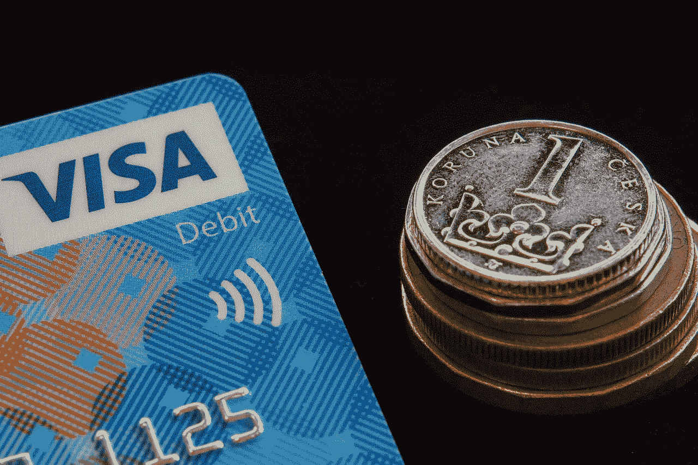
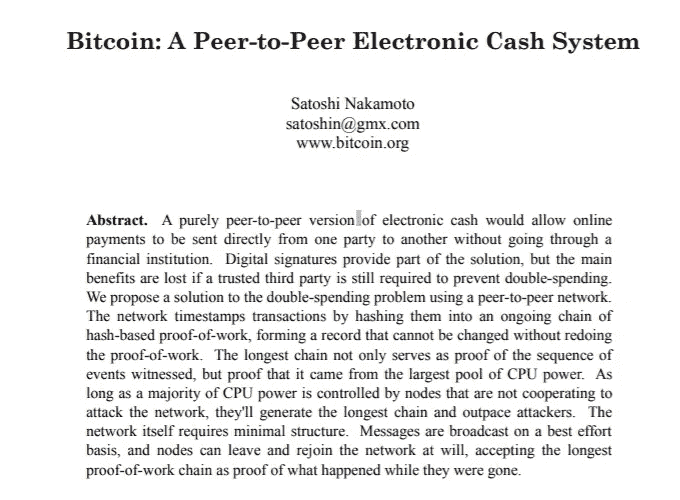
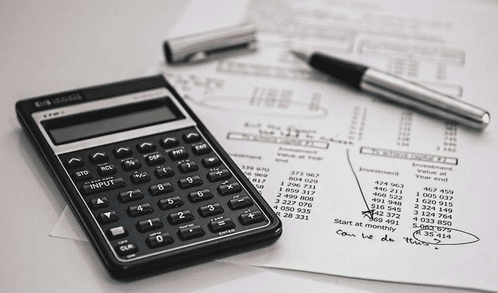

# 区块链——去中心化世界经济的曙光。

> 原文：<https://medium.com/geekculture/blockchain-the-dawn-of-decentralized-world-economy-e541af6df50a?source=collection_archive---------15----------------------->

## 什么是区块链？加密货币是如何工作的？比特币如何产生的故事和初学者指南。

Photo by [Sarah Pflug](https://burst.shopify.com/@sarahpflugphoto?utm_campaign=photo_credit&utm_content=Picture+of+Bitcoin+Coin+On+Bills+Of+Cash+Money+%E2%80%94+Free+Stock+Photo&utm_medium=referral&utm_source=credit) from [Burst](https://burst.shopify.com/bitcoin?utm_campaign=photo_credit&utm_content=Picture+of+Bitcoin+Coin+On+Bills+Of+Cash+Money+%E2%80%94+Free+Stock+Photo&utm_medium=referral&utm_source=credit)

> 今年是 2008 年，全球经济已经被信贷危机摧毁。一家大银行已经破产，公司和投资者要求他们的现金存款，世界上最大的金融机构已经被冻结。最后，政府介入，提供了历史上最大的银行救助。

你可能想知道我在说什么。所以，你有它！这是 2008 年的全球衰退，当美国第四大银行雷曼兄弟申请破产时，引发了金融灾难球，摧毁了全球证券交易所。这不是第一次衰退；世界已经经历了大萧条，大萧条始于 1929 年的美国，一直持续到 1933 年，造成了大范围的失业和数百万人一生积蓄的损失。

> 经济危机不是最近的现象；它可以追溯到公元 33 年，距今近 2000 年。罗马帝国是世界上第一次有记录的经济流动性危机和政府救助的中心。一场金融危机让这个世界上最大的帝国崩溃，皇帝提比略不得不用国库的资金来拯救这个国家陷入困境的银行。
> 
> —虽然历史可能不会重演，但它确实押韵…..很糟糕。

> 金钱是伟大的仆人，但也是糟糕的主人——弗朗西斯·培根。

# 木柴——最古老的货币形式。

Image by [Jakaria Islam](https://pixabay.com/users/jakaria3704-17257133/?utm_source=link-attribution&utm_medium=referral&utm_campaign=image&utm_content=5466266) from [Pixabay](https://pixabay.com/?utm_source=link-attribution&utm_medium=referral&utm_campaign=image&utm_content=5466266)

钱，是一种比轮子的发明还要古老，和火一样古老的技术。它是一种稀缺的有价值的东西，可以用来交换有形的东西。几千年前，当我们生活在小部落中时，我们使用物物交换系统。举个例子，假设你欠别人一堆柴火，他们给了你一杯牛奶作为回报。

我们过去常常储存柴火，这样我们可以随时买食物，但把柴火放在家里不是个好主意。白蚁会被吸引过来，随着堆的扩大，它会占据很大的空间。因此，我们开始把它储存在木材银行里。

木材银行似乎是唯一一个你可以储存你想要的柴火，取出你需要的柴火的地方。

但是，把你的柴火存放在一个他们把你的柴火借给别人的地方安全吗？

如果你需要柴火来买东西，而木材银行告诉你他们已经破产了，那该怎么办？如果你发现自己处于那种情况，你会怎么做？如果木材银行没有从中获利，他们为什么要保留你的柴火？他们为什么要花费时间和资源跟踪每个人的账户？

也就是说，如果你想把你宝贵的柴火保存在木材银行里，你必须让他们从中受益！银行系统就是这样运作的！

> 那么，解决办法是什么呢？
> 
> 有没有办法让我们的钱免受白蚁和木材银行的侵害？我们如何改变它的形状，以便我们可以安全地把它存放在家里？

# 金钱——它会随着时间而变化。

Image by [Miloslav Hamřík](https://pixabay.com/users/vjkombajn-764634/?utm_source=link-attribution&utm_medium=referral&utm_campaign=image&utm_content=3536349) from [Pixabay](https://pixabay.com/?utm_source=link-attribution&utm_medium=referral&utm_campaign=image&utm_content=3536349)

几个世纪以来，木柴变成了黄金，黄金变成了硬币，硬币又变成了纸币(你把贵重的黄金交给银行，银行会给你一张纸，上面写着持票人可以花 X 的钱)，现在我们通过银行账户上的数字来计算我们的财富。

今天，我们的智能手机存折上有数字，但我们不知道我们的钱(黄金或现金)是否真的在银行里，或者已经借给了别人，或者已经流向了其他国家？

这是一个谜，没有人知道这些数字是否有实际价值，但有一点是肯定的，世界是在数字上运行的，每个人都对此感到舒适。

现在，你可能会想，难道我们不是来学习区块链和其他有趣的东西的吗？

是啊！这就是为什么创造了加密货币来保护我们的柴火免受白蚁和木材银行的侵害。它基于一项名为区块链的突破性技术。

# 区块链——终极解决方案。

Picture of Bitcoin White Paper

一个从未透露过身份的匿名人找到了解决这种重复的经济危机模式的方法。他的名字叫中本聪。也有人怀疑中本聪是一群人使用的别名。

不暴露他的身份可能是他能做的最好的事情，因为这项技术有潜力解开这个世界，一些人可能不喜欢他从银行系统取钱的想法。区块链如此强大，甚至连美国都将其合法化，因为美国知道它有潜力提升世界上一些最贫穷的国家。

他发现了一种让我们的钱远离现有银行体系的方法，现有银行体系是寄生的，从社会中榨取巨大的价值。他重新设计了区块链技术，使其无法被黑客渗透，并利用它创造了比特币，这是一种现代电子现金转移系统，不需要使用银行或大型金融机构来存储和转移价值。

就在全球经济衰退之后，2008 年他匿名发布了白皮书《点对点电子现金系统》, 2009 年 1 月，中本聪发布了加密货币的第一个软件来测试这个概念。

> 然而，在我们能够真正理解区块链技术之前，我们必须首先理解对等网络！

# 分散化——对等网络

Photo by [Alina Grubnyak](https://unsplash.com/@alinnnaaaa?utm_source=unsplash&utm_medium=referral&utm_content=creditCopyText) on [Unsplash](https://unsplash.com/s/photos/connected-network?utm_source=unsplash&utm_medium=referral&utm_content=creditCopyText)

点对点网络是一种网络系统，在这种系统中，我们不需要第三方来将数据从一个人传输到另一个人，你的电脑上有一张照片，你可以通过互联网将照片发送给你的朋友，这也不需要第三方，如 WhatsApp、脸书或 Gmail。

比特币使用的是开放源码软件**点对点电子现金系统**，也就是说，代码没有被谷歌或苹果等任何公司隐藏或保护。你可以下载它，创建一个不同的数字现金系统，或者用它来创造货币以外的东西，比如**点对点音乐流媒体应用**，就像 **Mr. Worldwide** aka 发明的那样。**皮特保罗**。

现在我们知道，我们可以使用对等系统将电子货币从一个人发送到另一个人，而不需要使用银行或第三方服务。

那么谁来维持账目呢？谁来保护我们的钱？

> 区块链的魔力来了！

# 区块—分散或分散的分类帐

Image by [Steve Buissinne](https://pixabay.com/users/stevepb-282134/?utm_source=link-attribution&utm_medium=referral&utm_campaign=image&utm_content=385506) from [Pixabay](https://pixabay.com/?utm_source=link-attribution&utm_medium=referral&utm_campaign=image&utm_content=385506)

区块链是分散的区块网络。这里，交易链中的每一个区块都充当着总账的角色，记录着人们之间的交易细节。

转账后，交易会立即记录到区块(分类账)中，该区块(分类账)将被添加到现有的区块链(分类账链)中。你的交易不只是记录在一个区块，并增加到区块链；也许交易的细节会在区块链境内所有先前已存在的区块中得到更新，这样就可以防止区块链受到黑客攻击，因为计算机需要多年来改变区块链境内每个区块中的所有条目，而那一年永远不会到来，因为区块链每 10 分钟就会变得有点复杂。

X123 把一个比特币转给 Y456 后，它的所有区块中都会存储着数百万个条目，这让它几乎无法被黑客攻破。区块链还可以将你的姓名以 X123 和 Y456 这样的代码字进行编码，从而隐藏你和你朋友的身份。这就是为什么我们称之为加密货币。

**但有一个陷阱！**

为了处理这些交易，为了操作区块链，为了执行加密操作，我们需要巨大的计算能力。这不仅仅是将电子现金从一个地方转移到另一个地方；这是关于维持帐户，这是关于核实和记录那些交易。

谁来负责？我们在哪里可以找到保持区块链活力所需的计算能力？

> 比特币挖矿商的作用就在这里。

# 挖掘—从黄金到字节

## 什么是加密货币挖掘，它是如何工作的？

Photo by [Dominik Vanyi](https://unsplash.com/@dominik_photography?utm_source=medium&utm_medium=referral) on [Unsplash](https://unsplash.com?utm_source=medium&utm_medium=referral)

**加密货币挖矿商是区块链科技的支柱！**

比特币或其他加密货币挖矿商跟我们听说过的那些不一样！他们不必在地下深挖来开采黄金或钻石。

数字加密货币的挖掘是通过计算机来完成的。任何拥有电脑的人，只要下载能让区块链网络使用电脑处理能力的软件，在早期都有可能成为矿工。

由于区块链网络已经变得如此复杂，以至于普通的计算机不再能够支持所有的数学计算，早期采用者现在使用矿工(专门为采矿加密建造的计算机)来验证和记录区块链的新交易。

## 如果他们所做的只是核实和记录交易，为什么我们称他们为矿工？

Photo by [imgix](https://unsplash.com/@imgix?utm_source=medium&utm_medium=referral) on [Unsplash](https://unsplash.com?utm_source=medium&utm_medium=referral)

比特币矿工的工作是通过向区块链添加新形成的区块来记录和验证交易，这些区块通常包含约 500 笔交易。然而，记录所有这些交易并根据现有的区块链进行验证成为一个独特的难题，解决它成为所有矿工之间的竞争。

第一个解决谜题的人将获得 12.5 BTC 的奖励，该奖励将以他或她的代号记录在区块链中。这样，每 10 分钟就有 12.5 个新开采的比特币加入区块链账本。

天才中本聪！

> 然而，是什么让 Bitcon 如此有价值呢？
> 
> 要理解这一点，首先要理解货币经济学！

# 稀缺性——经济学中货币的特征之一。

Photo by [Pierre Borthiry](https://unsplash.com/@peiobty?utm_source=medium&utm_medium=referral) on [Unsplash](https://unsplash.com?utm_source=medium&utm_medium=referral)

这六个特征是商品被认为是货币**的必要条件。** 1)肯定是**稀缺**；2)必须是**便携**；3)必须是**可分的**；4)必须**耐用**；5)必须是**可接受的**，6)必须是**稳定的**。

比特币拥有上述所有特征，甚至可能拥有更优越的特征来用作货币。

为了使比特币变得稀缺，中本聪**将比特币的数量限制在 2100 万枚**，你挖掘的越多，挖掘新的比特币就越难，从而使它们更加稀缺**。**

**到 2021 年时，矿工们已经从总数为**2100 万**的比特币中挖掘出超过**1800 万**。一旦所有的比特币都被开采出来，将不会有新的比特币奖励给矿工；反而会获得高额激励，作为执行交易的交易费。矿工通常将这笔钱用于购买电力和新的矿工(电脑)，这样现有的货币就可以流通并融入比特币基础设施，使其更加耐用。**

****比特币的网络比谷歌还大！****

**近年来，比特币分散网络的计算能力呈指数级增长，超过了谷歌全球数据中心的计算能力总和。**

**比特币挖矿近年来也变得更加复杂；花了 **12 年挖掘出 1800 万个比特币**，再花 **120 年**挖掘出剩下的**300 万个**。因此，只要比特币在未来 120 年内不会消失，它已经变得容易被接受和有价值。我们越接近 2140 年，通货膨胀率就会越低，并且开始表现得像美元和欧元一样稳定。**

**作为一种数字货币，比特币无疑是可携带的和可分割的。**

# **加密货币——好处和坏处。**

## **让我们先来谈谈它的缺点——**

****

**Photo by [Matteo Badini](https://unsplash.com/@teobadini?utm_source=medium&utm_medium=referral) on [Unsplash](https://unsplash.com?utm_source=medium&utm_medium=referral)**

**地球上和地球外的一切都有优点和缺点，但要让事情行得通，我们就要权衡利弊，如果利大于弊，我们就接受！**

**加密货币有一个显著的缺点，这源于技术本身。加密货币使用密码术来隐藏发送者和接收者的身份，使其成为恐怖分子和在黑暗网络上运营的非法企业的理想交易模式。**

****第二个不利因素并不与所有密码相关:****

**比特币的供应量是有限的，只有 2100 万枚可供开采。据信中本聪有一百万个。这相当于加密货币总量的 5%。**

**让我们从这个角度来看，美国政府持有世界上最多的黄金储备，约为 8000 吨，占全球 18 万吨黄金储备的 4.4%。这意味着中本聪在比特币上的股份可能比整个美国政府在黄金上的股份还要多。如果中本聪卖掉他所有的比特币，crypto 的价值可能会快速下跌。**

**然而，专家认为，即使中本聪卖掉了他所有的比特币，比特币的价值也会随着时间的推移而恢复。据专家称，比特币每天交易价值 30 亿美元，是人们最信任的货币。**

## **好处是-**

**我记得在高中时写过一篇名为《科学》的论文——这是好事还是坏事？最后，我曾经把它当成恩惠！感谢铁路和灯泡！毫无疑问，也是为了给第一台人工智能计算机奠定基础的人。不是史蒂夫·乔布斯，我说的是艾伦·图灵，他的机器对结束二战至关重要。**

**区块链的发明开创了一个全新的时代，一个去中心化的时代。它建立了一个普通人掌权的社会，一个民主蓬勃发展、权力不被用来对付选民的社会，一个民选政府真正由人民选举并为人民服务的社会。**

**看到区块链如何造福世界，以及它如何标志着一个新时代的开始，美国政府在 2016 年将比特币合法化，并计划对其进行适当监管，以消除其负面影响。世界各地的其他政府，如俄罗斯和中国，正在开发自己的区块链 CBDC(央行数字货币)，但正如我们所知，区块链是去中心化，而不是集中化。你知道我的意思。**

****

# **维塔利克·布特林——区块链社区的名人。**

****

**Ethereum founder Vitalik Buterin**

**Vitalik Buterin 是一名俄裔加拿大程序员，比特币杂志的联合创始人，也是以太坊的创始人，以太坊是一个区块链网络，是分散化应用的世界计算机。2018 年，其加密货币以太的价值暴涨(以太坊的市值约为 300 亿美元)。**

**Etherium 推出了**智能合同**和**分布式应用****【DApps】**，它们可以在没有任何停机时间、盗窃、监管或第三方干预的情况下设计和运行，将区块链技术的潜力提升到了一个全新的水平。**

**欢迎来到未来！阿迪奥斯·✌**

****